# 东京西部 4th 2018 年第 4 期报道—第 1 部分

> 原文：<https://infosecwriteups.com/tokyowesterns-ctf-4th-2018-writeup-part-1-78558397cb7b?source=collection_archive---------1----------------------->

世界协调时+2 时间 2018 年 03 月 09 日下午 18:39

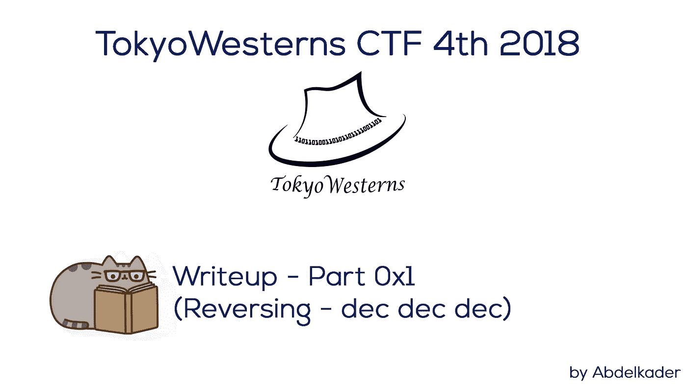

东京西部 4th 2018 年第 4 期报道—第 1 部分

TokyoWesterns CTF 第四届 2018 是第四届 TokyoWesterns CTF 竞赛，由来自日本的 TokyoWesterns 团队组织。

这是一场很好的比赛，在不同的类别(网络、反向、Pwnable、加密、热身、杂项)中，组织表现出色，充满了乐趣和实际挑战。

我刚刚开始这个 CTF，从开始(世界协调时 01/09/2018 01:00:00 星期六)到结束(世界协调时 03/09/2018 01:00:00 星期日)。所以几乎我玩了 48 小时。

让我们从第一个挑战开始，这个挑战是我在逆转了很长时间后解决的。

# 反转—十二月十二月

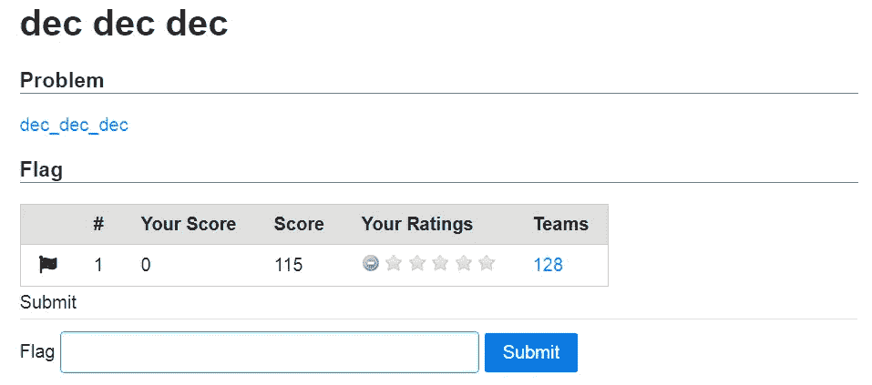

反转—十二月十二月

> **挑战:** [dec_dec_dec](https://github.com/Abdelkad3r/CTF/blob/master/TokyoWesterns%20CTF%204th%202018/reversing/dec%20dec%20dec/challenge/dec_dec_dec-c55c231bfbf686ab058bac2a56ce6cc49ae32fe086af499571e335c9f7417e5b)

这是 ELF 64 位二进制，让我们执行它:

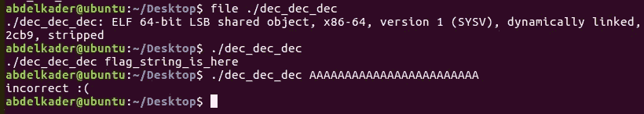

十二月十二日

似乎我们必须找到正确的标志，为此我们必须遵循以下流程:

## 静态分析

我用 IDA Pro 分析了这个二进制文件，让我们再来一次:

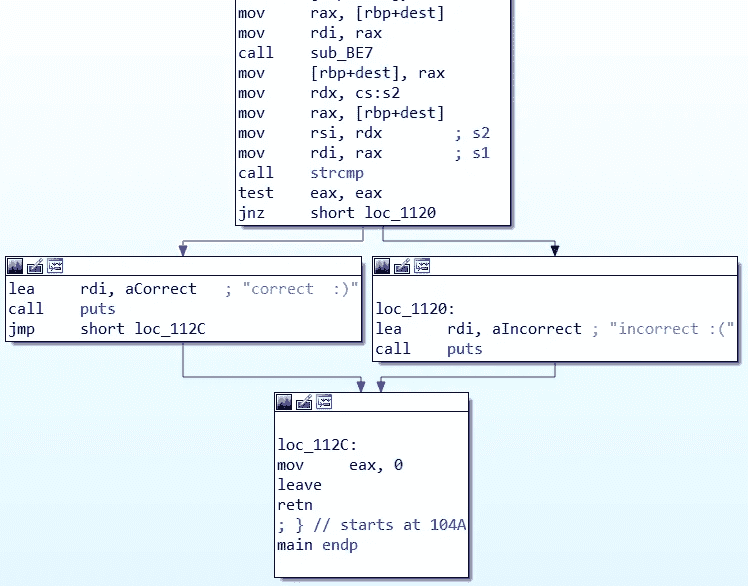

IDA Pro 中的 dec_dec_dec

正如你所看到的，根据 main()函数，strcmp 比较输入和标志，如果它们相同，那么标志是正确的，否则它是不正确的。

我首先想到的是 [**angr**](http://angr.io/) 框架。我花了很长时间试图用 angr 来解决这个问题，但对我来说很难，因为要对旗帜进行编码需要 3 个操作。我们回过头来看看我用 angr 解这个二进制的时候发生了什么。

这是我的第一个剧本:

angrbug_1187.py

我使用了线程并添加了 **0x400000** ，因为 [**PIE**](https://en.wikipedia.org/wiki/Position-independent_code) 被退回，然后我试图在 ***(正确的函数地址= 0x1075)*** 中找到正确的输入，并避免错误的输入 ***(错误的函数地址= 0x1120)*** 。

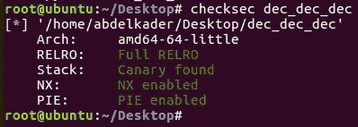

启用饼图

事实上，我刚刚尝试了这个脚本，但不确定我会用这个 100%解决它，因为我知道有三个函数来编码 flag，用这个脚本解决它并不容易。但是让我们试一试吧！

**结果:**

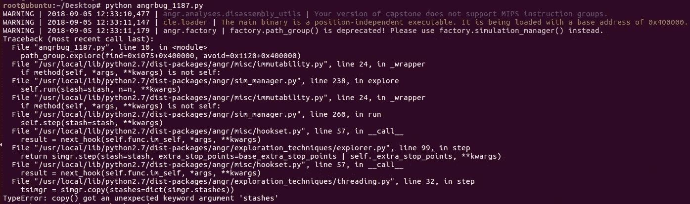

angr 框架中的 bug

看来这是个 bug！！！

我举报了:

[](https://github.com/angr/angr/issues/1187) [## copy()获得意外的关键字参数“stashes”错误问题#1187 angr/angr

### 你好，我只是想报告新的错误:PoC import angr main = 0x 104 a find = 0x 1075 avoid =[0x 1120]p =…

github.com](https://github.com/angr/angr/issues/1187) 

几分钟后，Shellphish 团队成员之一(@rhelmot)回复我:

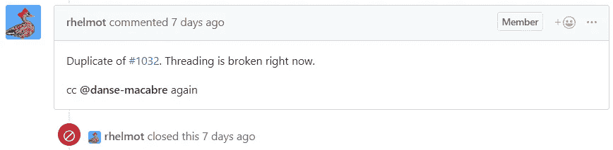

angr 框架中的错误被标记为重复

嗯……这是一个 bug，标记为 [**#1032**](https://github.com/angr/angr/issues/1032) 的重复，关闭！

我用了线，实际上它已经坏了一段时间了。这是我在 angr 框架上复制的 bug。

发现了一个错误(重复)

让我们回到挑战。在尝试用 angr 框架解决它很长时间后，我还是没能解决它。所以我决定用静态分析来解决。

下面是 [*主*](https://github.com/Abdelkad3r/CTF/blob/master/TokyoWesterns%20CTF%204th%202018/reversing/dec%20dec%20dec/main.c) 功能:


主要功能

如您所见，输入是 in 参数，传入 3 个函数( [*sub_860*](https://github.com/Abdelkad3r/CTF/blob/master/TokyoWesterns%20CTF%204th%202018/reversing/dec%20dec%20dec/sub_860.c) *，*[*sub _ F59*](https://github.com/Abdelkad3r/CTF/blob/master/TokyoWesterns%20CTF%204th%202018/reversing/dec%20dec%20dec/sub_F59.c)*，* [*sub_BE7*](https://github.com/Abdelkad3r/CTF/blob/master/TokyoWesterns%20CTF%204th%202018/reversing/dec%20dec%20dec/sub_BE7.c) )然后与编码标志进行比较:

```
**s2 = "**[**@25**](http://twitter.com/25)**-Q44E233=,>E-M34=,,$LS5VEQ45)M2S-),7"**
```

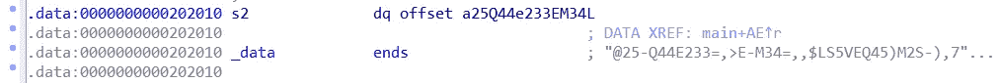

s2(编码标志)

为了手动反转，我们必须分别对这三个函数逐一进行静态分析。先说第一个( [*sub_860*](https://github.com/Abdelkad3r/CTF/blob/master/TokyoWesterns%20CTF%204th%202018/reversing/dec%20dec%20dec/sub_860.c) *)。*

我手动反过来，发现那是[**base64**](https://en.wikipedia.org/wiki/Base64)**编码功能:**

**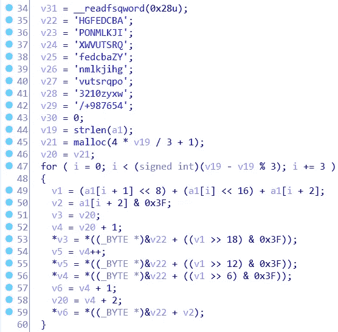**

**sub_860 函数(base64) 1**

**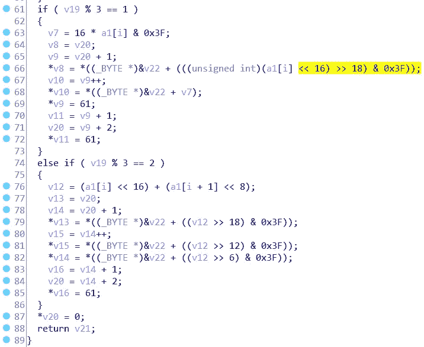**

**sub_860 函数(base64) 2**

**然后我手动反转了第二个函数( [*sub_F59*](https://github.com/Abdelkad3r/CTF/blob/master/TokyoWesterns%20CTF%204th%202018/reversing/dec%20dec%20dec/sub_F59.c) )。**

**我发现那是[**rot 13**](https://en.wikipedia.org/wiki/ROT13)**的密码功能:****

****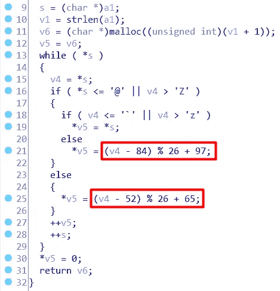****

****sub_F59 功能(rot13)****

****然后我分析了第三个也是最后一个函数( [*sub_BE7*](https://github.com/Abdelkad3r/CTF/blob/master/TokyoWesterns%20CTF%204th%202018/reversing/dec%20dec%20dec/sub_BE7.c) )。****

****很难手动反转它，因为它很长，但我尽了最大努力，编写了许多脚本，以便在 python 中构建编码函数来编码消息，然后将使用它来生成字节的标志，这将在结果中给我编码的标志。这是我的第一个想法，我有另一个想法是建立编码功能，然后在 python 中将其转化为解密功能。但是我没能成功地做到这些想法。****

****所以我考虑使用 [**GDB-PEDA**](https://github.com/longld/peda) 进行调试，并且我突破进入 *strcmp* 以便查看这个函数是如何工作的以及标志的加密是如何发生的。然后我手动强制，直到直接找到标志的所有字节。下面是我在调试方法中遵循的过程，我一直使用它直到找到标志:****

****正如我之前提到的我们必须强行进入 *strcmp* 函数，并且我们知道 [**派**](https://en.wikipedia.org/wiki/Position-independent_code) 被启用。所以我们必须先绕过 [**派**](https://en.wikipedia.org/wiki/Position-independent_code) ，为了做到这一点我们必须将断点分成***base _ address+strcmp _ address***。****

1.  ****找到 ***基 _ 地址*** :****

****首先，我们必须找到二进制地址的起始点:****

****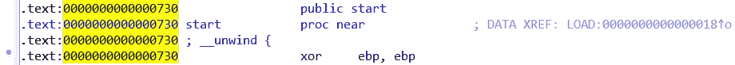****

****起点地址****

****然后将断点放入其中 ***(0x730)*** 然后运行程序，然后使用以下命令显示映射的地址空间:****

```
****gdb-peda$** info proc mappings**
```

****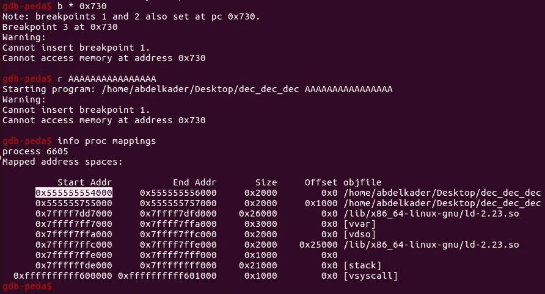****

****gdb-peda(查找基址…)****

****如上图， ***基址*** 为:***0x 55555554000*******

****2.找到***strcmp _ address***:****

****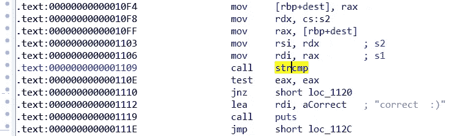****

****调用 strcmp****

****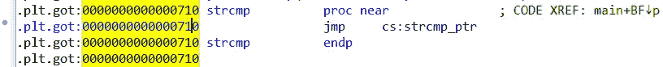****

****strcmp 地址****

****如上图，strcmp_address 为: ***0x710*******

****3.断点进入***base _ address+strcmp _ address***:****

*******0x 55555554000+0x 710 = 0x 55555554710*******

```
****gdb-peda$** b * 0x555555554710
**gdb-peda$** r TWCTF{**
```

****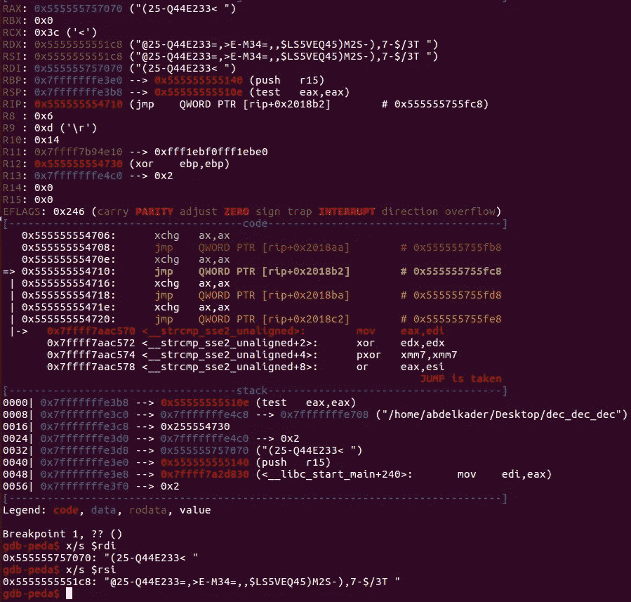****

****gdb-peda(暴力标志…)****

****如上图所示，我只是把 **"TWCTF{"** (标志格式)*作为输入，也就是上面 ida pro 中所示的****S1*****，并移入 **$rdi** 寄存器，与上面 ida pro 中所示的编码标志 **s2** 进行比较，并移入 **$rsi** 寄存器。因此，我们可以强制其他字节的标志，直到获得类似的编码信息，这是在上面的 **$rsi** 寄存器。******

```
******gdb-peda$** r TWCTF{base64_rot13_uu}****
```

******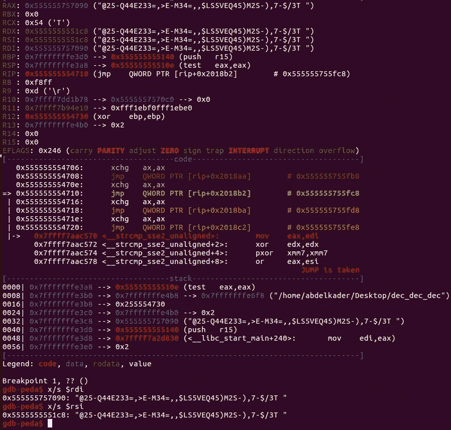******

******gdb-peda(国旗已被损坏)******

******好的，我们在两个寄存器中得到相似的编码信息，最后:******

> ********strcmp(s1，s2) = 0********

******意味着程序将跳转到正确的功能，并向我们显示:******

******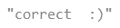******

******让我们回到我们的手动反向，经过长时间的搜索我才发现第三个函数**(**[***sub _ BE7***](https://github.com/Abdelkad3r/CTF/blob/master/TokyoWesterns%20CTF%204th%202018/reversing/dec%20dec%20dec/sub_BE7.c)***)****是*[**uuencode**](https://fr.wikipedia.org/wiki/Uuencode)*函数*。********

******一般来说，程序接受输入，并在经过 3 个函数后对其进行 3 次编码:**base64 encode>rot 13>uuencode。********

******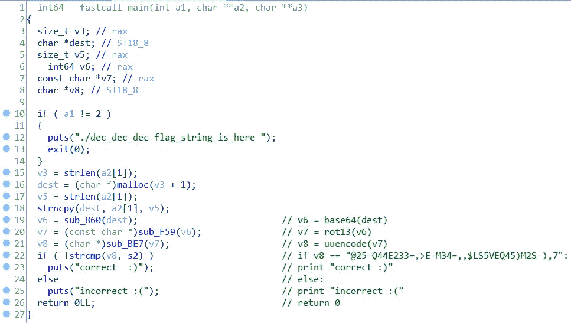******

******所有加密函数都已知后的主函数******

******要解密它，我们必须颠倒上面提到的过程，它将是这样的:**u decode>rot 13>base64 decode。********

******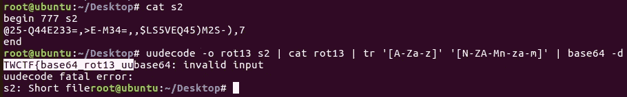******

******标志已被解码******

******完成标志并提交:******

******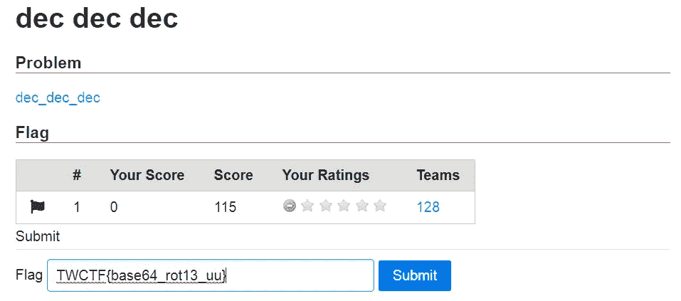******

******dec_dec_dec 已求解******

> ******标志为: **TWCTF{base64_rot13_uu}********

******我知道这很长…但我希望它也能有所帮助。如果你有兴趣阅读更多…请查看这篇文章的第二部分[](https://medium.com/@Abdelkad3r/tokyowesterns-ctf-4th-2018-writeup-part-2-81c77cffe7ec)**。********