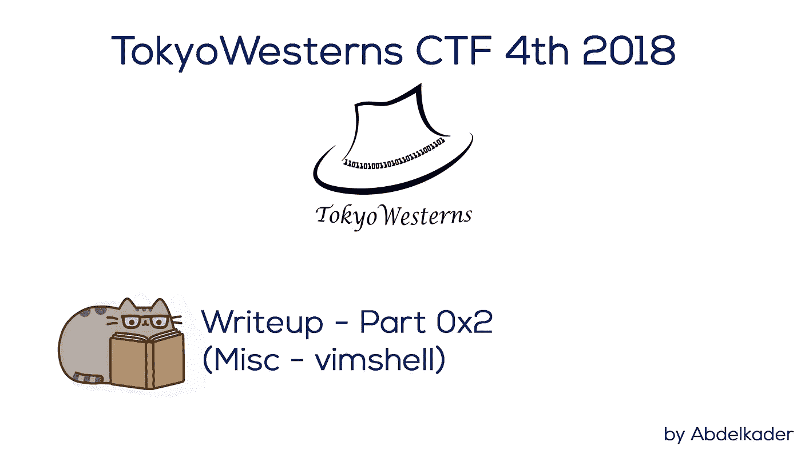
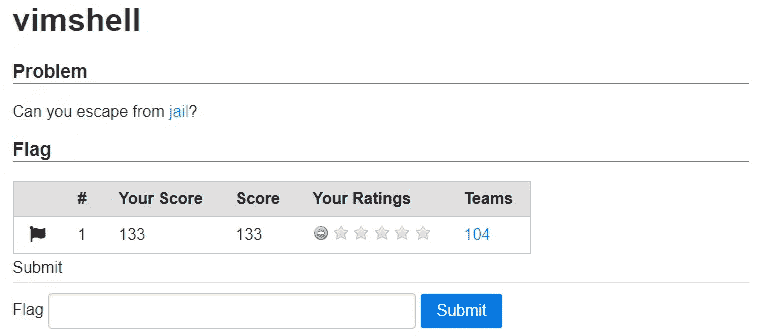
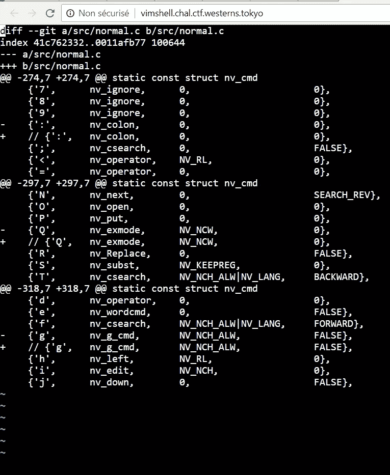
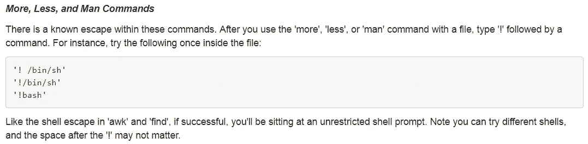
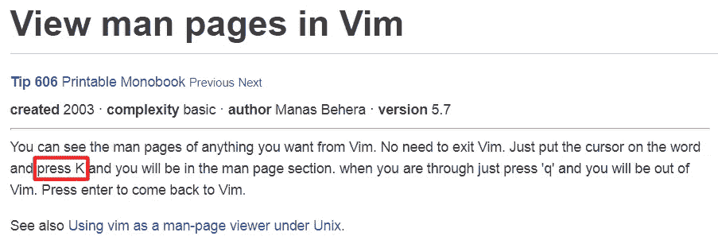
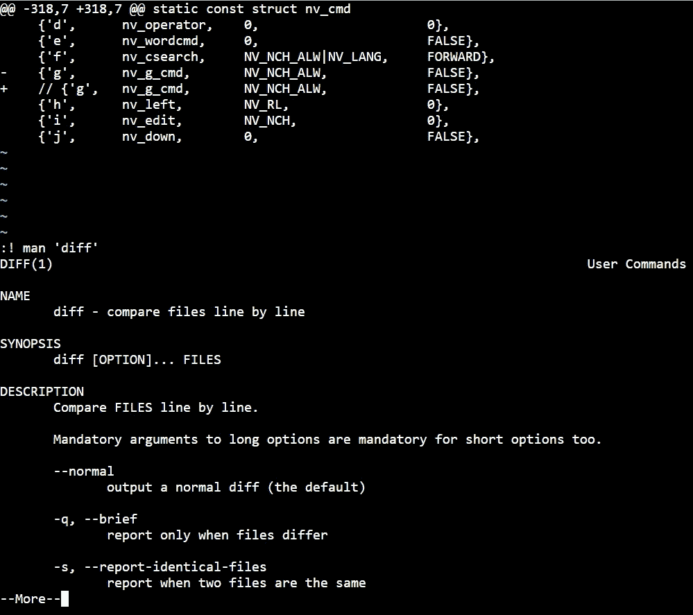
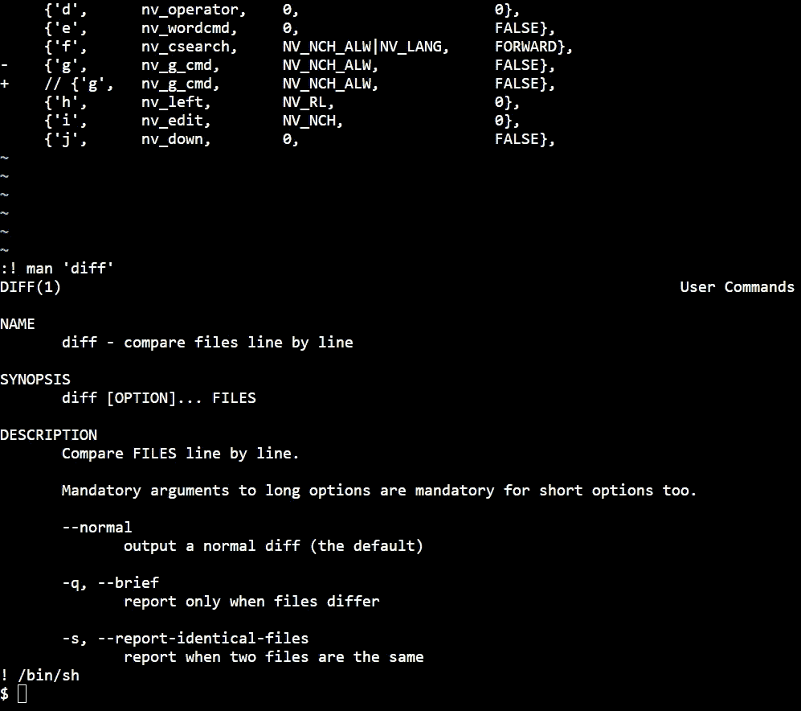
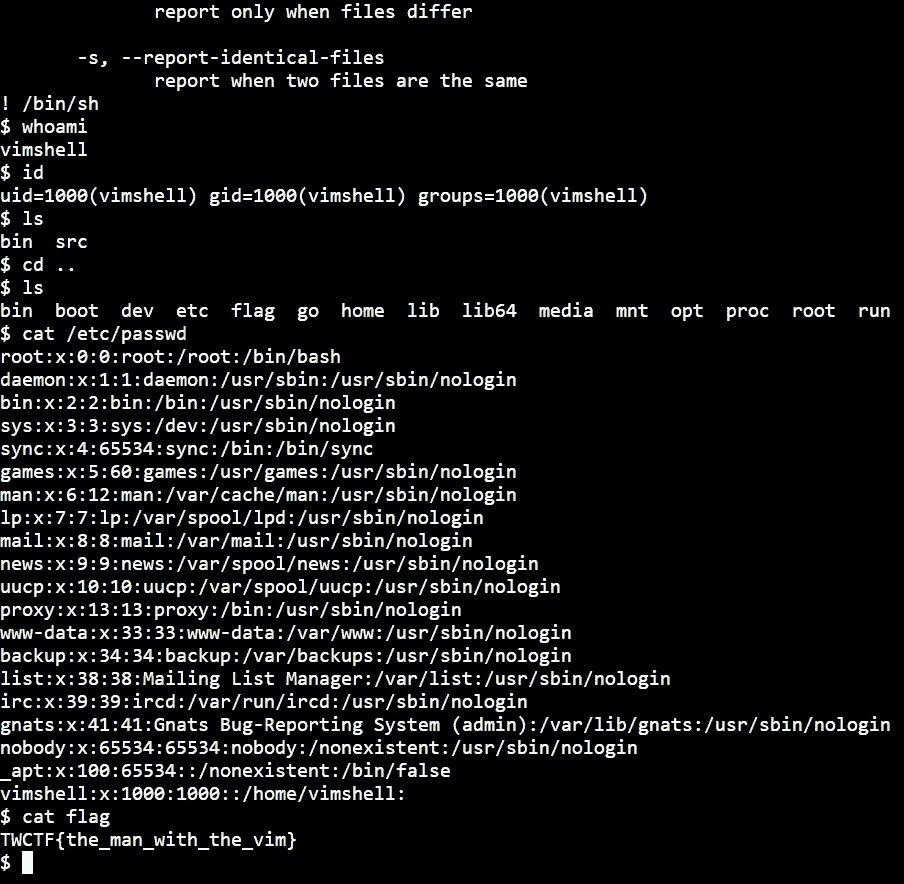

# 东京西部 4th 2018 年第 4 期报道—第 2 部分

> 原文：<https://infosecwriteups.com/tokyowesterns-ctf-4th-2018-writeup-part-2-81c77cffe7ec?source=collection_archive---------2----------------------->

世界协调时+2 时间 2018 年 02 月 09 日上午 11:43

东京西部 4th 2018 年第 4 期报道—第 2 部分

这是摩洛哥的一个阳光明媚的星期天，在我进入大学之前的暑假的最后几天，我正在玩东京西部片。

东京西部团队做出了非常令人敬畏的挑战，通常是今年最好的 CTF 比赛之一。让我们开始解决第二个挑战，我希望这比十二月更容易。

# 维姆谢尔—133 磅

维姆谢尔

> **挑战:** [监狱](http://vimshell.chal.ctf.westerns.tokyo/)

这是在 vim 中打开的两个文件的区别，我们必须逃离监狱，这意味着我们必须从这个 vim 中获得 shell。

嗯……那很酷。

维姆谢尔挑战

我试着输入一些命令并保存这个 vim 来获取 shell，并试图找到某种方式从这个 vim 获取 shell，但是没有有趣的结果。

在我谷歌了一些类似的东西和一些旧的挑战后，我发现了一个有趣的话题，关于越狱和从 vim 获得 shell 是这个主题的一部分。

 [## SANS 渗透测试

### 编者按:几个月前，在 GPWN 无笔测试课程校友的邮件列表上，我们有一个很好的，生动的…

pen-testing.sans.org](https://pen-testing.sans.org/blog/2012/06/06/escaping-restricted-linux-shells) 

如何从男人身上得到壳

这个想法是，我们将从 man 获得 Shell，所以首先我必须知道如何从 vim 进入 Man 页面，因为就我个人而言，我不是 vim 用户。

 [## 查看 Vim 中的手册页

### 提示 606 可打印的 Monobook 上一页下一页创建于 2003 年复杂性基础作者 Manas Behera 版本 5.7 你可以…

vim.wikia.com](http://vim.wikia.com/wiki/View_man_pages_in_Vim) 

查看 vim 中的手册页

好的，让我们按 K:

进入 vim 手册页

然后，让我们把我们从所阅读的题目中得到的重要的东西放在一起，以便得到外壳:

> **！/bin/sh**

从 Vim 获得 Shell

耶…让我们享受浏览和阅读国旗！

有旗子吗

> 标志是:**TWCTF { the _ man _ with _ the _ vim }**

这是一个很酷很有趣的挑战，我很喜欢，我希望我会在服务器上遇到这样的挑战，以便获得更多的外壳…

我想特别感谢这次挑战的发起者和 TokyoWesterns 团队。如果你有兴趣阅读这篇文章的第一部分，请查看并享受阅读: [**东京西部 4th 2018 年第 4 期文章—第 1 部分**](https://medium.com/@Abdelkad3r/tokyowesterns-ctf-4th-2018-writeup-part-1-78558397cb7b) 。