# 东京西部 4th 2018 年第 4 期报道—第 3 部分

> 原文：<https://infosecwriteups.com/tokyowesterns-ctf-4th-2018-writeup-part-3-1c8510dfad3f?source=collection_archive---------0----------------------->

世界协调时+2 时间 2018 年 06 月 09 日下午 20:32

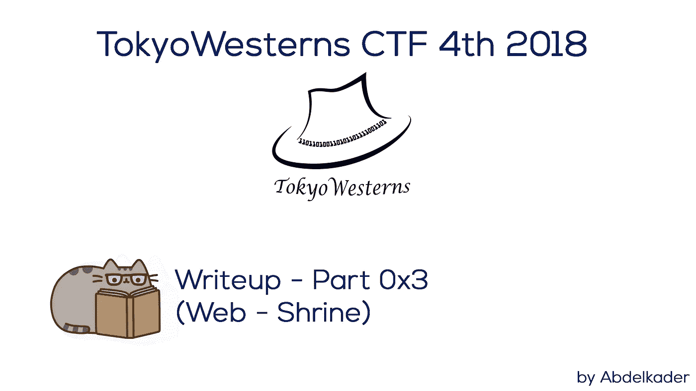

东京西部 4th 2018 年第 4 期报道—第 3 部分

显然，在这篇博客中我将谈到一个重要的漏洞；**服务器端模板注入(SSTI)** 我建议你也阅读这篇文章来理解它。

[](https://portswigger.net/blog/server-side-template-injection) [## 服务器端模板注入

### web 应用程序广泛使用模板引擎来通过网页和电子邮件呈现动态数据。不安全…

portswigger.net](https://portswigger.net/blog/server-side-template-injection) 

# 神龛—193 页

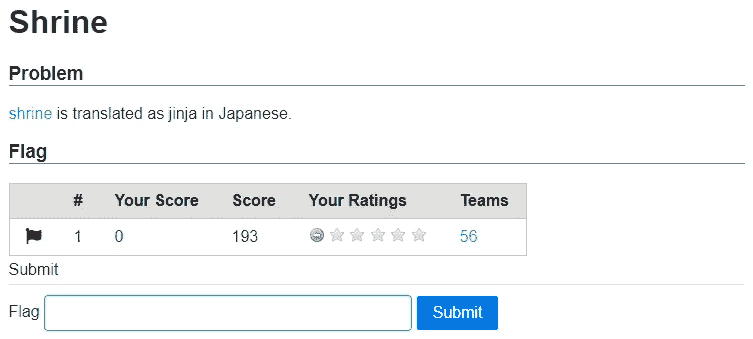

圣地

> **挑战:** [神社](http://shrine.chal.ctf.westerns.tokyo/)

世界协调时+2 日上午 05/09:06

当我逆转 [**dec dec dec**](https://github.com/Abdelkad3r/CTF/tree/master/TokyoWesterns%20CTF%204th%202018/reversing/dec%20dec%20dec) 挑战时，我的队友分享了一个叫做*神殿*的挑战的 python 脚本，告诉我们他正在进行这个挑战。貌似这是后端用 python 创建的 web 应用的 [*app.py*](https://github.com/Abdelkad3r/CTF/blob/master/TokyoWesterns%20CTF%204th%202018/web/shrine/app.py) 。

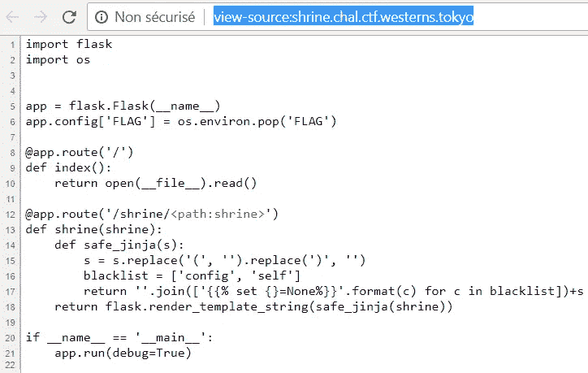

圣地挑战— app.py

我查的比较快，注意到这个应用是基于 Python [Flask](http://flask.pocoo.org/) 框架，我首先想到的是 [**服务器端模板注入(SSTI)漏洞**](https://nvisium.com/resources/blog/2015/12/07/injecting-flask.html) 。

正如你在上面的 *app.py* 中看到的；有两个滤镜的 *safe_jinja* 功能。我们必须绕过它才能在[*config*](http://flask.pocoo.org/docs/0.12/api/#flask.config)*或*[*self*](http://flask.pocoo.org/docs/0.12/api/#flask)*中获得两个黑名单文件。带有两个过滤符号*“(*和*”)。****

**所以作为我们任务的总结就是我们必须分两步绕过: *"()"* 和黑名单 [*config*](http://flask.pocoo.org/docs/0.12/api/#flask.config) 和 [*self*](http://flask.pocoo.org/docs/0.12/api/#flask) 以便最后进入 [*config*](http://flask.pocoo.org/docs/0.12/api/#flask.config) 或[*self*](http://flask.pocoo.org/docs/0.12/api/#flask)self。**

**事实上，我解决了一系列类似的挑战，并且有相同的背景，我写了一篇关于类似任务的精彩而丰富的文章，但没有经过过滤的*配置*或 [*自我*](http://flask.pocoo.org/docs/0.12/api/#flask) ，将在*[**AngstromCTF 2018 网络文章-第 2 部分**](https://medium.com/bugbountywriteup/angstromctf-2018-web-writeups-part-2-6c1ee586aa64) **中找到。*****

***让我们遵循高层次的方法来捕获一个高效的攻击过程，然后将其应用到这次 **SSTI** 攻击中！***

***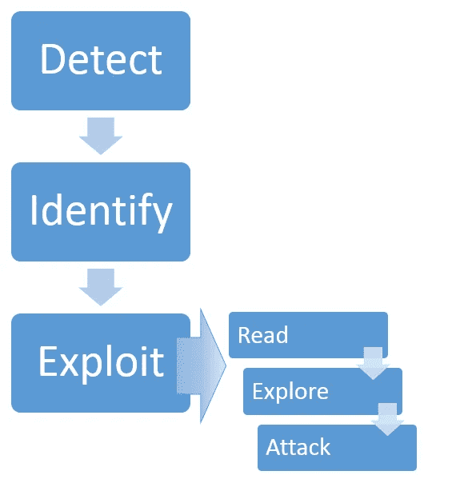***

***捕捉高效攻击过程的高级方法***

## ***1.发现***

***正如你在上面的 *app.py* 中看到的；有一条有趣的路线:***

```
**[@app](http://twitter.com/app).route('/shrine/**<path:shrine>**')**
```

**让我们跟随它:**

**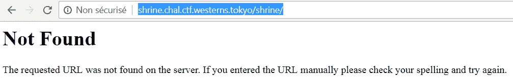**

**未发现**

**让我们通过在 **< path:shrine >** 中注入 **{{9*9}}** 来尝试检测 **SSTI** 漏洞:**

**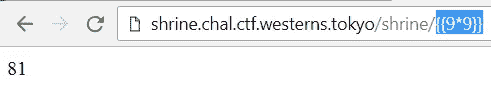**

**SSTI 被发现了**

**耶…正如你所看到的，我得到了 **81** 的结果，所以它被服务器执行，并最终使错误出来！**

**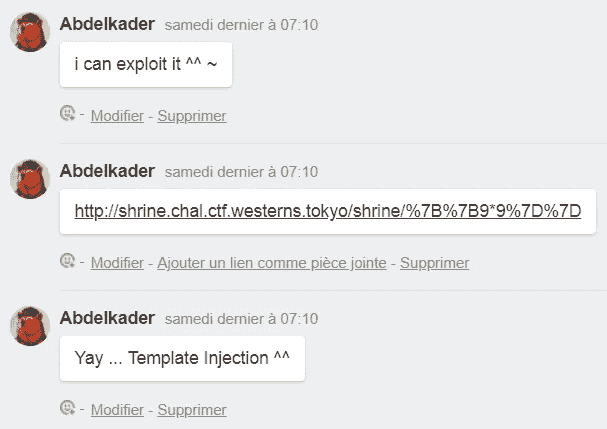**

**与此同时，*[***服务器端烧瓶模板注入(SSTI)漏洞***](https://nvisium.com/resources/blog/2015/12/07/injecting-flask.html)*已被检测到。****

## ***2.识别***

***如上图 [*app.py*](https://github.com/Abdelkad3r/CTF/blob/master/TokyoWesterns%20CTF%204th%202018/web/shrine/app.py) 所示；这个模板引擎就是 [**Jinja2**](http://jinja.pocoo.org/docs/2.10/) 。***

**与此同时， [***服务器端 Flask Jinja2 模板注入(SSTI)漏洞***](https://nvisium.com/resources/blog/2015/12/07/injecting-flask.html) 已经确定。**

## **3.剥削**

**我的利用是基于这个:**

**[](https://nvisium.com/resources/blog/2016/03/11/exploring-ssti-in-flask-jinja2-part-ii.html) [## 探索烧瓶中的 SSTI/jinja 2，第二部分

### 我最近写了一篇关于探索服务器端模板注入(SSTI)在应用程序中的真正影响的文章…

nvisium.com](https://nvisium.com/resources/blog/2016/03/11/exploring-ssti-in-flask-jinja2-part-ii.html) 

如果你尝试直接进入 [*配置*](http://flask.pocoo.org/docs/0.12/api/#flask.config) 或 [*自我*](http://flask.pocoo.org/docs/0.12/api/#flask) 将不会发现任何有趣的东西，因为这些都被列入了黑名单。

```
[http://shrine.chal.ctf.westerns.tokyo/shrine/](http://shrine.chal.ctf.westerns.tokyo/shrine/)**{{config}}**
```

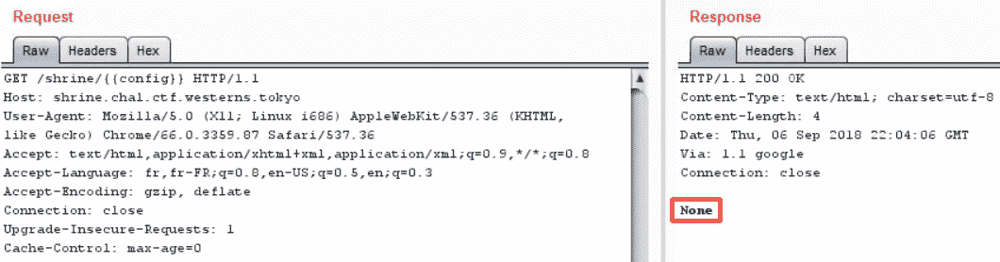

配置为无(列入黑名单)

```
[http://shrine.chal.ctf.westerns.tokyo/shrine/](http://shrine.chal.ctf.westerns.tokyo/shrine/)**{{self}}**
```

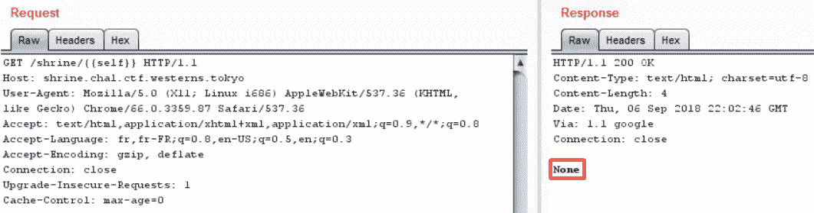

自己是无(黑名单)

更多信息也请阅读:

SSTI:现代网络应用的 RCE

所以想法是通过使用另一种方法在 [*config*](http://flask.pocoo.org/docs/0.12/api/#flask.config) 或 [*self*](http://flask.pocoo.org/docs/0.12/api/#flask) 中得到，以便绕过它作为黑名单函数。我想到的第一件事是使用子类和属性，直到在 [*config*](http://flask.pocoo.org/docs/0.12/api/#flask.config) 中得到，而要做到这一点，我必须列出函数和属性。过了一会儿，我的朋友发现了一个有趣的功能:

```
[http://shrine.chal.ctf.westerns.tokyo/shrine/](http://shrine.chal.ctf.westerns.tokyo/shrine/)**{{request.environ}}**
```

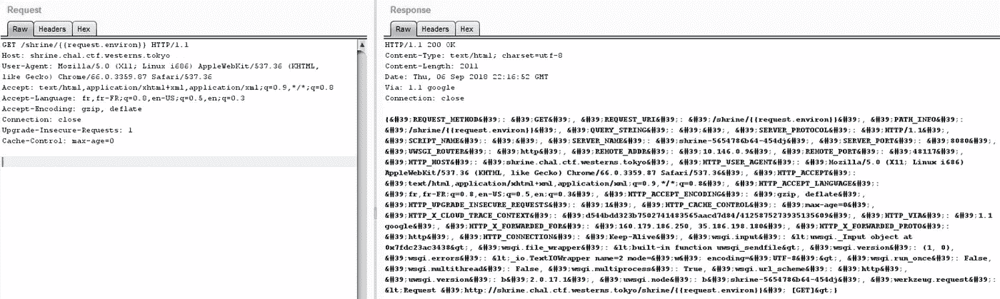

请求环境

但是没什么有趣的可以帮忙的。我试图通过搜索新的子类来发现一些新的东西，然后我发现在这个目录中使用有限的字节来注入，并且有可能注入 html 标签。注入了一些 html 标签，XSS 终于完成了！

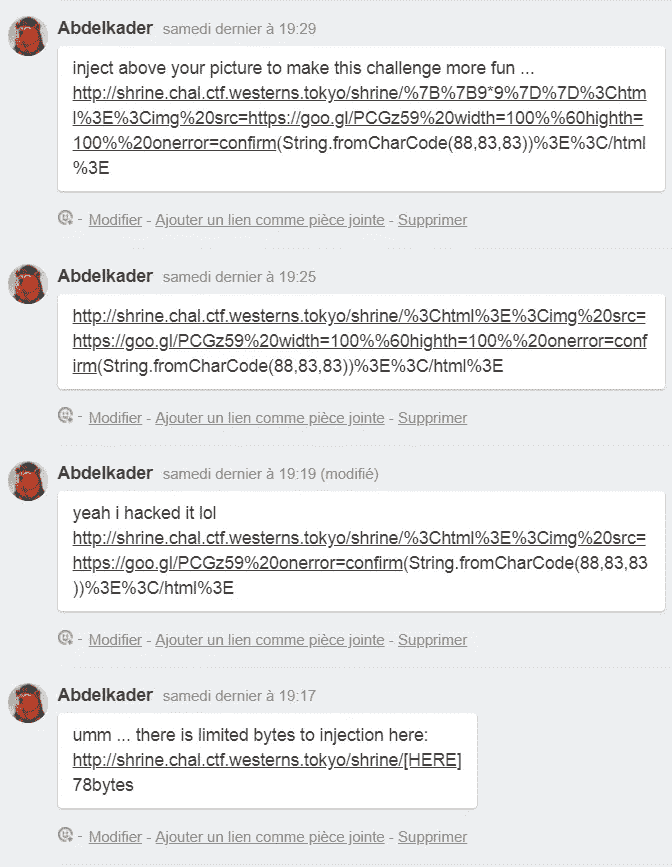

XSS

我利用这张 [XSS](https://www.owasp.org/index.php/Cross-site_Scripting_(XSS)) 来展示我的照片，但这并不是这次挑战的目的，我这样做只是为了好玩。

这里是 [XSS](https://www.owasp.org/index.php/Cross-site_Scripting_(XSS)) 有效载荷，我注入得到 [XSS](https://www.owasp.org/index.php/Cross-site_Scripting_(XSS)) :

> **<html></html>**


XSS 谈神社挑战

我叫上我的队友 [@tnmch](https://github.com/tnmch) 在他的图片上方注入这个模板，用好玩的 XD 来享受这个挑战！！

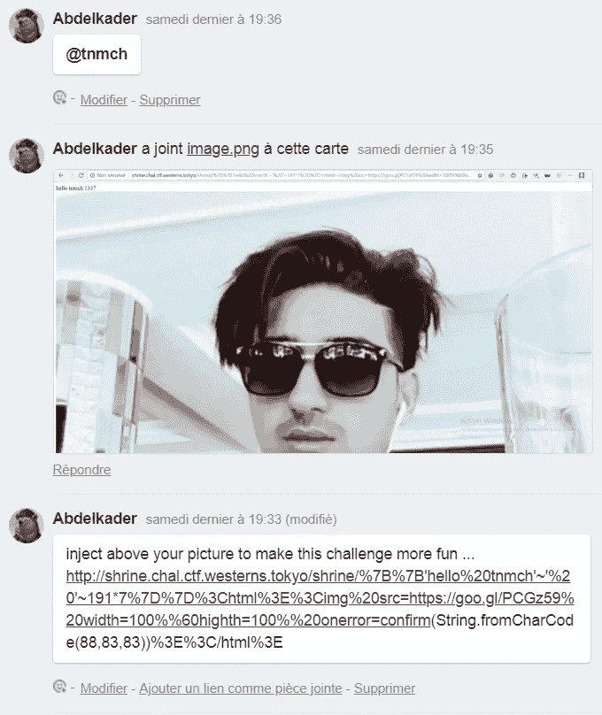

向@tnmch 问好

让我们一起享受在我的图片上方注入这个有趣的^^模板吧！！

```
[http://shrine.chal.ctf.westerns.tokyo/shrine/](http://shrine.chal.ctf.westerns.tokyo/shrine/)**%7B%7B'hello%20tnmch'~'%20'~191*7%7D%7D%3Chtml%3E%3Cimg%20src=https://goo.gl/PCGz59%20width=100%%60highth=100%%20onerror=confirm(String.fromCharCode(88,83,83))%3E%3C/html%3E**
```

让我们回到对这个模板注入的开发上来。经过长时间的尝试，没有任何有趣的结果，我只是试图阅读所有的[烧瓶](http://flask.pocoo.org/)函数和对象，发现一个有趣的叫做 [*url_for()*](http://flask.pocoo.org/docs/0.12/api/#flask.url_for) *。*顺便在模板中你可以访问到[](http://flask.pocoo.org/docs/0.12/api/#flask.config)**[*请求*](http://flask.pocoo.org/docs/0.12/api/#flask.request)*[*会话*](http://flask.pocoo.org/docs/0.12/api/#flask.session)**[*g**对象，以及*](http://flask.pocoo.org/docs/0.12/api/#flask.g) *[*url_for()*](http://flask.pocoo.org/docs/0.12/api/#flask.url_for)******

**我用 [*__globals__*](https://docs.python.org/3/reference/datamodel.html) 属性，一个一个地尝试，直到得到 [*url_for()*](http://flask.pocoo.org/docs/0.12/api/#flask.url_for) 函数的所有全局变量。**

```
**[http://shrine.chal.ctf.westerns.tokyo/shrine/](http://shrine.chal.ctf.westerns.tokyo/shrine/)**{{url_for.__globals__}}****
```

**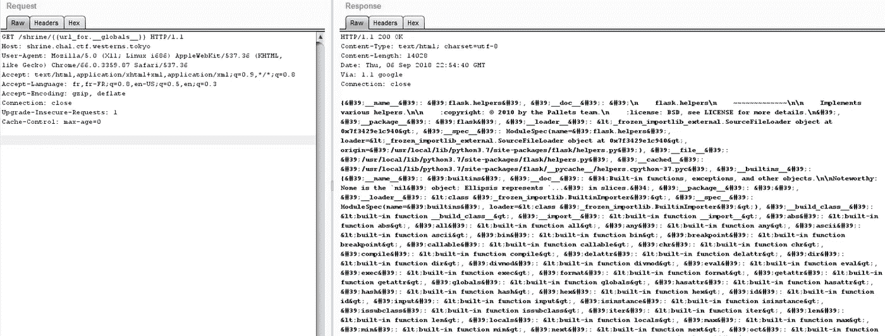**

**url_for() 1 的全局变量**

****

**url_for() 2 的全局变量**

**(CTRL+F)ed **"Flask"** word 之后我刚发现一个有趣的变量叫做:**[*current _ app*](http://flask.pocoo.org/docs/0.12/api/#flask.current_app)*。*****

****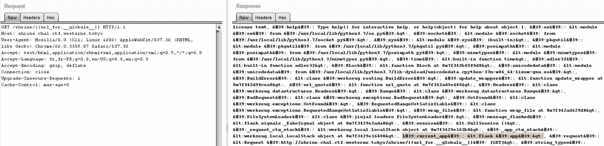****

****找到当前应用程序 1****

********

****找到当前应用程序 2****

****让我们试着进入[*current _ app*](http://flask.pocoo.org/docs/0.12/api/#flask.current_app)*:*****

```
****[http://shrine.chal.ctf.westerns.tokyo/shrine/](http://shrine.chal.ctf.westerns.tokyo/shrine/)**{{url_for.__globals__.current_app}}******
```

********

****当前应用 1****

********

****当前应用 2****

****这意味着我们又进入了应用程序 [*app.py*](https://github.com/Abdelkad3r/CTF/blob/master/TokyoWesterns%20CTF%204th%202018/web/shrine/app.py) 中，所以现在让我们尝试进入 config！****

```
****[http://shrine.chal.ctf.westerns.tokyo/shrine/](http://shrine.chal.ctf.westerns.tokyo/shrine/)**{{url_for.__globals__.current_app.config}}******
```

****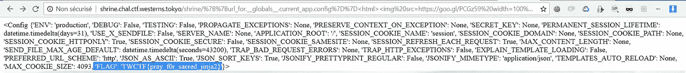****

****配置(配置字典)1****

****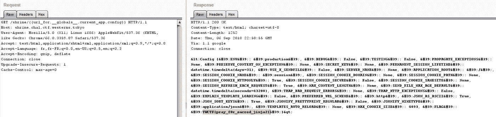****

****配置(配置字典)2****

****耶…我们只是通过使用 [*url_for()*](http://flask.pocoo.org/docs/0.12/api/#flask.url_for) 属性来访问 *config* ，而不是直接访问 config，因为它在 [*app.py*](https://github.com/Abdelkad3r/CTF/blob/master/TokyoWesterns%20CTF%204th%202018/web/shrine/app.py) *中被列入黑名单并进行过滤，结果是 *None* ，也没有使用“()”*，因为它在*[*app . py*](https://github.com/Abdelkad3r/CTF/blob/master/TokyoWesterns%20CTF%204th%202018/web/shrine/app.py)中也被过滤*****

****我们的目标是获取进入 [*config*](http://flask.pocoo.org/docs/0.12/api/#flask.config) 或 [*self*](http://flask.pocoo.org/docs/0.12/api/#flask) 以便查找标志，如上图所示标志确实存储在 [*config*](http://flask.pocoo.org/docs/0.12/api/#flask.config) 中。****

****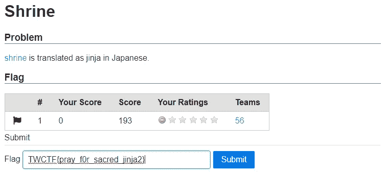****

****提交神社的旗帜****

****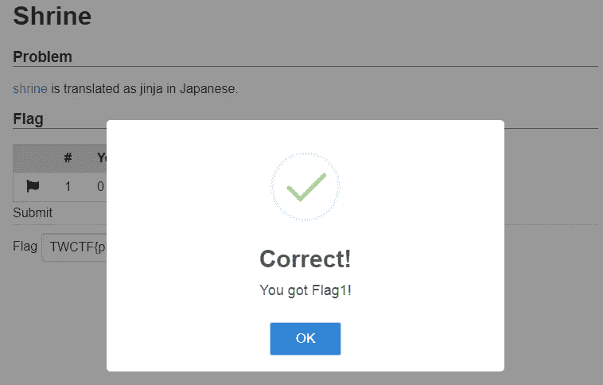****

****神龛已经解决了****

> ****标志是:**tw CTF { pray _ f0r _ sacrible _ jinja 2 }******

****我要特别感谢这次挑战的作者，以及东京西部团队。这个任务是非常有教育意义的关于一个很强的弱点。我希望我的文章能帮助大家阅读，这里是这篇文章的第四部分 的******