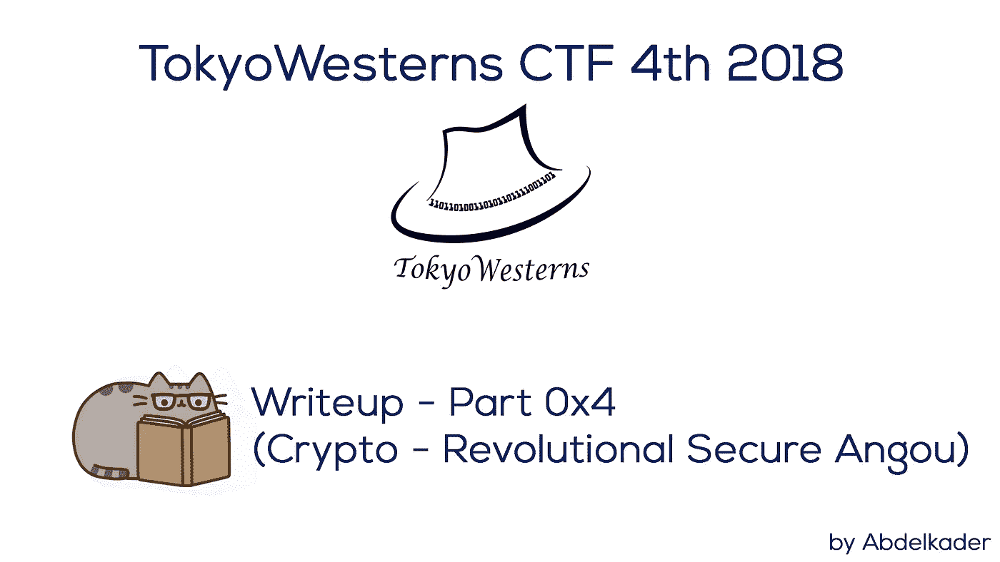
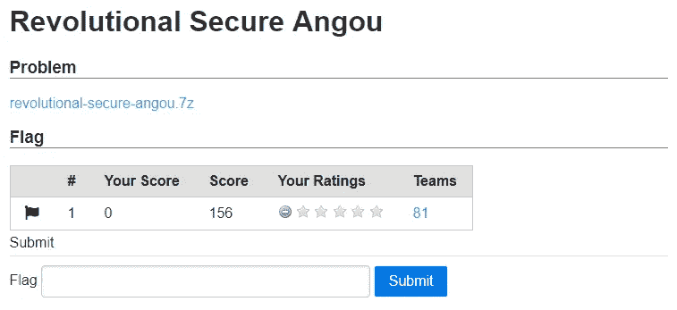
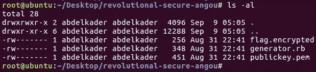
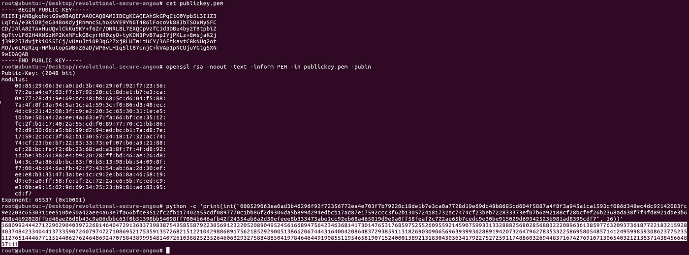
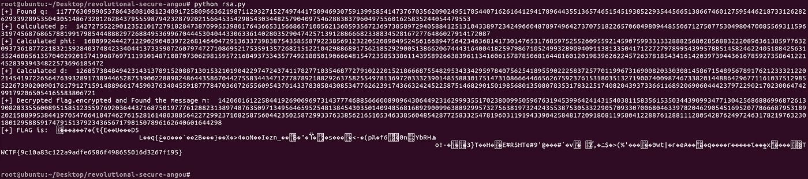
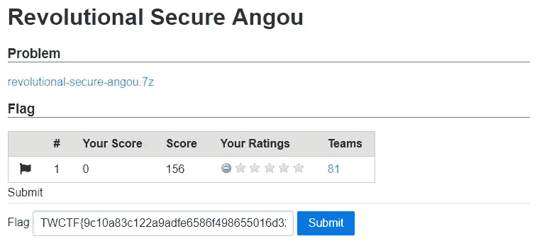
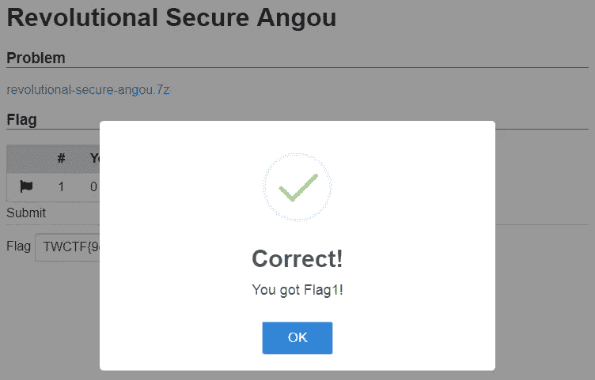

# 东京西部 4th 2018 年第 4 期报道—第 4 部分

> 原文：<https://infosecwriteups.com/tokyowesterns-ctf-4th-2018-writeup-part-4-f64e1583b315?source=collection_archive---------0----------------------->

世界协调时+2 时间 2018 年 9 月 9 日上午 01:33



东京西部 4th 2018 年第 4 期报道—第 4 部分

又来了，又一个我在比赛中从 Tokyo westerns CTF 2018 第四届平台得到的密码学挑战。这个挑战需要数学，这就是为什么我花了一天时间来解决这个问题，我将在下面详细解释。

# 革命安全安沟—156 分



革命安全

> **挑战:**[revolutional-secure-angou . 7z](https://github.com/Abdelkad3r/CTF/blob/master/TokyoWesterns%20CTF%204th%202018/crypto/revolutional%20secure%20angou/challenge/revolutional-secure-angou-de97106aa248a41a40fdd001fc5f7b4b4f28a39eb6bcabf8401b108b7a8961c5.7z)

这是本次挑战中给出的三个文件:加密文本 [*flag.encrypted*](https://github.com/Abdelkad3r/CTF/blob/master/TokyoWesterns%20CTF%204th%202018/crypto/revolutional%20secure%20angou/flag.encrypted) 和公钥 [*publickey.pem*](https://github.com/Abdelkad3r/CTF/blob/master/TokyoWesterns%20CTF%204th%202018/crypto/revolutional%20secure%20angou/publickey.pem) 和脚本 ruby[*generator . Rb*](https://github.com/Abdelkad3r/CTF/blob/master/TokyoWesterns%20CTF%204th%202018/crypto/revolutional%20secure%20angou/generator.rb)作为生成器。



革命性的安全安沟文件

让我们读一下生成器，试着理解它，因为它是用来加密标志信息的。

如你所见，这是 [**Ruby**](https://www.ruby-lang.org/en/) 中 [**OpenSSL**](https://www.openssl.org/) 的一个实现，我们有一个指数 **e** 和两个 1024 位的质数 **p** 和 **q** ，用于生成模数，然后生成公钥，用于加密标志并生成加密文本作为 [*标志。*](https://github.com/Abdelkad3r/CTF/blob/master/TokyoWesterns%20CTF%204th%202018/crypto/revolutional%20secure%20angou/flag.encrypted)

相应地，这就是应用 [**RSA**](https://en.wikipedia.org/wiki/RSA_(cryptosystem)) 算法对消息进行加密这也是我们的目标。为了达到它，我们必须解密 [*标志。用*](https://github.com/Abdelkad3r/CTF/blob/master/TokyoWesterns%20CTF%204th%202018/crypto/revolutional%20secure%20angou/flag.encrypted) *[**RSA**](https://en.wikipedia.org/wiki/RSA_(cryptosystem)) 加密* 。

众所周知， [**RSA**](https://en.wikipedia.org/wiki/RSA_(cryptosystem)) 中的加密需要公钥，这意味着模数 **N** 和公共指数 **e** 。我们有 **e** 如上面的生成器脚本所示，让我们提取[*public key . PEM*](https://github.com/Abdelkad3r/CTF/blob/master/TokyoWesterns%20CTF%204th%202018/crypto/revolutional%20secure%20angou/publickey.pem)文件以便找到模数 **N** 。



从 publickey.pem 中提取模数 N 和公共指数 e

```
**N = 16809924442712290290403972268146404729136337398387543585587922385691232205208904952456166894756423463681417301476531768597525526095592145907599331332888256802856883222089636138597763209373618772218321592840374842334044137335907260797472710869521753591357268215122104298868917562185292900513866206744431640042086483729385911318269030906569639399362889194207326479627835332258695805485714124959985930862377523511276514446771151440627624648692470758438999548140726103882523526460632932758848850419784646449190855119546581907152400013892131830430363417922752725911748860326944837167427691071306540321213837143845664837111
e = 65537**
```

如你所知，[**RSA**](https://en.wikipedia.org/wiki/RSA_(cryptosystem))**中的解密需要私钥，即模数 N 和私钥指数 **d** 。如上所示，我们有 **N** ，我们必须计算 **d.** 为了做到这一点，我们必须计算 **e** 和[欧拉函数](https://simple.wikipedia.org/wiki/Euler%27s_totient_function)**φ**的逆模。phi 是未知的，因为你需要质数 **p** 和 **q** 来计算它，而这些质数也是未知的。你不能因式分解 **N** 。**

**但是我们在 [*generator.rb*](https://github.com/Abdelkad3r/CTF/blob/master/TokyoWesterns%20CTF%204th%202018/crypto/revolutional%20secure%20angou/generator.rb) 脚本中有一句有趣的台词:**

```
**q = OpenSSL::BN.new(e).mod_inverse(p)**
```

**这意味着:**

```
**q = mod_inverse(p)**
```

**经过一天的分析，并试图找到一个好的数学解决方案，这里是我最后的数学解决方案:**

```
**q = mod_inverse(p)
q = e ^ (-1) mod p
q * e = 1 mod p
q * e = k * p + 1                            # k is multiplier**
```

**现在，让我们用 **q** 乘以上面的等式。**

```
**q * q * e = q * (k * p + 1)
(q ^ 2) * e = (k * p * q) + q
(q ^ 2) * e = (k * N) + q                          # N = p * q
((q ^ 2) * e) - q = k * N
q = ((k * N) / e) ^ 2**
```

**模数 **N** 已知，公共指数 **e** 已知，所以想法是强行 **k** 直到找到质数 **q** 除以模数 **N** 。然后计算 **q** 然后计算**φ**然后计算私钥指数 **d** 然后使用私钥解密[flag . encrypted即模数 **N** 和私钥指数 **d** 。](https://github.com/Abdelkad3r/CTF/blob/master/TokyoWesterns%20CTF%204th%202018/crypto/revolutional%20secure%20angou/flag.encrypted)**

**下面是我的 [*脚本*](https://github.com/Abdelkad3r/CTF/blob/master/TokyoWesterns%20CTF%204th%202018/crypto/revolutional%20secure%20angou/rsa.py) python 我用来自动化我的数学求解和暴力 **k** 然后计算直到解密[*flag . encrypted*](https://github.com/Abdelkad3r/CTF/blob/master/TokyoWesterns%20CTF%204th%202018/crypto/revolutional%20secure%20angou/flag.encrypted)并找到标志:**

****结果:****

****

**rsa.py 脚本的结果**

****

**交出革命安全的安国旗帜**

****

**革命的安全问题已经解决**

> **标志为:**tw CTF { 9 c10a 83 c 122 a9 adfe 6586 f 498655016d 3267 f 195 }****

**这是一个很好的挑战，有太多的乐趣，尤其是在数学部分。再次感谢东京西部团队。如果你正在寻找我的文章的其他部分，这里是列表:**

*   **[**东京西部 4th 2018 年第 4 期报道—第 1 部分**](https://medium.com/bugbountywriteup/tokyowesterns-ctf-4th-2018-writeup-part-1-78558397cb7b)**
*   **[**东京西部 4th 2018 年第 4 期报道—第二部分**](https://medium.com/bugbountywriteup/tokyowesterns-ctf-4th-2018-writeup-part-2-81c77cffe7ec)**
*   **[**东京西部 4th 2018 年第 4 期报道—第 3 部分**](https://medium.com/bugbountywriteup/tokyowesterns-ctf-4th-2018-writeup-part-3-1c8510dfad3f)**
*   **[**东京西部 4th 2018 年第 4 期报道—第 4 部分**](https://medium.com/@Abdelkad3r/tokyowesterns-ctf-4th-2018-writeup-part-4-f64e1583b315)**
*   **[**东京西部 4th 2018 年第 4 期报道—第 5 部分**](https://medium.com/@Abdelkad3r/tokyowesterns-ctf-4th-2018-writeup-part-5-6d699f07f71c)**