# 汤姆鬼影

> 原文：<https://infosecwriteups.com/tomghost-f78da95df531?source=collection_archive---------4----------------------->

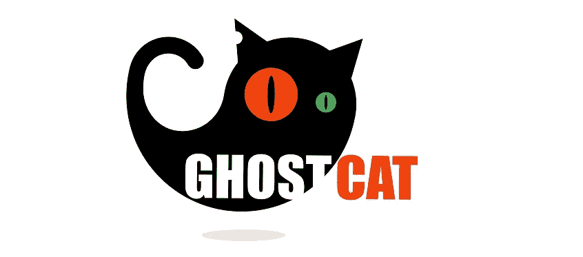

你好。！这不会是一个机器的常规报道，相反，我想用为 OSCP 提供的模板作为渗透测试报告。

我从多个渠道得到这个想法，他们强调有效报告的重要性，这对于一个圣灵降临者来说是非常重要的。所以让我们直接进入这台机器的官方报告，我也将尝试修补最初的漏洞，就像一个建议。

# 目录:

1.  高级摘要
2.  方法学

2.1 信息收集

2.2 渗透

系统枚举

权限提升

3 条建议(带补丁)

# **1。高层总结:**

我的任务是对 Demo.inc .的一台机器执行内部渗透测试。内部渗透测试是针对内部连接系统的专门攻击。该测试的重点是执行攻击，类似于黑客的攻击并试图渗透。我的总体目标是评估网络，识别系统，并利用缺陷，同时向 Demo.inc .报告调查结果。

在这个渗透测试中，我被指示只测试一台暴露在互联网上的机器，并使用 Apache Tomcat 服务器托管一些 web 内容。当执行测试时，机器上存在令人担忧的漏洞，这使得我可以完全破坏机器并完全控制它。这主要是由于糟糕的配置和一些过时的补丁。

系统 IP:10.10.48.134

# **2。方法论:**

我利用了一种广泛采用的方法来执行渗透测试，这种方法在测试中是有效的，下面是我如何能够识别和利用各种系统的突破，包括发现的所有单个漏洞。

**2.1。信息收集:**

渗透测试的信息收集部分侧重于确定渗透测试的范围。在这次渗透测试中，我的任务是利用网络中的一台机器。

**2.2 穿透:**

评估的渗透测试部分重点关注对各种系统的访问。

系统 IP:10.10.48.134

## 服务枚举

渗透测试的服务枚举部分着重于收集关于在一个或多个系统上哪些服务是活动的信息。这对攻击者很有价值，因为它提供了进入系统的潜在攻击媒介的详细信息。在执行实际渗透测试之前，了解系统上运行的应用程序可以为攻击者提供所需的信息。

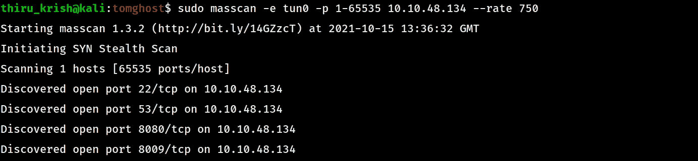

开放端口

Nmap 扫描结果:

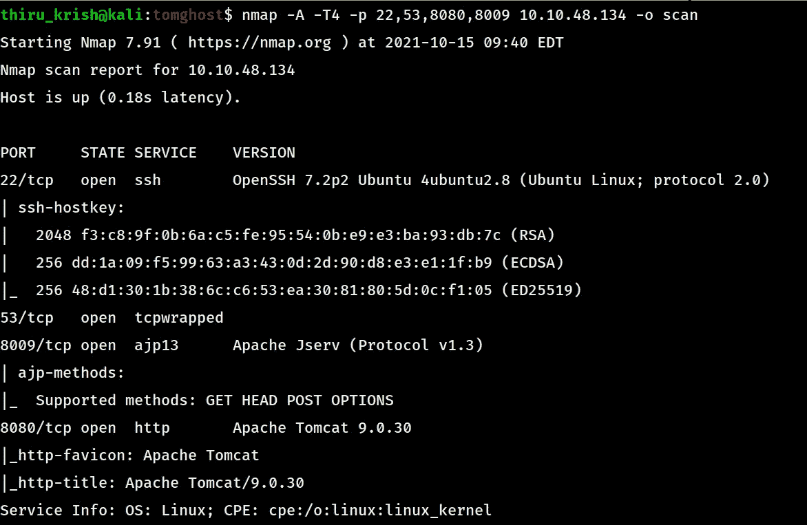

服务-扫描

**初始攻击向量:**

> 被利用的漏洞:Apache Tomcat-AJP 的 Ghostcat 文件读取/包含
> 
> 漏洞解释:
> 
> Ghost Cat 是一个影响 Apache Tomcat 的漏洞。它目前影响 9.0.31 之前、8.5.51 之前和 7.0.100 之前的版本。这是由于 Tomcat 的默认安装中 AJP 协议的不安全配置造成的，使得攻击者能够造成信息泄露，并可能远程执行代码。
> 
> 如需进一步阅读，请参考:
> 
> [https://Scott c130 . medium . com/understanding-the-ghost-cat-vulnerability-CVE-2020-1938-79 ceae 327599](https://scottc130.medium.com/understanding-the-ghost-cat-vulnerability-cve-2020-1938-79ceae327599)
> 
> 概念验证代码在这里:[https://www.exploit-db.com/exploits/48143](https://www.exploit-db.com/exploits/48143)

利用这个漏洞，我们可以读取一个配置文件`WEB-INF/web.xml.`

该文件泄漏了用户 skyfuck 的凭据，该凭据可用于通过 ssh 进入机器。

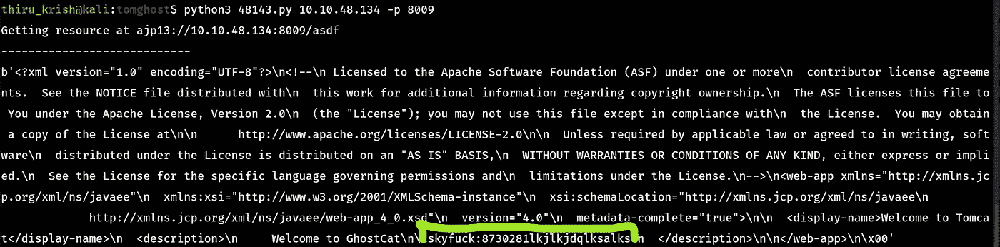

以 skyfuck 的身份登录，我们得到 user.txt 文件。

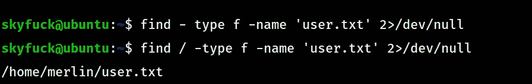

User.txt

**权限提升:**

列出了我们可以看到的梅林的主目录

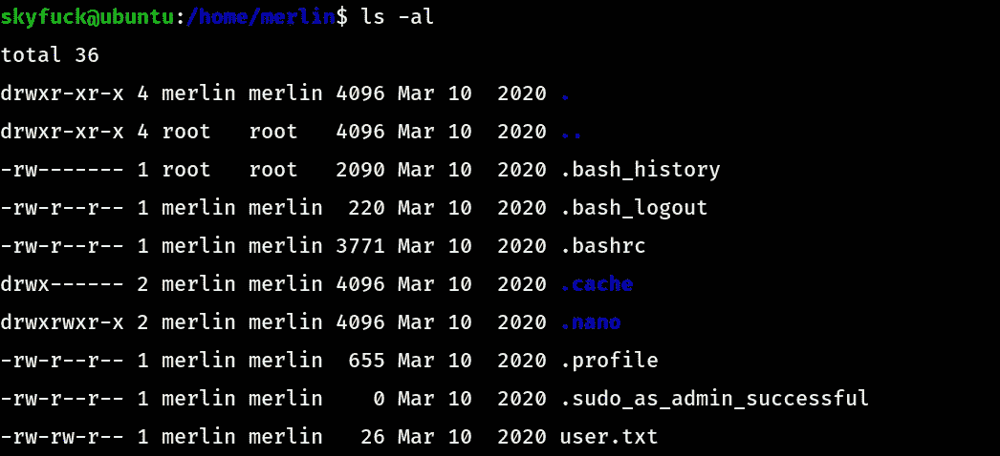

我们可以看到。sudo_as_admin_successful，这意味着用户 merlin 属于 sudoers 组。因此，我们必须首先找到梅林的凭证，并且在使用我们拥有的用户名和密码尝试 sudo 时，通过得到 skyfuck 不在 sudoers 组中的提示来确认这条路线。

在 skyfuck 的主目录中列出我们看到的文件:

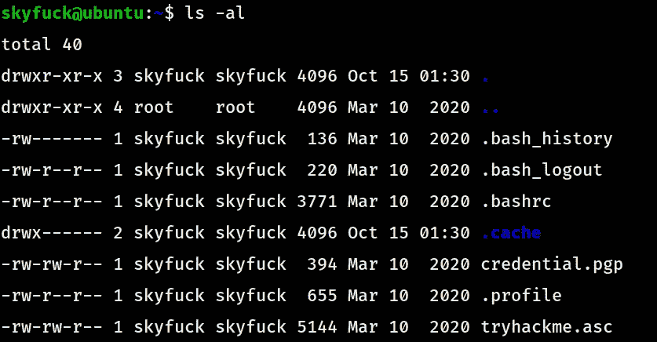

Skyfuck 的家

我们可以看到两个有趣的文件 credential.pgp 和 tryhackme.asc。

在这种加密方法中，我们需要一个私钥 tryhackme.asc 和一个密码来解密 credential.pgp 文件。

因为我们不知道密码短语，所以我们必须使用众所周知的 rockyou.txt 单词表来强制使用它。

在此之前，我们已经使用 gpg2john 将 tryhackme.asc 文件转换为 hash。

> gpg 2g John tryhackme . ASC > hash
> 
> John hash—word list =/usr/share/word lists/rock you . txt

一旦我们得到了密码，我们就可以使用

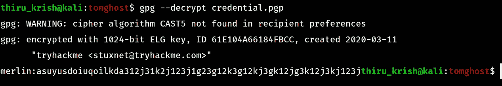

现在以 merlin 和基本权限枚举登录，我们将看到

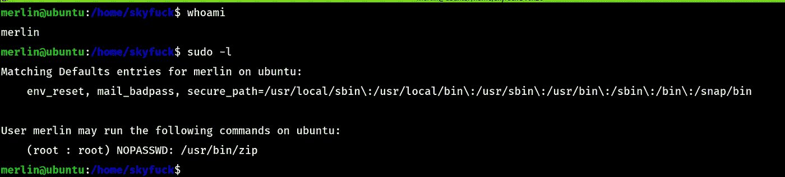

Merlin 用户

> **利用了权限提升漏洞:**允许/usr/bin/zip 以 root 用户身份运行，无需任何身份验证。
> 
> **漏洞解释:** ZIP 二进制文件可用于调用 shell 进程，当该进程被允许以 root 用户身份运行时，我们会以 root 用户身份获得 shell，从而导致系统完全受损。
> 
> **漏洞利用代码:**([https://gtfobins.github.io/gtfobins/zip/](https://gtfobins.github.io/gtfobins/zip/))

```
TF=$(mktemp -u)
zip $TF /etc/hosts -T -TT 'sh #'
rm $TF
```

证明:

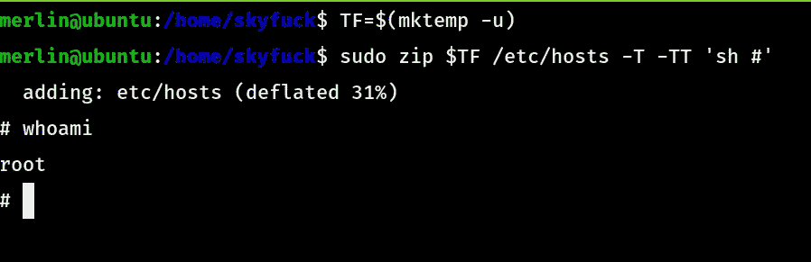

# 3.建议和补丁:

此系统的最佳解决方案或补丁是修补 GhostCat 漏洞，因为这可以阻止攻击者获得初始外壳。

1.  我们可以安装 Apache 发布的 Tomcat 的补丁版本，并在/conf/server.xml 文件中放置一个密钥

> <connector port="”8009&quot;" protocol="”AJP/1.3&quot;">redirect port = " 8443 "
> ADDRESS = " YOUR _ TOMCAT _ IP _ ADDRESS "
> SECRET = " YOUR _ TOMCAT _ AJP _ SECRET "/></connector>

2.如果您没有使用 AJP 协议，那么我们必须注释掉 server.xml 文件中提到的端口。

server.xml 文件位于机器的:/opt/tomcat/conf/server.xml 中

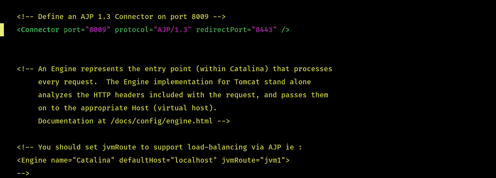

注释该行会关闭端口，只有当您不使用 AJP 协议时，才必须这样做。

3.如果无法修补，则必须将 server.xml 文件修改为

> <connector port="”8009&quot;" protocol="”AJP/1.3&quot;">redirect port = " 8443 "
> ADDRESS = " YOUR _ TOMCAT _ IP _ ADDRESS " required SECRET = " YOUR _ TOMCAT _ AJP _ SECRET "/></connector>

应用此修补程序后，重新启动并检查端口是否仍然打开或易受攻击。

谢谢大家！！