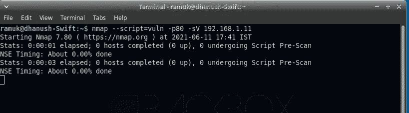
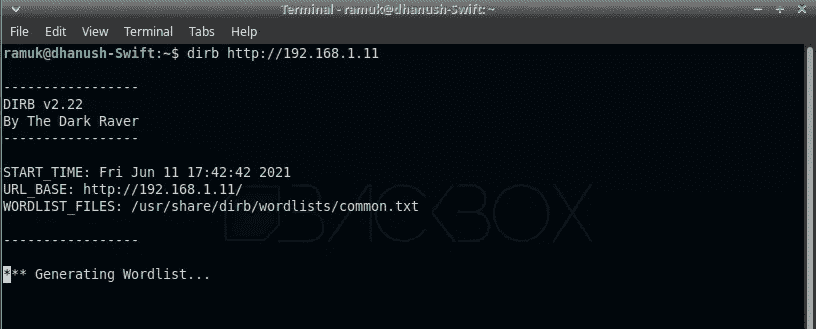
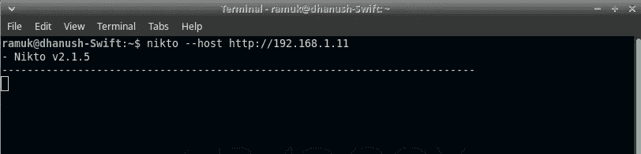

# 你需要用来解决 CTF 挑战的工具-端口 80。

> 原文：<https://infosecwriteups.com/tools-that-you-need-to-use-for-solving-port-80-on-a-ctf-challenge-29a21441bf4a?source=collection_archive---------3----------------------->

端口 80 是 CTF 挑战赛中的常见服务。这也是我在其他服务中最喜欢的一个，因为你肯定会在其中找到有用的东西。如果您遇到端口 80 或 433，那么这里是您应该使用的基本工具和步骤。

# Nmap

如果你正在阅读这篇文章，那么你应该已经知道 Nmap 了。Nmap 是一种网络扫描工具，它通过发送请求和分析响应来查找网络上的主机和服务。

Nmap 是我在 CTF 挑战赛中使用的第一个工具。我只是使用没有 nmap 选项的 CTF 的 IP 地址来查看打开了哪些端口。如果端口 80 是打开的，那么您应该进一步使用带有特定选项的 nmap 来获得关于它的更多信息。我是这么做的，

> **nmap-p80—script = vuln-sV-A IP**

在上面的命令中，-sV 选项将提供在端口 80 上运行的服务版本，而 script = vuln 选项将检查端口 80 上的常见漏洞。A 选项将列出操作系统类型以及一些其他有用的信息。

公平地说，仅仅依靠这个工具的帮助，你是无法解决挑战的。但是它会给你一个关于软件、版本号的概念，以及更多有用的信息来解决未来的挑战。

# Dirb

我最喜欢的工具之一，我在运行 nmap 工具后马上运行 Dirb。这是一个网页内容扫描器，寻找现有的和隐藏的目录出现在网站上。

首先，我只使用 dirb 工具运行了一个简单的测试。这是我在网站上找到有用内容所需要的一切。

> **dirb http://IP**

这个简单的测试默认采用 dirb 工具附带的' *common.txt'* 单词列表。如果我没有得到任何有用的内容，在用尽所有其他选择后，我会用这个工具使用一个高要求的单词表。

> **dirb http://IP/usr/share/word lists/dirb/big . txt**

在大多数挑战中，我通过使用这个工具获得了一些有用的信息，这有助于我获得旗帜。

# 尼克托

Nikto 是一个免费的漏洞扫描工具，应该放在你的腰带上。它检查服务器上的过时软件、危险文件和其他检查。你只需要提供 Nikto 工具的 IP 地址。

> **nikto -host http://IP**

我发誓我已经用 Nikto 的信息解决了一些挑战。你应该在你遇到的每个 CTF 挑战中使用这个工具。

# **网络扩展**

当 CLI 工具运行时，我会悠闲地逛遍网站的每个角落。当直接在网站上工作时，我使用一些网络扩展。

这是一个很棒的网络扩展，列出了服务器、软件和网站中使用的其他技术。如果我看到任何可疑的东西，我会在谷歌上搜索以获得更多的信息。

如果你使用 burp 套件，福克西代理人
福克西代理人应该在你的经纪人那里。它消除了在浏览器上设置代理站点以连接到 burp 套件的麻烦。我使用 Burp Suite 来查看网站的请求和响应。它帮助我解决了一些 CTF 的挑战，所以拥有它总是很好。

# 最后的想法

现在，有很多工具可以帮助你应对 CTF 挑战。但是上面列出的是重要的，如果你在一个网站上工作(例如端口 80)。我正在考虑为其他常见的端口写这样的文章，所以请回复我你的想法。如果你喜欢这个帖子，请留下一些👏。

***专业提示:*** *你可以在一篇帖子上鼓掌多达 50 次，以向作者展示你有多喜欢这篇帖子。*