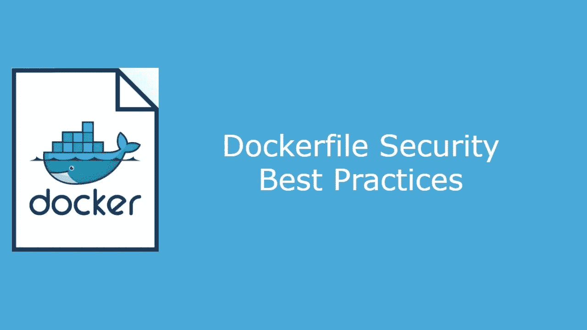
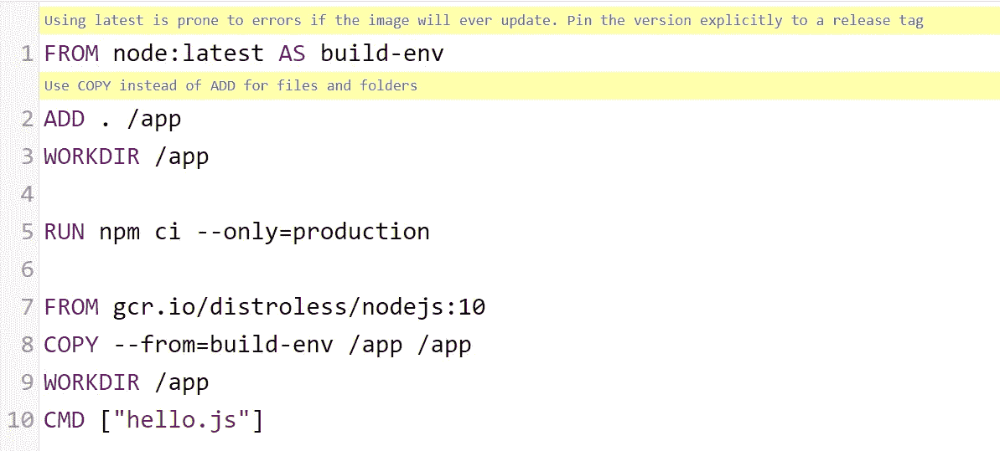
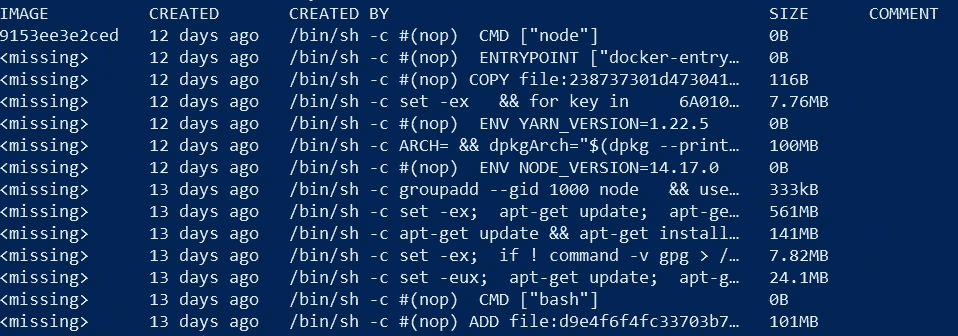

# 实现更安全容器的十大 docker 文件安全最佳实践

> 原文：<https://infosecwriteups.com/top-10-dockerfile-security-best-practices-for-a-more-secure-container-e5426f69738b?source=collection_archive---------1----------------------->



在本帖中，我们将介绍 Dockerfile 是什么以及如何创建一个 docker file，并遵循以下领先的行业安全最佳实践，包括但不限于多阶段构建、创建最少映像、使用适当的说明来最大限度地减少层数、林挺、避免什么等等。因此，让我们深入探讨 Dockerfile 安全性。

# 目录

[1。什么是 Dockerfile？](#3124)
[2。使用用户指令](#fe7f)
[3。使用最小 Dockerfile 基础映像](#768b)
[4。使用最小端口](#70f1)
[5。使用可信且安全的基础映像](#4085)
∘ [5.1。检查漏洞](#5cb5)
∘ [5.2。使用签名图像](#739f)
[6。使用棉绒](#7694)
[7。避免使用最新的标签](#3942)
[8。组运行、复制和添加指令](#169d)
[9。多级建筑](#f8af)
[10。避免包含机密或凭证](#cac1)
[11。使用。dockerignore](#3467)
[12。结论](#7405)
[参考文献](#0c6a)

# 1.什么是 Dockerfile？

最常见的 Docker 文件是一个文本文件，其中包含用于构建 Docker 映像的必要命令。如果你不熟悉 Docker 图像是什么，我强烈推荐你从 Docker 的一些文档[开始你的容器之旅。也就是说，dockerfile 是做什么的？dockerfile 允许用户以可重复、一致的方式自动构建容器映像，而不必手动遍历每个命令，这是一个很大的好处。现在您已经知道 dockerfile 是什么了，接下来的部分将带您了解编写 docker file 的安全最佳实践。](https://docs.docker.com/)

# 2.使用用户说明

为了确保容器不以 root 用户身份运行，应该尽可能使用用户指令。避免使用 root 将有助于防止主机权限提升攻击，这可能会损害系统的安全性。为了帮助用户完成这项任务，一些图像包含一个内置用户。例如，Node.js 包括它们的节点用户，如下所示。

```
USER node
```

如果不需要内置用户，应该将其删除。使用上面的同一个 Node.js 示例，这将通过向 Dockerfile 文件添加以下内容来完成。

```
# For debian based images use:
RUN userdel -r node# For alpine based images use:
RUN deluser --remove-home node
```

# 3.使用最小 Dockerfile 文件基础映像

图像应该是最少的，并且只包括成功运行应用程序所必需的包。这样做，通过移除不必要的和潜在的易受攻击的包，攻击面将显著减少。为了帮助开发人员完成这项工作，多个来源开发了只包含核心必需品的基础映像。[distroles](https://github.com/GoogleContainerTools/distroless)和 [Alpine](https://hub.docker.com/_/alpine) 是两种最常见的、推荐用于创建最小容器的基础图像。

# 4.使用最少的端口

除了使用最少的映像之外，应该只暴露必要的端口。使用 EXPOSE 指令将有助于向用户概述打算发布哪些端口。但是，需要注意的是，EXPOSE 指令纯粹是为了注释和/或文档目的。因此，它不能防止在运行时暴露额外的端口。

```
EXPOSE 80/tcp
```

# 5.使用可信且安全的基础映像

Docker 图像应来自可信来源，经过签名，并经过漏洞扫描，以实现适当的风险缓解级别。虽然有许多工具可以获得这样的结果，但 Docker 预装了 docker scan 命令，从而为用户扫描图像提供了一种快速简便的方法。

## 5.1.检查漏洞

```
PS user> docker scan node:14
\ Analyzing container dependencies for node:14
\ Querying vulnerabilities database......Package manager:   deb
Project name:      docker-image|node
Docker image:      node:14
Platform:          linux/amd64Tested 413 dependencies for known vulnerabilities, found 548 vulnerabilities.
```

## 5.2.使用签名图像

Docker 图像应该在使用前由可信来源签名。确保只使用签名图像的一种方法是强制 Docker 内容信任。在客户端，可以通过使用以下命令在每个会话的基础上强制执行。

```
$ export DOCKER_CONTENT_TRUST=1
```

设置 Docker 内容信任后，如果客户端试图提取不受信任的图像，将会出现如下错误。

```
$ docker pull node:14
No valid trust data for 14
```

为了检查已经提取的图像，Docker 提供了 docker trust inspect 命令，如下所示。

```
PS user> docker trust inspect --pretty node:14No signatures for node:14Administrative keys for node:14 Repository Key:       d3a0845e6d36c6c058ae6d2bc718b32ead4b51f2a6fa81b341ba2df72f1823c9
  Root Key:     be46625d7c6a0afe24bbbce6a92114d691e32ae921cf14f3feb2f970e7a77337
```

# 6.使用棉绒

linter 是一种静态分析内容的工具，可以标记编程错误、bug、风格错误等，帮助防止不良后果。 [Hadolint](https://github.com/hadolint/hadolint) 是一个普遍推荐的 Dockerfile linter，它可以帮助确保用户的 Dockerfile 遵循最佳实践，比如确认用户已经为他们的基本映像明确标记了一个版本。因此，建议在编写 docker 文件时尽可能使用 linter。

**图 1**

*Hadolint 示例*



# 7.避免使用最新的标签

如第 1.4 节所示。使用 Linter，Hadolint 建议避免在 docker 文件中使用最新的标签。用户应避免使用最新的标记，因为如果映像更新，可能会破坏功能或在将来的环境中引入未知因素。用户应该选择指定一个明确的发布标签，而不是使用最新的标签。

```
FROM node:14
```

# 8.组运行、复制和添加指令

Dockerfiles 中的 RUN、COPY 和 ADD 指令在被调用时都会创建一个新层。因此，最佳实践是尽可能将这些指令组合到一行中，以减少容器层数。

# 9.多层建筑

Dockerfiles 中的多阶段构建提供了一种进行中间构建的方法，也称为阶段。阶段允许用户复制前一阶段生成的版本，并在后续阶段使用它。使用多阶段构建将通过限制最终映像中发现的包来减少攻击面和构建的潜在漏洞。

例如，用户可能希望拥有一个利用构建工具的舞台，但是在最终图像中对这些构建工具没有要求。通过多阶段构建，他们可以使用 FROM“base _ image”作为“name_of_stage1”指令开始一个阶段，然后使用 COPY–FROM = " name _ of _ stage 1 "指令将该阶段的结果复制到下一个 FROM 阶段。参见下面的 docker 文件，它使用 Node:10 作为构建环境，然后使用 Google 的 distrolles Node:10 作为最终图像。

```
FROM node:10 as build-env
COPY ./app
WORKDIR /appRUN npm ci --only=productionFROM gcr.io/distroless/nodejs:10
COPY --from=build-env /app /app
WORKDIR /app
CMD ["app.js"]
```

# 10.避免包含秘密或凭证

Docker 使用层缓存，这实质上意味着所有的层仍然存在于最终的图像中。某些命令如 docker history 将显示图像中的图层以及它们是如何构建的。下面的图 2 给出了一个使用 Node:14 的例子。

```
docker history node:14
```

**图 2**

*节点的停靠历史:14*



当涉及到在 docker 文件中使用秘密或凭证时，这变得特别重要，因为任何访问图像的用户都能够看到内容。为了解决安全问题，最重要的是用户永远不要在他们的 docker 文件中包含秘密或凭证，无论是直接以明文形式写在 docker 文件中，作为文件传入，还是作为构建参数传入。

用户应该选择使用像 [Docker BuildKit](https://docs.docker.com/develop/develop-images/build_enhancements/) 这样的带有–secret 命令行选项的工具来传递所需的秘密信息。

例如，在 docker 文件中，用户将通过 RUN 命令访问秘密，如下所示。

```
RUN --mount=type=secret,id=secret cat /run/secrets/secret
```

在构建过程中，秘密将通过–secret 标志传递。

```
docker build --no-cache --progress=plain --secret id=secret,src=secret.txt .
```

# 11.使用。dockerignore

答。dockerignore 文件类似于. gitignore 文件，开发人员可以通过它指定要从构建上下文中排除的文件或目录，从而防止它被包含在最终的映像中。。dockerignore 文件对于明确排除敏感文件和目录(如凭证文件、备份、日志等)特别有用。以下示例确保. git 文件夹、logs 文件夹和所有以。md 扩展名(README.md 文件除外)被排除在生成上下文之外。见[码头工人。更多信息，请查阅文档](https://docs.docker.com/engine/reference/builder/#dockerignore-file)。

```
.git
logs
*.md
!README.md
```

# 12.结论

总之，Dockerfile 是构建可重复且一致的容器映像的一个很好的工具，只要安全地完成了。避免最新的标签，检查漏洞并减少任何出现的漏洞，仅使用签名的图像以避免潜在的供应链问题，以及概述的其他最佳实践将保证您的开发有一个正确的安全基础，以防止任何未来的麻烦。

# 参考

互联网安全中心。(未注明)。 *CIS Docker 基准*。【https://www.cisecurity.org/benchmark/docker/】T4。

码头工人。(未注明日期)。编写 Dockerfiles 的最佳实践。[https://docs . docker . com/develop/develop-images/docker file _ best-practices/](https://docs.docker.com/develop/develop-images/dockerfile_best-practices/)。

码头工人。(未注明)。*用 BuildKit* 构建图像。[https://docs . docker . com/develop/develop-images/build _ enhancements/](https://docs.docker.com/develop/develop-images/build_enhancements/)。

码头工人。(未注明日期)。*内容信任于码头工人*[https://docs.docker.com/engine/security/trust/](https://docs.docker.com/engine/security/trust/)。

码头工人。(未标明-未标明)。*针对 Docker 本地镜像的漏洞扫描*[https://docs.docker.com/engine/scan/](https://docs.docker.com/engine/scan/)。

加特曼博士(2018 年 7 月 10 日)。确保您的码头集装箱安全的速赢方案*。[https://www . equal experts . com/blog/tech-focus/quick-wins-to-secure-your-docker-containers/](https://www.equalexperts.com/blog/tech-focus/quick-wins-to-secure-your-docker-containers/)。*

GoogleContainerTools。(2020 年 7 月 28 日)。 *GitHub 资源库*。

[https://github . com/Google container tools/distro less/blob/main/examples/nodejs/docker file](https://github.com/GoogleContainerTools/distroless/blob/main/examples/nodejs/Dockerfile)。

Iradier，A. (2021 年 3 月 9 日)。*20 大 Dockerfile 最佳实践*。【https://sysdig.com/blog/docker-file-best-practices/】T4。

Nodejs。(2020 年 11 月 2 日)。 *Docker 和 Node.js 最佳实践*。[https://github . com/nodejs/docker-node/blob/main/docs/best practices . MD](https://github.com/nodejs/docker-node/blob/main/docs/BestPractices.md)。

准备好让您的网络安全技能更上一层楼了吗？请关注我，了解最新的行业标准最佳实践和指导。

## 来自 Infosec 的报道:Infosec 每天都有很多内容，很难跟上。[加入我们的每周简讯](https://weekly.infosecwriteups.com/)以 5 篇文章、4 个线程、3 个视频、2 个 GitHub Repos 和工具以及 1 个工作提醒的形式免费获取所有最新的 Infosec 趋势！