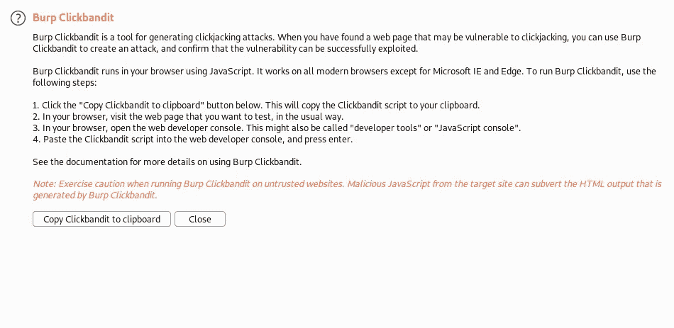

# 前 25 名点击劫持 Bug 赏金报告

> 原文：<https://infosecwriteups.com/top-25-clickjacking-bug-bounty-reports-b8b5b16ea2be?source=collection_archive---------2----------------------->


(照片由[翁贝托](https://unsplash.com/@umby?utm_source=unsplash&utm_medium=referral&utm_content=creditCopyText)在 [Unsplash](https://unsplash.com/s/photos/mouse-pointer?utm_source=unsplash&utm_medium=referral&utm_content=creditCopyText) 上拍摄)

在本文中，我们将讨论点击劫持漏洞，如何找到一个，并提出了 25 个基于此问题的披露报告。

# 什么是点击劫持？

Clickjacking 是一个漏洞，通过该漏洞，用户被诱骗(视觉上)单击父页面的一些按钮或 UI 元素，但实际上他们单击的是易受攻击的 web 应用程序中的某些内容，因为这些内容隐藏在父页面的 UI 后面。基本上，用户的点击被劫持为不同页面中的另一个动作。

这可能导致执行不受限制的操作、恶意软件下载、劫持(针对社交媒体页面)等。

# 如何发现点击劫持漏洞

有多种方法可以测试 web 应用程序中是否存在点击劫持的可能性。我最常用的是 Burp 套件工具的 Burp Clickbandit 特性。



另一种选择是在网站的本地主机上使用 iframe，如下所示:

```
<iframe src="URL"></iframe>
```

或者，如果你想速战速决，可以使用以下网站:【https://www.lookout.net/test/clickjack.html】T4

# 减轻

防止点击劫持攻击的解决方案非常简单，只需使用***X-Frame-Options****标头。你可以在这里找到更多:[https://developer . Mozilla . org/en-US/docs/Web/HTTP/Headers/X-Frame-Options](https://developer.mozilla.org/en-US/docs/Web/HTTP/Headers/X-Frame-Options)*

# *前 25 名点击劫持 Bug 赏金报告*

*这些报告是通过 HackerOne 平台披露的，并根据其支持票、奖金、严重程度、复杂性和独特性进行选择。*

***#1***

> ***标题:**玩家卡中的高蠕虫点击劫持*
> 
> ***公司:** [**推特**](https://hackerone.com/twitter)*
> 
> *赏金:5040 美元*
> 
> ***链接:**https://hackerone.com/reports/85624*

***#2***

> ***标题:** OAuth 授权页面易遭点击劫持*
> 
> ***公司:**[比特币基地 ](https://hackerone.com/coinbase)*
> 
> *赏金:5000 美元*
> 
> ***链接:**[https://hackerone.com/reports/65825](https://hackerone.com/reports/65825)*

***#3***

> ***标题:** Twitter 潜望镜点击劫持漏洞*
> 
> ***公司:** [**推特**](https://hackerone.com/twitter)*
> 
> *赏金:1120 美元*
> 
> ***链接:**https://hackerone.com/reports/591432*

***#4***

> ***标题:**通过链接截断进行病毒式直接消息点击劫持，导致获取两个 Google 凭据&安装恶意第三方 Twitter 应用程序*
> 
> ***公司:** [**推特**](https://hackerone.com/twitter)*
> 
> *赏金:1120 美元*
> 
> ***链接:**https://hackerone.com/reports/643274*

***#5***

> ***标题:**点击劫持 cards.twitter.com/xxx/xxx 窃取用户邮件*
> 
> ***公司:** [**推特**](https://hackerone.com/twitter)*
> 
> *赏金:1120 美元*
> 
> ***链接:**https://hackerone.com/reports/154963*

***#6***

> ***标题:**点击 Chrome 上的 jacking Periscope.tv*
> 
> ***公司:** [**推特**](https://hackerone.com/twitter)*
> 
> *赏金:560 美元*
> 
> ***链接:**https://hackerone.com/reports/198622*

***#7***

> *标题:点击劫持 Yelp 的重要功能*
> 
> ***公司:**[**Yelp**](https://hackerone.com/yelp)*
> 
> *赏金:500 美元*
> 
> ***链接:**【https://hackerone.com/reports/305128】T2*

***#8***

> ***标题:**关键 Yelp 预订中的点击劫持导致受害者私人数据(电子邮件信息)暴露+受害者信用卡误用。*
> 
> ***公司:**[**Yelp**](https://hackerone.com/yelp)*
> 
> *赏金:500 美元*
> 
> ***链接:**https://hackerone.com/reports/355859*

***#9***

> ***标题:**IE11 现场点击劫持*
> 
> ***公司:** [**新遗迹**](https://hackerone.com/newrelic)*
> 
> *赏金:500 美元*
> 
> ***链接:**https://hackerone.com/reports/614947*

***#10***

> ***标题:**使用 iframes 中的数据 URL 绕过 Flickr 上的点击劫持保护*
> 
> ***公司:** [**威瑞森传媒**](https://hackerone.com/verizonmedia)*
> 
> *赏金:250 美元*
> 
> ***链接:**https://hackerone.com/reports/7264*

***#11***

> ***标题:**让用户通过点击劫持的可能性购买物品*
> 
> ***公司:** [**Mail.ru**](https://hackerone.com/mailru)*
> 
> *赏金:200 美元*
> 
> ***链接:**https://hackerone.com/reports/471967*

***#12***

> ***标题:**【api.tumblr.com】利用点击劫持漏洞触发自身 DOM 型 XSS*
> 
> ***公司:** [**自动化**](https://hackerone.com/automattic)*
> 
> *赏金:150 美元*
> 
> ***链接:**https://hackerone.com/reports/953579*

***#13***

> ***标题:**在 o2.mail.ru 上点击劫持修改应用设置*
> 
> ***公司:**[mail . ru](https://hackerone.com/mailru)*
> 
> *赏金:150 美元*
> 
> ***链接:**https://hackerone.com/reports/355774*

***#14***

> ***标题:**单曲开启——点击劫持*
> 
> ***公司:** [**塞姆拉什**](https://hackerone.com/semrush)*
> 
> *赏金:150 美元*
> 
> ***链接:**https://hackerone.com/reports/299009*

***#15***

> ***标题:**以下链接容易被点击劫持*
> 
> ***公司:** [**塞姆拉什**](https://hackerone.com/semrush)*
> 
> *赏金:150 美元*
> 
> *【https://hackerone.com/reports/289246】链接:T44*

***#16***

> ***标题:**点击劫持漏洞通过[https://web agent . mail . ru](https://webagent.mail.ru)导致[https://web.icq.com/](https://web.icq.com/)端点的保护旁路*
> 
> ***公司:**[**mail . ru**](https://hackerone.com/mailru)*
> 
> *赏金:150 美元*
> 
> ***链接:**https://hackerone.com/reports/918923*

***#17***

> ***标题:**管理员登录页面敏感点击劫持。*
> 
> ***公司:** [**Shipt**](https://hackerone.com/shipt)*
> 
> *赏金:100 美元*
> 
> ***链接:**[https://hackerone.com/reports/389145](https://hackerone.com/reports/389145)*

***#18***

> ***标题:**带有点击劫持的 self-xss 会导致 Firefox 中的帐户被接管*
> 
> ***公司:**[Imgur](https://hackerone.com/imgur)*
> 
> *赏金: $100*
> 
> ***链接:**[https://hackerone.com/reports/892289](https://hackerone.com/reports/892289)*

***#19***

> ***标题:**Yelp 上发现的点击劫持漏洞*
> 
> ***公司:**[**Yelp**](https://hackerone.com/yelp)*
> 
> *赏金:100 美元*
> 
> ***链接:**https://hackerone.com/reports/214087*

***#20***

> *标题:在 ylands.com 点击劫持*
> 
> ***公司:** [**波西米亚互动公司**](https://hackerone.com/bohemia)*
> 
> *赏金:80 美元*
> 
> ***链接:**https://hackerone.com/reports/405342*

***#21***

> ***标题:**利用 refer.wordpress.com 上的点击劫持漏洞修改帐户详细信息*
> 
> ***公司:** [**自动化**](https://hackerone.com/automattic)*
> 
> *赏金:75 美元*
> 
> ***链接:**https://hackerone.com/reports/765355*

***#22***

> ***标题:**在捐赠页面点击劫持*
> 
> ***公司:** [**文字出版社**](https://hackerone.com/wordpress)*
> 
> *赏金:50 美元*
> 
> ***链接:**https://hackerone.com/reports/921709*

***#23***

> ***标题:**点击[https://www.mavenlink.com/](https://www.mavenlink.com/)主网站劫持*
> 
> ***公司:**[**maven link**](https://hackerone.com/mavenlink)*
> 
> *赏金:50 美元*
> 
> ***链接:**【https://hackerone.com/reports/14631】T2*

***#24***

> ***标题:**点击劫持*
> 
> ***公司:**[**maven link**](https://hackerone.com/mavenlink)*
> 
> *赏金:50 美元*
> 
> ***链接:**https://hackerone.com/reports/21110*

***#25***

> ***标题:** AWS S3 网站不能提供安全标题，可能允许点击劫持*
> 
> ***公司:** [**法律机器人**](https://hackerone.com/legalrobot)*
> 
> *赏金: $40*
> 
> ***链接:**https://hackerone.com/reports/149572*

# *奖金:10 美元零点击劫持报告*

***#1***

> ***标题:**在管理页面点击劫持*
> 
> ***公司:** [**火箭。聊天**](https://hackerone.com/rocket_chat)*
> 
> ***赏金:**$ 0*
> 
> ***链接:**https://hackerone.com/reports/728004*

***#2***

> ***标题:**在 cas.acronis.com 登录页面点击劫持*
> 
> ***公司:** [**Acronis**](https://hackerone.com/acronis)*
> 
> ***赏金:**$ 0*
> 
> ***链接:**https://hackerone.com/reports/971234*

***#3***

> *标题:在 jobs.wordpress.net 点击劫持*
> 
> ***公司:** [**文字出版社**](https://hackerone.com/wordpress)*
> 
> ***赏金:***【0 美元】**
> 
> ***链接:**https://hackerone.com/reports/223024*

***#4***

> *标题:【exchangemarketplace.com】点击劫持*
> 
> ***公司:**[](https://hackerone.com/shopify)*
> 
> *****赏金:***【0 美元****
> 
> *****链接:**https://hackerone.com/reports/658217***

*****#5*****

> *****标题:**点击劫持 wordcamp.org***
> 
> *****公司:** [**出版社**](https://hackerone.com/wordpress)***
> 
> *****赏金:**$ 0***
> 
> *****链接:**https://hackerone.com/reports/230581***

*****#6*****

> *****标题:** URL 容易被点击劫持***
> 
> *****公司:**[**my crypto**](https://hackerone.com/mycrypto)***
> 
> *****赏金:***【0 美元】****
> 
> *****链接:**https://hackerone.com/reports/712376***

*****#7*****

> *****标题:**点击劫持 mercantile.wordpress.org***
> 
> *****公司:** [**文字出版社**](https://hackerone.com/wordpress)***
> 
> *****赏金:**$ 0***
> 
> *****链接:**https://hackerone.com/reports/264125***

*****#8*****

> *****标题:**使用 inspectlet 技术通过点击劫持获取任何用户的 ip 和地理位置***
> 
> *****公司:** [**Acronis**](https://hackerone.com/acronis)***
> 
> *****赏金:***【0】美元****
> 
> *****链接:**https://hackerone.com/reports/998555***

*****#9*****

> *****标题:**在授权页面点击劫持[https://wakatime.com/share/embed](https://wakatime.com/share/embed)***
> 
> *****公司:**[](https://hackerone.com/wakatime)***
> 
> *******赏金:***【0 美元******
> 
> *******链接:**https://hackerone.com/reports/244967*****

*******#10*******

> *******标题:**点击劫持—[https://mercantile.wordpress.org/](https://mercantile.wordpress.org/)*****
> 
> *******公司:** [**出版社**](https://hackerone.com/wordpress)*****
> 
> *******赏金:**$ 0*****
> 
> *******链接:**https://hackerone.com/reports/258283*****

*****非常感谢，祝你有美好的一天！*****