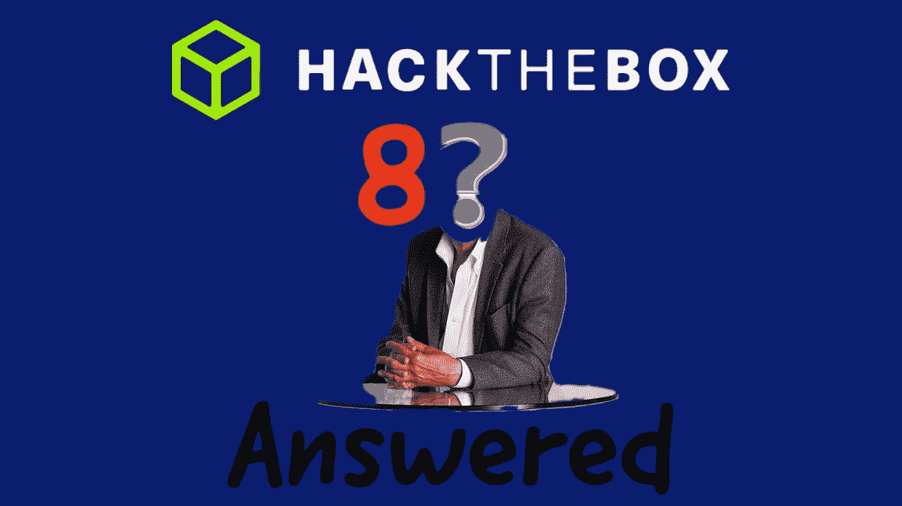
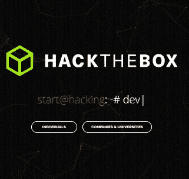
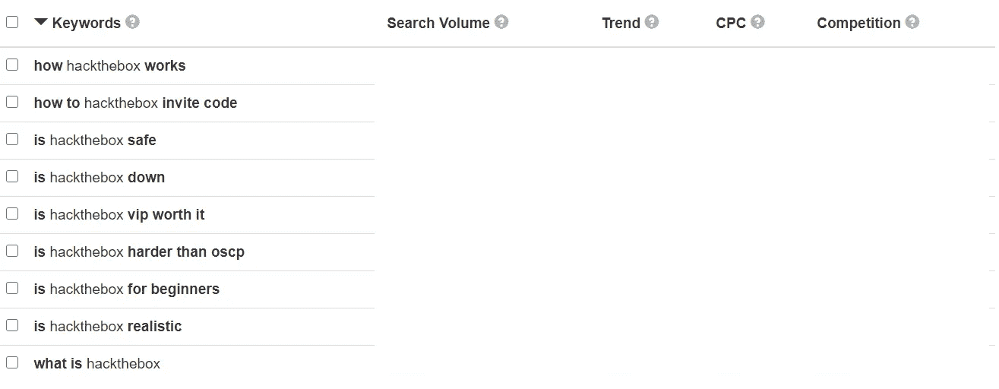

# 回答的 8 大热门黑客盒子问题

> 原文：<https://infosecwriteups.com/top-8-popular-hackthebox-questions-answered-23e26272e6a6?source=collection_archive---------0----------------------->

## HTB 趋势问题— 2020 年

**HackTheBox 问题解答**

他的文章将会和我以前发表的完全不同。在这里，我将回答一些网上用户提出的热门问题。希望你喜欢！！

> 我今天选择的关键词是黑客盒子。

HTB 个人资料徽章

图片来源:【https://www.hackthebox.eu/ 

我很确定你对 HackTheBox(又名 HTB)很熟悉，或者至少听说过它。不管你是新手还是有经验的安全专家，我都强烈建议你在 HackTheBox 上注册一个帐户，玩挑战和机器。

它将滋养你的安全评估技能，并为你提供一个完全不同的心态。

这里，我使用站点关键字工具来识别所选平台的热门问题。以下是一目了然的问题，很快会有答案。

图片来源:[https://keywordtool.io/](https://keywordtool.io/)

确保你通读了整篇文章，以防奇迹发生，我可能已经回答了你的一个甚至没有列出的问题。如果你有除了以上列表之外的问题，请随意在评论区提出，我会确保回复的。

说到这里，让我们深入探讨一下这个问题。

> ***第一个问题:hackthebox 如何工作***

嗯，这确实是个好问题。这个问题的答案很简单，但在本质上是巨大的。我试着总结一下。HTB 提供了各种各样的挑战和机器，难度从简单到疯狂不等。用户应该在平台上有一个帐户，并张贴 VPN 连接，你已经准备好采取不同的舞台。大多数情况下，提交是通过用户自己完成的。此外，HTB 确实提供了 VIP 订阅，它提供了许多功能，如预激活退休机器或挑战。

> ***第 2 题。如何破解邮箱邀请码***

哈哈哈。:-)每一个有趣的问题。在回答问题之前，我先给你简单介绍一下背景。最初，当您尝试在该平台上注册时，您需要输入邀请代码。最糟糕的是，没有人会给你现成的邀请代码，而是你必须自己生成邀请代码。所以基本上第二个问题是询问如何获得邀请代码。

不幸的是，为你提供解决方案违背了我的职业道德。但是我可以给你一个提示。提示是“***JavaScript 很有用。尝试添加一些断点。*** “以防你没有得到提示，网上很多网站都可以给你这个问题的答案。就为了它，谷歌。

> ***第三个问题:hackthebox 安全吗***

在我看来，当然是。我不确定，为什么你认为，它不是。除了来自 HTB 的安全性，最终用户也有一些共同的责任，以确保我们加强您的帐户。一些快速的安全性查找是，

1.密码:

*   有复杂的密码
*   每季度至少更改一次密码。
*   看在上帝的份上，不要在所有其他平台上使用相同的密码。

2.虚拟专用网络

*   确保断开您的 VPN。哦，我指的是 VPN，因为 HTB 提供了许多基于竞技场的 VPN。

3.盒子和 HTB 论坛

*   在评估挑战或机器时，确保不要在平台上上传文件或敏感数据，也不要在 HTB 论坛上发布。

> ***第四个问题:hackthebox 是不是倒了***

何时，如何，为什么。我真傻，至少不是现在，但我无法预测未来。

> ***第五个问题:hackthebox vip 值得吗***

我相信是的，HTB VIP 用户提供了大量的功能。有些是，

*   接触退役机器/挑战
*   官方报道和视频

正如所说，一张图片胜过千言万语。下图描述了免费、VIP 和 VIP+订阅之间的区别。

图片来源:[https://www.hackthebox.eu/](https://www.hackthebox.eu/)

> ***第六题:hackthebox 比 oscp*** 难吗

我离开 OSCP 已经一年了。甚至在我报名参加 OSCP 认证之前，我就在 HTB 玩得很开心。

老实说，与中等难度的箱子相比，HTB 类似于最难的 PWN 实验室。所谓的 OSCP 5 大困难箱子甚至比不上 HTB 的疯狂困难关卡箱子。

> ***第七个问题:hackthebox 适合初学者吗***

是的，它也是为初学者准备的。如前所述，机器和困难水平的挑战从容易到疯狂不等，以适应大多数观众。

> ***第 8 个问题:hackthebox 现实吗***

到目前为止，在 HTB 有 150+的内容提交，比较它们，我可以肯定地说，是的，大多数机器是现实的。此外，提交是由最终用户完成的，他们是网络专家，通过准备那些机器，包括他们实时面临的现实世界的挑战，来帮助信息安全和网络安全社区。

 [## 漏洞利用报告

### CTF 玩家、安全专家、Bug 赏金猎人、白帽黑客和渗透测试者的博客你好，我是…

www.youtube.com](https://www.youtube.com/@Exploit-Writeup/) 

**拜拜:**

感谢您阅读这篇文章。如果你喜欢这个解释，请竖起大拇指，并与你的朋友分享。对于任何建议或意见，请在评论区发表，这将鼓励我为信息安全和网络安全社区做出更多贡献。