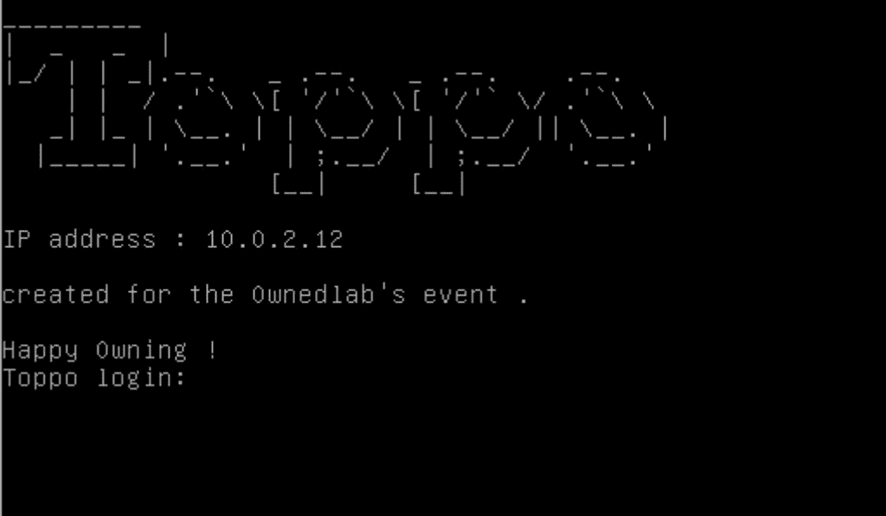
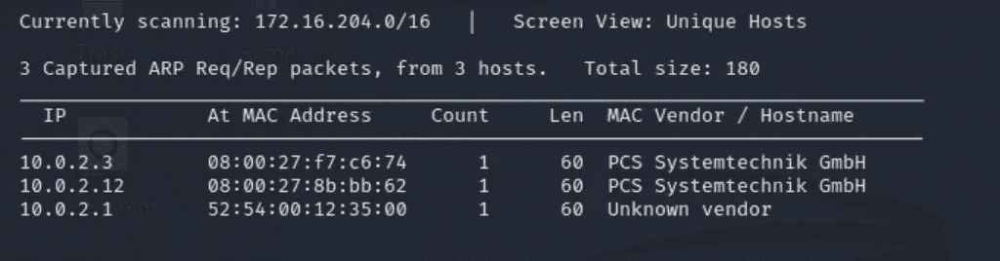
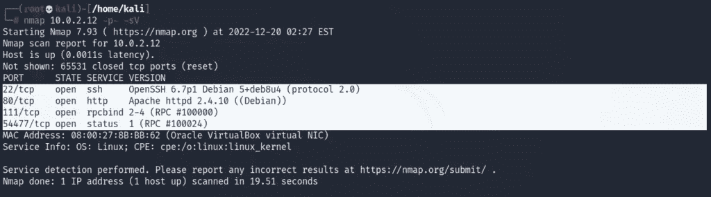
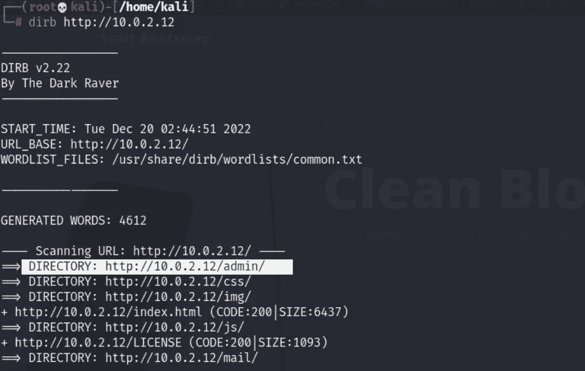
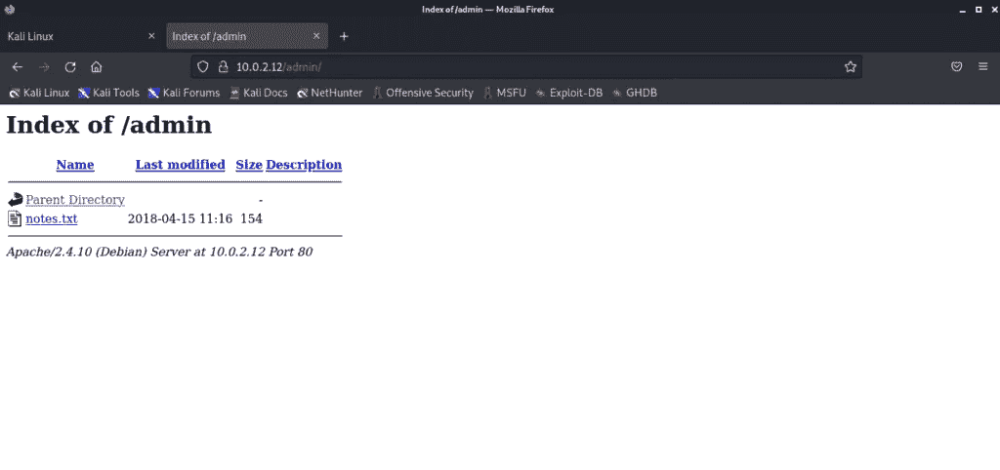
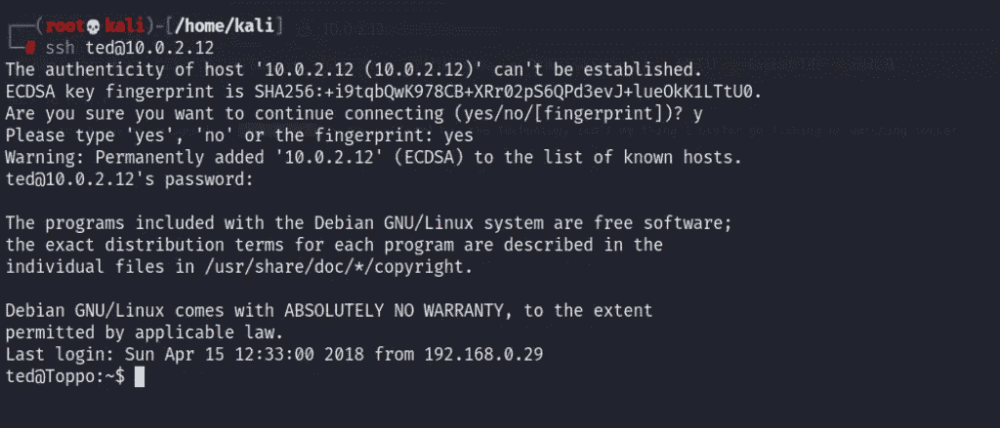
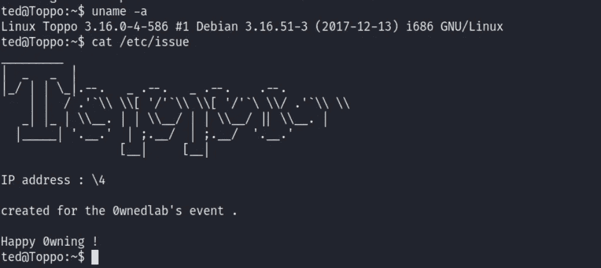
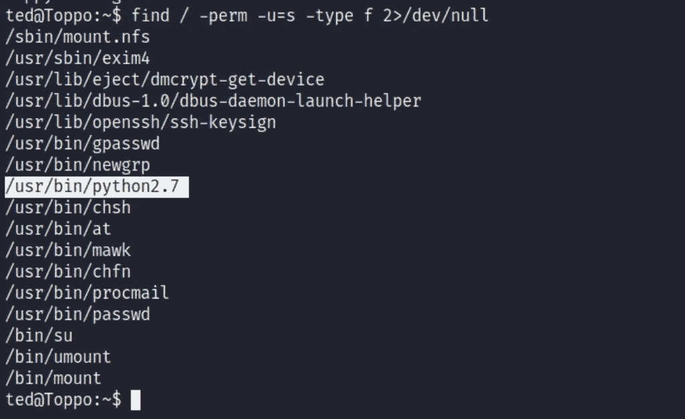
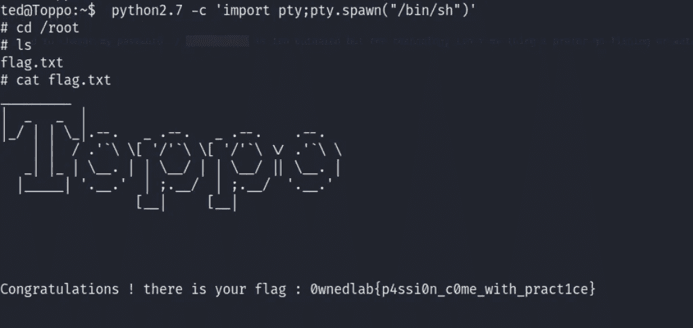

# Vulnhub Machine-Toppo 详细报道/漫游|作者 Md Amiruddin

> 原文：<https://infosecwriteups.com/toppo-capture-the-flag-walkthrough-d7ace3aa811f?source=collection_archive---------9----------------------->

难度:容易

旗帜:有一面旗帜

DHCP:启用
IP 地址:自动分配

对于这台 Toppo 机器，我使用了 Virtual Box 来运行目标机器。Kali Linux 是解决这个 CTF 的攻击机器。

Toppo OVA 文件可以从[这里](https://www.vulnhub.com/entry/toppo-1,245/)下载。

**足迹**

正如你所看到的，Toppo 机器是开机的，它显示 ip 地址为 10.0.2.12。现在，在我们开始使用 ifconfig 来找到你的攻击机器(kali)的 IP 地址。

我的目标的 IP 地址是 10.0.2.12，我的 Kali 的 IP 地址是 10.0.2.5。这些地址适用于我和我的网络，您的地址可能会有所不同。

我们将使用命令> **netdiscover -i eth0** 来发现 Toppo ip 地址。

我们接下来需要找出哪些端口和服务是可用的。为此，我们可以进行 Nmap 扫描。

使用的命令>**nmap 192 . 168 . 0 . 31-p****-sV**

扫描显示目标有 4 个打开的端口。

如我们所见，端口 80 可用，因此，我们将打开浏览器，在地址栏中键入 IP 地址，它将显示网站的主页。

因为网页没有显示任何有用的信息。现在是时候和 Dirb 爆发了。Dirb 将帮助我们找到网站的目录。DIRB 是一个网页内容扫描器。它查找现有的(和/或隐藏的)Web 对象。它的基本工作原理是对 web 服务器发起基于字典的攻击，并分析响应。

使用的命令>**dirb**[**http://10 . 0 . 2 . 12**](http://10.0.2.12)

一段时间后，dirb 将显示一些有用的目录，从结果中我们得到了一个管理目录，这将是我们开始寻找的第一选择。只需要复制网址，并把它放在我们浏览器的地址栏。

我们在 admin 目录中发现了一些重要的 notes.txt 文件。打开 notes.txt 文件后，我们发现了一个密码{12345ted123}，因此，我们将尝试使用该密码登录运行在端口 22 上的 ssh。

由于我们已经有了一个包含名称的密码，并且目标正在运行 SSH，因此可能的用户名和密码组合如下所示 ssh [【受电子邮件保护】](https://cyberintelligencesolution.com/cdn-cgi/l/email-protection)

使用的命令>**ssh**[【邮件保护】](https://cyberintelligencesolution.com/cdn-cgi/l/email-protection)

如您所见，我们已经登录，因此我们将深入了解以找到所需的标志。

现在是开发和扎根的时候了。我们来看看 OS 版本是否存在漏洞。

**> *猫/etc/期***

我已经检查过我们的目标操作系统 Debian 3 . 16 . 51–3 没有漏洞，所以我们尝试不同的方法来找到我们的根标志。

通过使用以下命令，我们可以枚举所有具有 SUID 权限的二进制文件。

SUID 是对可执行文件的一种特殊的文件权限，它使其他用户能够以文件所有者的有效权限运行该文件。您将看到一个 s(表示 SUID)用户的特殊权限，而不是代表执行权限的普通 x。

使用的命令>**find/-perm-u = s-type F2>/dev/null**

我们已经发现了 python2.7 二进制文件，所以我们将利用它。

通过使用 Python 2.7，我们可以获得 root 访问权限，我们将使用以下命令找到 root 标志:

**python2.7 -c 'import pty 使用的命令；pty.spawn("/bin/sh")'**

如您所见，我们在根目录中找到了根标志。这个 CTF 对初学者来说很容易，但是做起来很有趣。

*原载于 2022 年 12 月 20 日 https://cyberintelligencesolution.com**的* [*。*](https://cyberintelligencesolution.com/toppo-capture-the-flag-walkthrough/)