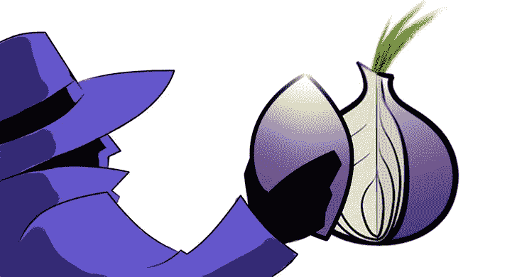

# TOR:具有潜在漏洞的不太安全的一面

> 原文：<https://infosecwriteups.com/tor-the-less-secure-side-with-potential-vulnerabilities-edd45cae7665?source=collection_archive---------0----------------------->

> 在我们每天使用的互联网表面下，隐藏着一个加密网站的秘密世界。这是黑暗之网。一组使用加密技术隐藏在众目睽睽之下的网站。试图访问这些网站的用户使用一种名为 Tor Browser 的专门工具来创建与黑暗网站的连接，使用强加密来保护他们的通信免受窥探。Tor 连接的主要好处是保证匿名性。你不仅可以防止窃听，而且如果你正确使用 Tor，即使你访问的网站也不会知道你的身份。网站所有者不知道其用户的真实身份，用户也不知道网站所有者的真实身份。这是一个完全匿名的互联网版本，隐藏在众目睽睽之下。虽然犯罪分子肯定会在黑暗的网络上安家，但注重隐私的公民、记者、持不同政见者和其他人也是如此。

事实上，虽然 Tor 为互联网流量的隐私和匿名提供了一个有价值的工具，但它并不是不可战胜的。用户仍然必须采取预防措施来保护他们的通信，因为老练的对手可能会利用漏洞来破坏通过 Tor 网络发送的通信的安全性。让我们讨论一些方法，你的 TOR 匿名可能会受到影响。

> **这些攻击中的第一种**使用了一系列技术，利用用户行为中的失败来危害他们的通信安全。爱德华·斯诺登的演讲也讨论了这些技术。NSA 将这个漏洞称为“哑用户”，并给它起了一个代号 EPICFAIL。这些技术的工作原理是简单地观察匿名用户离开 Tor 出口节点的流量，并将该流量与其他识别信息联系起来。这可能很简单，只需观察匿名网络连接的用户登录个人账户以识别其身份，也可能更复杂。如果观察者能够从 Tor 网络外部访问其他网络流量，他们可能能够比较匿名和非匿名流量的特征。例如，互联网上的网站和广告网络使用 cookie 来跟踪用户行为，并且 web 浏览器会自动将这些 cookie 发送到参与的网站，对此您可能不会感到惊讶。这些 cookies 唯一地识别用户。如果窃听 Tor 通信的人注意到通过 Tor 网络发送了一个 cookie，并且也看到在常规互联网上使用了同一个 cookie，他们就可以将两个会话联系在一起，并取消 Tor 用户的匿名。
> 
> **第二种方法**涉及被动流量分析，遵循与用户行为分析非常相似的模式，将常规互联网流量和匿名 Tor 流量结合在一起。这两种技术的主要区别在于，用户行为分析依赖于不安全的用户活动，或者如 NSA 所称的哑用户。被动流量分析寻找计算机、浏览器或网络的行为模式。例如，分析师可能会注意到某个用户发送的 web 请求包含由操作系统、硬件和修补程序级别的组合添加的独特属性的组合。如果这些特征同时出现在 Tor 流量和常规互联网流量中，就有可能将两者联系在一起。现在，如果这听起来很有挑战性和牵强，那是因为它确实如此。被动流量分析背后的基本思想是，虽然 Tor 流量是匿名的，但有两个弱点:**流向入口节点的流量和离开出口节点的流量**。如果窃听者正在监控 Tor 网络的大部分，他们可能能够使用被动流量分析将进入入口节点的流量与离开出口节点的流量相关联，从而使两个节点之间发生的事情无关。**个人用户无法保护自己免受这种攻击。**
> 
> 到目前为止，我所讨论的攻击都依赖于窃听用户活动，进入或离开 Tor 网络。他们假设 Tor 网络的内核是精心设计的，不可渗透的。虽然 Tor 可能设计得很好，但这并不意味着无法进入安全核心。记住，Tor 网络上节点的身份是匿名的。我们不知道是谁在操纵他们。您正在使用的节点可能由爱好者、专注于电子隐私的非营利组织或拥有一些额外服务器的公司的 it 人员运行。他们也可能由情报机构管理。任何人都可以设置 Tor 节点并开始接受流量。然而，处理 Tor 连接的节点只知道它从哪个节点接收流量，以及它向哪个节点发送流量。如果您正在操作入口节点，您确实知道用户的身份，但您无法读取流量或看到最终目的地。如果您是出口节点，您知道流量的最终目的地和内容，如果它没有在应用层加密，但您不知道用户的身份。如果你是电路中间的一个中继节点，你其实知道的不多。您知道向您发送流量的节点的身份，以及电路中下一个节点的身份，但您不知道流量是由谁发起的，它将去往何处，或者它包含什么内容。试图危害 Tor 流量的对手可能试图创建恶意节点来窃听通信，但他们只有控制 Tor 电路中的所有节点才能获得有价值的情报。用户的浏览器从目录中随机选择这些节点，所以这不太可能。但是，如果一个老练的、资金充足的对手创造了许多强大的 Tor 节点，并将它们加入到网络中会怎么样呢？记住，Tor 网络上只有几千个节点。不难想象，一个老练的攻击者可以创建 3000 个 Tor 节点，并随着时间的推移将它们添加到网络中。**这是第三种，也是所谓的电路重建攻击**。假设总共有 9000 个 Tor 节点，一个对手控制了其中的 3000 个。这意味着现在任何随机选择的 Tor 节点都有 30%的机会被对手控制。如果用户选择三节点电路，那么这些节点中的每一个都有 30%的几率受到损害。同样，受感染节点的数量越多，泄露匿名的可能性就越大。