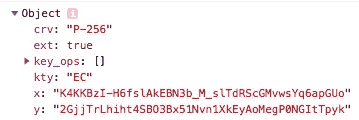

# 走向更短的加密密钥

> 原文：<https://infosecwriteups.com/towards-shorter-encryption-keys-91fe276aeea2?source=collection_archive---------2----------------------->

*本文深入探讨了椭圆曲线加密的技术细节。*

公钥和私钥密码术是七十年代后期的新发明，我们富有创造力的前辈们并没有想到。相反，他们依赖对称加密方案，要求双方都知道加密密钥。

最早的此类计划是 Scytale，一种由希腊诗人 Archilochus 在公元前 7 世纪首次提及的装置。在这个方案中，秘密就在棍子的宽度上，一条加密的文本卷在棍子上。


Scytale(图片来自维基百科)

从那以后，在加密的复杂性方面有了一系列的创新，最终出现了加密方案，如德国人在二战中使用的 Enigma。

然而，对称加密方案需要由不应被拦截的人类信使物理地发送加密密钥。这种情况在 70 年代末发生了变化，当时几个研究人员开始研究被称为公钥密码学的东西。特别是在 1978 年，三位计算机科学家 Rivest、Shamir 和 Adelman (RSA)宣布了一项发明，允许将加密密钥分成公共和私有部分。公共部分用于加密，私有部分用于解密。

创新之处在于，即使有人设法看了一眼公钥，也无法帮助他解密秘密信息。这个想法是，我会告诉我所有的朋友我的公钥，如果他们想给我发送一个机密消息，那么他们会用这个密钥来加密文本。

乍一看，双公钥-私钥思想似乎是私有通信的理想解决方案。但是，还存在一个如何沟通密钥的问题。

RSA 方案设计的公钥是长数字。它们可以由数字和字母的组合在一个稍短的空间中表示，但即使这样，它们仍然太长了。相比之下，信用卡号有 16 位，读起来已经够长的了。相比之下，RSA 公钥至少要长十倍。

这里有一个保存在我的 MacBook 上的`.ssh/id_rsa.pub`文件中的公钥的例子:

```
ssh-rsa AAAAB3NzaC1yc2EAAAADAQABAAABAQDZdYqaK6msN2pRrr1tMioVqnqSI5P4+o+74Db2eLTenaeCXm/TJERgYBWV1c0EU8cGVfvH/tRBoJWVuPXs6ml1WnDvcgWpCrR+BZ7mga7as8t0U+264YsQe9NpdnFjpTW9RmyY+RDCAPkF7qtzdGyCQY0PmsRESsJ9tp1amrEL6vyhZvdZr/wOXpPzgQ00/9heZESuFlC4lLFsEBkPhBPdalYL2vjdEbunYjFqFlp4yuyBAV8BIfP+YTjPhyEXu03Ue0sDI/FD4ayx92Kozt7XtAI7W54iG7ycW0jiihOLag9vRCLXOSFCF1cDfHW74xdcwws8lxnJ2B2zoiCAOISH
```

由于您无法读取公钥，也无法键入公钥，因此必须通过 USB key 或电子邮件、即时消息或 Dropbox 等电子通信方式进行物理传输。另一种方法是在你的网站、推特或脸书上发布。(这是 Keybase.io 采用的方法。)

尽管这些是潜在的解决方案，但是仍然有一个必须被委托来传递公钥的快递员。现在快递员不是人了。“他”在互联网服务器、网站或电子邮件网关中。但是因为快递员站在你和你所有朋友之间，所以快递员处于对你进行“中间人”攻击的位置。他通过向你所有的朋友发送他自己的公钥来冒充你。

需要一种创新来允许更短的键，以便更容易传达它们。这种创新以椭圆曲线加密(ECC)方案的形式出现，该方案提供了与 RSA 相当的保密级别，但密钥要短得多。这是因为它不依赖于秘密的素数，而是依赖于秘密的合数。

由于质数相对较少，RSA 需要非常大的质数，因此无法猜测。(最近，一名研究人员能够证明许多 RSA 公钥实际上是基于相同的素数，并基于此能够破解加密。)

与交替排列在大圆上的数字的 RSA 不同，ECC 方案交替排列在具有(x，y)表面坐标的三维圆环或圆环上的点，服从某个等式。

现在，键不再是一个长数字，而是一个具有整数坐标的点(x，y)。这些坐标满足“y = x + ax + b”形式的椭圆曲线方程。请注意，所有运算都是以“mod p”计算的。

(工作“mod p”是指如果一个数大于 p，那么你可以用它除以 p，用余数代替原来的数。可以证明，在这种情况下，只要 p 是一个素数，所有重要的代数性质都保持不变。)

一个键的长度是表示这些(x，y)坐标所需的空间。由于该方案将与参数“a”、“b”和“p”的不同选择一起工作，所以已经设计了几个标准化的参数集。名为“P-256”的已知参数集如下。系数“a”是负 3 的数。数字“b”是一个长整数:

```
41058363725152142129326129780047268409114441015993725554835256314039467401291
```

模数“p”必须是一个质数，它是一个很长的数，可以用公式 2 ⁵⁶ - 2 ⁴ - 2 ⁹ - 2⁹⁶ - 1 来计算。它的计算值是:

```
115792089210356248762697446949407573530086143415290314195533631308867097853951
```

那个质数有一个特殊的性质，那就是它后面的数能被 4 整除。换句话说，(p+1)/4 是一个整数。这个事实的重要性很快就会变得明显。(注意，因为所有的质数都是奇数，所以结果数应该是偶数，并且可以被 2 整除，但不一定是 4)。

让我们继续估计公钥长度的项目。在“P-256”椭圆曲线方案中，所有坐标可以仅用 32 字节的空间来表示。因为每个字节可以有 256 个值，但是英语只有不到 256 个字母，所以我们需要用 32 个以上的字符来表示它。Base64 URL 编码允许用一个字符表示 64 种可能性。(注意 base64 *URL* 编码与 base64 编码不同。)

使用 Base64 URL 字符编码，32 字节的密钥可以表示为 43 个字符。可以导出公钥的 JSON Web Key (JWK)标准就是这样做的:



P-256 椭圆曲线中的密钥(x，y ), base64-URL 编码

因为每个坐标表示为 43 个字符，所以完整的(x，y)坐标需要 86 个字符。尽管这是对 RSA 的一个巨大改进，但还是有可能将所需空间减半。这个技巧涉及到一个数学计算。理论上，知道其中一个坐标就可以计算出另一个坐标，因为两者都满足椭圆曲线方程 y =x -3x+b。

为了快速计算，我们计算出给定的 *x* 的 *y* ，而不是反过来。然而，将一个已知的 *x* 的值代入等式计算出的是 *y* 的值，而不是我们需要的 *y* 。那么，我们如何得到 *y* 的“平方根”？这并不简单，因为，记住，所有的计算都是“mod p”完成的。

让我们花一点时间了解一下模运算的数学。模运算涉及排列在一个圆上的整数。在其中工作会让你觉得自己置身于一个怪异的世界。

作为说明，我们以一个有 11 个位置的圆为例，它对应于“mod 11”计算。(想象一个只有 11 个小时的落地钟，而不是 12 个小时)。

3 模 11 的平方根是 5 和 6。这仅仅意味着，如果你从位置 1 开始，绕圆走 25 步，你将在位置 3 结束。如果你绕着圆圈走 36 步，也会发生同样的情况。

以下是“mod 11”设置中的所有“平方”数字:

```
p = 11   
for (var i=0; i<p; i++) {  
  console.log(i+"x"+i, i*i % p) 
}0x0 0
1x1 1
2x2 4
3x3 9
4x4 5
5x5 3
6x6 3
7x7 5
8x8 9
9x9 4
10x10 1
```

因此，回到你的“mod p”计算，我们需要一个策略来从 y 计算 y，这涉及到理解循环行为。幸运的是，一些伟大的头脑已经在这方面工作了，我们可以免费使用结果。

为了方便计算 y 的平方根，我们使用大数学家欧拉的一个定理。这个定理被称为欧拉判据，它指出一个值的幂(p-1)/2 等于 1 或-1 mod p。每当我们在数学中有一个公式可以将一些量减少到一个单位，我们就试图将我们拥有的任何量分成可以应用该公式的部分。

在这种情况下，我们利用我们选择的素数也满足(p+1)/4 是整数这一事实。让我们来看看当你把 *y* 提升到(p+1)/4 次方时会发生什么。总功率变为 2 (p+1)/4，简化为(p+1)/2。此外，该表达式可以用(p-1)来表示，如下所示:1 + (p-1)/2。结合欧拉判据，我们得到 y，我们正在寻找的平方根。

所以，求模平方根的方法是，在 mod p 算法中，简单地将数字提升到(p+1)/4 的幂。

根据我提出的欧拉判据，上述计算将给出 *-y* 的第二个解。这并不完全准确，因为我没有提到的部分是，对于具有平方根 mod p 的值——这种数字在模运算中被称为*二次剩余*，对应于常规非模运算中的平方数——准则公式保证给出值 1，而不是-1。

另一方面，我们在这里解一个二次方程，因式分解 y 确实有两个解，一个是正的，一个是负的。换句话说:-y * -y = y 和 y * y = y .因此，只给定 x 坐标和一个缺失的 y 坐标，我们无法确定我们缺失的是哪个 y 坐标。

然而，在模运算中，每个负数都可以表示为等价的正数。比如-5 mod 11 和 6 mod 11 一样。(这就是为什么在前面的“mod 11”示例中，我们观察到 5 和 6 都是 3 mod 11 的平方根。实际上，5 和-5 是 3 的平方根。)负数只是表示绕一圈向后走；同样的位置可以向前移动一步。

正数和负数之间的二元性看似复杂，实际上对我们有利。在计算中，我们更愿意只处理正整数。

从- *y* 到它的正等值需要加上 *p* ，所以它变成(-y + p)。反过来写就是补码(p-y)。有趣的是，有效解中必须有一个是偶数，另一个是奇数。比如 y 是奇数，那么(p-y)一定是偶数，因为 p 是奇数。反之，如果 y 是偶数，那么(p-y)是奇数。

因此，如果我们坚持将椭圆曲线方程的两个解都作为正数，符号的不同就转化为奇偶性的不同。奇偶校验可以编码为一个布尔位，并与需要 32 字节空间的“x”值打包在一起。

因为我们使用的是字节，所以需要一个额外的字节。只有 x 坐标的整体公钥包得到了一个“压缩椭圆曲线坐标”的标准化名称。确切的格式是第一个字节可以存储值 2 或 3，后面是 32 个字节的 x 坐标值。

现在我们已经理解了这个理论，让我们来看一些代码。给定“压缩”的 x 坐标，恢复 y 坐标的 Javascript 代码示例如下所示(来自[堆栈溢出 post](https://stackoverflow.com/questions/17171542/algorithm-for-elliptic-curve-point-compression) 的代码):

```
const 
  two = new bigInt(2),
  prime = two.pow(256).sub( two.pow(224) )
         .add( two.pow(192) ).add( two.pow(96) ).sub(1),
  euler_exponent = prime.add(1).divide(4);function decompress_coordinate( package ){
  const 
    y_parity = package[0] - 2, // first byte must be 2 or 3
    x_bytes = package.subarray(1),
    x = new bigInt( x );

  // y^2 = x^3 - 3x + b
  var y = x.pow(3).sub( x.multiply(3) ).add( b )
         .modPow( euler_exponent, prime ); // If the parity doesn't match it's the *other* root
  if( y.mod(2) !== y_parity ) {
    y = prime.sub( y ); // y = prime - y
  }return {
    x: x_bytes,
    y: y.toUint8Array()
  };
}
```

总之，为了传递公钥，我们必须只向另一个人发送一个 base64-url 编码的字符串，如下所示:

```
even,LdK0I_FQu8S3CKKzR6TuSj_BMiXyYyheMlAOvzgdbiw
```

它仍然很神秘，并且比信用卡号长得多，但是我们已经接近解决公钥通信问题了。从这里去哪里？

一种方法是将坐标编码为单词列表，而不是使用 base64 URL 编码。篇幅会更长，但不会隐晦。

32 字节长坐标值的每个字节可以有 256 种可能性，因此密钥可以作为 32 个单词来传递，每个单词来自具有 256 个单词的字典(或单词列表)。

我们可以使用更大的字典，这将需要更少的 T2 单词。一对字节可以有 65，536 种可能性，这将需要一个相当大的字典，其中包含不常用的单词。你可以看看[电子前沿基金会](https://www.eff.org/deeplinks/2016/07/new-wordlists-random-passphrases) (EFF)公布的这样一个词典词表，里面有 66666 个单词。以下是其中的几个词:

```
angrily
angriness
anguished
angular
animal
animate
animating
animation
animator
anime
animosity
ankle
annex
annotate
announcer
annoying
annually
annuity
anointer
another
answering
```

你可以看到“愤怒”、“痛苦的”和“不安的”这些词对我们的目的来说不是那么好。他们很容易记错，单词“anointer”并不常见，容易拼错。

为了使用更小的单词列表，只包含常用单词，我们需要将密钥分成比 16 位更小的组。总共我们有 32*8 或 256 位。如果我们将 256 位分成每组 10 位的组，那么我们将只需要 26 个字，每个字列表具有 2 个⁰或 1024 个字。

我们还可以做得更好，通过增加位数，直到我们达到一个现实大小的字典。每个字 13 位，我们需要一个有 8192 个字的字表，我们需要从中选择 20 个字。

EFF 网站提供了一个包含 6666 个单词的词典词表，这个词表太小了。我们可以混合较长列表中的一些单词，或者我们可以寻找现有的更大的字典单词列表。因此，轻松传递公钥的挑战是创建一个包含常用单词的单词列表。

这也意味着列表必须根据用户使用的语言进行定制。对一个不说英语的人来说，英语单词是很普通的单词。例如，说俄语的人应该只使用俄语单词。

如果两个人都是以俄语为母语的人，并且知道英语是第二语言，那么他们可以使用一个适当混合了俄语和英语单词的单词列表。

有趣的是，双语使用者的词汇量大约是两倍，因此，他们可以用更少的单词来交流公钥。例如，具有 20，000 个跨语言通用单词的单词列表将允许用 19 个单词而不是 20 个单词来表示公钥。

Peerio 公司有一个在线密码生成器，可以从大约 11000 个单词的列表中随机选择单词。这是它随机生成的 20 个单词的列表:“*胡子电影壮举切割机群集花束标记门阶擒获咬甲啃水肺无神论者 wad 跺脚冲浪者雪貂广泛抓捕。”*你能在电话上像输入信用卡号码一样简单地交流这样的列表吗？

请注意，只有在双方都同意使用基本单词列表(字典)的情况下，单词才能用于对公钥进行编码。要将单词转换回密钥，接收方必须用单词列表中的索引替换每个单词。

总之，我们已经看到，公钥可以是 x 坐标和 y 坐标的奇偶性，它们共同可以表示为单词或 Base64 URL 编码的字符串。此外，用于传达 y 坐标奇偶性的额外比特也可以被去除。大卫·伯恩斯坦发明的[曲线 25519](https://en.wikipedia.org/wiki/Curve25519) 椭圆曲线密码系统完全由 x 坐标决定，因此不需要对 y 坐标的符号进行编码。

你能想到别的方法吗？这本书还没有结束这个话题。