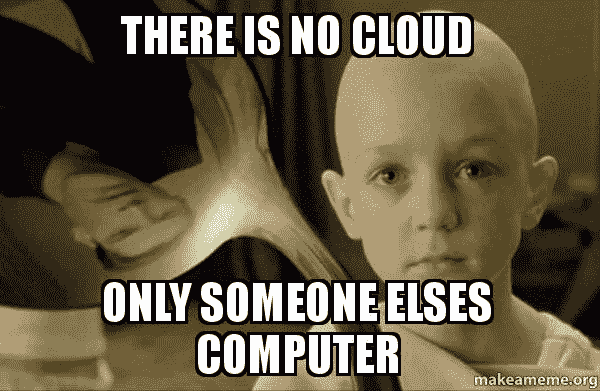
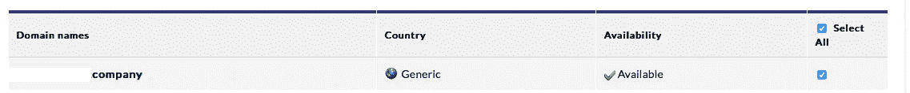

# 将领域转化为矩阵(一个开放的重定向故事)

> 原文：<https://infosecwriteups.com/transforming-a-domain-into-the-matrix-an-open-redirect-story-4bd87c3a8caa?source=collection_archive---------5----------------------->

嘿，大家好吗？希望你是好的，今天我分享一个非常奇怪和不常见的行为，这是我一年前从奖金开始时发现的。我们将该程序保密，因此从现在起我们可以将其命名为[redated . com]。

所以我找到了这个正常的终点:

*   https://[redated . com]/登录？return_to=[url]

有趣吧？所以我决定尝试一些开放重定向负载:

> return_to=http://evil.com ->拒绝
> 
> return _ to = http://[redated . com]. evil . com->拒绝
> 
> return_to=//google.com ->拒绝
> 
> return_to=//redacted.com@evil.com->拒绝
> 
> return _ to =//Google . com/redated . com->拒绝

…有效载荷的列表相当大..但是所有的尝试都失败了

我的感觉是:

真相有时很伤人:(

但是..在这个过程中，我注意到一个奇怪的行为..(这里是暮光之城的音乐来源..)

于是灵感从天堂直接带着这条信息降临到我身上:

我尝试下一件奇怪的事:

如果我输入任何字符串/login？return_to= **anythinghere** (当用户登录时)域成为 https://redated . comany thinghere

(倒霉事发生)

好吧，好吧，这是怎么回事？所以我想到了一个小技巧，我问自己:如果我做下一个请求会发生什么？

> https://[redated . com]/登录？return _ to =公司

当用户登录后，直接重定向到 [https://【编校公司】](https://[redacted.company])

所以我看看这个域名是否可用..让我惊讶的是:

是啊！可用！

这时我觉得:

*   当我们通过 CORS、OAuth 等处理白名单 URL 或域时，同样的技巧可以用在很多场景中
*   我希望你像我写这篇文章一样喜欢阅读:)

**关于开放重定向的好资源有:**

 [## 英国安全研究员

### 开放网址重定向是简单的网址像 https://www.example.com/?go=https://www.google.com/,，当访问将去…

zseano.com](https://zseano.com/tutorials/1.html)  [## 开放重定向漏洞的演变。

### TL；DR ///host.com 被服务器端库解析为相对路径 URL，但是 Chrome 和 Firefox 违反 RFC 并加载…

homakov.blogspot.com.ar](http://homakov.blogspot.com.ar/2014/01/evolution-of-open-redirect-vulnerability.html) 

**并记住**:放松，有些事情会来到你身边:**这是不可避免的**

**黑客快乐！**

 [## HackerOne 简介- ak1t4

### 怀特 4t Hack3r &禅宗和尚&赏金猎人-https://twitter.com/knowledge_2014

hackerone.com](https://hackerone.com/ak1t4)  [## ak1t4 z3n (@knowledge_2014) |推特

### ak1t4 z3n 的最新推文(@knowledge_2014)。Bug 赏金猎人- HoF:谷歌- Mozilla - PayPal -微软…

twitter.com](https://twitter.com/knowledge_2014)