# 尝试破解我:基本测试演练

> 原文：<https://infosecwriteups.com/try-hack-me-basic-pentesting-walkthrough-a70b85308b0a?source=collection_archive---------3----------------------->

这是我决定写的第二个演练，与第一个不同，这与我的主要兴趣 pentest 有更多的关系。

所以我在完成这个房间和写这篇文章的过程中得到了很多乐趣。

这个房间给那些像我一样开始的人一个机会，在 pentest 的真实场景中应用所学。

希望这篇小文能对别人有用。=D

# 任务 1

> **1.1 —部署机器并连接到我们的网络**

这个问题不需要回答。

> **1.2 —找到机器公开的服务**

这也不需要回答，但为了完成所提问题，我们需要遵循以下步骤:

**步骤 1:使用命令在目标的 IP 地址上运行 nmap:**

> nmap“目标 IP”

**第 2 步:查看结果，查看开放端口上运行的服务。**

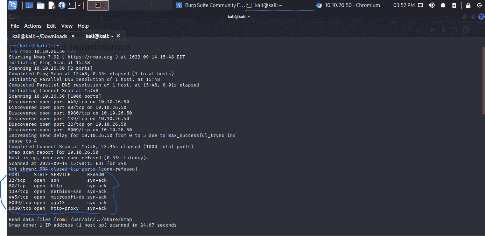

留着以后用吧！

> **1.3—web 服务器上隐藏目录的名称是什么(输入不带/)的名称？**

对于这项任务，我们只需要使用一些目录暴力工具，如 dirb，dirbuster，gobuster 或任何其他你编程。

我喜欢 gobuster，因为我觉得它更容易使用线程。

步骤 1:在目标上运行 gobuster，使用一些常用目录的单词表。

这是我用过的单词表:

[https://github . com/danielmiessler/sec lists/blob/master/Discovery/we B- Content/directory-list-2.3-small . txt](https://github.com/danielmiessler/SecLists/blob/master/Discovery/Web-Content/directory-list-2.3-small.txt)

使用下面的命令:

> gobuster-u[http://10 . 10 . 26 . 50](http://10.10.26.50)-w directory-list-2.3-small . txt dir

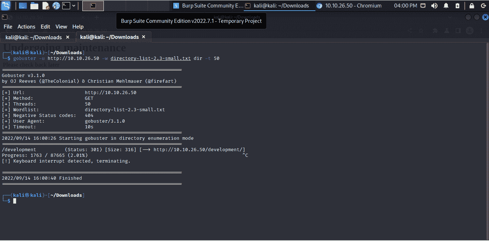

我停在第一个目录上，因为它是答案。

> **Anwser:开发**

> **1.4 —用户强行找到用户名&密码**

这个问题也不需要回答，但是这个过程会在接下来的问题中帮助我们。

第一步:让我们看看隐藏目录。

有两个文件。txt，每一条都告诉我们有用的信息。

*   系统使用 Apache 2 . 4 . 18；
*   两个文件都向我们展示了两个用户的缩写，J 和 K；
*   第一个 dev.txt 显示系统使用的是 SMB
*   第二个显示用户 J 的密码最弱。

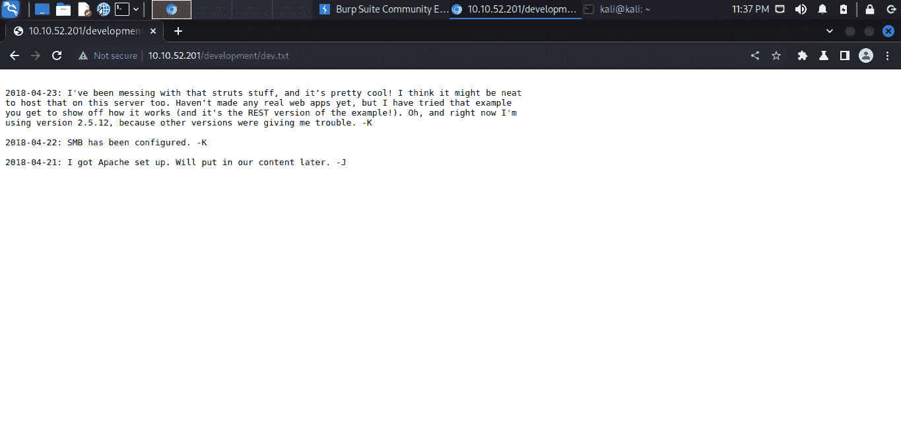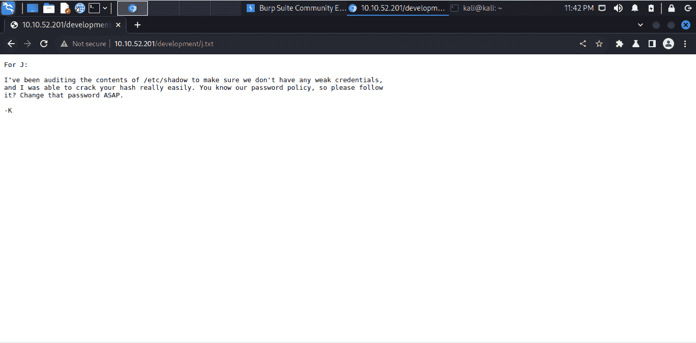

第二步:使用 enum4linux 工具对系统进行枚举。

知道了系统使用的是 Samba (SMB)，我们就可以使用 enum4linux 这个很有用的枚举 Windows 和 Samba 系统。

命令是:enum 4 Linux“IP target”，为了找到用户，只需添加-U，

> enum4linux“目标 IP”-U

现在我们知道用户了。

凯和简。

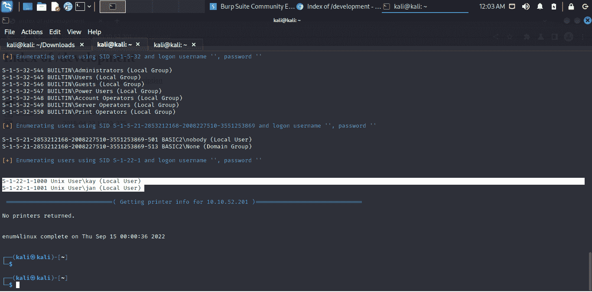

**第三步:使用九头蛇蛮力。**

现在我们有了用户，我们可以用他们来暴力破解密码。

我们从 j.txt 中得到的一个提示是，以字母 J 开头的用户有一个较弱的密码，所以我们只需要使用 Hydra 暴力破解 jan 用户的密码。

但是在哪里？

在我们通过 nmap 获得的服务中，我们可以看到 ssh 正在服务器上运行，因此让我们使用下面的命令强行运行它:

> 九头蛇 ssh://10 . 10 . 52 . 201-l Jan-P/usr/share/word lists/rock you . txt

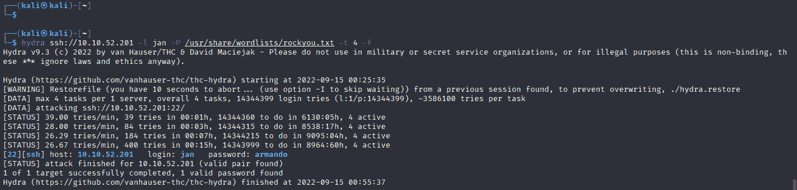

搞定了。密码是阿曼多。

就是这样！让我们进行下一个任务吧！

> **1.5 —用户名是什么？**
> 
> **答案:jan**

> **1.6 —密码是什么？**
> 
> **答案:阿曼多**

> **1.7 —您使用什么服务来访问服务器(请用大写字母缩写回答)？**
> 
> **答案:宋承宪**

> **1.8 —枚举机器以查找特权提升的任何向量**

这个问题不需要回答，但让我们借此机会登录并了解一下 system。

**步骤 1:现在我们有了 jan 的用户名和密码，我们可以使用 ssh 服务登录，命令如下:**

> 宋承宪 jan@ "目标 IP "

密码:阿曼多

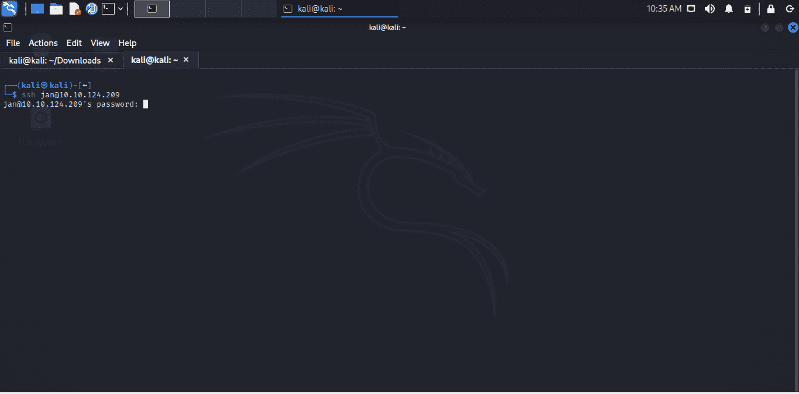

我们进去了。

**第二步:环顾四周。**

走过系统，我们可以找到另一个用户 Kay 的目录。

在里面，有一个有趣的文件 pass.bak 应该包含他的密码，但不幸的是，我们没有权限用当前用户读取它。

所以…我们需要提升特权。无红利

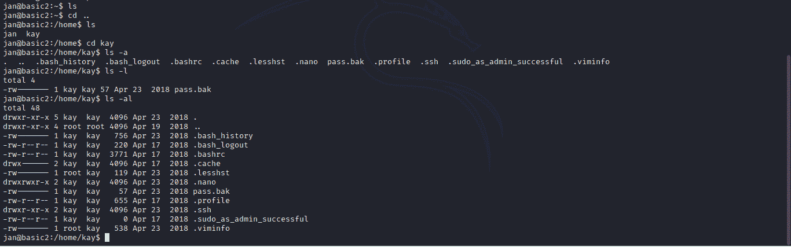

> **1.8 —你找到的另一个用户的名字是什么(全小写)？**

关于这一点，我们已经知道了！

> **答案:凯**

> **1.9 —如果您找到了另一个用户，您可以如何处理这些信息？**

这个问题不需要回答。

> 1.10 —您获得的最终密码是什么？

所以，我们需要看看凯的档案。

在 Kay 的目录里，还有其他有趣的目录，比如。宋承宪”。

在这个目录中，我们可以看到我们有权限读取 id_rsa 文件，该文件包含用于访问 ssh 服务器的私有密钥。

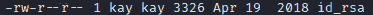

让我们利用这个缺陷来访问用户 kay。

**第一步:读取 id_rsa 文件获取私钥。**

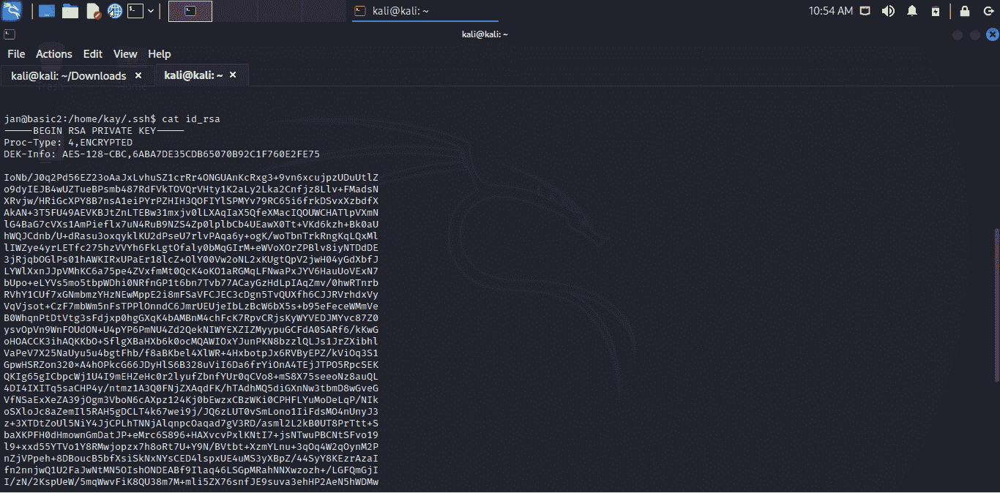

第二步:将密钥复制并粘贴到你机器内的一个新文件中。

我认为简单地将文件内容复制并粘贴到一个新文件中比通过服务器发送一份拷贝更容易。

所以我在我的机器上用 nano 创建了一个名为 pass_kay.txt 的新文件，并粘贴了密钥。

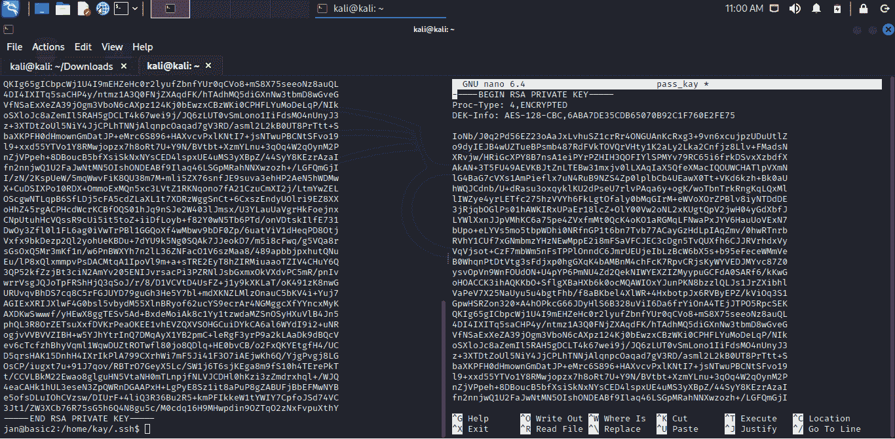

如果我们尝试使用这个新文件作为 ssh 登录的密码，它将被拒绝，因为说这太不安全了。

发生这种情况是因为文件的排列松散。

所以我们需要限制这个文件的权限。

**步骤 3:使用命令**更改文件权限

> chmod 600“文件名”

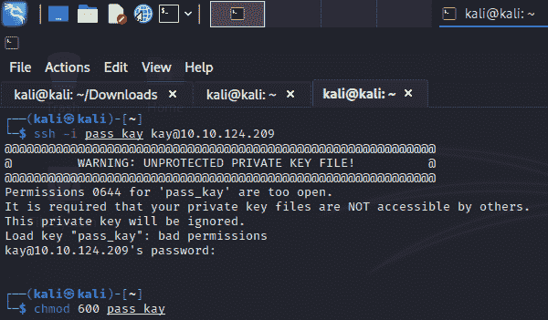

第 4 步:现在我们可以尝试登录，发送这个文件作为密码，使用带参数-i 的 ssh 命令来指定文件。

> ssh -i "文件名" kay@ "目标 IP "

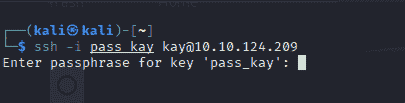

但是正如你所看到的，它要求我们提供一个密码来保护 kay 的密钥。

为了得到它，我们需要从文件中提取一个散列，并使用暴力破解它。

**步骤 5:使用 ssh2john.py 工具从文件中提取一个 hash，命令如下:**

> python 2/usr/share/John/ssh 2 John . py "带关键字的文件" > "散列文件的名称"。文本文件（textfile）

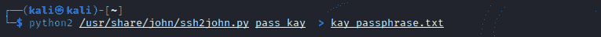

**第六步:使用约翰工具破解这个杂凑。**

> 约翰-单词表:"单词表路径" "哈希文件"

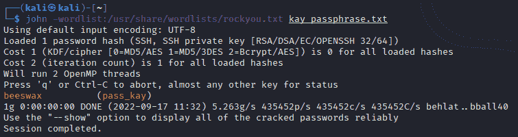

现在我们得到了密码，让我们再次登录 ssh 服务器。

**第 7 步:使用下一个命令登录:**

> ssh -i "密钥文件" kay@ "目标 IP "

通行短语:蜂蜡

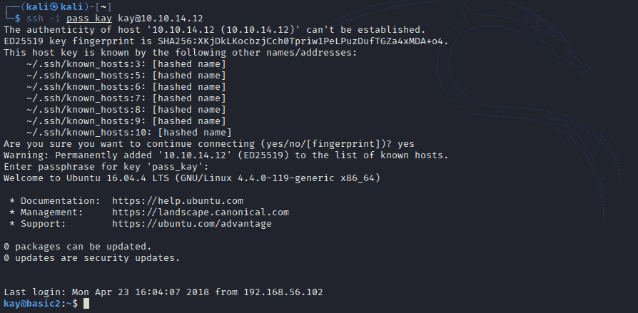

我们进去了。！

现在我们来读一下 kay 的文件 pass.bak。

**第八步:读取文件 pass.bak**

> cat pass.bak

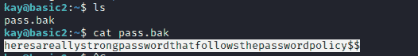

就是这样！

> **答:下面是 reallystrong password that followsthepassword policy $ $**

就是这样！

这是我为这个令人敬畏的网络安全世界做贡献的小小尝试。

如果你有任何建议或看到一些错误，请告诉我。

我是来学习的，我想在这项任务中有所提高。

感谢阅读到这里！

如果我能帮你什么，请告诉我！无红利

## 来自 Infosec 的报道:Infosec 每天都有很多内容，很难跟上。[加入我们的每周简讯](https://weekly.infosecwriteups.com/)以 5 篇文章、4 个线程、3 个视频、2 个 GitHub Repos 和工具以及 1 个工作提醒的形式免费获取所有最新的 Infosec 趋势！