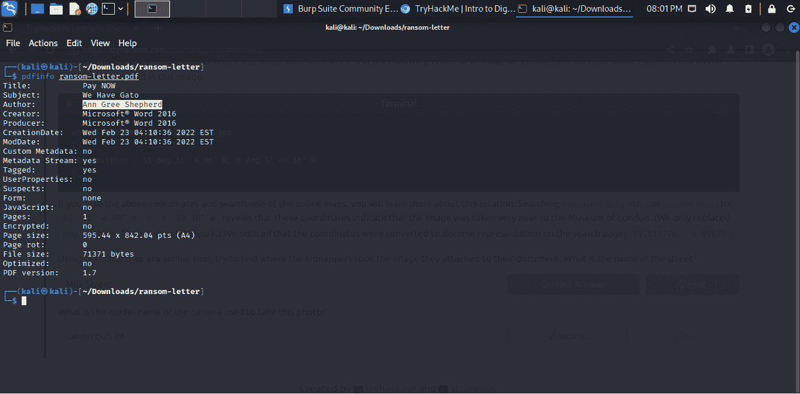
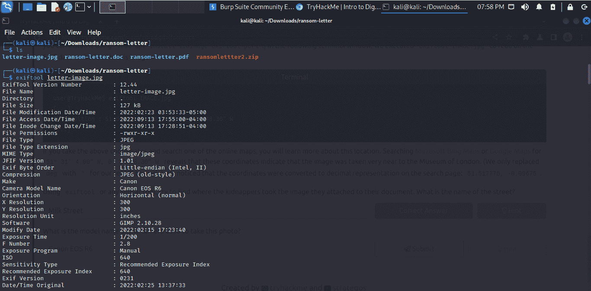
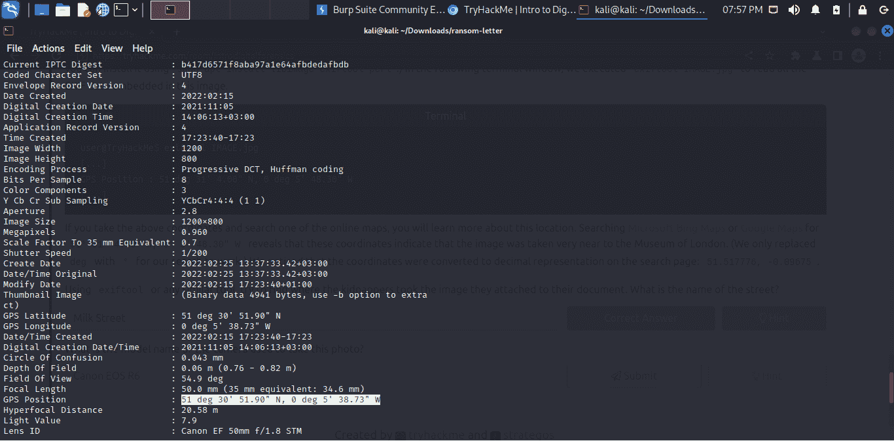
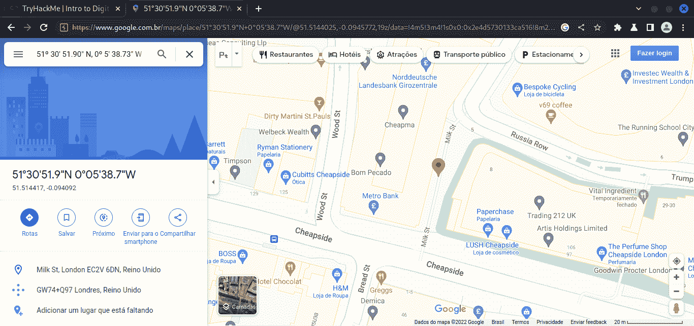
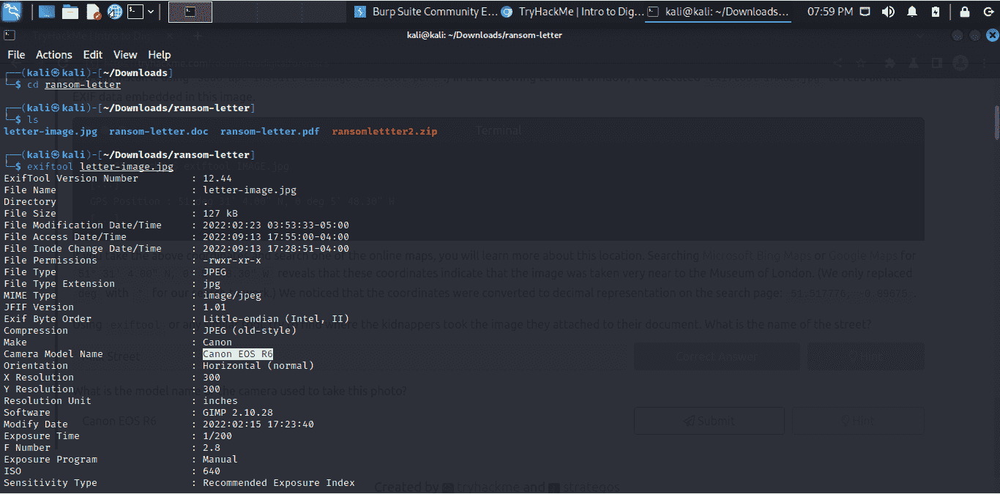

# 尝试黑我:介绍数字取证演练

> 原文：<https://infosecwriteups.com/try-hack-me-intro-to-digital-forensics-write-up-566977aabe4e?source=collection_archive---------1----------------------->

这是我选择写的第一个房间。我一直在推迟，但最终我决定开始这段旅程。

所以我随机选择了这个房间，只是因为它看起来很有趣。无红利

这个房间向我们展示了在当今的数字世界中，犯罪调查中的大量证据都是在不同的数字设备中找到的。

因此，数字取证负责分析和处理这些数字证据，有助于弄清在这种情况下到底发生了什么。

此外，这个房间向我们介绍了如何使用它的基本知识。

## 任务 1

> 考虑一下上面照片中的桌子。除了智能手机、相机和 SD 卡，数字取证还有什么有趣的东西？

想想定义，这就变得容易了！唯一的其他数码设备是**笔记本电脑**。

> **答案:笔记本电脑**

## 任务 2

随着这个主题的深入，现在这个任务更好地展示了作为一名数字取证调查人员应该做什么的一步一步的过程。

要回答第二个问题，我们只需要在文章中找到答案。

> 2 —随时跟踪谁在处理它，以确保证据在法庭上是可接受的，这一点至关重要。有助于证明这一点的文档名称是什么？

> **答案:监管链**

## 任务 3

是时候练习了！

如果您在本地机器上工作，要完成这个任务，我们首先必须下载并解压缩给定的材料。

我建议您在解压缩文件之前创建一个新目录，以确保组织有序。

您可以使用命令 mkdir 和下载文件中的命令“unzip”来完成此操作。

现在，我们将使用两个工具来查看和处理文件的元数据。

> ***phpinfo 和 exiftool***

> **3.1 —使用 pdfinfo，找出附件 PDF 文件的作者。**

让我们一步一步来

**第 0 步——如果你没有 phpinfo，就安装它。**

如果您没有安装 phpinfo，请使用以下命令:

> " sudo 安装 poppler-utils "

**步骤 1 —使用命令在 ransom-letter.pdf 上使用 phpinfo:**

> **" phpinfo ransom-letter . pdf "**

**第二步——在结果中寻找作者**

> **答案:安·格力牧羊人**

> **3.2-使用 exiftool 或任何类似的工具，尝试找出绑匪将他们附在文件上的图片放在哪里。这条街叫什么名字？**

**第 0 步—如果没有 exiftool，请安装它。**

如果您没有安装 phpinfo，请使用以下命令:

> " sudo 安装 libimage-exiftool-perl "

**步骤 1 —使用命令在 ransom-letter.jpg 图像上使用 exiftool:**

> " exiftool letter-image.jpg "

**步骤 2——在结果中寻找 GPS 位置**

**第三步——复制 GPS 坐标，在谷歌地图中搜索，找到照片拍摄的街道(记得从“deg”改为“when search”)**

> **答案:牛奶街**

> **3.3 —拍摄这张照片的相机型号是什么？**

**步骤 1 —在结果**中查找“摄像机型号名称”

> **答案:佳能 EOS R6**

就是这样！

这是我的第一篇文章，我喜欢它！

感谢您的关注！如果你们有任何建议或看到的错误，请告诉我！我是来学 xD 的

再见！

## 来自 Infosec 的报道:Infosec 每天都有很多内容，很难跟上。[加入我们的每周简讯](https://weekly.infosecwriteups.com/)以 5 篇文章、4 个线程、3 个视频、2 个 Github Repos 和工具以及 1 个工作提醒的形式免费获取所有最新的 Infosec 趋势！