# 尝试黑客我:简单的 CTF 演练

> 原文：<https://infosecwriteups.com/try-hack-me-simple-ctf-walkthrough-62824db116fa?source=collection_archive---------1----------------------->

## 初级 ctf

这是我们 [TryHackMe](https://medium.com/u/dc49a0a3cb16?source=post_page-----62824db116fa--------------------------------) 系列的第三次演练。

选择的房间是“简单的 CTF ”,我很喜欢完成它。

这是一个简单的房间，但我们可以学到一些有趣的东西，主要是如何:

*   寻找 CVE 氏症；
*   发现和运行漏洞；
*   并利用 sudo 权限缺陷提升权限。

希望这个演练能对你有用！

祝你好运！无红利

# 任务 1

> **1.1 —端口 1000 下运行着多少服务？**

**第一步:运行 nmap 查找开放端口**

> nmap“目标 IP”-sV-P1–3000-vv

立正！

ssh 服务通常运行在端口 22，但是在这种情况下，它被重定向到端口 2222。如果您只是简单地扫描它，不会清楚地显示在端口 2222 上运行的 ssh，但是在 nmap 中使用参数-sV 时可以看到它。

所以记得添加-sV 参数，否则您将无法看到 ssh 服务在端口 2222 上运行。

> **答案:2**

> **1.2 —较高端口上运行的是什么？**
> 
> **答案:宋承宪**

> **1.3 —您针对应用程序使用的 CVE 是什么？**

现在我们需要更好地看看这个应用程序。

正如我们在 nmap 扫描结果中看到的，端口 80 是开放的，http 服务正在运行，这让我们想到了 web 应用程序。

所以让我们来看看浏览器给我们显示了什么！

**第一步:在浏览器中粘贴 IP 目标。**

这就是我们得到的:

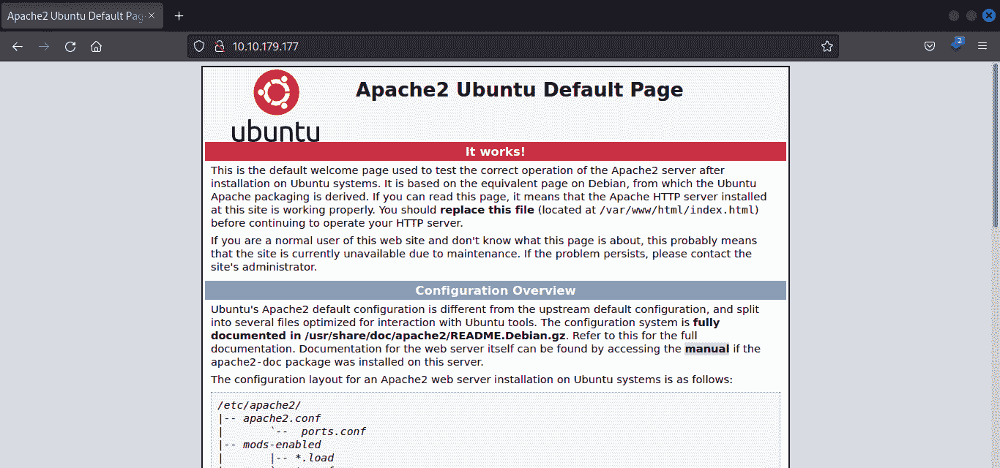

在此站点中运行的服务器 apache 的默认页面。

它没有很多有用的信息，但也许有一些隐藏的目录，我们可以找到。

**第二步:做一个目录蛮力，找到隐藏的目录。**

你可以使用任何你喜欢的工具。

我将使用 gobuster 和下面的单词表:

[https://github . com/danielmiessler/sec lists/blob/master/Discovery/we B- Content/directory-list-2.3-small . txt](https://github.com/danielmiessler/SecLists/blob/master/Discovery/Web-Content/directory-list-2.3-small.txt)

> gobuster-u http://10 . 10 . 179 . 177-w directory-list-2.3-small . txt dir

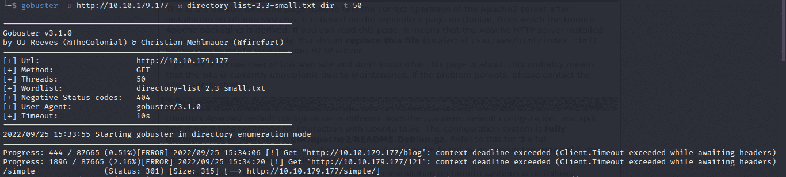

我们找到了一个名为 **simple/** 的目录，让我们来看看。

**第三步:看看简单的目录:**

> http://"目标 IP"/simple/

我们发现了这个应用程序的主页。

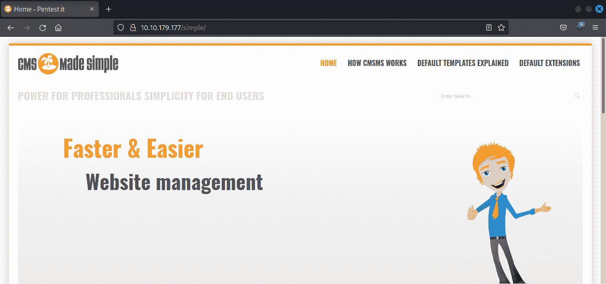

让我们浏览一下这个页面，看看是否能找到一些有趣的东西。

在页面的底部有一个有用的信息。

该网站告诉我们，它是由 CMS 简单，这似乎是一个开源内容管理系统，仍然告诉我们的版本 2.2.8。

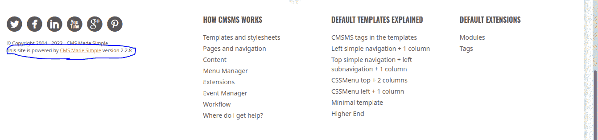

知道了这一点，我们就可以搜索这个版本的 CMS 的漏洞。

**第四步:搜索 CVE 到 CMS 制作了简单版本 2.2.8。**

在 https://cve.mitre.org/的[上搜索，我们发现它容易受到 sql 注入攻击。](https://cve.mitre.org/)

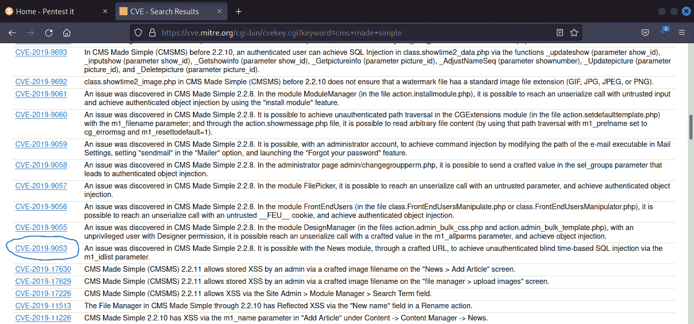

> **答案:CVE-2019–9053**

> **1.4 —应用程序易受哪种漏洞的攻击？**
> 
> **答案:SQLi**

> **1.5 —密码是什么？**

让我们更好地看看这个 CVE。

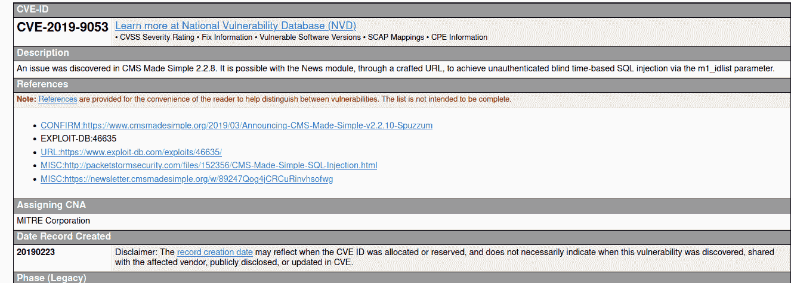

CVE.mitre 给了我们一个漏洞利用的链接，让我们检查一下！

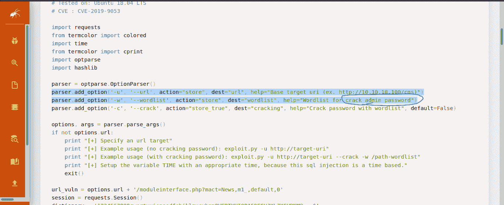

对我们来说它好像破解了密码。

所以还是用起来吧！

在 google 上做了一些搜索，我发现同样的脚本适用于 python3。如果你也喜欢它，你可以在下面的链接中找到它:

[https://github . com/4 nner/CVE-2019-9053/blob/master/exploit . py](https://github.com/4nner/CVE-2019-9053/blob/master/exploit.py)

**第一步:将脚本复制到. py 文件中保存，或者下载脚本。**

正如代码告诉我们的，我们只需要指定一个 URL，参数-c 来指明我们想要尝试破解密码，以及一个单词列表。

**步骤 2:运行指定参数的脚本:**

*   -u 代表 URL
*   -w 表示某个单词列表
*   -c 代表破解密码

> exploit.py -u http://"目标 IP "/simple-c-w/usr/share/word lists/rock you . txt

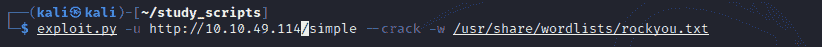

就是这样！

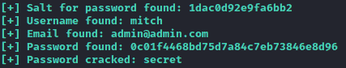

现在我们有了用户名和密码。

> **答案:秘密**

> **1.6 —您可以在哪里登录并获得详细信息？**

正如我们在 nmap 扫描中看到的，服务 ssh 正在端口 2222 上运行。

所以我们可以尝试使用找到的凭证登录。

> **答案:宋承宪**

> 1.7 —什么是用户标志？

**步骤 1:让我们使用 ssh 通过下面的命令登录:**

请记住，用户是 mitch，ssh 运行在端口 2222 上。

> 宋承宪米奇@ "目标 IP" -p 2222
> 
> 密码:秘密

我们进去了。

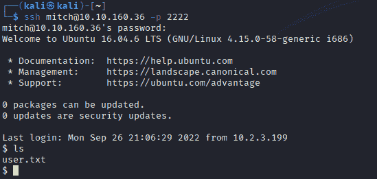

第二步:读取用户目录下的文件。

> cat user.txt

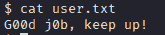

> **答案:G00d j0b，跟上！**

> **1.8 —主目录中还有其他用户吗？它叫什么名字？**

第一步:查看主目录。

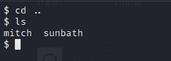

我们可以看到另一个用户。

> **答案:日光浴**

> 1.9 —您可以利用什么来生成特权外壳？

如果我们尝试查看当前用户可以使用的 sudo 命令:

> 须岛一号

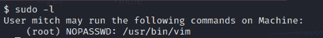

我们发现用户 mitch 拥有使用 vim 编辑器的 root 权限。

因此，我们可以在 vim 中使用一些参数来提升权限:

> sudo vim -c ':/bin/bash '

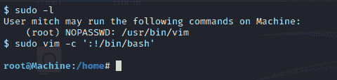

现在我们有根权限了！

> **答案:vim**

> **1.10——根旗是什么？**

让我们在根目录中寻找标志。

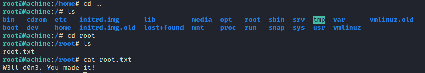

明白了！

> **答案:W3ll d0n3。你成功了！**

就是这样！

我希望你和我一样在完成这个房间的时候有很多乐趣。

如果我说错了什么或者你有更好的方法来完成它，请告诉我！

我也是来学习的！无红利

感谢阅读到这里！

如果你喜欢，跟我来！我打算继续发帖！

再见！

## 来自 Infosec 的报道:Infosec 每天都有很多内容，很难跟上。[加入我们的每周简讯](https://weekly.infosecwriteups.com/)以 5 篇文章、4 个线程、3 个视频、2 个 GitHub Repos 和工具以及 1 个工作提醒的形式免费获取所有最新的 Infosec 趋势！