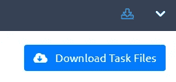
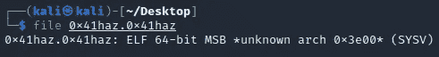
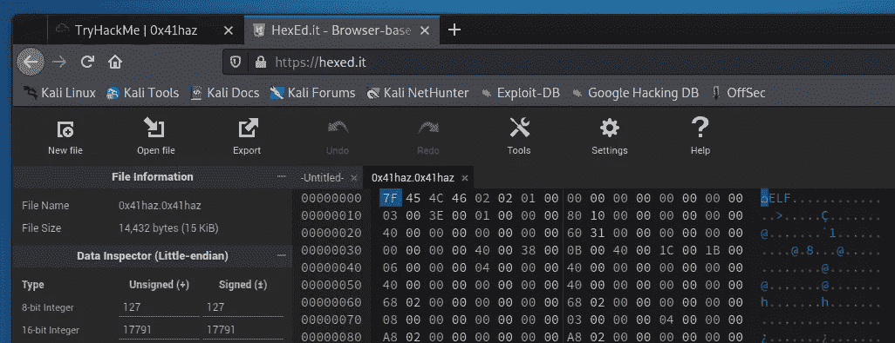
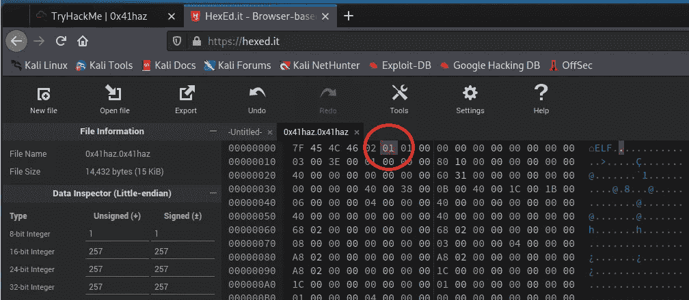
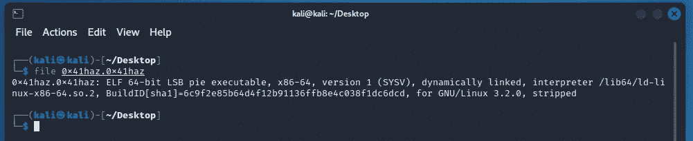
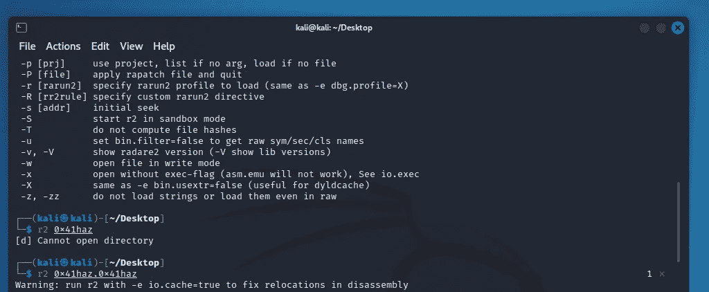
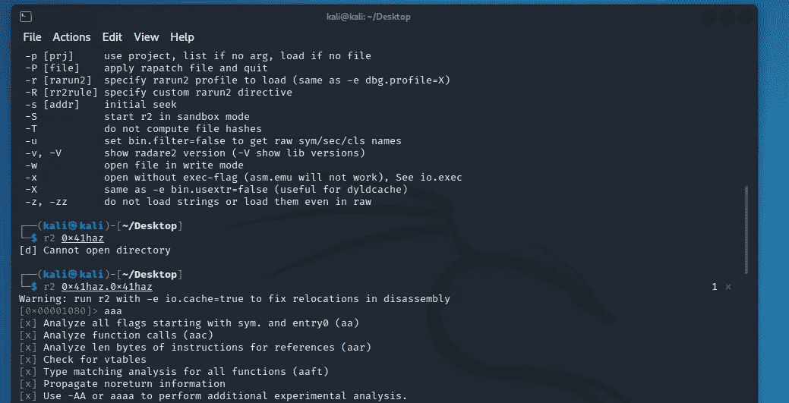
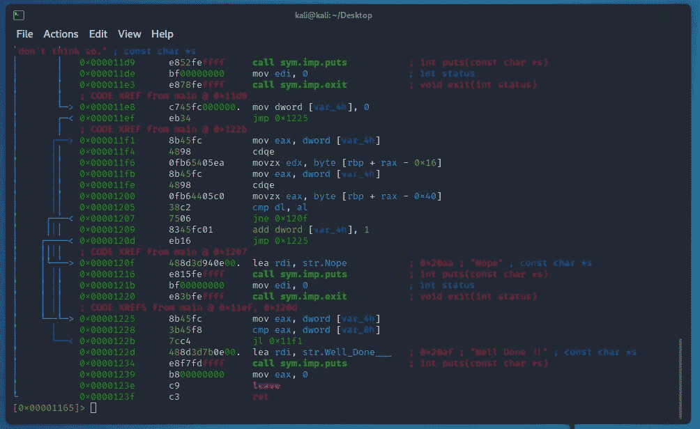
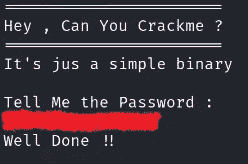
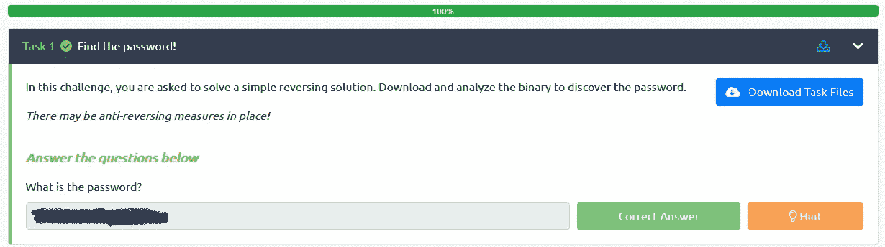

# TryHackMe: 0x41haz 房间报道[无回答]

> 原文：<https://infosecwriteups.com/tryhackme-0x41haz-room-write-up-no-answer-a79478a986ea?source=collection_archive---------1----------------------->

0x41haz 房间图像/徽标

**房间描述:** *【简单倒车挑战】*

**任务一:找到密码！**

*“在这个挑战中，你需要解决一个简单的倒车问题。下载并分析二进制文件以发现密码。*

*“可能有防逆转措施！”*

因此，要开始使用 0x41haz，我们需要下载任务文件。我们只需按下任务 1 右侧的蓝色按钮即可。

0x41haz 下载任务文件

所以在下载任务文件后，我决定在任务文件上运行一个简单的文件命令。“ ***文件*** ”命令允许我获得关于“ ***.0x41haz*** ”文件类型的更多信息。

文件 0x41haz

运行 file 命令后，很明显我们正在处理 ELF 64 位可执行文件类型。虽然文件“***MSB *未知 arch 0x3e00* (SYSV)*** 有一点小问题。所以，我决定谷歌一下这个问题。在 GitHub 上我找到了一个提示。要绕过这一点，您需要将第六个字节(0x02)修补到 0x01 接下来要做的是找到一个十六进制编辑器，将第六个字节从 0x02 修补到 0x01。为此，我决定使用基于浏览器的十六进制编辑器，而不是 Kali Linux 中可用的编辑器。

hexed.it 上的 0x41haz

我决定用 [hexed.it](https://hexed.it/) 来完成这部分任务。

0x41haz on hexed.it，第六个字节从 02 变为 01

在将第六个字节从 02 更改为 01 后，运行 file 命令时，我们会得到如下图所示的输出

第六次字节更改后的文件 0x41haz.0x41haz

对于下一部分，我将使用**雷达 2** 或简单的 **r2** 来检查文件。下面是这个文件上 r2 的入门截图(r2 应该是预装在 Kali Linux 上的)。

**r2** 0x41haz.0x41haz

之后，我将输入' **aaa** '来分析所有引用的代码。

0x41haz 上的 **aaa**

好了，一旦完成，我们就可以执行' **s main** '来初始化 main 上的寻道。一旦完成，我们可以尝试打开 pdf 格式的文件，看看我们得到了什么。下面是我们能看到的。

0x41haz.0x41haz 上的 pdf 文件视图

这样他就有了我们的答案。现在我们可以通过运行 0x41haz 来测试它。

0x41haz.0x41haz 答案验证

要获得 TryHackMe 的正确答案，只需添加 THM{ **answer** }。你会完成这个房间。

0x41haz 房间已完成

感谢你阅读我的 0x41haz 房间的文章，如果你想自己试试这个房间，链接在下面。我花了比预期更长的时间来完成这个房间，因为它比我预期的更复杂。如果你想和我联系，我也附上了我的链接树。

0x41haz 房间链接:[https://tryhackme.com/room/](https://tryhackme.com/room/0x41haz)0x 41 HAZ

我的链接树—【https://linktr.ee/StefanPBargan 

## 来自 Infosec 的报道:Infosec 每天都有很多内容，很难跟上。[加入我们的每周时事通讯](https://weekly.infosecwriteups.com/)以 5 篇文章、4 个线程、3 个视频、2 个 GitHub Repos 和工具以及 1 个工作提醒的形式免费获取所有最新的 Infosec 趋势！