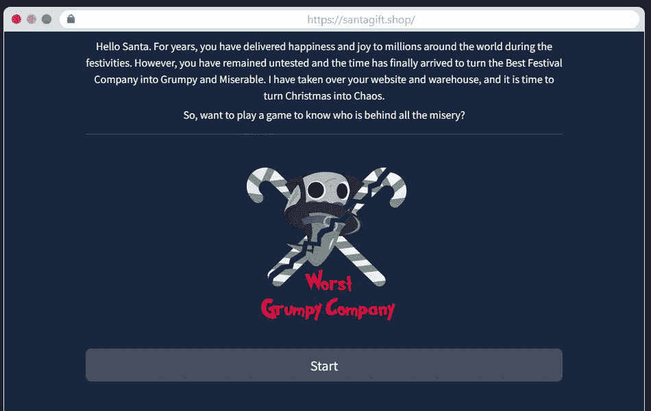
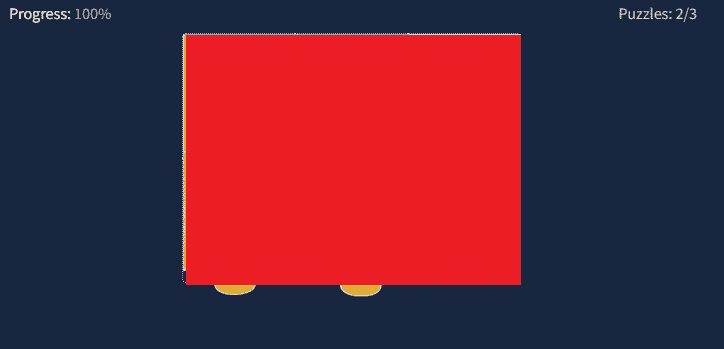
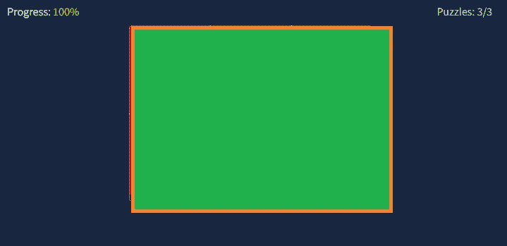
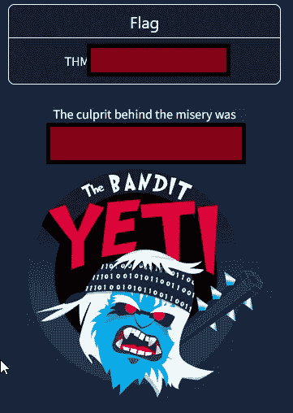
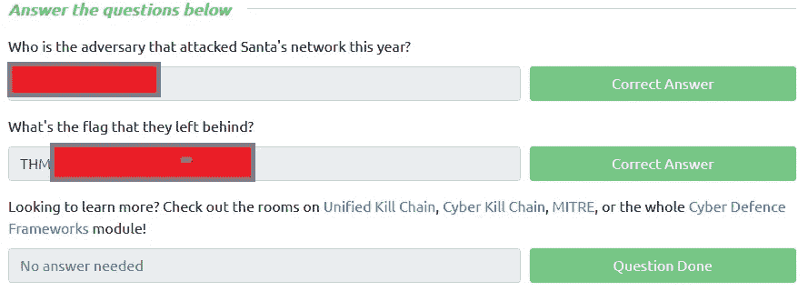

# 网络 2022[第一天]有人要进城了！—没有答案:P

> 原文：<https://infosecwriteups.com/tryhackme-advent-of-cyber-2022-day-1-no-answers-p-87cdbad59c7d?source=collection_archive---------0----------------------->

我对 TryHackMe 的网络降临感到非常兴奋，今天 12 月 1 日是第一天。TryHackMe 为这个降临节提供了很多奖励，我想在 Medium 上分享我完成第一天的方法。

第一天从一个网站开始，非常简单，santagift.shop

第一天网站

对于这项任务，我们需要解决 3 个难题。

## 谜题 1/3

## 第一个谜题的线索:

1.  研究是我工作的一部分，从公共资源中寻找线索。
2.  我把简单的文件变成了恶意软件。
3.  一个比萨饼，包裹或有效载荷都有我作为一个共同的行动。
4.  骗局是我的游戏，欺骗你相信一个虚假的身份。
5.  弱点是我的主要资源；通过他们，我让人们感受到我的存在。
6.  你离开后我会让你回到网络中。
7.  删除证据是我工作的一部分。
8.  与妥协者的交流要通过我。

*额外提示，周期 1:在*

第一天拼图已完成 1/3

## 谜题 2/3

## 线索:

1.  我是一个让你去冒险和探索的主播。
2.  有了我，你可以找到新的信息来扩大攻击。
3.  曾经的小卒，变成了国王。
4.  我的有效载荷被触发去感染所有他们接触到的东西。
5.  我收集的密码是进入主机的钥匙。
6.  一边到另一边，机器到机器，我们跳。

*额外提示，第二季:到*

第一天拼图完成 2/3

## 谜题 3/3

## 线索:

1.  在你的金库里，我在。
2.  像龙一样，我收集所有有价值的战利品。
3.  我出口收集的财宝。
4.  和我在一起，你的名声会一落千丈。
5.  设定目标，实现目标。我赢了！

*额外提示，第三季:出局*

第一天拼图 3/3 完成

第一天答案

TryHackMe 上的第一天答案

这样，我们就可以结束网络时代的第一天了！

*如果你喜欢看我的故事，* [*关注我*](https://medium.com/@stefan-p-bargan) *了解更多。此外，如果你不是中等会员，并且你想获得对平台的无限制访问，可以考虑注册***！每月只有 5 美元，我只能得到很少的一部分。谢谢！**

***中等会员【https://stefan-p-bargan.medium.com/membership】——***

***我的 LinkTree**——[https://linktr.ee/StefanPBargan](https://linktr.ee/StefanPBargan)*

## *来自 Infosec 的报道:Infosec 每天都有很多内容，很难跟上。[加入我们的每周简讯](https://weekly.infosecwriteups.com/)以 5 篇文章、4 个线程、3 个视频、2 个 GitHub Repos 和工具以及 1 个工作提醒的形式免费获取所有最新的 Infosec 趋势！*