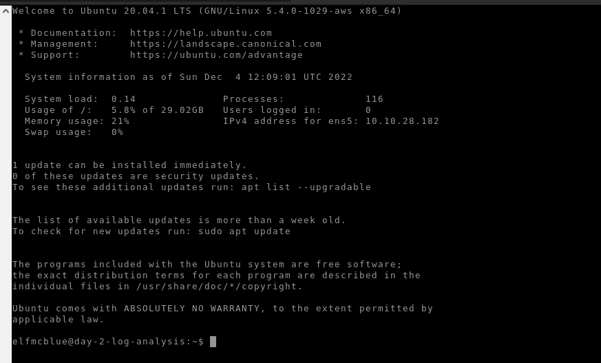
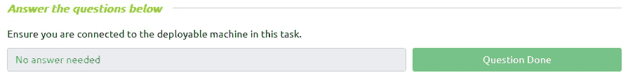
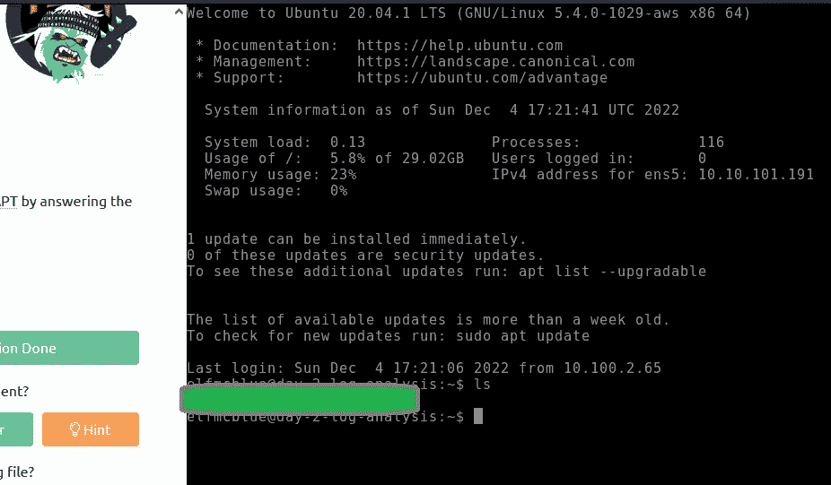
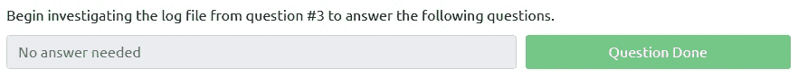
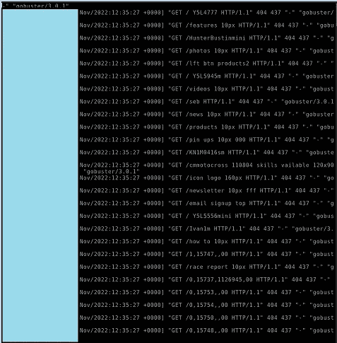
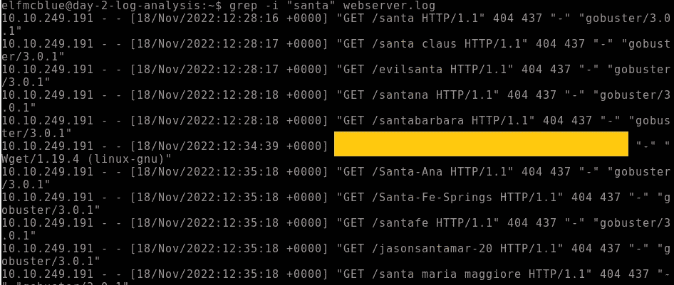
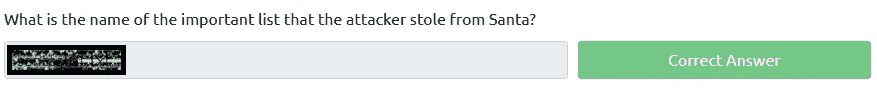
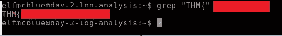
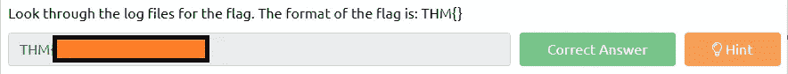
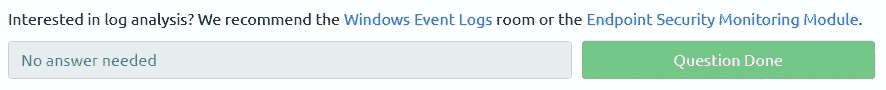

# 网络 2022[第二天]圣诞老人的淘气与可爱日志——没有答案:P

> 原文：<https://infosecwriteups.com/tryhackme-advent-of-cyber-2022-day-2-no-answers-p-5bad39fb83ec?source=collection_archive---------1----------------------->

第 2 天学习目标

*   了解什么是日志文件以及它们为什么有用
*   了解日志文件可能包含哪些有价值的信息
*   了解可以找到这些日志文件的一些常见位置
*   使用一些基本的 Linux 命令开始分析日志文件，寻找有价值的信息
*   帮助精灵麦克布鲁追踪强盗雪人 APT！

*“圣诞老人的安全运营中心(SSOC)注意到他们的一个 web 服务器*[*Santa gift . shop*](http://santagift.shop/)*被土匪 Yeti APT 集团劫持了。”—这一天是关于日志分析的*


强盗雪人 APT 集团标志

## **问题 1:** 确保您连接到该任务中的可部署机器。

该任务有一台需要开机才能完成任务的机器。



机器已通电并正在工作

完成第二天的第一个问题不需要答案。



不需要回答

## *问题 2:使用* `*ls*` *命令列出当前目录下的文件。有多少日志文件？*

今天的下一个问题非常简单，因为我们需要运行命令`*ls*`来获得答案。



限位开关（Limit Switch）


问题 2 已回答

## **问题 3:** Elf McSkidy 设法捕获了 web 服务器生成的日志。该日志文件的名称是什么？

这个问题很容易回答，因为我们已经用`*ls*` 命令查看了目录中的日志文件。根据 THM 上的提示(显示答案的长度)，只有一个选项是可行的。


问题 3 已回答

## 问题 4:开始研究问题 3 中的日志文件，以回答以下问题。



不需要回答

## 问题 5:圣诞老人的淘气和乖名单是哪一天被偷的？

读取日志的一个简单方法是对问题 3 中的日志文件运行`*cat*`

**

*日志文件中使用的 cat 命令*

*我们发现了一个日期，藏在蓝色的长方形后面。*

**

*提示，那是在 11 月*

## *问题 6:攻击者的 IP 地址是什么？*

**

*使用 cat 命令可以看到 IP 地址，因此我们可以停留在那个窗口。*

**

*提示，从 10 开始*

## *问题 7:攻击者从圣诞老人那里偷走的重要名单叫什么名字？*

*最重要的清单，可能是圣诞老人的清单？好孩子和坏孩子？无论如何，我将尝试使用 grep，看看用 GET 命令获取了什么样的文件。*

```
*grep -i "santa" webserver.log*
```

*能够展示一些有趣的文件+答案*

**

*圣诞老人的清单*

**

*问题 7 已回答*

## *问题 8:查看日志文件中的标志。标志的格式是:THM{}*

*回答最后一个问题，我们可以再次使用 grep。该标志隐藏在一个日志文件中。*

```
*grep "THM{" (log file here)*
```

**

*Grep 为赢:P*

**

*问题 8 已回答*

## *问题 9:对日志分析感兴趣？我们推荐 [Windows 事件日志](https://tryhackme.com/room/windowseventlogs)室或者[端点安全监控模块](https://tryhackme.com/module/endpoint-security-monitoring)。*

**

*不需要回答*

**如果你喜欢看我的故事，* [*关注我*](https://medium.com/@stefan-p-bargan) *了解更多。此外，如果你不是中等会员，并且你想无限制地访问平台，可以考虑注册*[](https://stefan-p-bargan.medium.com/membership)**！每月只有 5 美元，我只能得到很少的一部分。谢谢！***

****中等会员**——[https://stefan-p-bargan.medium.com/membership](https://stefan-p-bargan.medium.com/membership)**

****我的 LinkTree**——[https://linktr.ee/StefanPBargan](https://linktr.ee/StefanPBargan)**

## **来自 Infosec 的报道:Infosec 每天都有很多内容，很难跟上。[加入我们的每周简讯](https://weekly.infosecwriteups.com/)以 5 篇文章、4 个线程、3 个视频、2 个 GitHub Repos 和工具以及 1 个工作提醒的形式免费获取所有最新的 Infosec 趋势！**