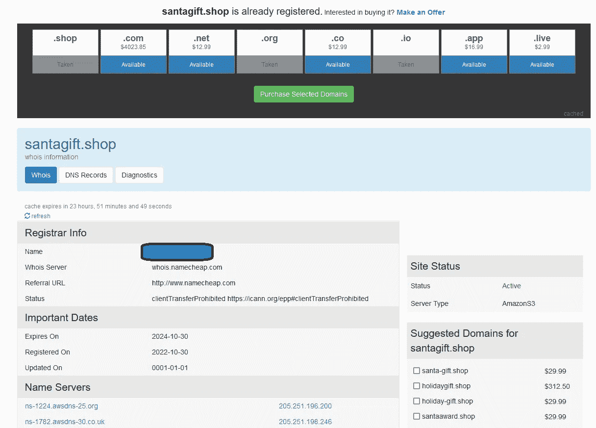
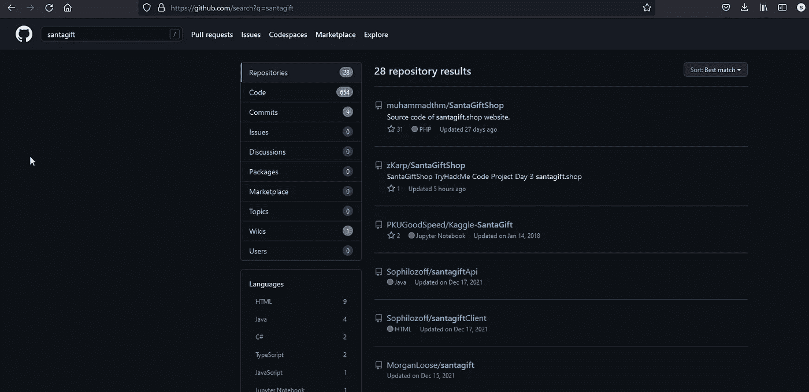
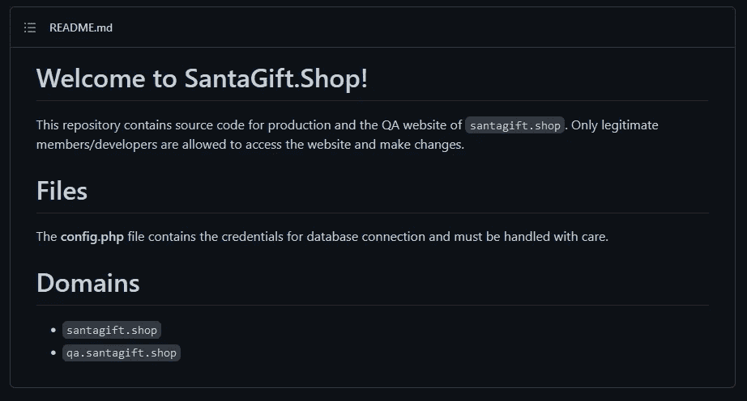
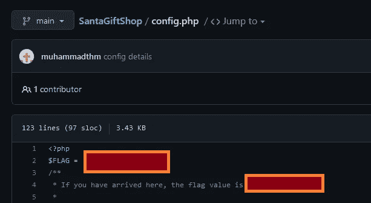
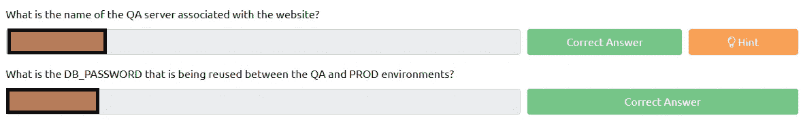

# 网络 2022[第三天]没有什么能逃过侦探麦克瑞德的眼睛——没有答案:P

> 原文：<https://infosecwriteups.com/tryhackme-advent-of-cyber-2022-day-3-no-answers-p-771895ffd492?source=collection_archive---------2----------------------->

第 3 天学习目标:

*   什么是 OSINT，哪些技术可以针对网站或目标提取有用的信息？
*   使用呆子在谷歌搜索引擎上查找特定信息
*   通过 Robots.txt 文件提取隐藏目录
*   通过 WHOIS 查找域名所有者信息
*   从被黑的数据库中搜索数据
*   从公开可用的 GitHub 存储库中获取敏感信息

*“当精灵们试图恢复被攻破的* `*santagift.shop*` *网站时，精灵侦察员麦克瑞德正试图找出它最初是如何被攻破的。你能帮助他收集针对网站的开源信息吗？”*

## 问题 1:域名 santagift.shop 的注册服务商名称是什么？

为了得到这个问题的答案，我们可以使用 [Whois](https://who.is/) 网站。

注册信息

问题 1 已回答

## 问题 2:在[github.com](https://github.com/)上找到网站的源代码(存储库)，打开包含敏感凭证的文件。你能找到旗子吗？

在 GitHub 上快速搜索“santagift”就会找到一个知识库。

圣诞礼物商店(第一家)

README.md 没什么意思

README.md

下一步要做的事情是查看这些文件。

config.php

似乎 config.php 在这个问题上举足轻重。

问题 2 已回答

## 问题 3:包含密码的文件的名称是什么？

看一下 Y29uZmlnLnBocA==就能揭晓答案

问题 3 已回答

## 问题 4 和 5

这些问题可以很容易地在包含密码的文件中找到答案。

数据库密码&数据库主机:P

回答了问题 4 和 5

## 问题 6:如果你想了解更多关于 Google Dorking 的信息，请查看这个房间。

不需要回答

至此，我们迎来了网络 2022 年来临的第三天！

*如果你喜欢看我的故事，* [*关注我*](https://medium.com/@stefan-p-bargan) *了解更多。另外，如果你不是中等会员，但你想无限制地使用平台，可以考虑* [*注册*](https://stefan-p-bargan.medium.com/membership) *！每月只有 5 美元，我只能得到很少的一部分。谢谢！*

**中等会员**——[https://stefan-p-bargan.medium.com/membership](https://stefan-p-bargan.medium.com/membership)

**我的 LinkTree**——【https://linktr.ee/StefanPBargan 

## 来自 Infosec 的报道:Infosec 每天都有很多内容，很难跟上。[加入我们的每周时事通讯](https://weekly.infosecwriteups.com/)以 5 篇文章、4 个线程、3 个视频、2 个 GitHub Repos 和工具以及 1 个工作提醒的形式免费获取所有最新的 Infosec 趋势！