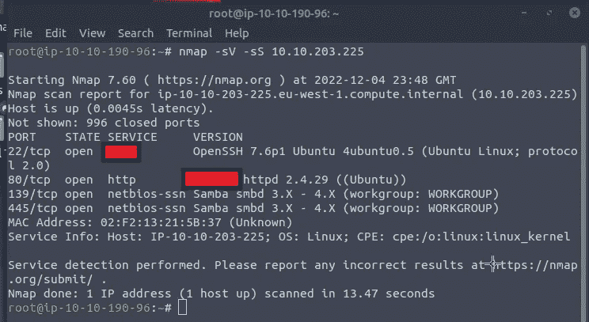
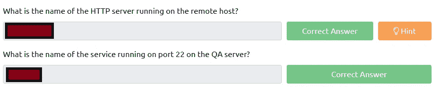
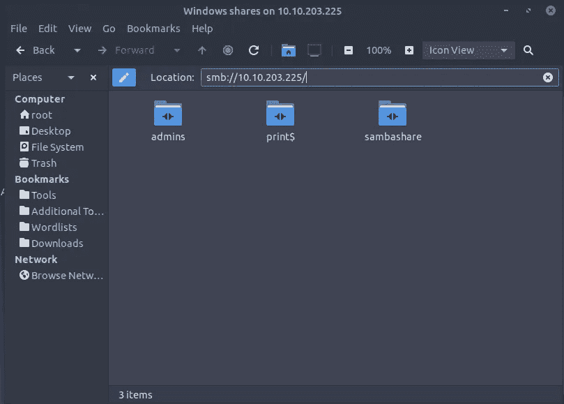
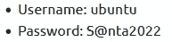
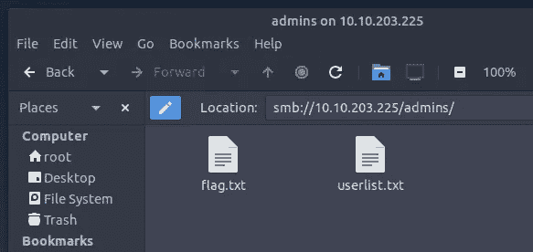
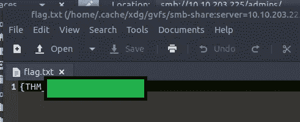
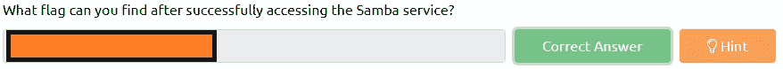
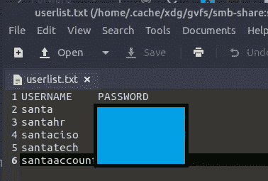
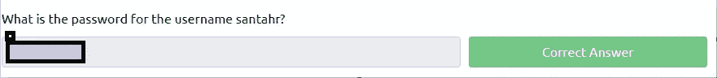

# 网络 2022 的来临[第四天]在雪地里扫描——没有答案:P

> 原文：<https://infosecwriteups.com/tryhackme-advent-of-cyber-2022-day-4-scanning-through-the-snow-no-answers-p-791b6afd80c3?source=collection_archive---------5----------------------->

第 4 天学习目标

*   什么是扫描？
*   扫描类型
*   扫描技术
*   扫描工具

我们在第 4 天有了一台可部署的机器，我最喜欢在开始时对任何机器做的事情之一是运行 Nmap 扫描。

nmap -sV -sS :P

从一开始，我们就有两个答案。

## 问题 1 和 2 完成

回答了问题 1 和 2

## 问题 3:成功访问 Samba 服务后可以找到什么标志？

现在，对于这一部分，我们需要在问题的上方键入命令`smb://10.10.203.225`在文件夹搜索中(*你将有一个不同的 IP*

服务器信息块

我们也有一些登录细节

网络 2022 的到来

中小企业管理员

SMB Admins 文件夹有 2 个 txt 文件。

flag.txt

至此，我们有了问题 3 的答案。

问题 3 已回答

## 问题 4:用户名 santahr 的密码是什么？

我们可以看一下 userlist.txt，看看它是否包含任何有用的信息。

答对了，拿到密码了

问题 4 已回答

## 问题 5:如果你想学习更多的扫描技术，我们有一个模块专门针对 [Nmap](https://tryhackme.com/module/nmap) ！

不需要回答

*如果你喜欢看我的故事，* [*关注我*](https://medium.com/@stefan-p-bargan) *了解更多。此外，如果你不是中等会员，并且你想获得对平台的无限制访问，可以考虑注册***！每月只有 5 美元，我只能得到很少的一部分。谢谢！**

***中等会员**——【https://stefan-p-bargan.medium.com/membership *

***我的 LinkTree**——[https://linktr.ee/StefanPBargan](https://linktr.ee/StefanPBargan)*

## *来自 Infosec 的报道:Infosec 每天都有很多内容，很难跟上。[加入我们的每周简讯](https://weekly.infosecwriteups.com/)以 5 篇文章、4 个线程、3 个视频、2 个 GitHub Repos 和工具以及 1 个工作提醒的形式免费获取所有最新的 Infosec 趋势！*