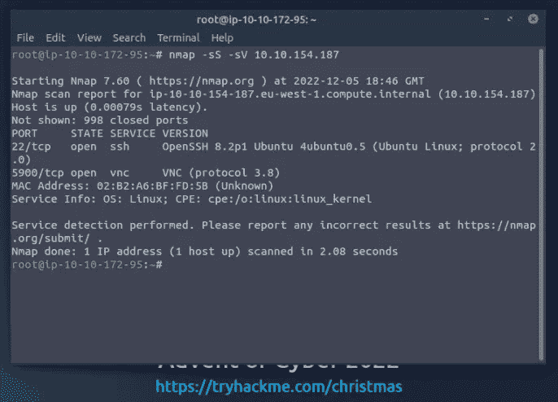
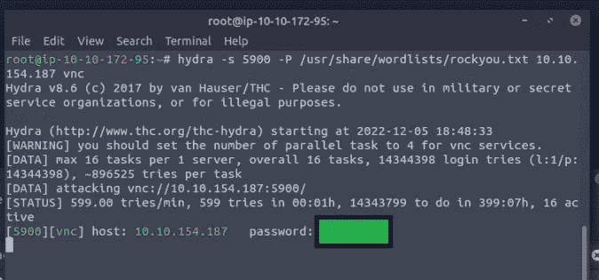
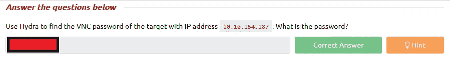
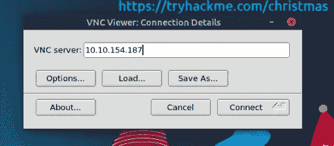
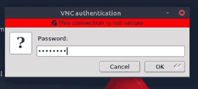
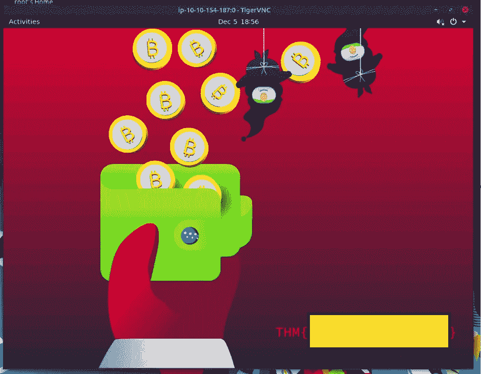
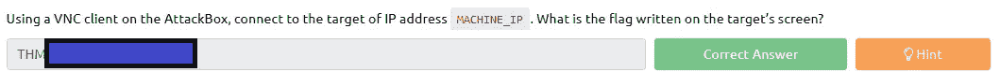
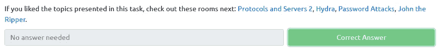

# 他知道你什么时候醒着——没有答案:P

> 原文：<https://infosecwriteups.com/tryhackme-advent-of-cyber-2022-day-5-he-knows-when-youre-awake-no-answers-p-25db80f3a89e?source=collection_archive---------3----------------------->

第 5 天学习目标:

*   了解常见的远程访问服务。
*   在端口扫描中识别监听 VNC 端口。
*   使用工具找到 VNC 服务器的密码。
*   使用 VNC 客户端连接到 VNC 服务器。

## 问题 1:使用 Hydra 找到 IP 地址为`10.10.154.187`的目标的 VNC 密码。密码是什么？

我们在第 5 天有了一台可部署的机器，我最喜欢在开始时对任何机器做的事情之一是运行 Nmap 扫描。在 Nmap 扫描的帮助下，我找到了 VNC 港。

Nmap 扫描(5900)

下一件事是使用命令`hydra -s 5900 -P /usr/share/wordlists/rockyou.txt 10.10.154.187 vnc`在 IP 地址上使用 Hydra

答对了，我们拿到密码了

问题 1 已回答

## 问题 2:使用攻击框上的 VNC 客户端，连接到 IP 地址为`10.10.154.187`的目标。目标屏幕上写的是什么旗？

对于这个问题，我们可以使用 TigerVNC 连接目标 IP。

VNC 服务器:(输入您自己的目标 IP 地址)

及格

连接需要问题 1 中的密码。

答对了，使用 TigerVNC 连接到机器

问题 2 已回答

## 问题 3:如果你喜欢这个任务中的主题，接下来看看这些房间:[协议和服务器 2](https://tryhackme.com/room/protocolsandservers2) ，[九头蛇](https://tryhackme.com/room/hydra)，[密码攻击](https://tryhackme.com/room/passwordattacks)，[开膛手约翰](https://tryhackme.com/room/johntheripper0)。

不需要回答

*如果你喜欢看我的故事，* [*关注我*](https://medium.com/@stefan-p-bargan) *了解更多。另外，如果你不是中等会员，但你想无限制地使用平台，可以考虑* [*注册*](https://stefan-p-bargan.medium.com/membership) *！每月只有 5 美元，我只能得到很少的一部分。谢谢！*

**中等会员**——[https://stefan-p-bargan.medium.com/membership](https://stefan-p-bargan.medium.com/membership)

**我的 LinkTree**——[https://linktr.ee/StefanPBargan](https://linktr.ee/StefanPBargan)

## 来自 Infosec 的报道:Infosec 每天都有很多内容，很难跟上。[加入我们的每周简讯](https://weekly.infosecwriteups.com/)以 5 篇文章、4 条线索、3 个视频、2 个 GitHub Repos 和工具以及 1 个工作提醒的形式免费获取所有最新的 Infosec 趋势！