# 网络 2022[第 6 天]开始看起来很像网络钓鱼——没有答案:P

> 原文：<https://infosecwriteups.com/tryhackme-advent-of-cyber-2022-day-6-its-beginning-to-look-a-lot-like-phishing-no-answers-p-66b57be74cb3?source=collection_archive---------0----------------------->

第 6 天学习目标:

*   了解什么是电子邮件分析以及为什么它仍然重要。
*   学习电子邮件标题部分。
*   了解在电子邮件分析中要问的基本问题。
*   了解如何使用电子邮件标题部分来评估电子邮件。
*   学习使用其他工具来发现电子邮件附件并进行进一步分析。
*   帮助 Elf 团队调查收到的可疑邮件。

第 6 天到了，这都是关于电子邮件分析的。今天，我们首先介绍电子邮件分析，然后通过 THM 创建的虚拟机来回答这些问题。

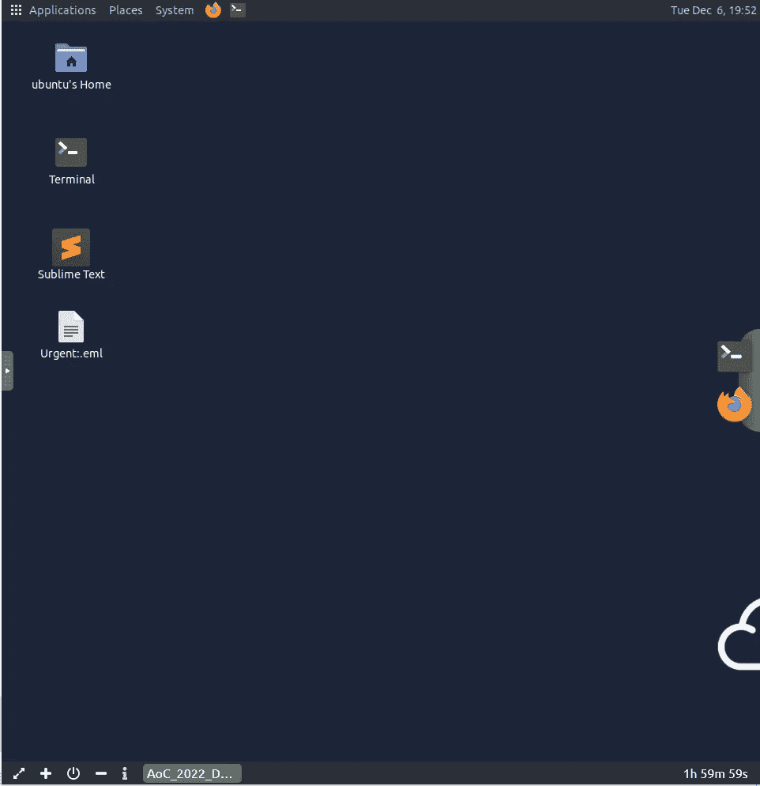

第 6 天 Ubuntu 虚拟机

此虚拟机有一个“紧急:。eml”文件，我们可能要分析它。

通过打开“紧急:。eml“我们可以回答第 6 天的前 5 个问题。

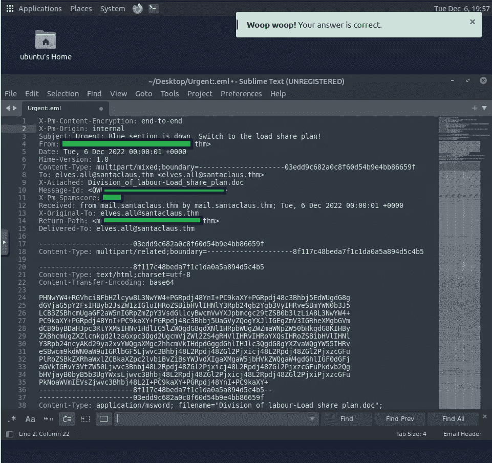

隐藏问题 1 至 5 的答案

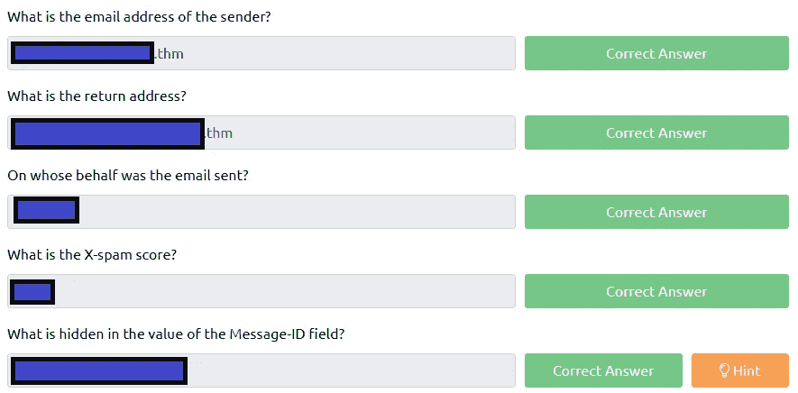

回答了问题 1 至 5

至此，我们已经回答了第 6 天的前 5 个问题。

问题 6 要求我们访问一个网站，[https://emailrep.io/](https://emailrep.io/)，在那里我们必须验证电子邮件地址的信誉。

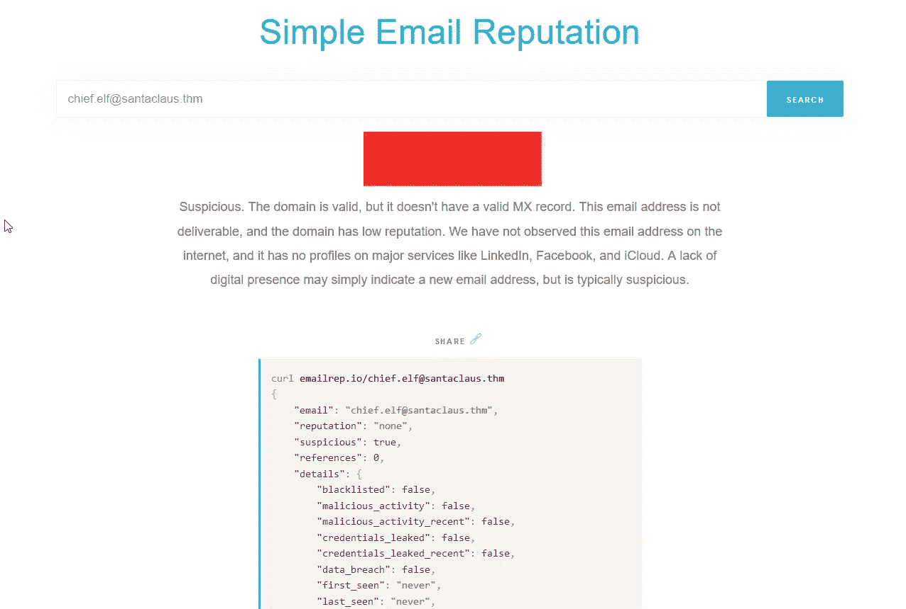

不太好

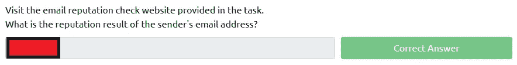

问题 6 已回答

问题 6 很容易回答，因为问题 1 至 5 的答案很清楚。

问题 7 希望我们检查附件的名称。

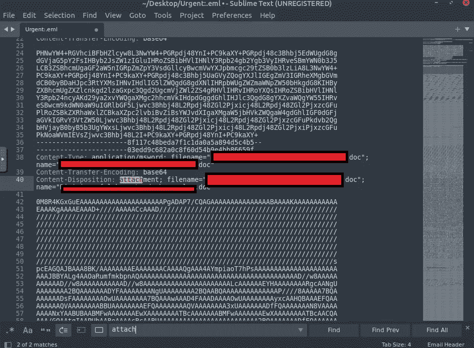

找到附件

这可以通过在崇高文本上按 Ctrl + F 并搜索“附件”来轻松完成。

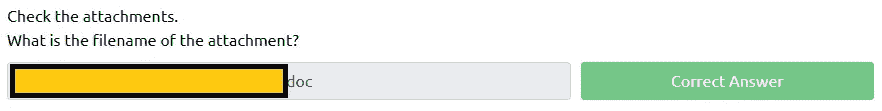

问题 7 已回答

问题 8 是关于哈希的。但是我们需要从文件中提取附件来获得散列。THM 非常友好地分享了用于提取附件的命令。

电化学分析仪

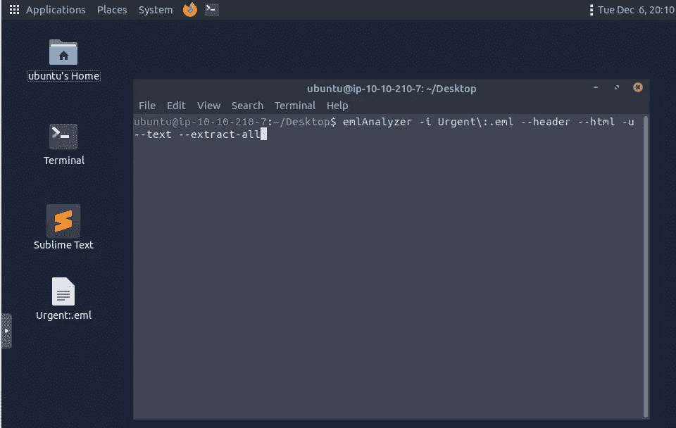

记得改变你的目录

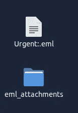

eml _ 附件

附件已提取，现在让我们提取哈希。

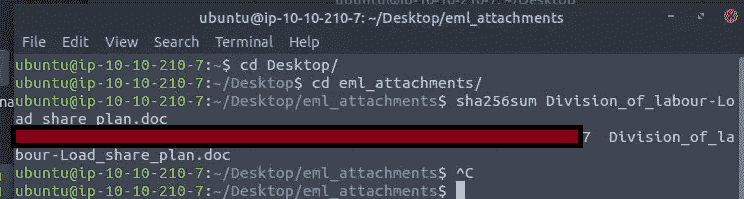

division _ of _ labor-Load _ share _ plan . doc 哈希

通过简单的命令“sha256sum ”,我们得到了散列。

问题 8 已回答

对于问题 9，我们必须访问 [VirusTotal](https://www.virustotal.com/gui/home/upload) (伟大的网站)，我们可以在 VirusTotal 上运行哈希搜索，看看我们能找到什么。

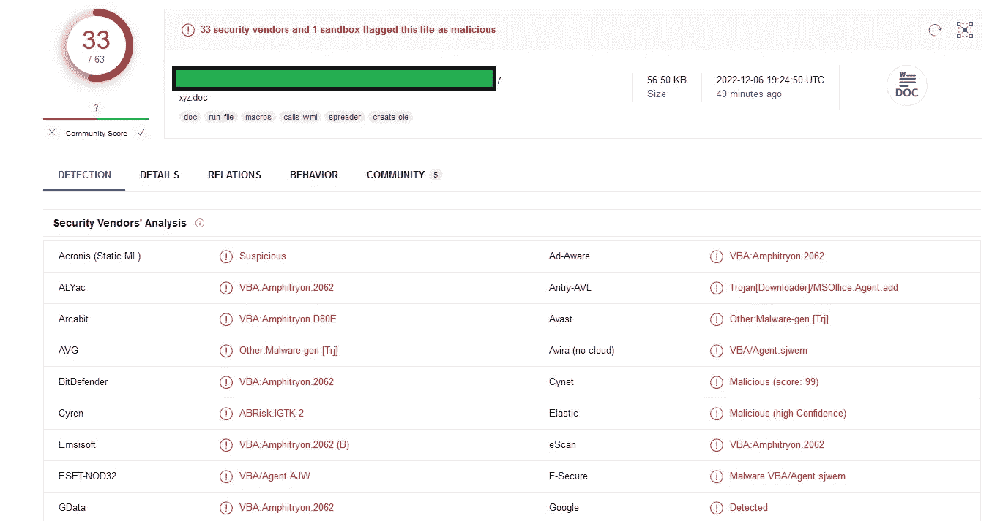

33/63 标志(错误文档)

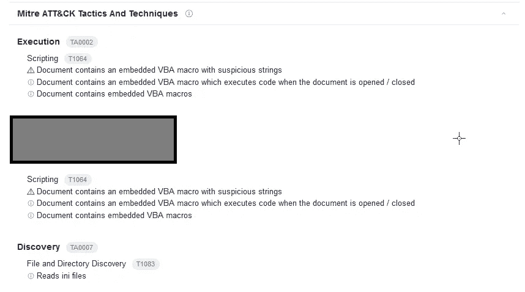

米特 ATT 和 CK 的战术和技术

这一部分可以在“行为”中找到。上面带有标志的截图正在检测中。

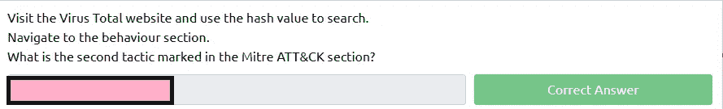

问题 9 已回答

问题 10，类似于问题 9，这次需要我们访问一个网站，[调查](https://labs.inquest.net/)。与在 VirusTotal 上一样，使用从问题 8 获得的散列。

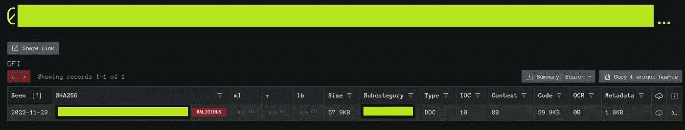

审讯子类别

至此，我们有了最终答案。

问题 9 已回答

问题 10 不需要答案。

*如果你喜欢看我的故事，* [*关注我*](https://medium.com/@stefan-p-bargan) *了解更多。此外，如果你不是中等会员，并且你想无限制地访问平台，可以考虑注册***！每月只有 5 美元，我只能得到很少的一部分。谢谢！**

***中等会员**——[https://stefan-p-bargan.medium.com/membership](https://stefan-p-bargan.medium.com/membership)*

***我的 LinkTree**——[https://linktr.ee/StefanPBargan](https://linktr.ee/StefanPBargan)*

## *来自 Infosec 的报道:Infosec 每天都有很多内容，很难跟上。[加入我们的每周简讯](https://weekly.infosecwriteups.com/)以 5 篇文章、4 个线程、3 个视频、2 个 GitHub Repos 和工具以及 1 个工作提醒的形式免费获取所有最新的 Infosec 趋势！*