# TryHackMe Cyber 2022 降临[第 7 天]马尔多克在火上烤——没有答案:P

> 原文：<https://infosecwriteups.com/tryhackme-advent-of-cyber-2022-day-7-maldocs-roasting-on-an-open-fire-no-answers-p-d9d90522bc94?source=collection_archive---------3----------------------->

第 7 天学习目标:

*   什么是赛博咖啡
*   赛博咖啡馆有什么功能
*   如何利用 CyberChef 分析恶意文档
*   如何对数据进行去泡沫、过滤和解析

## 第七天问题 1:

CyberChef 版？

我们首先需要启动攻击箱来找出答案。*“一个离线版本的赛博咖啡馆在附加到这个任务的机器上的 Firefox 中被加入了书签。”*

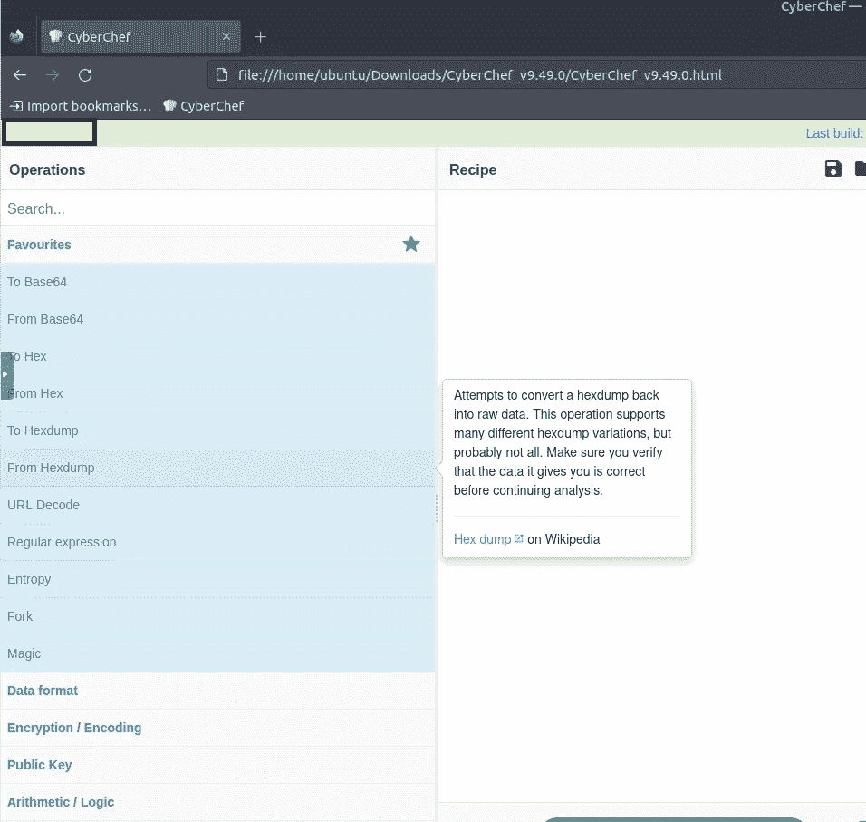

网吧工作

CyberChef 的版本可以在左上角找到。

问题 1 已回答

## 第七天问题 2

让我们将 Division _ of _ labour-Load _ share _ plan . doc 添加到 CyberChef 中

division _ of _ labour-Load _ share _ plan . doc

提示— *“使用 CyberChef 进行恶意文档分析”步骤您可以查看使用了多少步骤/配方来获得问题 3、4 & 5 的答案。*

问题 2 已回答

## 第 7 天问题 3、4 和 5

要回答最后几个问题，最好的方法是遵循 TryHackMe 给出的步骤。

## **字符串提取**

最小长度应为 **258**

匹配应设置为**所有可打印字符，ASCII 码**

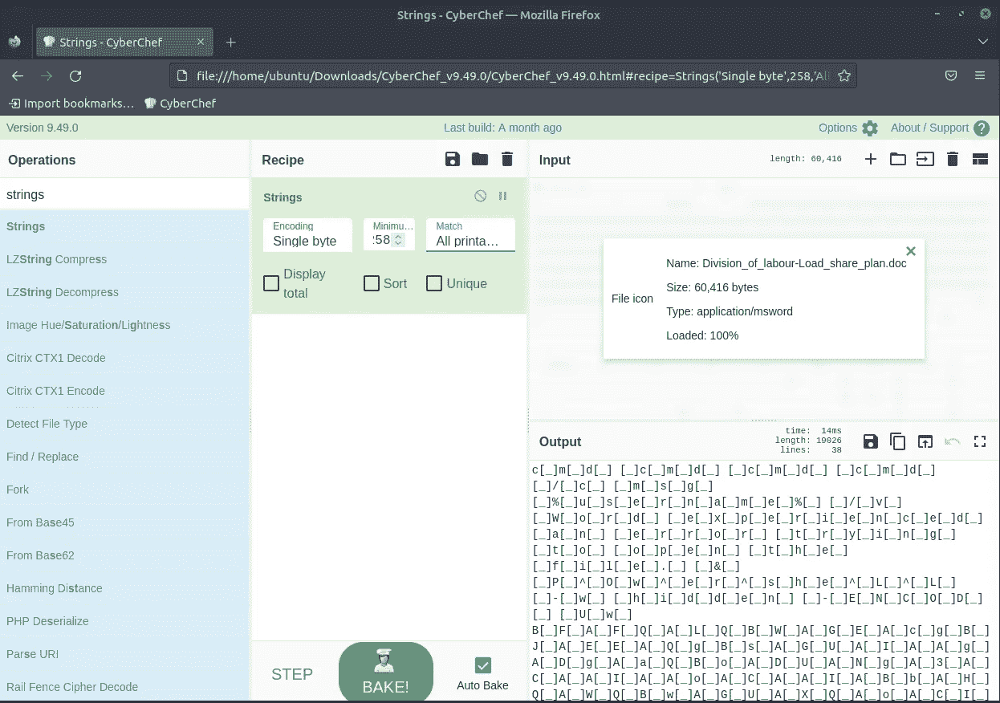

用线串

## 移除图案

将此字符串添加到 Find — `[**\[\]\n_**]`

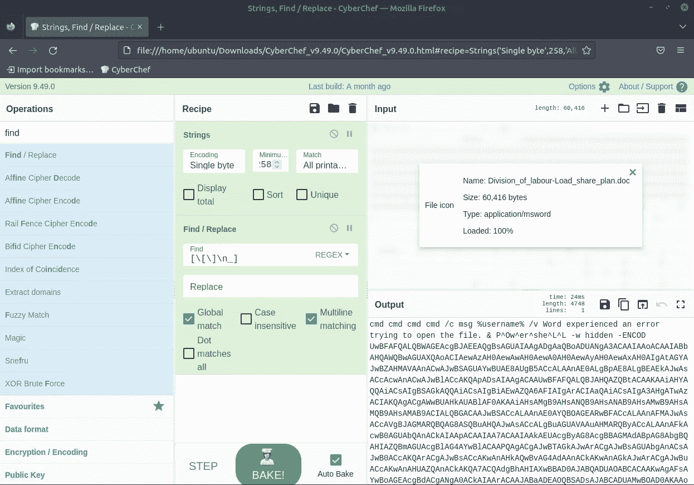

查找/替换

## 丢弃字节

长度— **124**

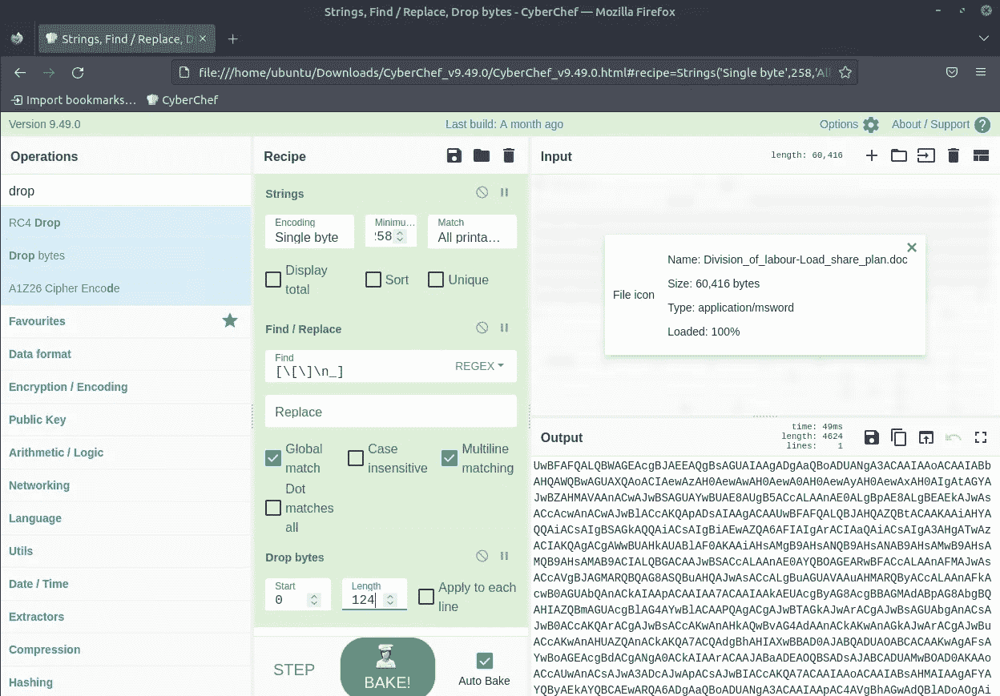

丢弃字节

## 从 Base64 开始

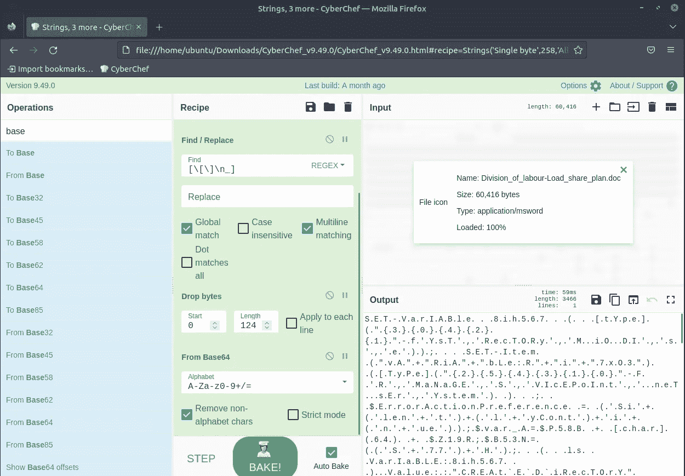

从 Base64 开始

## 解码文本

编码— **UTF-16LE(1200)**

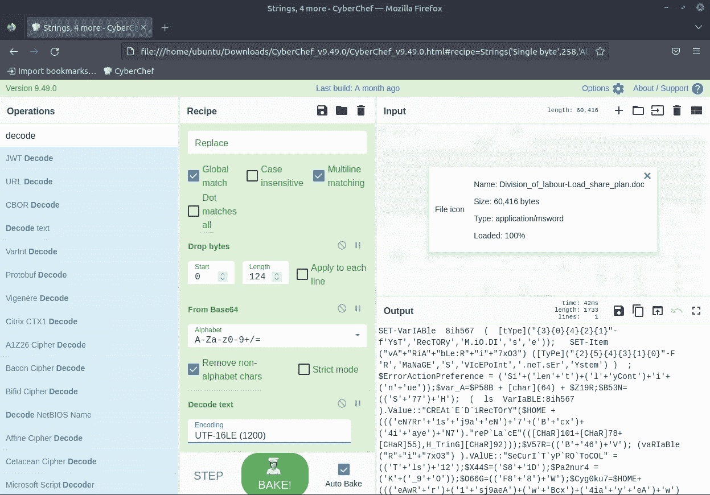

解码文本

## 再次查找/替换

查找— `['()+'"`]`

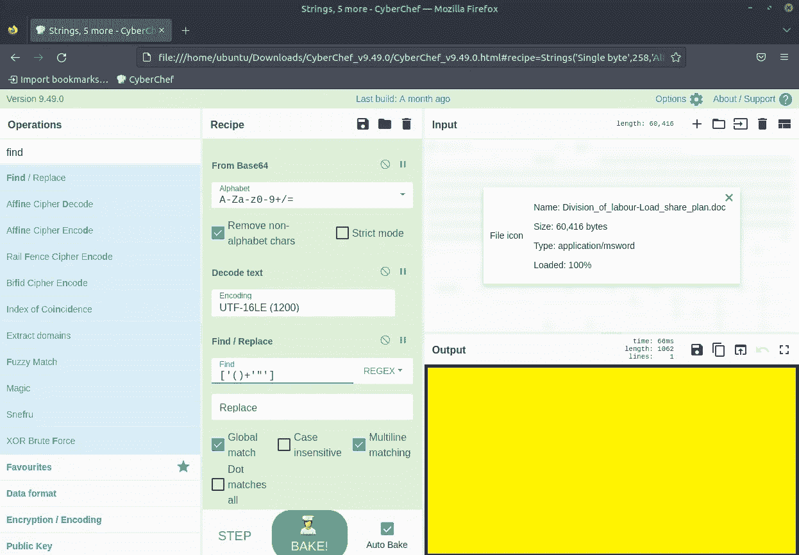

再次查找/替换

## 第三次查找/替换

查找— **]b2H_**

替换— **http**

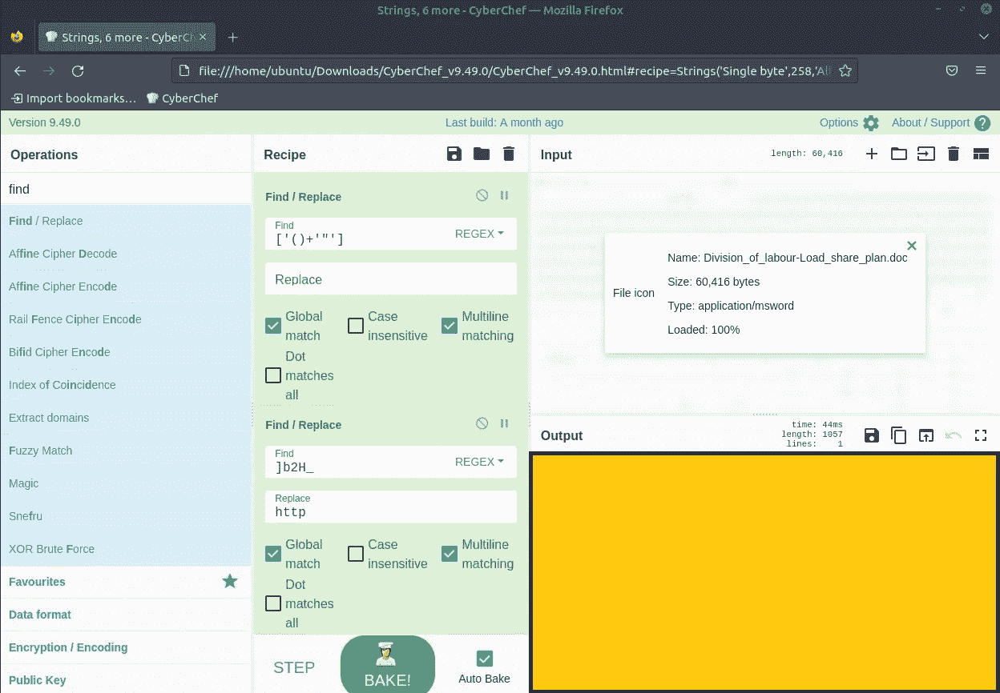

第三次查找/替换

## 提取 URL

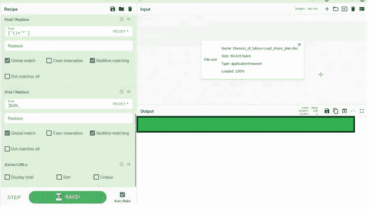

最后几个问题的答案。

我必须再三检查我做的每件事都是正确的，再三检查每件事，因为这个虚拟机很慢。

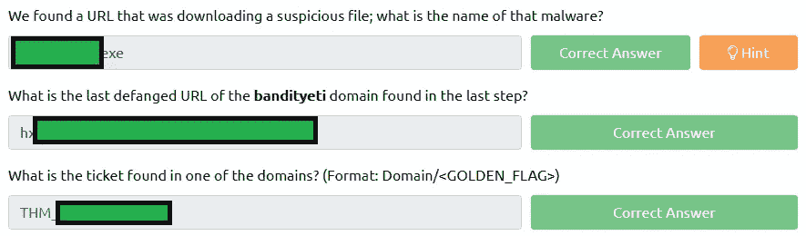

回答了问题 3、4 和 5

## 第七天问题 6

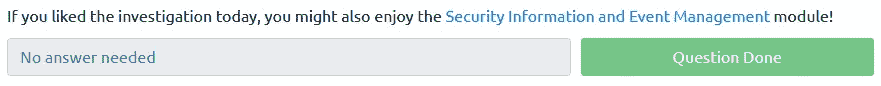

不需要回答

*如果你喜欢看我的故事，* [*关注我*](https://medium.com/@stefan-p-bargan) *了解更多类似内容。此外，如果你不是中等会员，但你想无限制地访问平台，可以考虑注册***！每月只有 5 美元，我只能得到很少的一部分。谢谢！**

***中等会员**——[https://stefan-p-bargan.medium.com/membership](https://stefan-p-bargan.medium.com/membership)*

***我的链接树**——[https://linktr.ee/StefanPBargan](https://linktr.ee/StefanPBargan)*

## *来自 Infosec 的报道:Infosec 每天都有很多内容，很难跟上。[加入我们的每周简讯](https://weekly.infosecwriteups.com/)以 5 篇文章、4 条线索、3 个视频、2 个 GitHub Repos 和工具以及 1 个工作提醒的形式免费获取所有最新的 Infosec 趋势！*