# TryHackMe-匿名 CTF 报道(详细)

> 原文：<https://infosecwriteups.com/tryhackme-anonymous-ctf-writeup-detailed-d7628a5417bb?source=collection_archive---------4----------------------->

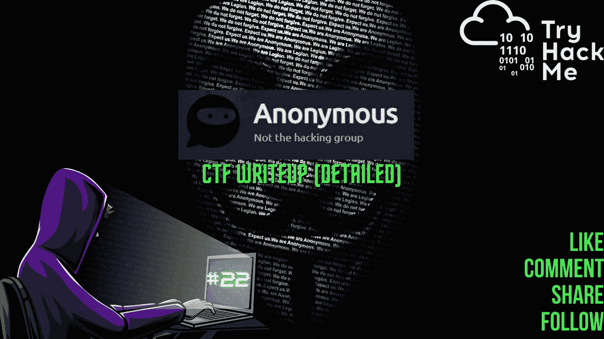

CTF 报道#22

欢迎各位！！我们将在 [TryHackMe](https://medium.com/u/dc49a0a3cb16?source=post_page-----d7628a5417bb--------------------------------) 做匿名 CTF。

CTF 链接:

 [## 匿名

### TryHackMe 是一个学习网络安全的在线平台，使用动手练习和实验室！

tryhackme.com](https://tryhackme.com/room/anonymous) 

CTF 由以下作者创作:

 [## TryHackMe |匿名 0ne

### TryHackMe 是一个学习网络安全的在线平台，使用动手练习和实验室！

tryhackme.com](https://tryhackme.com/p/Nameless0ne) 

为您的 CTF 计算机创建一个目录，并为 Nmap 创建一个目录来存储您的 Nmap 扫描输出。

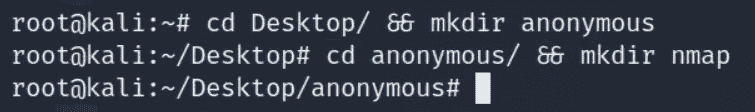

让我们开始吧！！享受流动吧！！

## 任务 1- Pwn:

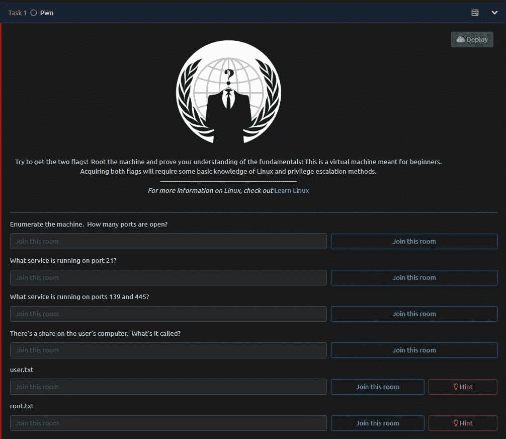

部署机器。

## Nmap 扫描:

> *nmap-sC-sV-p--oN nmap/anonymous _ all ports<TARGET _ IP>*
> 
> -sC:默认脚本
> -sV:版本检测
> -oN:输出将存储在您之前创建的“nmap”目录中
> -p-:扫描所有端口

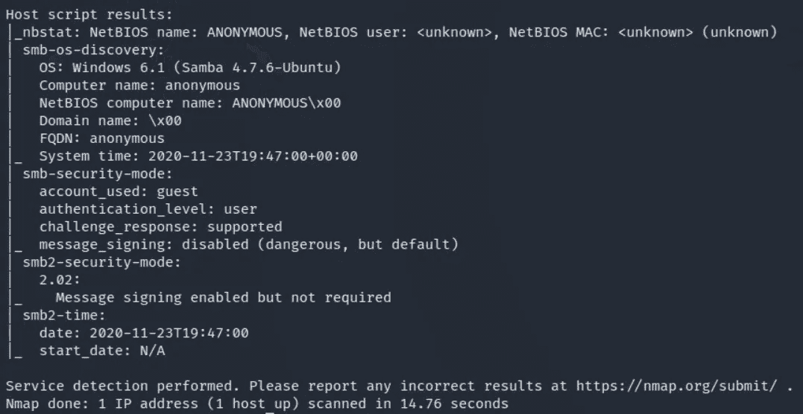

有 4 个端口开放:
21/ftp- vsftpd 2.0.8【允许匿名登录】
22/ssh-OpenSSH 7.6 P1
139/NetBIOS-SSN-Samba smbd 3。X-4。x
445/NetBIOS-SSN-Samba smbd 4 . 7 . 6
检测到操作系统- Ubuntu Linux

nmap 扫描输出回答了任务中的几个问题。提交它们。

> 列举机器。开放了多少个端口？
> 答案:4
> 
> 端口 21 上运行的是什么服务？
> 答:ftp
> 
> 端口 139 和 445 上运行的是什么服务？
> 答案:中小企业

没有网络服务器运行在端口 80，因此我们不会尝试目录模糊或使用 Nik 查找文档等。

到目前为止一切顺利！！让我们开始列举服务。首先是 FTP。我们将以“匿名”用户的身份执行 FTP，在密码提示时，我们将插入“匿名”。它将允许我们匿名登录 FTP，因为它是允许的。

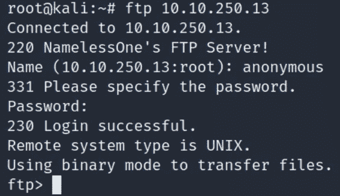

我们进去了。让我们找到一些文件，如果找到任何文件，我们将把它们转移到我们的主机上进行检查。

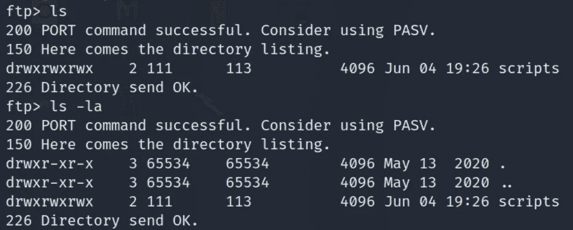

有一个“脚本”目录。我们将导航到它。请记住，总是使用“ls -la”检查隐藏文件是非常重要的，这样我们在退出 FTP 之前不会错过任何东西。

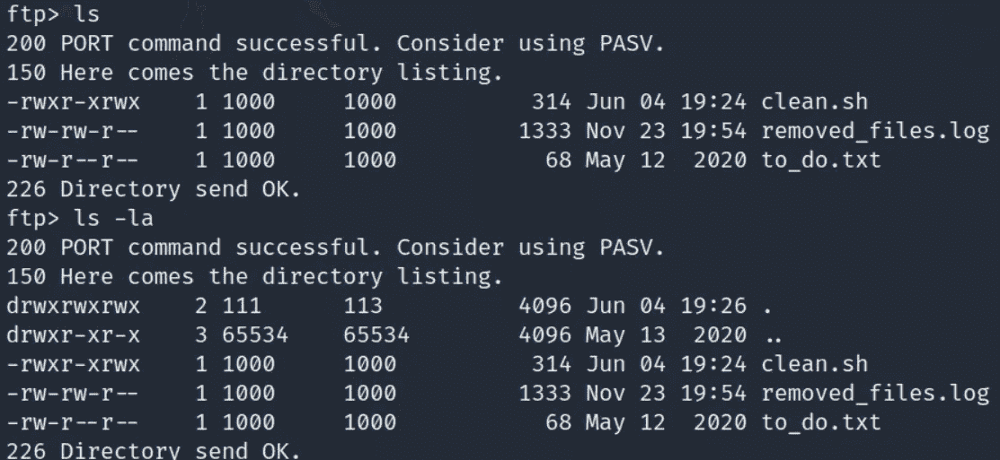

在“脚本”目录中，总共有 3 个文件。一个是 bash 脚本，另一个是日志文件，最后一个是文本文件。我们将使用“get”命令传输它们。

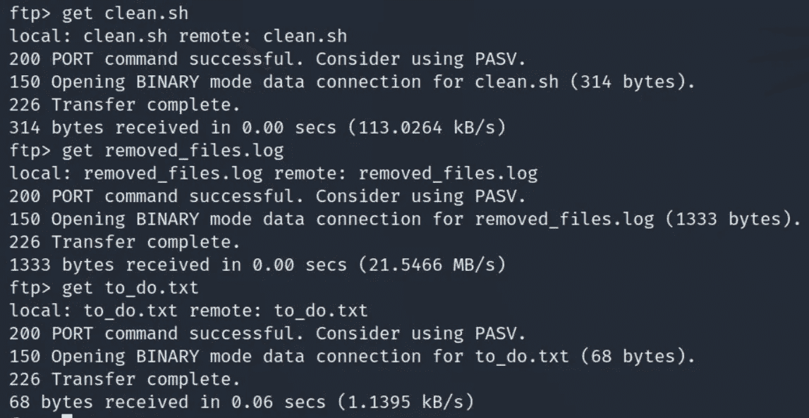

太好了，我们已经取回了文件。让我们退出 FTP 并逐个检查它们。

> clean.sh

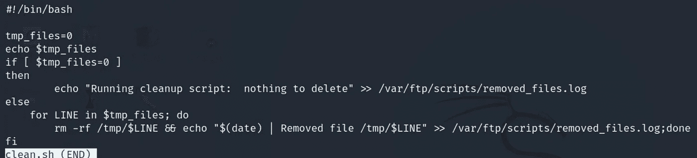

该脚本计划自动运行，并查看代码，它只是清理日志，即“删除 _ 文件.日志”文件。这可能对我们以后有潜在的帮助。让我们继续寻找/搜寻文件以便进一步枚举。

> 已删除 _files.log

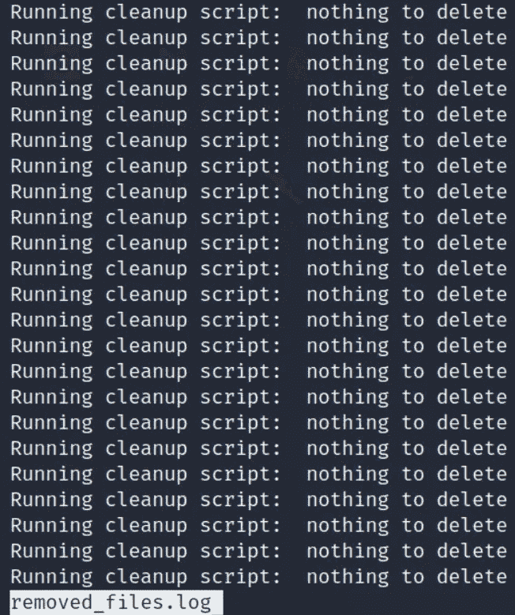

> todo . txt

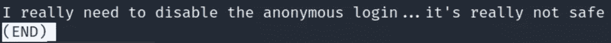

好的。所以。这还不够。回想一下 Nmap 扫描，在端口 139 和 445 上还运行着 SMB 服务。每当我想枚举 SMB 共享时，我的首选工具是“Enum4linux”。它将为我们提供 SMB 共享以及用户的名称。希望有匿名分享可以访问。让我们启动 Enum4linux

## Enum4linux:

> *enum 4 Linux-a<TARGET _ IP>*
> 
> -a 表示包括所有选项

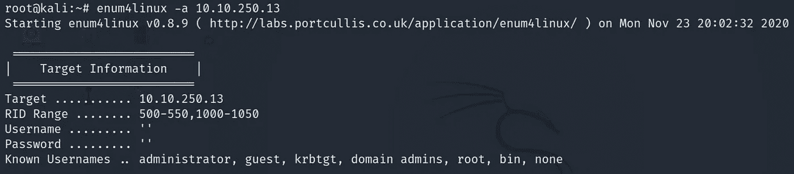

我们获得了一些非常有用的信息。我将从下面的输出中包括重要的位。

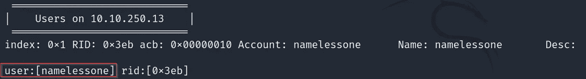

我们获得了一个用户名“无名”。

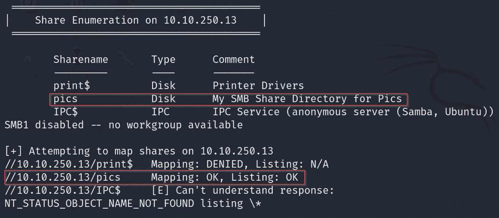

我们发现了 SMB 共享“图片”。这将有助于我们找到更多的文件，我们可以工作。也回答了下一个问题。提交吧。

> 用户电脑上有共享。它叫什么？
> 答:图片

让我们使用“smbclient”工具来列举 SMB。出现密码提示时，点击“Enter ”,我们将登录“pics”SMB 共享。

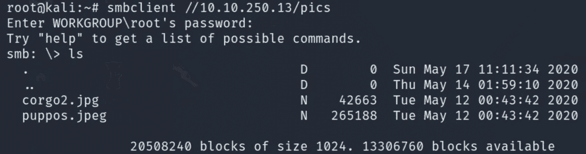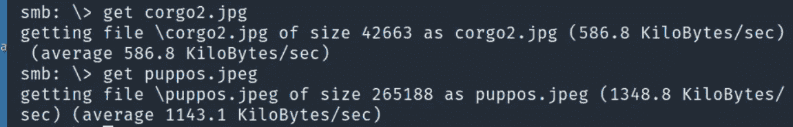

文件传输到我们的主机后，我们将退出并检查图像，如果它们打开或损坏了不正确的文件签名。

> corgo2.jpg

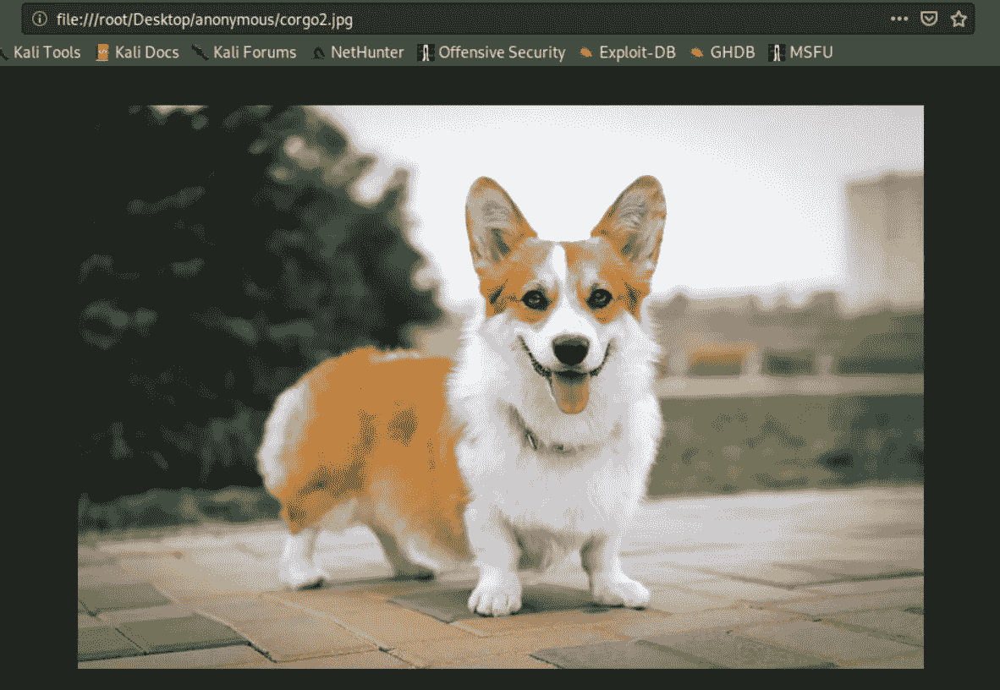

> puppos.jpeg

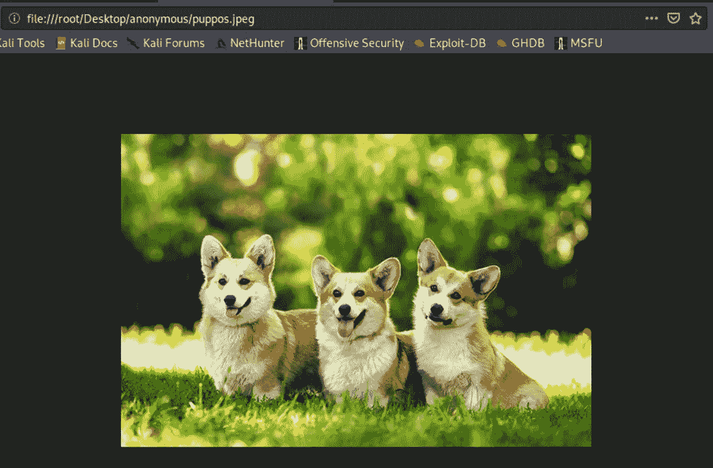

显然是可爱的狗狗照片。我们也许可以使用隐写术工具来检查更多关于这些图像的信息。也许它们包含隐藏的文件或信息。我的首选 steg 工具是“steghide”。

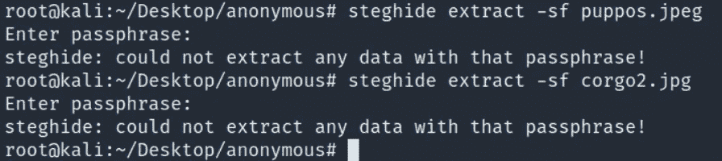

Steghide 输出检测到图像受密码保护。我们没有。

也有一种方法可以使用“stegcracker”工具对带有所需单词列表的图像进行暴力破解。我们可以利用它。但我可以向你保证这需要很长时间。如果你注意到下面的截图，扫描只完成了 2.21%，花费了 17 分钟。

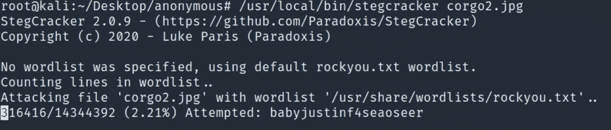

让我花点时间给你一些建议。建议是永远不要在 CTF 环境中暴力破解任何服务或登录页面或图像等超过 5 分钟。如果暴力破解花费了超过 5 分钟的时间，那么你就做错了，并且穿过了一条意想不到的通向兔子洞的路。CTF 被设计成能够在不到或等于 5 分钟内暴力破解。以我的经验，我可以告诉你这一点。我们不会从这些照片中找到任何东西。因此，我们将继续做其他事情。

回想一下之前我提到的“clean.sh”脚本可能对我们有用。让我们玩玩这个脚本，想一个在目标机器上获得 shell 的方法。

重新访问“clean.sh”脚本。

我们可以通过包含一个反向 shell 脚本来覆盖该脚本。我们可以从下面的链接中找到不同格式的反向 shell 脚本:

 [## 反向外壳备忘单

### 如果你足够幸运，在渗透测试中发现了一个命令执行漏洞，不久之后…

pentestmonkey.net](http://pentestmonkey.net/cheat-sheet/shells/reverse-shell-cheat-sheet) 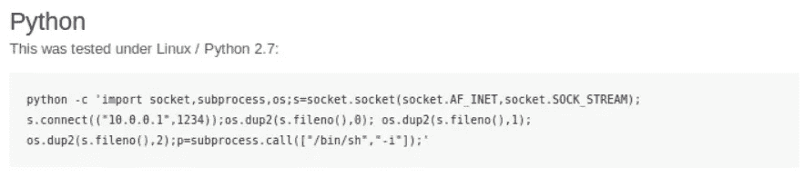

我们将使用上面的 python 反向 shell 脚本来尝试在目标机器上获得 shell。
我们如何做到这一点？
在我们修改了主机的 IP 和 Port 值后，我们将使用反向 shell 脚本覆盖“clean.sh”文件。更改脚本中的值以使其正常工作是非常重要的。

我们需要将反向 shell 脚本上传到机器上。我能想到的最简单的方法是使用“FTP”服务来上传脚本。通常我们使用“get”命令从 FTP 服务下载或传输文件。同样，我们可以使用“上传”命令将文件上传到 FTP 服务。它将允许我们上传脚本，并将自动执行脚本。

让我们现在做那件事。

我的机器过期了，所以我不得不重新启动它。只是 IP 变了，其他什么都没变。

> 在“nano”编辑器中覆盖“clean.sh”脚本。

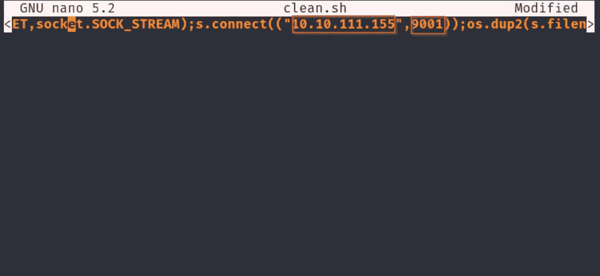

保存它[Ctrl+O]并退出它[Ctrl+U]

> 我们将在脚本中插入的端口上启动一个 netcat 监听器。

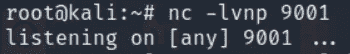

> 匿名登录 FTP

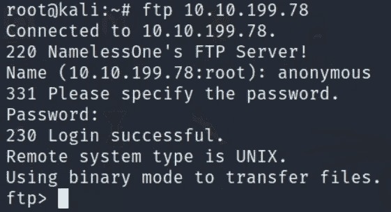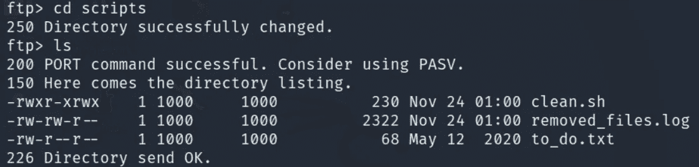

> 使用“上传”命令上传脚本

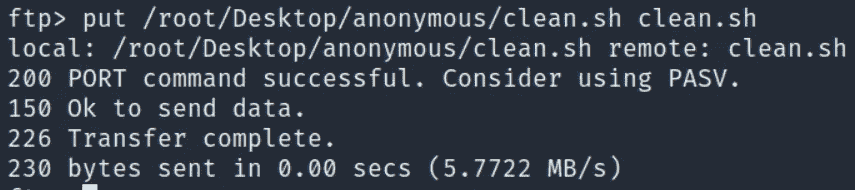

> 过一会儿再检查收听者
> …

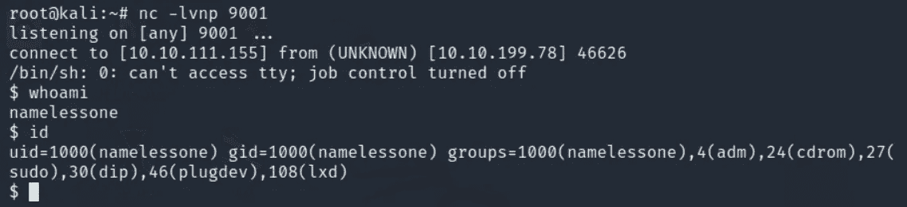

太棒了！！
我们成功获得了 shell。
但这个壳不是一个稳定的壳。
我们如何获得稳定的外壳？让我给你带路。

> $ python-c ' import pty；pty . spawn("/bin/bash ")'
> Ctrl+Z
> stty raw-echo
> fg
> export TERM = xterm

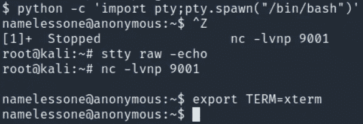

我们现在有一个稳定的外壳。
以上命令将让您现在通过 TAB 键自动完成，清除屏幕，在 shell 中轻松导航。

让我们寻找我们的用户标志！

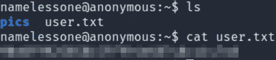

太棒了。！获取了用户标志。提交吧。

> user . txt
> Ans:xxxxxxxxxxxxxxxxxxxxxxxxxxxxx

现在怎么办？是的，我认为这确实是对的。我们需要提升我们在机器上的权限，以成为 root 用户并获取 root 标志。

我们可以从一些手工枚举开始。首先，我们可以搜索/找到设置了超级用户权限的二进制文件。这意味着用户可以以 root 身份运行二进制文件。

> find / -perm -4000 2>/dev/null

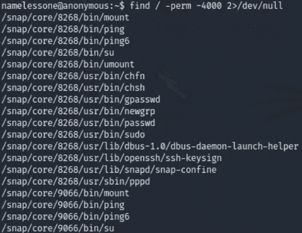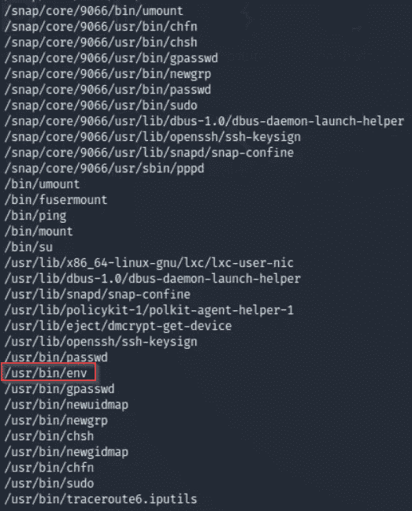

我认为二进制的“env”有可能被用于特权提升的目的。我找到 privesc 命令的网站是 GTFOBins。
链接如下。

 [## GTFOBins

### GTFOBins 是 Unix 二进制文件的精选列表，攻击者可以利用它来绕过本地安全限制…

gtfobins.github.io](https://gtfobins.github.io/#env) 

> 搜索“环境”

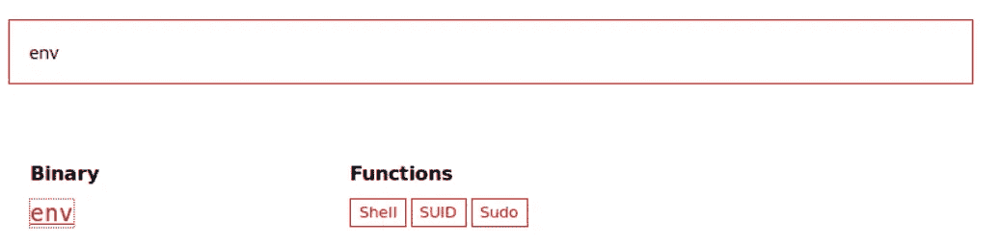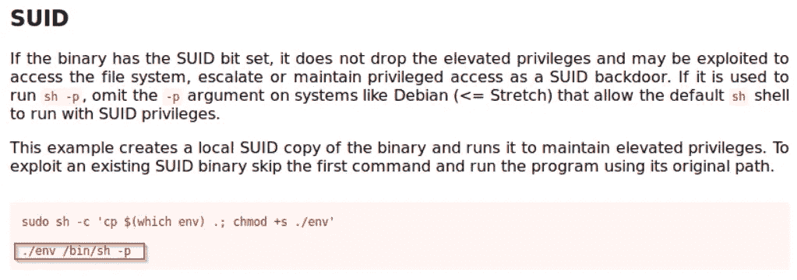

因为我们知道二进制文件设置了 SUID 位，所以我们需要执行/bin/sh -p 后面的二进制文件，它将运行二进制文件的 SUID 副本，从而允许我们提升权限。

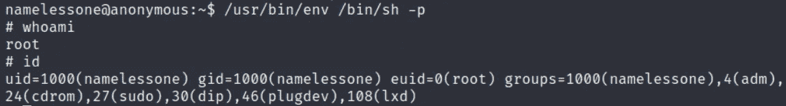

我们现在可以确认我们是根了！！
让我们抓住根旗，给这个盒子一个圆满的结局。

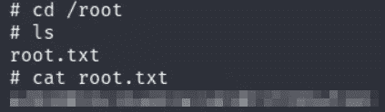

提交吧。

> root . txt
> Ans:xxxxxxxxxxxxxxxxxxxxxxxxxxxxxxxx

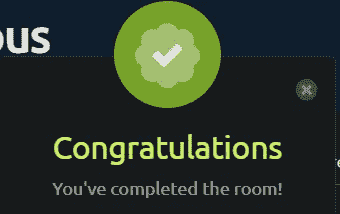

我们已经完成了房间。我真的很喜欢这个房间，并从中获得了很多乐趣。我会建议每个人都尝试一下这个房间，我希望你离开时能学到一些新东西。

如果你喜欢这篇文章，并且这篇文章对你有所帮助，请在评论中告诉我，或者用掌声分享你的爱。

谢谢你抽出时间。

跟着我。

更多的报道正在进行中。

保重，注意安全，继续黑！

哈桑·谢赫