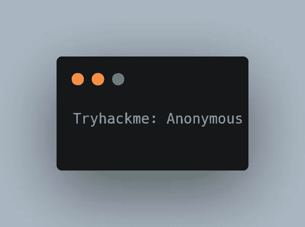
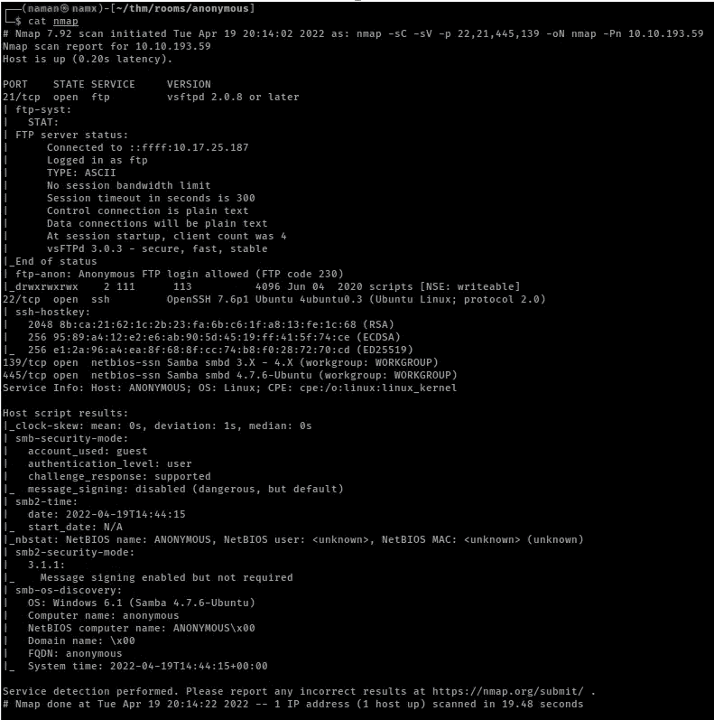
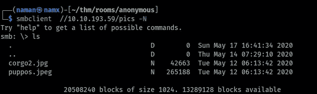
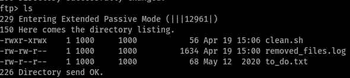
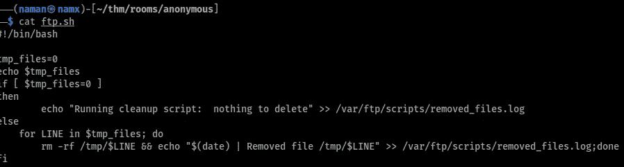
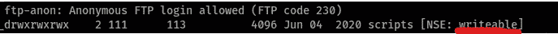
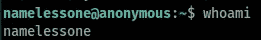
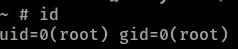
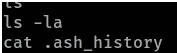
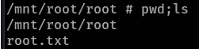

# Tryhackme:匿名

> 原文：<https://infosecwriteups.com/tryhackme-anonymous-d7d5b6d14478?source=collection_archive---------0----------------------->

## 游戏攻略



# 简介:

大家好。这次我们要做在 Tryhackme 上被评为中等的匿名房间。

所以让我们支持:D

# 首字母

用我的名字缩写，包括存储机器 IP 地址到变量、

```
export IP=10.10.193.59
```

## 端口扫描:

```
rustscan -a $IP --ulimit 5000 | tee rust.txt
```

使用 **rustscan** 我们发现 4 个端口打开，即

`21, 22, 139, 445`

让我们用 **nmap** 深入研究这些端口，

```
nmap -sC -sV -p21,22,139,445 -oN nmap $IP -Pn
```



nmap 扫描结果

## 端口- 139，445 (SMB):

```
smbclient -L $IP -N
```

我发现了一个名为“图片”的分享，让我们来深入了解一下



中小企业份额

我查看了 SMB 共享，找到了两张图片，做了我所知道的所有速记工作，浪费了一些时间后，我知道这只是一个兔子洞:/

# 剥削

## 端口 21 (FTP):

由于 nmap 扫描显示允许匿名登录，因此它以匿名用户身份登录并找到了一些文件。



FTP 共享

我的第一个注意是由`clean.sh`引起的，因为它是一个可执行文件，它就在那里。

将该文件放入我的本地机器，发现它正在自动进行清理工作。



clean.sh

所以我改变了文件夹的内容(添加了我的反向 shell)并上传到 machine。我突然发现 FTP 共享文件夹在 nmap 扫描上是可写的



几秒钟后，我拿到了贝壳:D



壳

# 根

现在我们有了用户，是时候获得根用户了。

首先要尝试的是

`sudo -l` →没有运气

`suid`二进制→没有运气

然后我检查了组，找到了有线组名“lxd”

这是我的时间看到，研究同样的黑客技巧和其他网站和一些特权提升技术。这个[网站](https://www.hackingarticles.in/lxd-privilege-escalation/)对我真的很有帮助(:

我们是根！



根！！

虽然我被 root 了但是没有能够找到`root.txt` 的文件。只有一个文件在`/root`



/root

后来看文章，发现整个`/`目录都在`/mnt/root`下面，得到了`root.txt`文件 XD



root.txt

就这样我们完成了匿名房间。感谢您阅读这篇文章(:

|| [房间](https://tryhackme.com/room/anonymous) || [推特](https://twitter.com/namx05) ||