# TryHackMe —防病毒

> 原文：<https://infosecwriteups.com/tryhackme-antivirus-2c69a4b3e26e?source=collection_archive---------1----------------------->

大家好，

从新手到极客，每一个熟悉计算机的人都会在某个时候听说过防病毒软件。防病毒是从便携式计算机的早期发展而来的概念。从 Windows 95 到 Windows 11，防病毒是计算机进化的一部分。


防病毒软件是一种保护机器免受各种恶意软件、病毒和网络攻击的软件，可以帮助我们保护机器的安全。

传统的反病毒解决方案，如卡巴斯基，AVG，诺顿到恶意软件字节，和 Windows Defender，反病毒服务的确切原因是保护机器。

但是我们对它的工作原理知之甚少。我们不打算深入历史，但让我们了解它是如何工作的。

防病毒软件是一个由扫描器、引擎、数据库和沙盒环境组成的软件包。每个组件都有自己的用途

防病毒软件使用最新恶意软件的实时签名更新其数据库，并根据签名扫描文件以进行匹配。一旦识别出来，它就采取相应的行动。

让我们深入了解不同类型的扫描以及它在机器上的工作原理。

有 3 种类型的扫描和检测。1.静态检测 2。动态检测 3。基于行为的检测

## 静态检测:

静态检测是最简单最基本的检测方式。它用恶意软件文件的现有数据库扫描文件。它检查哈希值、校验和以及证明文件完整性的其他相关信息。

在此任务中，我们将使用具有静态检测功能的防病毒软件扫描计算机上的文件。

我们得到了一台运行着名为“clamscam”的杀毒软件的 windows 10 机器和一堆不同类型的恶意软件样本。

恶意软件示例文件夹包含以下文件:

1.  **EICAR** 是一个包含 ASCII 字符串的测试文件，用于测试反病毒软件的有效性，而不是可能损害您机器的真正恶意软件。任何病毒扫描软件都可以使用这个文件进行测试
2.  **Backdoor 1** 是一个 C#程序，它使用一种众所周知的技术来建立反向连接，包括创建一个进程和执行一个 Metasploit 框架外壳代码。
3.  **后门 2** 是一个利用进程注入和加密建立反向连接的 C#程序，包括将一个 Metasploit 外壳代码注入到一个已经存在并正在运行的进程中。
4.  **AV-Check** 是一个 C#程序，枚举目标机器中的 AV 软件。请注意，该文件没有恶意。我们将在任务 6 中更详细地讨论该工具。
5.  notes.txt 是一个文本文件

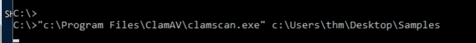

我已经登录到机器，并使用 cmd 工具指示 AV 扫描主机桌面上的样本。

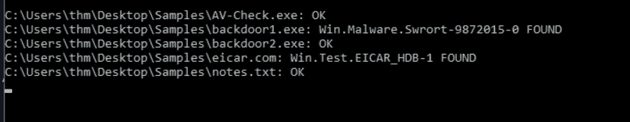

AV 扫描了他们数据库中的文件并分享了结果。我们检测到两个恶意软件。然而，它错误地将后门 2 识别为非恶意的，尽管它是恶意的。

您可以运行 clamscan.exe—调试<file_to_scan>，您将看到在扫描过程中加载和使用的所有模块。例如，它使用解包方法来分割文件，并寻找预先定义的恶意字节码值序列，这就是它如何能够检测到 C#后门 1。</file_to_scan>

如果你记得，后门 1 和后门 2 是相同的代码，但后门 2 是加密的。backdoor 1 中使用的 Metasploit 外壳代码的字节码值之前已经确定并添加到 ClamAV 的数据库中。

然而，backdoor 2 对 Metasploit 外壳代码使用了一种加密技术(XOR ),导致字节码值的不同序列，这在 ClamAV 数据库中是找不到的。

而 ClamAV 能够使用基于 md5 签名的技术将 EICAR.COM 测试文件检测为恶意的。

很多时候，反病毒软件无法更新所有反病毒软件的签名。由于黑客总是尝试新的方法来创建恶意软件，有时需要手动将签名添加到 AV 数据库中。大多数防病毒软件提供报告新签名或直接添加到他们的数据库。

在我们的例子中，由于我们无法识别恶意软件样本，现在我们将后门 2 的哈希值添加到我们的签名数据库中。

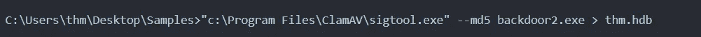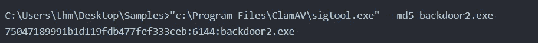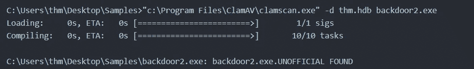

以上步骤描述了添加签名的方式。以下是必需的步骤:

1.  为文件生成 MD5 签名。
2.  将生成的签名添加到带有扩展名“的数据库中。组屋”。
3.  用我们新的数据库重新扫描 ClamAV 文件。

此外，我们可以识别不同进程中的模式，并通过添加规则中的所有参数来创建规则，以检测恶意软件。这可以通过 YARA 法则来实现。

Yara 是一个允许恶意软件工程师分类和检测恶意软件的工具。Yara 使用基于规则的检测，因此为了检测新的恶意软件，我们需要创建一个新的规则。

要在 YARA 中编写一个规则，我们应该使用字符串工具分析文件并列出二进制文件中所有人类可读的字符串。因此，我们将看到所有的函数、变量和无意义的字符串。

但是，如果您仔细观察，我们可以在规则中使用一些独特的字符串来检测该文件。AV 检查使用程序数据库(。pdb)，它包含编译期间程序的类型和符号调试信息。

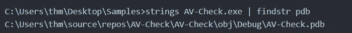

## 什么是程序数据库(PDB)？

## 默认情况下，当指定/DEBUG 时，链接器会创建一个保存调试信息的程序数据库(PDB)。PDB 的默认文件名是程序的基本名称和扩展名. pdb

我们将使用前面命令输出中的路径作为我们将要创建的 Yara 规则中唯一的字符串示例。签名可以是注册表项、命令等。以下是我们将在检测中使用的亚拉法则:

```
rule thm_demo_rule {
	meta:
		author = "THM: Intro-to-AV-Room"
		description = "Look at how the Yara rule works with ClamAV"
	strings:
		$a = "C:\\Users\\thm\\source\\repos\\AV-Check\\AV-Check\\obj\\Debug\\AV-Check.pdb"
	condition:
		$a
}
```

让我们解释一下亚拉法则。

*   规则的名称以 rule thm_demo_rule 开头。如果规则匹配，ClamAV 将使用此名称。
*   元数据部分是一般信息，包含作者和描述。
*   strings 部分包含我们正在寻找的字符串或字节码。在这种情况下，我们使用的是 C#程序的数据库路径，它是在前面的命令执行中获得的。
*   请注意，我们在路径中添加了一个额外的\来转义特殊字符，这样就不会违反规则。
*   在 condition 部分，我们指定定义的字符串是否在 string 部分找到，然后标记文件。

注意，yara 规则必须存储在一个. Yara 扩展文件中，以便 ClamAV 进行处理。

让我们使用我们创建的 Yara 规则再次重新扫描 c:\Users\thm\Desktop\Samples 文件夹。我们在桌面上的 c:\ Users \ thm \ Desktop \ Files \ thm-demo-1 . Yara 中保存了 Yara 规则的副本。


输出结果显示，该文本文件也被标记为恶意文件，因为该文件包含我们在 YARA 规则中添加的相同字符串。

为了避免误判，我们将在规则中指定文件类型。通常，文件的类型可以用幻数来标识，幻数是二进制文件的前两个字节。比如[可执行文件](https://en.wikipedia.org/wiki/DOS_MZ_executable)(。exe)总是以十六进制的 ASCII“MZ”值或“4D 5A”开始。

为了证实这一点，让我们使用免费的十六进制编辑器 [HxD](https://mh-nexus.de/en/hxd/) 应用程序来检查 AV-Check.exe 二进制文件并查看前两个字节。请注意，HxD 已经在提供的 VM 中可用。


让我们在 Yara 规则中包含这一点，只标记。包含我们的签名字符串的 exe 文件是恶意的。以下是改进后的亚拉法则:

```
 rule thm_demo_rule {
	meta:
		author = "THM: Intro-to-AV-Room"
		description = "Look at how the Yara rule works with ClamAV"
	strings:
		$a = "C:\\Users\\thm\\source\\repos\\AV-Check\\AV-Check\\obj\\Debug\\AV-Check.pdb"
		$b = "MZ"
	condition:
		$b at 0 and $a
}
```

在新的 Yara 规则中，我们定义了一个等于 MZ 的唯一字符串($b)作为。exe 文件类型。我们还更新了条件部分，现在包括以下条件:

1.  如果在 0 位置找到字符串“MZ ”,则为文件的开头。
2.  如果唯一字符串(路径)出现在二进制文件中。
3.  在条件部分，我们用 AND 运算符对 1 和 2 中的两个定义都找到了，那么我们就有了一个匹配。

您可以在 Desktop\Files\thm-demo-2.yara 中找到更新的规则。现在我们有了更新的 yara 规则，现在让我们再试一次。

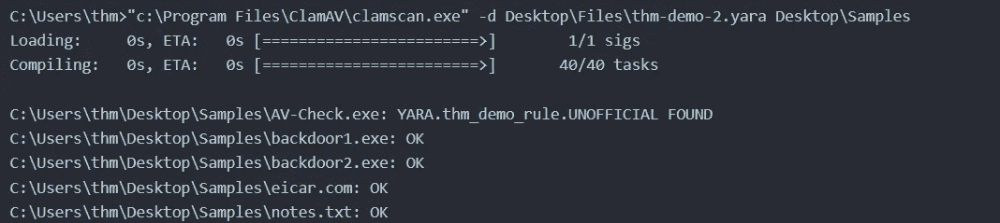

输出显示我们改进了 Yara 规则以减少假阳性结果。这是反病毒软件工作原理的一个简单例子。因此，反病毒软件供应商努力打击恶意软件，并改进他们的产品和数据库，以提高性能和结果的准确性。

基于签名的检测的缺点是，如果二进制文件被修改，文件将具有不同的哈希值。因此，如果有人知道反病毒软件寻找什么以及如何分析二进制文件，就很容易绕过基于签名的检测技术，如后面的房间所示。

现在任务来了。我们给了两个问题来完成。

1.  我们需要使用 ClamAV 的 sigtool 获得 AV-Check.exe 的哈希值。

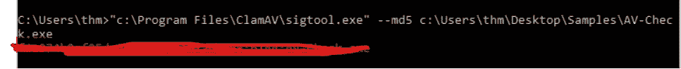

2.我们应该通过使用字符串命令遍历 AV-Check.exe 的二进制文件来获得一个标志。

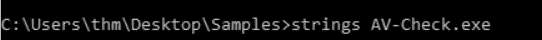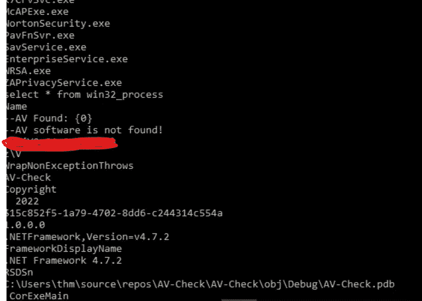

## 动态检测

在动态检测中，我们实时监控文件的行为来识别恶意进程。

动态检测更侧重于使用不同的方法在运行时检查文件。下图显示了动态检测扫描流程:

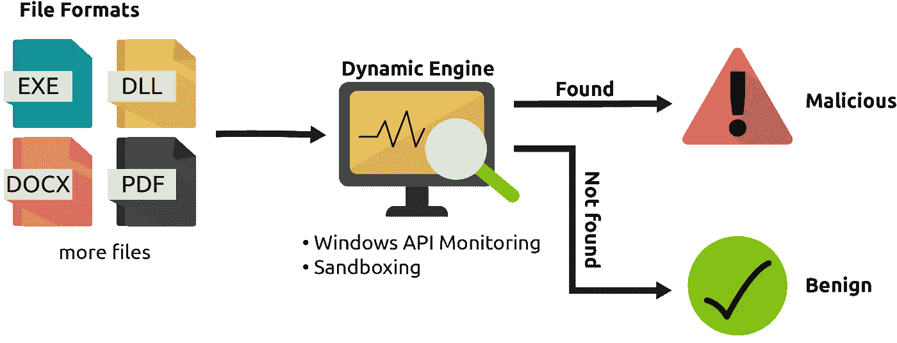

Windows 系统文件是最常被用来执行恶意软件的工具之一。这些反病毒软件会监控这些文件的 API 调用来检测恶意软件。一旦进程被执行，他们将监控窗口挂钩

```
A *hook* is a mechanism by which an application can intercept events, such as messages, mouse actions, and keystrokes. A function that intercepts a particular type of event is known as a *hook procedure*. A hook procedure can act on each event it receives, and then modify or discard the event.
```

另一种动态检测方法是沙盒。

沙箱是一种虚拟化环境，用于运行与主机分离的恶意文件。这通常在隔离环境中进行，主要目的是分析恶意软件在系统中的行为方式。一旦恶意软件被确认，将基于二进制文件的特征创建唯一的签名和规则。

## 启发式和行为检测

启发式和行为检测在当今的现代反病毒产品中已经变得必不可少。现代反病毒软件依靠这种类型的检测来检测恶意软件。启发式分析使用各种技术，包括静态和动态启发式方法:

1.  静态启发式分析是提取恶意软件源代码的过程。然后，将提取的源代码与其他众所周知的病毒源代码进行比较。这些源代码是预先已知的，并在启发式数据库中预定义。如果匹配达到或超过阈值百分比，代码将被标记为恶意代码。
2.  动态启发式分析基于预定义的行为规则。安全研究人员分析了隔离和安全环境中的可疑软件。根据他们的发现，他们将该软件标记为恶意软件。然后，创建行为规则来匹配目标机器内的软件恶意活动。

以下是行为规则的示例:

*   如果一个进程试图与包含用户的 NTLM 散列、Kerberos 票据等等的 LSASS.exe 进程进行交互
*   如果进程打开监听端口并等待从命令和控制(C2)服务器接收命令

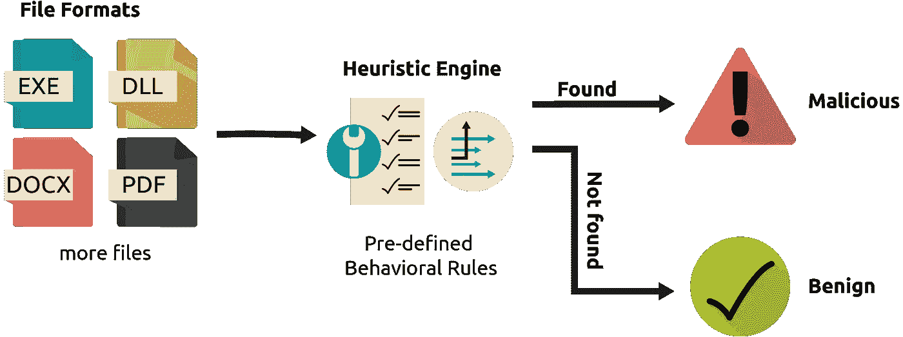

## 检测摘要:

在图中，你可以看到一个可疑的 Foobar.zip 文件被传递给反病毒软件进行扫描。

*   反病毒软件识别出它是一个压缩文件(。zip)。
*   软件识别并应用解压缩功能来提取文件(Foobar.exe)。
*   接下来，它识别文件类型以知道使用哪个模块，然后执行 pe 解析操作来提取二进制文件的信息和其他特征。
*   接下来，它检查文件是否打包；如果是，它就解包代码。
*   最后，它将收集的信息和二进制文件传递给反病毒引擎，在那里它试图检测它是否是恶意的，并给我们结果。

作为安全专业人员，您需要了解防病毒产品如何随着新型病毒攻击而更新。

感谢阅读:)

来自 Infosec 的报道:Infosec 上每天都会出现很多难以跟上的内容。加入我们的每周简讯，以 5 篇文章、4 个线程、3 个视频、2 个 Github Repos 和工具以及 1 个工作提醒的形式免费获取所有最新的 Infosec 趋势！[](https://weekly.infosecwriteups.com/)