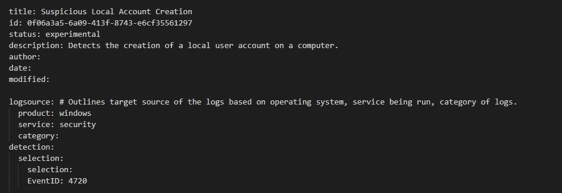
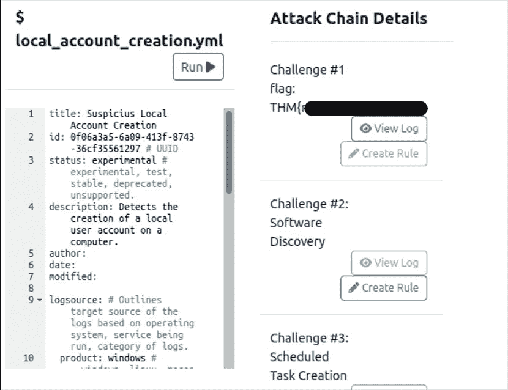
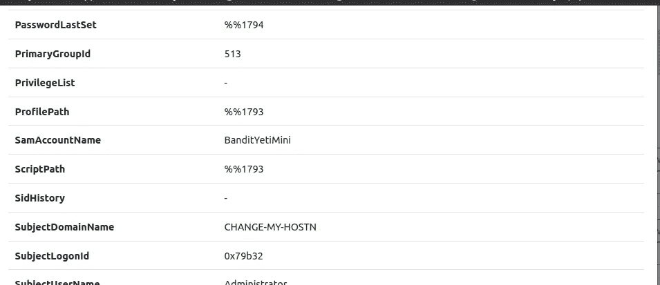
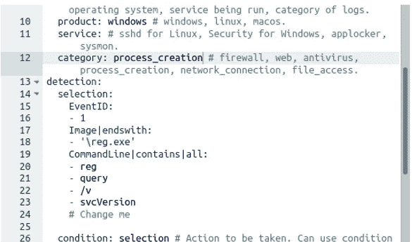
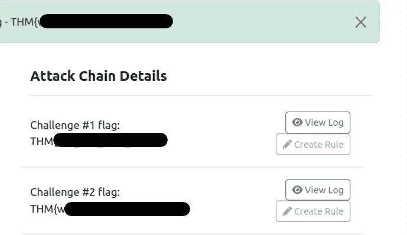
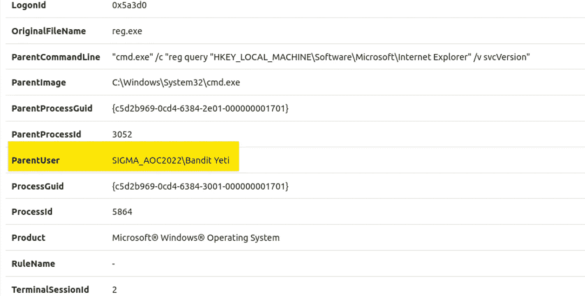
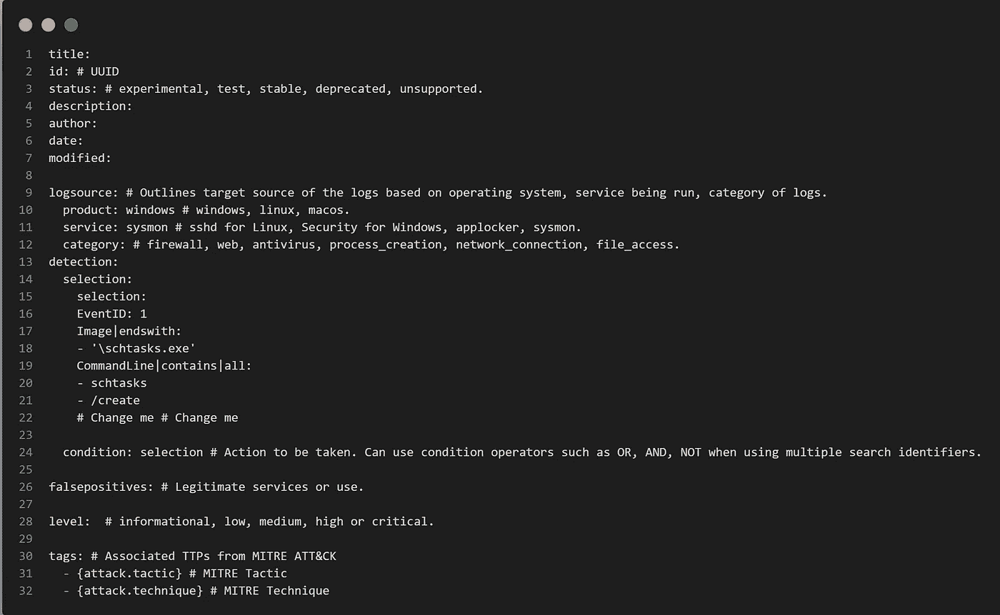
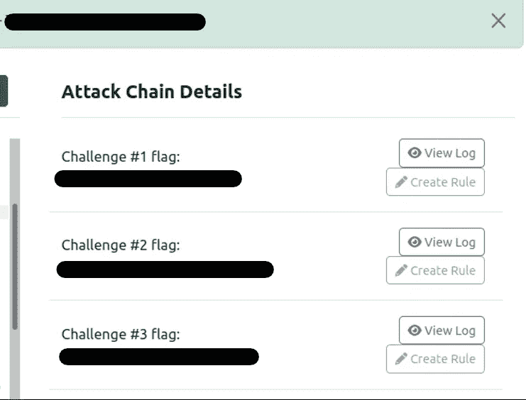
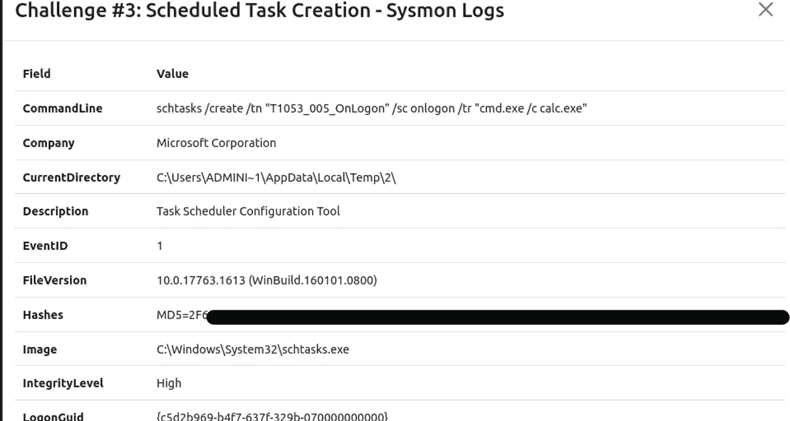
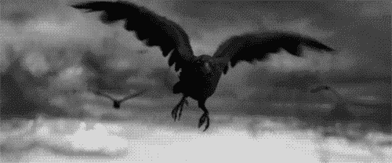

# 适马伐木工人莱尼学习新规则

> 原文：<https://infosecwriteups.com/tryhackme-aoc-2022-day-18-sigma-lumberjack-lenny-learns-new-rules-26d69c3432a6?source=collection_archive---------2----------------------->

免责声明:这篇文章的目的是在你执行这项任务受挫时帮助你。

记住在每次挑战中总是阅读 TryHackMe 提供的信息来练习、提高和学习，否则你只是在等待这个 CFT 的答案，这是在伤害你自己。

# 1:什么是挑战 1 标志？

我们要做的第一件事是编辑检测规则，以获得屏幕上显示的第一个标志并运行它。

一旦我们运行检测文件，它将返回初始标志。

flag # 1 = = > > THM { n0t _ just _ your _ u $ ser }

# 2:在挑战 1 日志中，创建了哪个用户帐户？

要获得第二个标志，我们只需单击“查看日志”按钮即可查看该日志中包含的信息。

挑战# 1 = = > > BanditYetiMini

# 3 什么是挑战 2 标志？

要找到第二个标志，我们必须设置屏幕上显示的检测规则并运行它。

如果一切都运行成功，结果我们将获得以下标志

flag # 2 = = > > THM { wh @ t _ 1s _ running 1 ng _ h3r 3 }

# 4 挑战 2 日志文件中的用户路径是什么？

要获得第二个问题的答案，只需单击查看日志按钮，查看日志中包含的信息。

挑战# 2 = = > > SIGMA _ AOC2022 \强盗雪人

# 5 什么是挑战 3 标志？

要找到第三个标志，我们必须设置屏幕上显示的检测规则并运行它。

如果一切都运行成功，结果我们将获得以下标志

flag # 3 = = > > THM { sch 3 dule _ 0 NPO 1 nt _ 101 }

# 6 与挑战#3 日志关联的 MD5 哈希是什么？

要获得 MD5，只需查看日志详细信息，就大功告成了。

挑战# 3 MD5 = = > > 2 F6 ce 97 fa F2 D5 EEA 919 e 4393 BDD 416 a 7

今天的帖子到此结束，希望对您有所帮助，不要忘记练习和提高您的技能，以更好地掌握安全和网络安全。

感谢您阅读和评论我的第六篇文章，如果这些内容对您有帮助，或者您知道有人可能会感兴趣，我将非常感谢您分享这些内容，以便任何对学习黑客、网络安全和我将在这个社区分享的更多内容感兴趣的人都可以看到这些内容。

## 来自 Infosec 的报道:Infosec 每天都有很多内容，很难跟上。[加入我们的每周简讯](https://weekly.infosecwriteups.com/)以 5 篇文章、4 条线索、3 个视频、2 个 GitHub Repos 和工具以及 1 个工作提醒的形式免费获取所有最新的 Infosec 趋势！