# TryHackMe:阿拉托斯

> 原文：<https://infosecwriteups.com/tryhackme-aratus-62751adaa9f6?source=collection_archive---------1----------------------->

## 游戏攻略

奥拉的乡亲们！！今天我们支持来自 TryHackMe 的阿拉托斯，它被评为中型机器。所以我们加油吧。


cover.png

# 首字母

我以前保存 IP 地址是为了更好的自动化:)

```
export IP=10.10.114.209
```

## 端口扫描

我们将从 rustscan(获取开放端口)开始

```
rustscan -a $IP --ulimit 5000
```

我们发现端口 21，22，80，139，143，443，445 是开放的。让我们得到更多的细节

```
nmap -sC -sV -p22,21,80,143,139,443,445 -oN nmap -pN $IP
```

扫描结果很长。

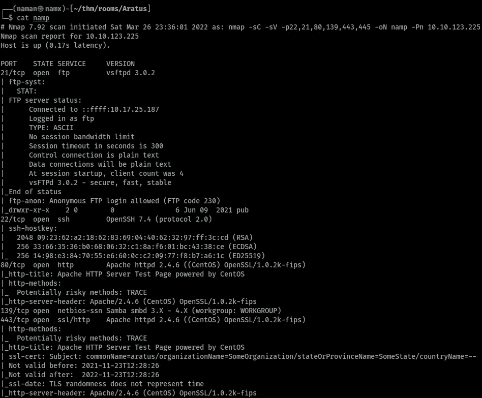

nmap1.png

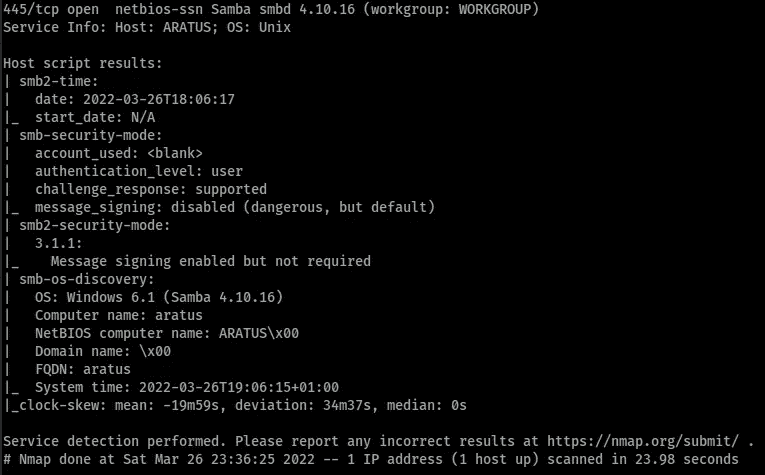

nmap2.png

# 列举

## 目录

对于目录枚举，我想使用 freroxbuster

```
feroxbuster -u [http://$IP](/$IP)/ -w /opt/medium.txt -o feroscan
```

但是一无所获。

## 文件传送协议

对于 FTP 枚举，我们发现允许**匿名**登录

```
ftp $IP 
```

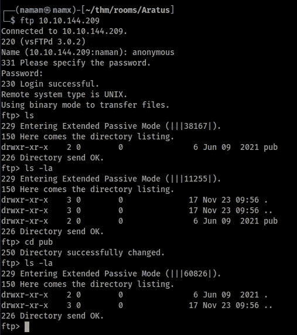

FTP.png

我们又一无所获。这只是一个兔子洞。

## 服务器信息块

现在是列举中小企业的时候了，首先我总是尝试手工操作

```
smbclient -L //$IP -N
```

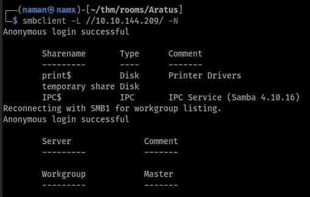

SMB_enum.png

检查临时**共享磁盘**

```
smbclient //$IP/"temporary share"
```

或者

```
smbclient //$IP/temporary\ share
```

这两个命令都有效。

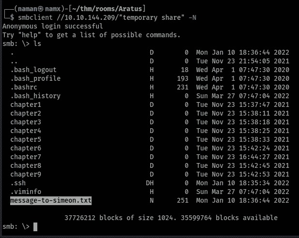

SMB_files.png

我找到了一个信息文件。我们去拿文件。

```
get message-to-simeon.txt
```

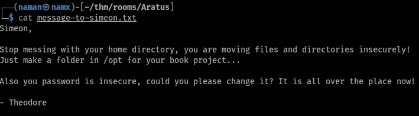

message-to-Simeon.txt.png

看完文件后，我发现:

*   他有一些博客或它托管的东西(我在怀疑)
*   他的密码在他的博客里。

## **HTTP**

当时忘了我们有 HTTP 运行太 XD 了。由于 feroxbuster 没有找到任何目录，我有点忽略了它。

让我们访问 HTTP web 服务器。所以 HTTP 和 HTTPS 正在运行。我猜两者看起来是一样的

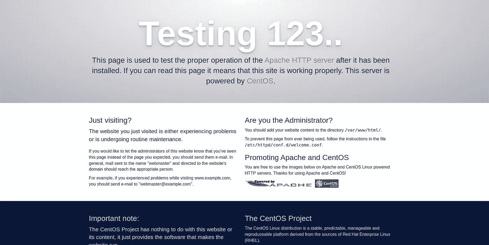

默认 _ 页面. png

出于好奇，我走访了一下，发现了这个:`http://10.10.114.209/simeon`

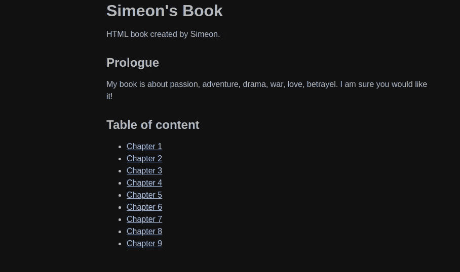

[http://](http://10.10.114.209/simeon)

## 嘘

因为我们知道他的密码在这篇文章的某个地方。我在网上搜索制作单词表，找到了一个命令

`cewl [http://10.10.114.209/simeon](http://10.10.114.209/simeon) > wordlist`

> 该命令将返回可用作密码的单词

现在我们已经得到了用户名和密码列表。我们在等什么 XD

```
hydra -l simeon -P wordlist ssh://$IP -v
```

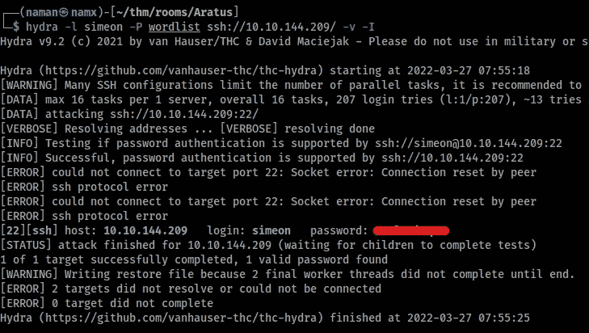

ssh_password_cracked.png

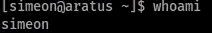

用户 Simeon.png

现在我最喜欢的部分，也就是

# **升级**

## 用户升级

用户 Simon 没有权限读取 **user.txt**

在枚举用户一段时间后，我找到了用户 **theodore** 的一个散列文件

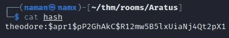

兔子 _ 洞 _ 哈希. png

破解了哈希，发现这是另一个兔子洞 XD

经过进一步的枚举，我发现有一个服务是由 root 运行的

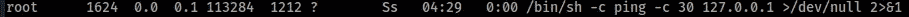

service.png

现在让我们通过 tcpdump 拦截流量(最有趣的部分是我刚刚在 TryHackMe 上了解到 tcpdump:[协议和服务器 2](https://tryhackme.com/room/protocolsandservers2) ):

```
tcpdump -i lo -A
```

我们发现了另一个哈希。

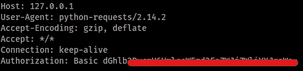

hash2.png

解码后，我们发现了用户 theodore 的另一个凭证

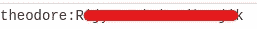

credentials.png

这奏效了。

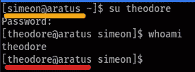

用户 changed.png

获得 shell 后，我运行的第一个命令是`sudo -l`

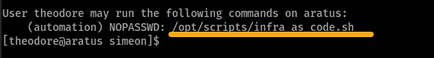

须岛一号

似乎用户**西奥多**可以像用户**自动化**一样运行一个脚本而无需密码。

让我们检查一下剧本

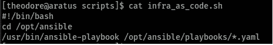

script.png

这个脚本正在运行另一个脚本，让我们检查一下另一个脚本，因为我们对此脚本没有写权限。

所以一些 YAML 文件被执行。在检查每个 YAML 文件时，我发现其中一个文件正在执行一些任务

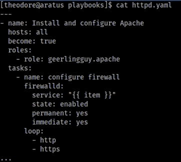

正在检查此任务文件夹:

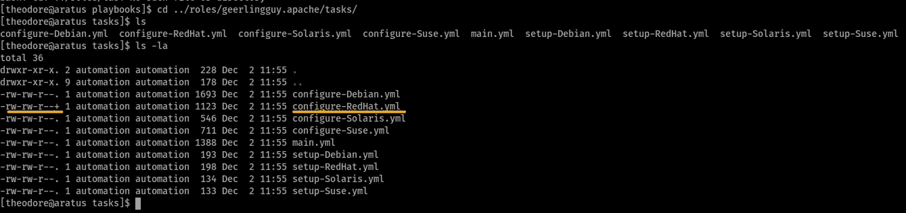

工作

在这里，我们终于找到了一个具有写权限的文件。

让我们创建反向 shell 负载

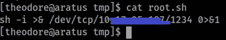

反向 shell.png

现在更改文件以触发有效负载:

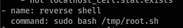

添加这个命令来触发我们的反向 shell 负载

## 根

运行脚本:

```
sudo -u automation /opt/script/infra_as_code.sh
```

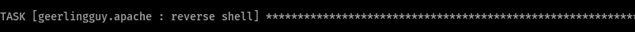

有效载荷触发


根壳

现在我们有了根壳&有了它，我们就有了阿拉托斯。在下一篇博客中与您见面(:

# 礼节

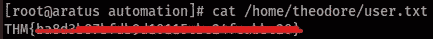

user.txt

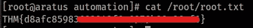

root.txt

|| [房间](https://tryhackme.com/room/aratus) | [推特](https://twitter com/namx05) ||