# TryHackMe- AttackerKB CTF 报道(详细)

> 原文：<https://infosecwriteups.com/tryhackme-attackerkb-ctf-writeup-detailed-aa72b1db87a0?source=collection_archive---------4----------------------->

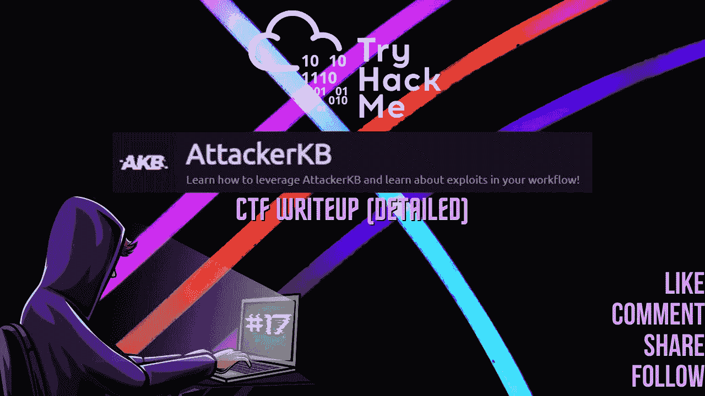

CTF 报道#17

欢迎各位！！
我们要在 [TryHackMe](https://medium.com/u/dc49a0a3cb16?source=post_page-----aa72b1db87a0--------------------------------) 上做 AttackerKB CTF，由 [DarkStar7471](https://twitter.com/darkstar7471) 创造。这个房间是有向导的，我的文章也是有向导的。我将与任务一起移动，并包括截图，所以任何人尝试这个房间可以完全得到确切的地方看看。我希望这篇文章能对你完成这个房间有所帮助。

 [## TryHackMe | AttackerKB

### TryHackMe 是一个学习和教授网络安全的在线平台，全部通过您的浏览器完成。

tryhackme.com](https://tryhackme.com/room/attackerkb) 

在桌面上为您的 CTF 计算机创建一个目录，并在 CTF 目录中为 Nmap 创建一个目录。

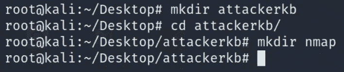

让我们开始吧！！享受流动吧！！

## 任务 1-我现在攻击什么？：

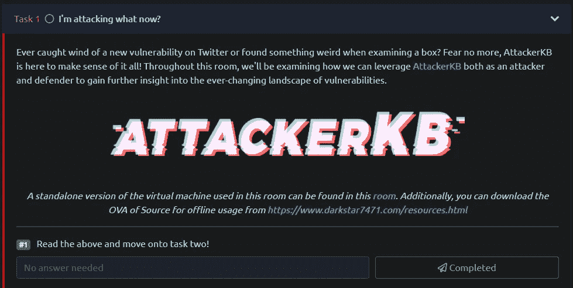

任务 1 列表

> #1.阅读以上内容，进入任务二！
> 答:不需要回答

## 任务 2-发现地形:

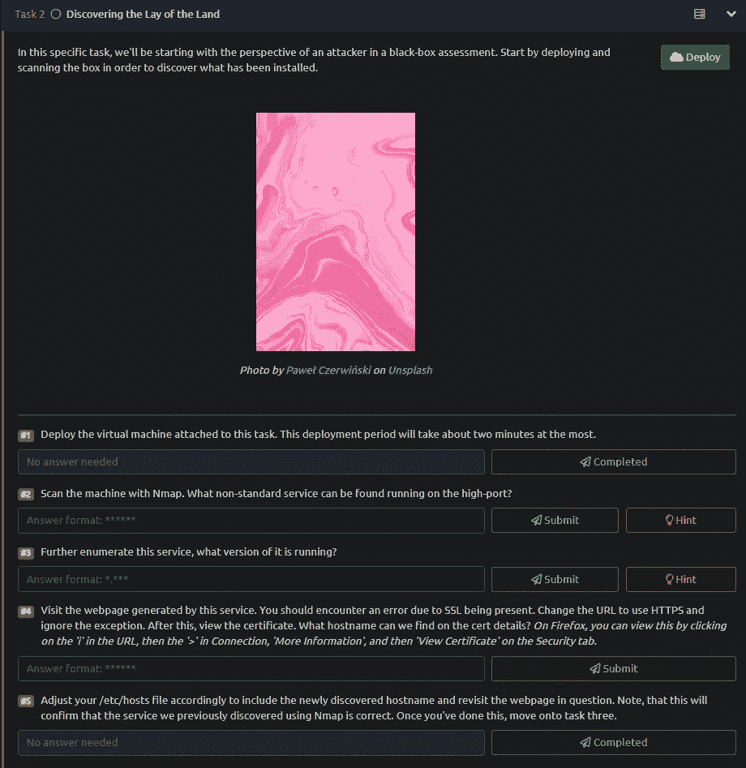

任务 2 列表

启动机器，我们出发。

> #1.部署附加到此任务的虚拟机。这一部署过程最多需要大约两分钟。答:不需要回答

## **Nmap 扫描:**

> *nmap-sC-sV-p--在 nmap/attacker kb<TARGET _ IP>*
> 
> -sC:默认脚本
> -sV:版本检测
> -oN:输出将存储在您之前创建的目录“nmap”中
> -p-:要扫描的所有端口

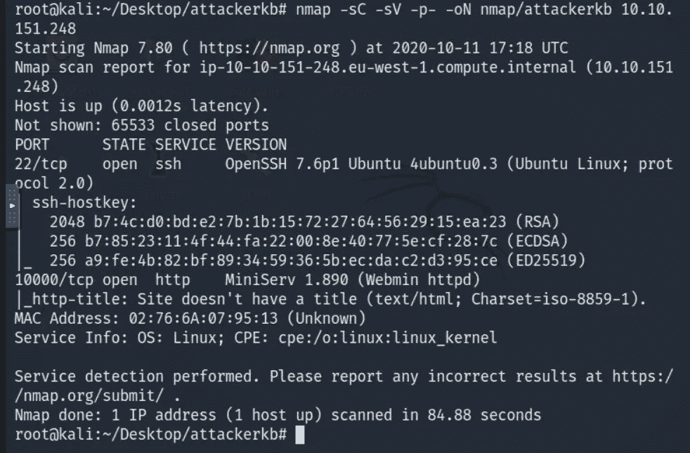

有 2 个端口打开:
22/ssh-OpenSSH 7.6p 1
10000/http-miniserver 1.890(Webmin httpd)

我们获得了接下来两项任务的答案。

> #2.用 Nmap 扫描机器。在高端口上运行什么非标准服务？
> Ans: Webmin
> 
> #3.进一步列举这个服务，它运行的是什么版本？
> 答案:1.890

我们将导航到端口 10000 上的服务器。

导航到 http:// <target_ip>:10000</target_ip>

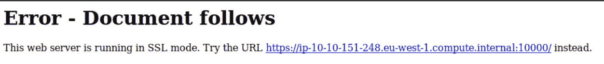

web 服务器在端口 10000(即 https)上以 SSL 模式运行。我们去看看。

导航到 https:// <target_ip>:10000</target_ip>

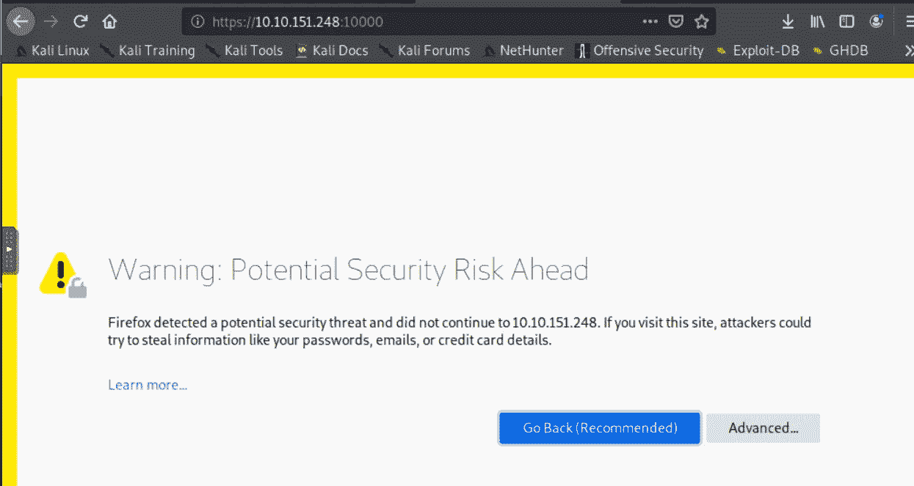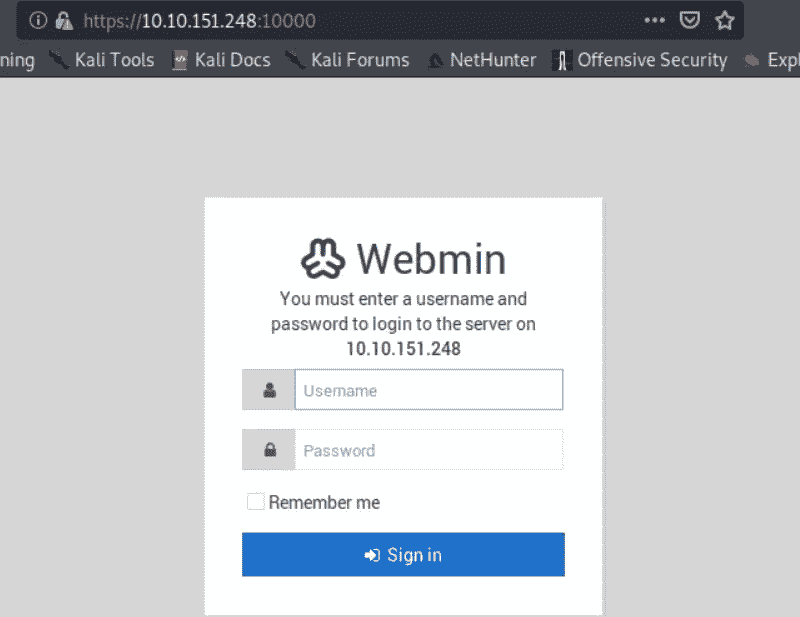

> 在 Firefox 上，您可以通过单击 URL 中的“I ”,然后单击连接中的“>”,“更多信息”,然后单击安全选项卡上的“查看证书”来查看。

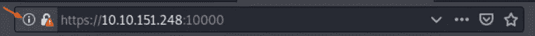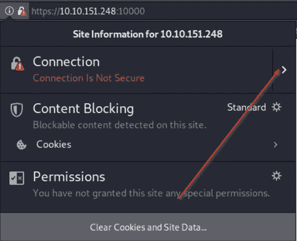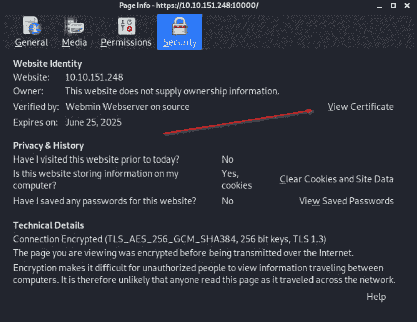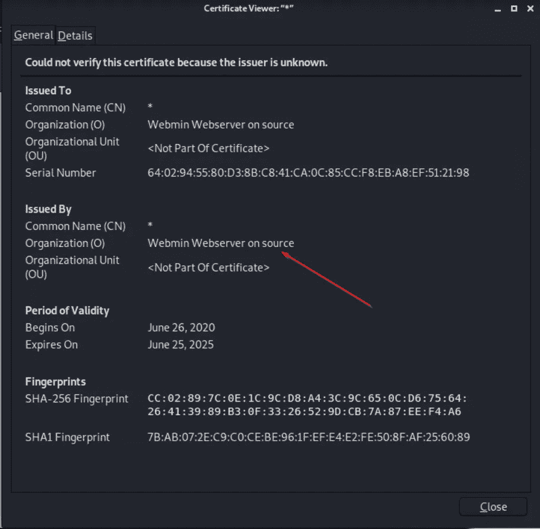

> #4.访问此服务生成的网页。由于 SSL 的存在，您应该会遇到一个错误。将 URL 更改为使用 HTTPS 并忽略异常。之后，查看证书。我们可以在证书详细信息中找到什么主机名？资料来源

很好很容易..我们继续吧。
我们需要将发现的主机包含在/etc/hosts 文件中，它会将 IP 地址映射到 URL。

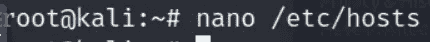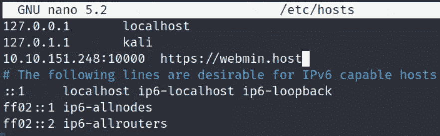

以防万一，导航到主机，检查它是否工作。

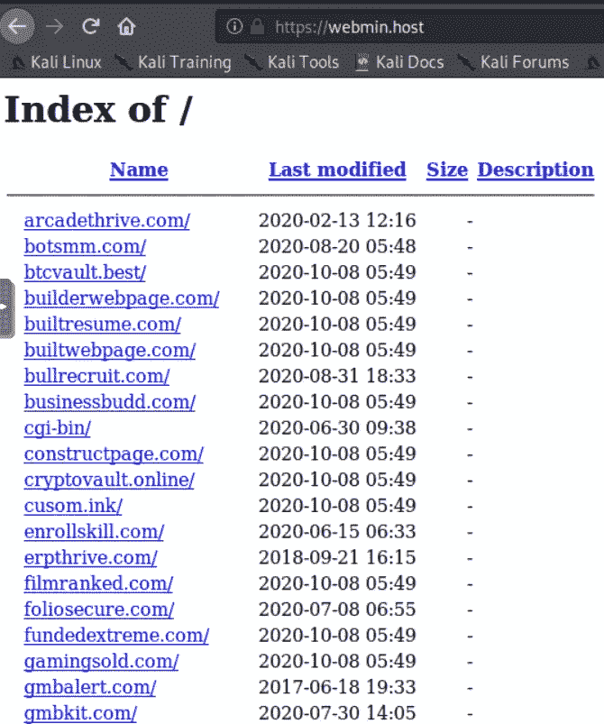

的确如此。

> #5.相应地调整/etc/hosts 文件，以包含新发现的主机名，并重新访问有问题的网页。请注意，这将确认我们之前使用 Nmap 发现的服务是正确的。一旦你完成了这个，进入任务三。答:不需要回答

太棒了。让我们跳到任务 3。

## 任务 3-学习飞行:

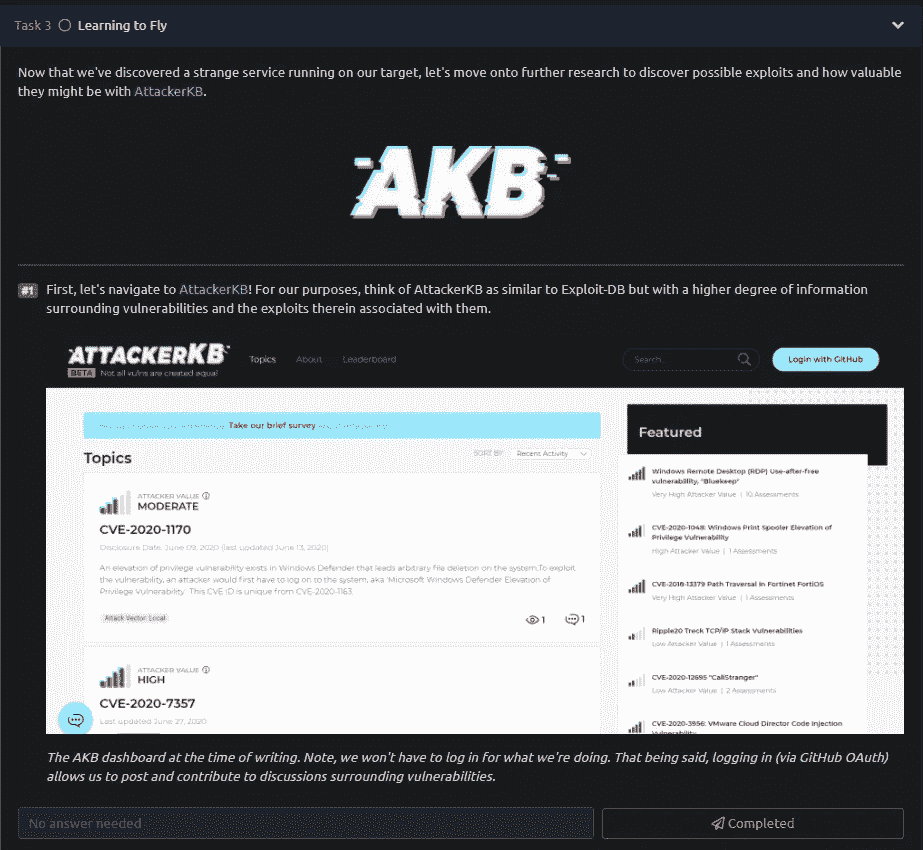

任务 3 列表

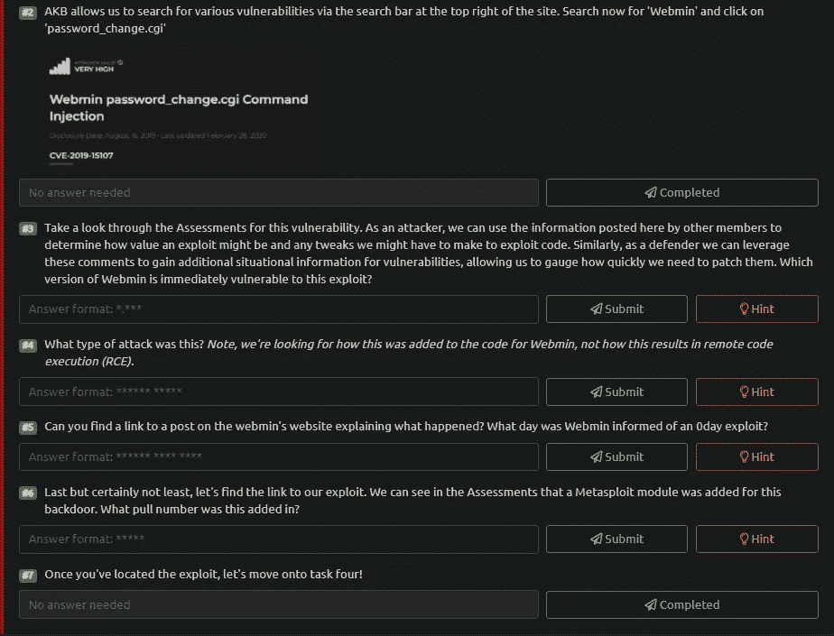

任务 3 列表

> #1.首先，让我们导航到 [AttackerKB](https://attackerkb.com/?referrer=thm) ！出于我们的目的，可以将 AttackerKB 视为类似于 Exploit-DB，但它包含了更多关于漏洞和漏洞利用的信息。
> 答:不需要回答。

单击任务 1 中的超链接或下面的链接，将您重定向到 attackerkb.com 网站。Attackerkb 分别在寻找漏洞和漏洞利用方面类似于 exploit-db。

在搜索栏中插入 webmin。

 [## 主题| AttackerKB

### 并非所有的人生来平等。

attackerkb.com](https://attackerkb.com/) 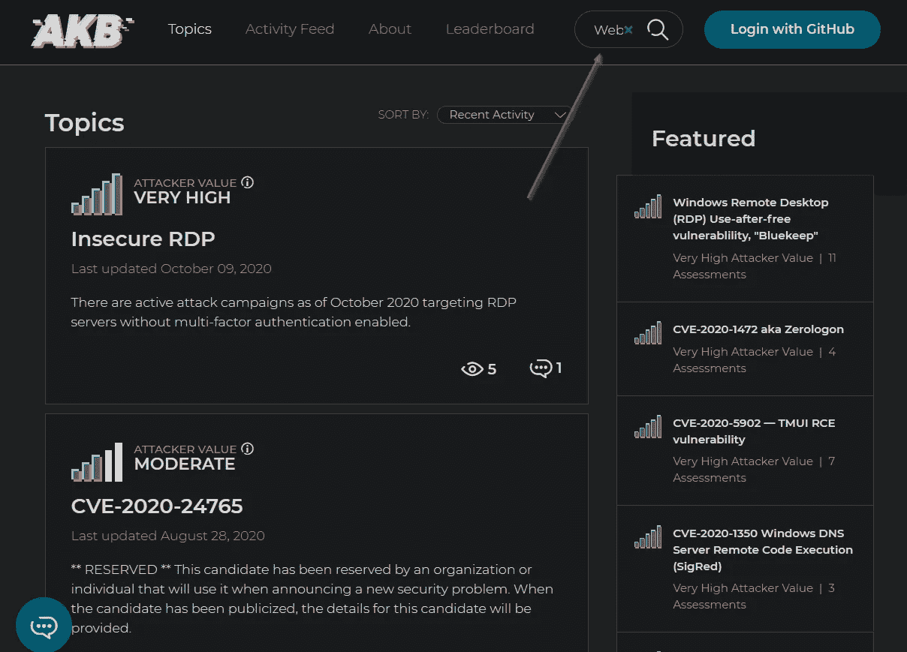

我们可以看到有一个评级很高的 Webmin 密码漏洞，这意味着它很有可能起作用。

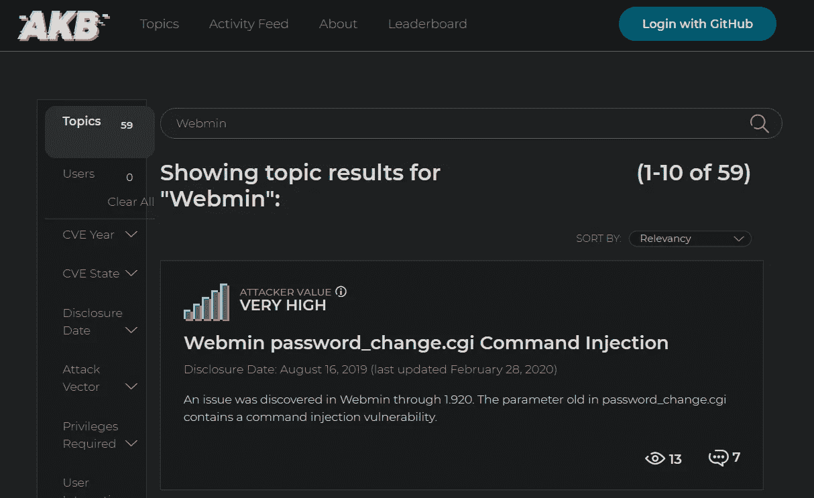

> #2.AKB 允许我们通过网站右上角的搜索栏搜索各种漏洞。现在搜索“Webmin”并点击“password _ change . CGI”
> 答:无需回答

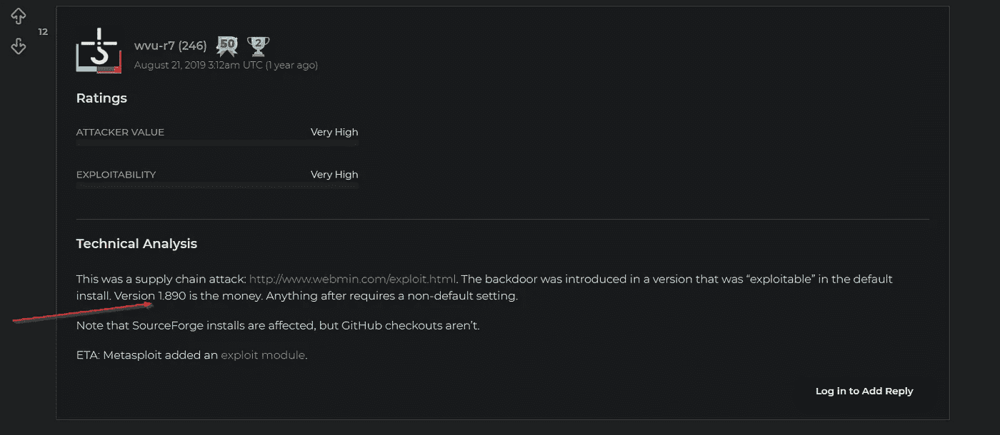

虽然漏洞是通过 Webmin 1.920 版发现的，但在上面的分析中，我们可以清楚地看到“1.890 版就是金钱”，这意味着 Webmin 1.890 版最有可能被成功利用。

> #3.查看针对此漏洞的评估。作为一名攻击者，我们可以使用其他成员在这里发布的信息来确定漏洞利用的价值以及我们可能需要对漏洞利用代码进行的任何调整。同样，作为一名防御人员，我们可以利用这些评论来获得漏洞的额外情况信息，使我们能够衡量我们需要多快修补它们。哪个版本的 Webmin 最容易受到这种攻击？
> 俺们。1.890

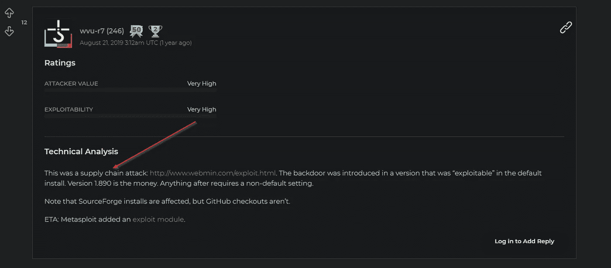

> #4.这是什么类型的攻击？请注意，我们正在寻找这是如何添加到 Webmin 的代码，而不是如何导致远程代码执行(RCE)。
> 答:供应链

对于下一个任务，我们需要导航到 webmin.com，找到漏洞被报告的确切日期。让我们找到那个日期。如果出现以下情况，请跟随截图

导航到 https://webmin.com

 [## Webmin

### Webmin 是用于 Unix 系统管理的基于 web 的界面。使用任何现代网络浏览器，您可以设置用户…

www.webmin.com](https://www.webmin.com/) 

Webmin-主页

点击“安全警报”

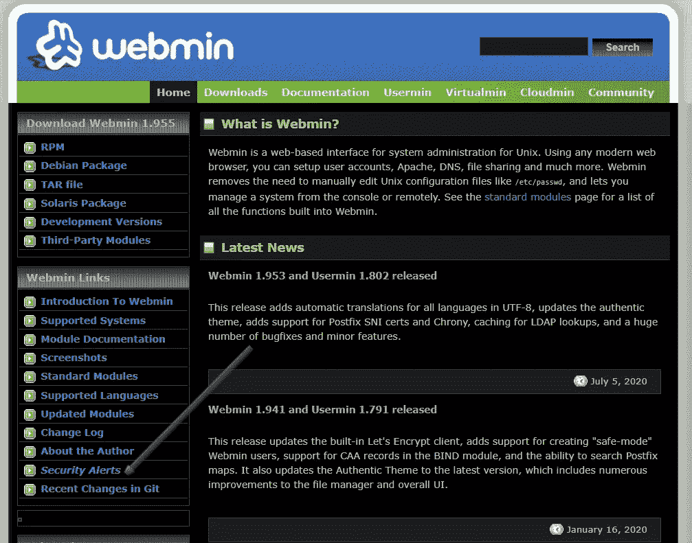

点击“发生了什么”

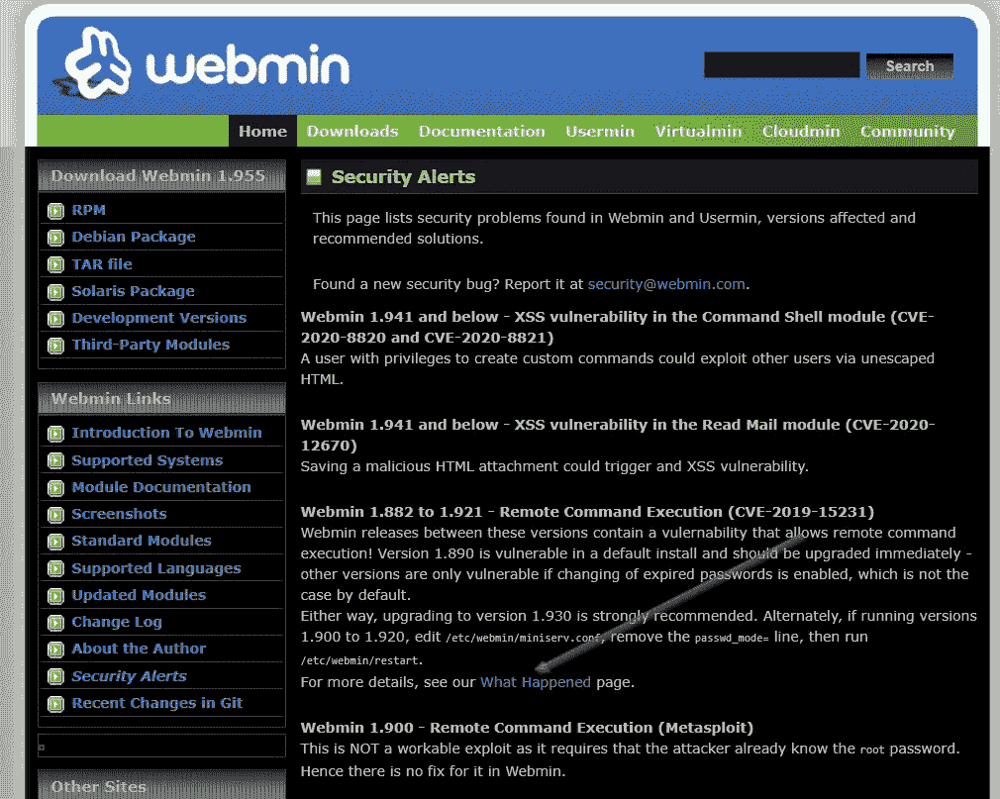

安全警报页面

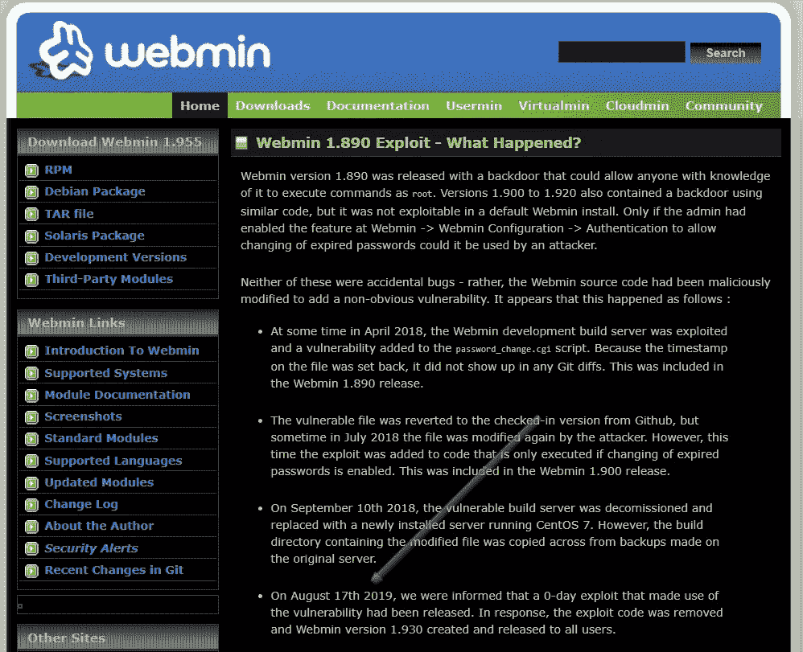

这就是我们的日期。该团队于 2019 年 8 月 17 日被告知 0 天漏洞。提交答案。

> #5.你能在 webmin 的网站上找到一个解释事情经过的链接吗？Webmin 是哪一天得知 0day 漏洞的？
> 答案:2019 年 8 月 17 日

太好了！！
在技术分析下的上下文中，我们将找到 Metasploit 漏洞利用模块的链接。

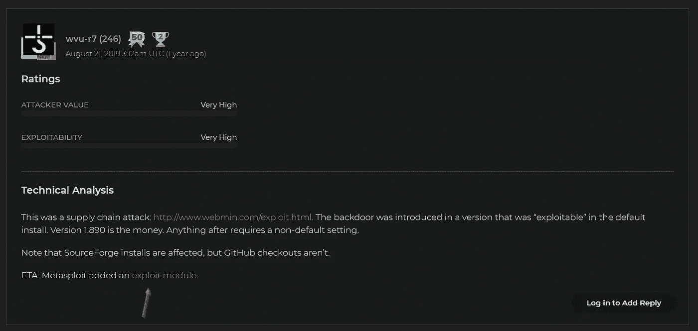 [## 添加 Webmin password_change.cgi 后门利用 wvu-r7 拉请求#12219 …

### 背景请阅读 http://www.webmin.com/exploit.html 的全部内容。

github.com](https://github.com/rapid7/metasploit-framework/pull/12219) 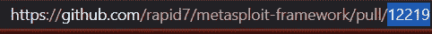

> #6.最后但肯定不是最不重要的，让我们找到我们的利用链接。我们可以在评估中看到，为此后门添加了一个 Metasploit 模块。这是加在什么拉动数字上的？
> Ans: 12219

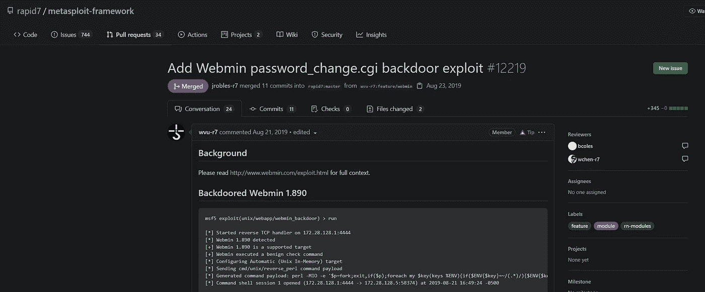

> #7.一旦您找到了漏洞，让我们进入任务四！
> 答:不需要回答。

在这个房间里玩得很开心。继续前进…

## 任务 4-爆破:

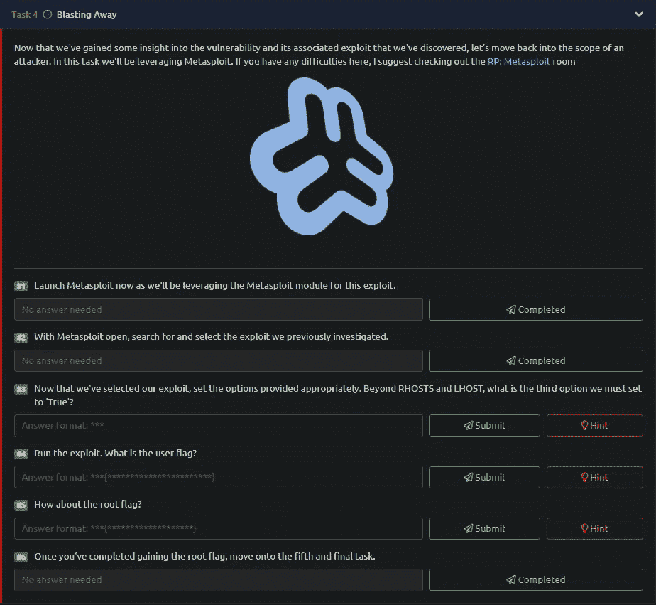

任务 4 列表

现在我们已经发现了一个漏洞，我们需要运行它来进入系统。

启动 msfconsole。

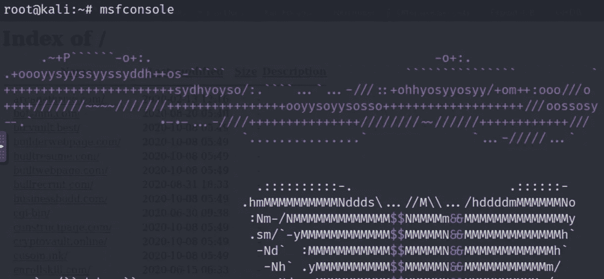

> #1.现在启动 Metasploit，因为我们将利用 Metasploit 模块来利用此漏洞。
> 答:不需要回答

已启动。搜索 Webmin 或后门 WebMin 1.890。

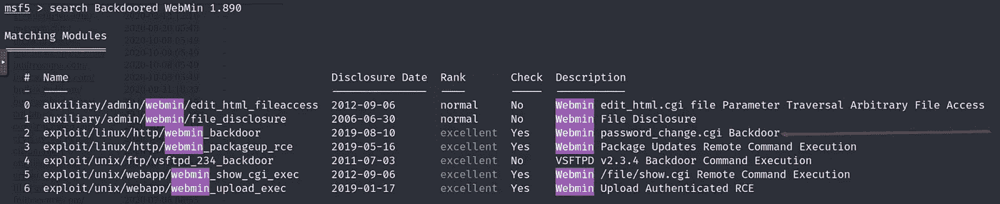

我们对#2 感兴趣，因为该描述与我们之前获得的漏洞匹配。

> #2.打开 Metasploit，搜索并选择我们之前研究过的漏洞。
> 答:不需要回答

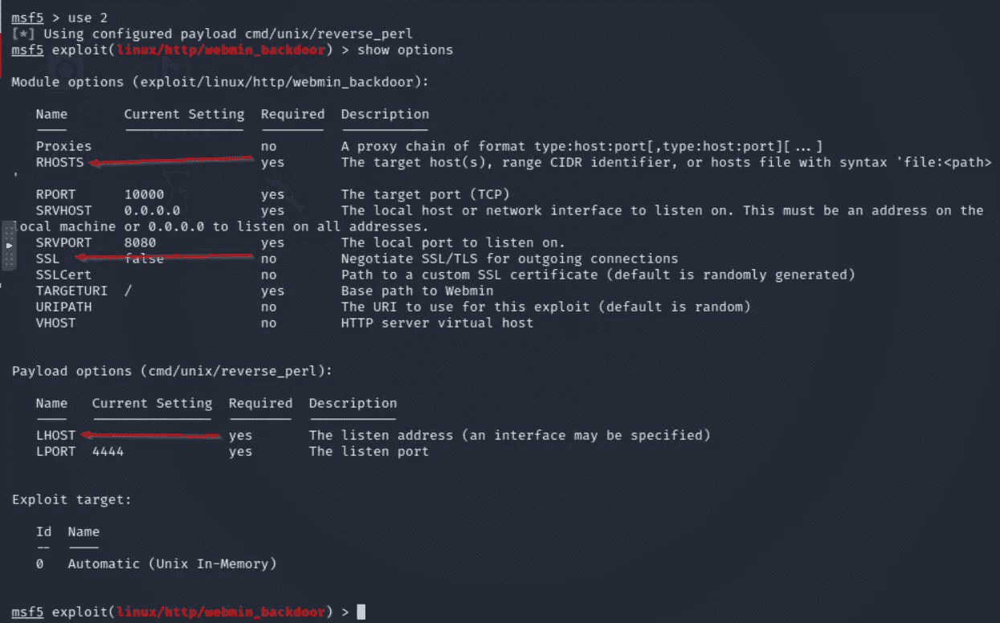

回想一下，web 服务器在端口 10000 上以 SSL 模式运行。因此，在运行漏洞利用之前，我们必须设置为“真”的第三个选项是 SSL。

> #3.现在我们已经选择了我们的漏洞，适当地设置提供的选项。除了 RHOSTS 和 LHOST，我们必须设置为“True”的第三个选项是什么？
> Ans: SSL

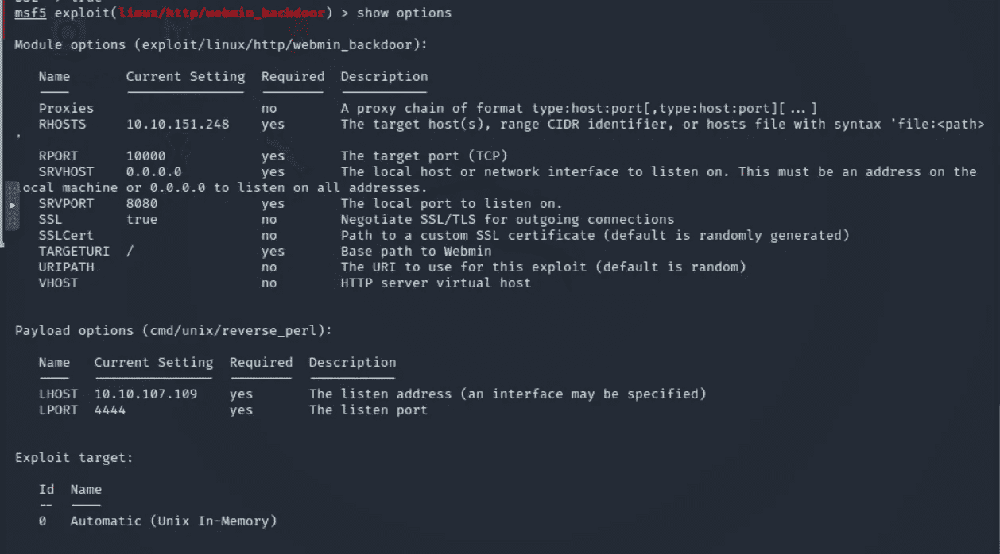

看起来非常好。
我们将运行漏洞利用。手指交叉。

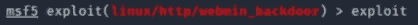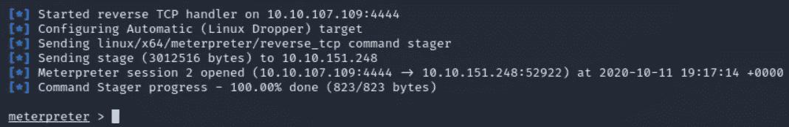

提示 shell 并捕获用户标志。

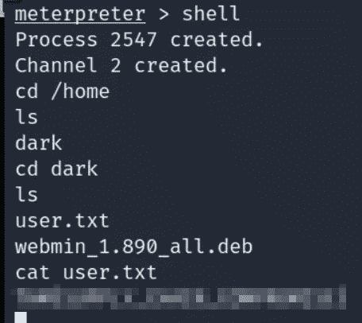

太棒了！

> #4.运行漏洞。什么是用户标志？
> 答:xxxxxxxxxxxxxxxxxxxxx

我们可以通过下面的命令来稳定外壳。尽管我总是检查“whoami”或“id”来查看我们是以哪个用户的身份运行的。不知怎么的，我忘记做那件事了。但是因为我输入了稳定外壳的命令，所以我或我们可以确认我们是机器的根，我们必须简单地捕获根标志。

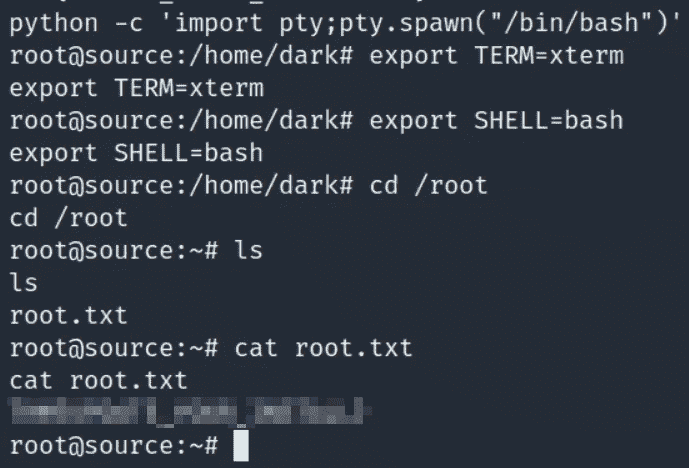

瞧啊。！我们已经成功地找到并捕获了所有的旗帜。

> #5.根旗怎么样？
> 答:xxxxxxxxxxxxxxxxxxxxx
> 
> #6.一旦你完成了获得根旗，进入第五个也是最后一个任务。答:不需要回答

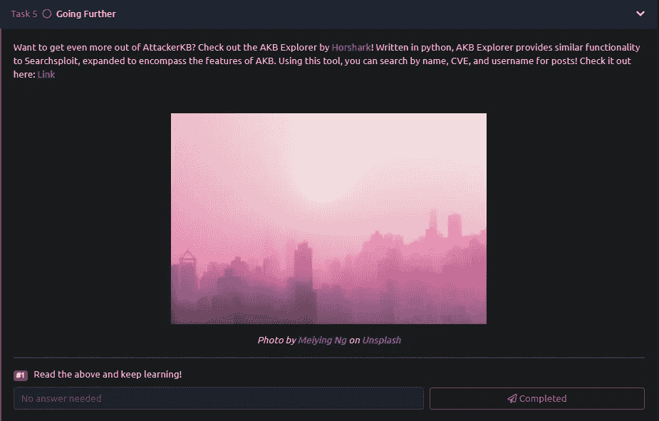 [## horshark/akb-explorer

### 搜索 AttackerKB 的命令行工具。没有太多要做的，你只需要克隆回购和安装所需的…

github.com](https://github.com/horshark/akb-explorer) 

> #1.看完以上，继续学习！答:不需要回答

太棒了。！完成了房间！！是不是很有趣？当然了。

如果你喜欢这篇文章，并且这篇文章对你有所帮助，请在评论中告诉我，或者用掌声分享你的爱。

谢谢你抽出时间。

跟着我。

更多的报道正在进行中。

保重，注意安全，继续黑！

哈桑·谢赫