# TryHackMe-复仇者博客 CTF 写道(详细)

> 原文：<https://infosecwriteups.com/tryhackme-avengers-blog-ctf-writeup-detailed-956c72efc0dc?source=collection_archive---------6----------------------->

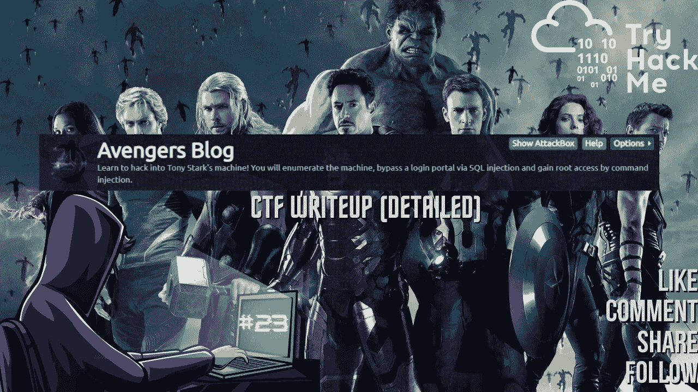

CTF 报道#23

欢迎各位！！我们将在 [TryHackMe](https://medium.com/u/dc49a0a3cb16?source=post_page-----956c72efc0dc--------------------------------) 做复仇者联盟博客 CTF。

CTF 链接:

 [## 网络安全培训

### TryHackMe 是一个学习网络安全的在线平台，使用动手练习和实验室！

tryhackme.com](https://tryhackme.com/room/avengers) 

CTF 由以下作者创作:

 [## 试用版|试用版

### TryHackMe 是一个学习网络安全的在线平台，使用动手练习和实验室！

tryhackme.com](https://tryhackme.com/p/tryhackme) 

让我们开始吧！！享受流动吧！！

## 任务 1-部署:

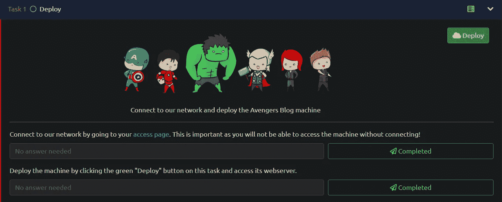

我完成的这个 CTF 和所有 CTF 都是在 Attackbox 上完成的，attack box 是一个基于浏览器的攻击机器，可供 TryHackMe 的订户使用。因此我将旋转它。

> 点击“攻击框”。

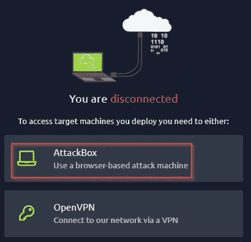

> 点击“我的机器”。

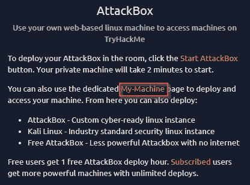

> 选择机器“Kali Linux”并点击“启动机器”。

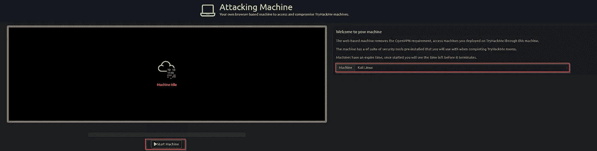

> 过一会儿…

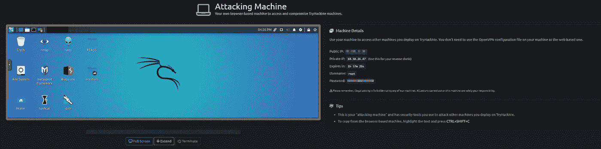

我们准备出发了。现在机器已经启动，我们将提交答案。

> 进入您的[访问页面](https://tryhackme.com/access)，连接到我们的网络。这一点很重要，因为不连接就无法访问机器！
> 答:不需要回答。

部署机器。

> 通过单击此任务上的绿色“部署”按钮来部署机器，并访问其 web 服务器。答:不需要回答。

为您的 CTF 计算机创建一个目录，并为 Nmap 创建一个目录来存储您的 Nmap 扫描输出。

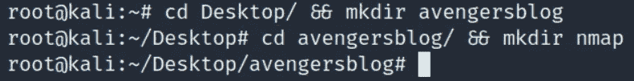

继续任务 2。

## 任务 2-cookie:

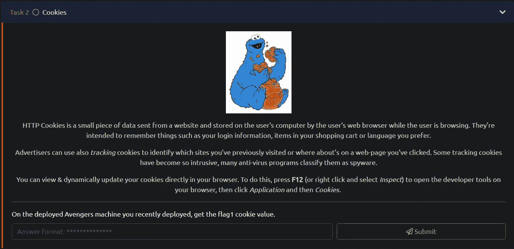

> 导航到 http://<target_ip></target_ip>

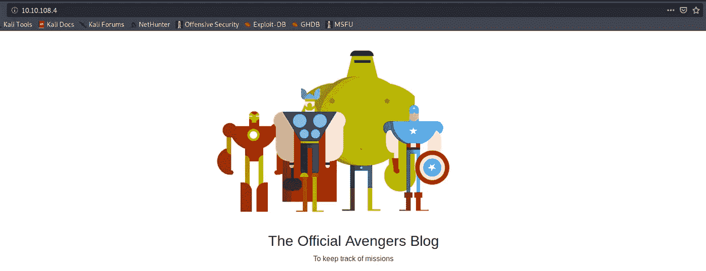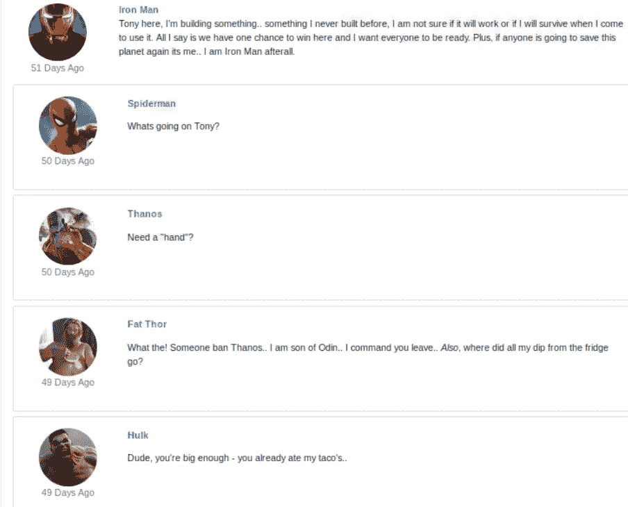

该页面包含复仇者联盟和灭霸之间的评论。Rocket 的评论对我们非常有用，因为它为我们提供了用户“groot”的旧密码“iamgroot”。我们不知道使用我们发现的凭证可以访问哪个服务。不管怎样，我们会把它们作为以后任务的参考。也许我们需要它们。
到目前为止还不错！！

右键单击页面，然后单击“检查元素”。
接下来单击“存储”选项卡，在下面我们将分别找到 cookies 及其值。

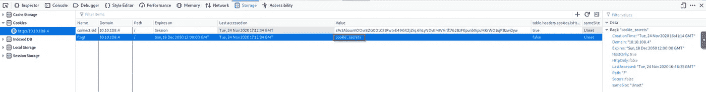

任务中的第一个标志和问题的答案就在那里。我们提交吧。

> 在您最近部署的复仇者机器上，获取 flag1 cookie 值。
> 答:cookie_secrets

太棒了！！继续前进…

## 任务 3- HTTP 头:

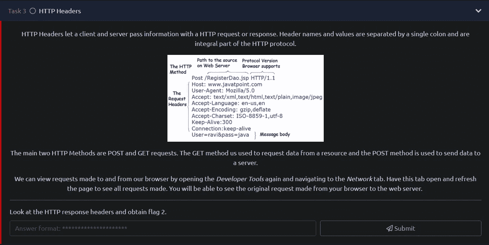

再次右键单击页面并单击“Inspect element”
然后单击“Network”选项卡，我们将能够看到来回发送的请求。
按“F5”刷新页面。
选择类型为“html”的第一个请求，我们将在右侧看到标题。
在“Headers”选项卡下，我们可以看到“Response headers ”,在标题内，我们会看到 flag2。

我们已经获得了 flag2，因此我们将提交它并继续下一个任务。

> 查看 HTTP 响应头并获取标志 2。
> 答:标题很重要

## 任务 4-枚举和 FTP:

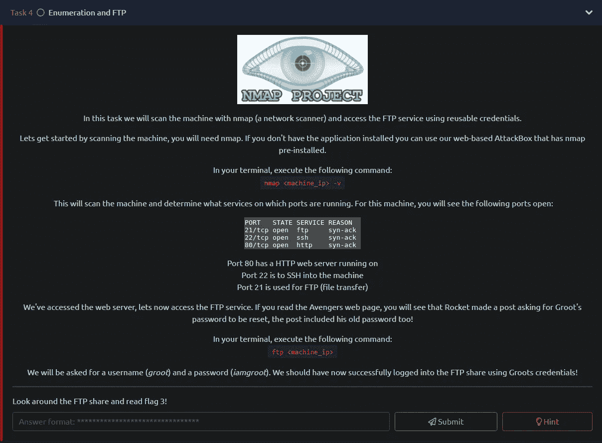

## Nmap 扫描:

> *nmap-sC-sV-p--oN nmap/Avengers blog _ all ports<TARGET _ IP>*
> 
> -sC:默认脚本
> -sV:版本检测
> -oN:输出将存储在您之前创建的目录‘nmap’中
> -p-:扫描所有端口

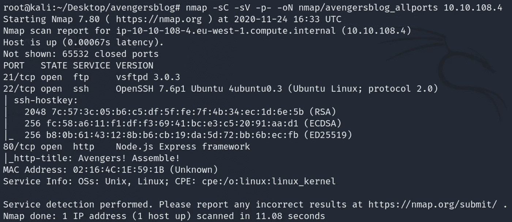

有 3 个端口打开:
21/FTP-vsftpd 3 . 0 . 3
22/ssh-OpenSSH 7.6 P1
80/http-node . js Express framework
检测到 OS-Ubuntu Linux

根据任务描述中提供的说明，我们可以回忆起之前我保留了凭据以供参考。我们被提供凭证“groot:iamgroot”可以被用来登录在端口 21 上运行的 FTP 服务。我们现在可以这么做。

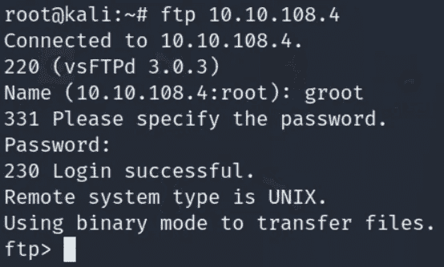

太棒了。！我们将在 ftp 中找到文件，如果找到任何文件，我们将使用“get”命令将它们传输到我们的主机上。

始终使用' ls -la '命令是非常重要的，这样我们在退出 FTP 之前不会错过任何隐藏的文件。

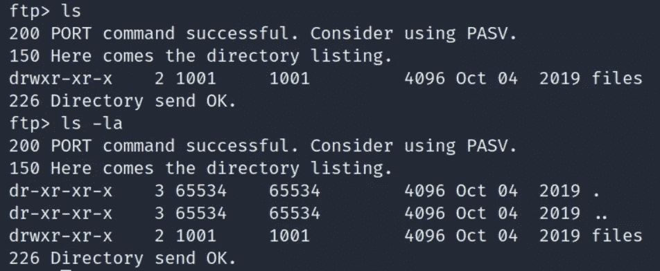

有一个“文件”目录。我们将导航到它。

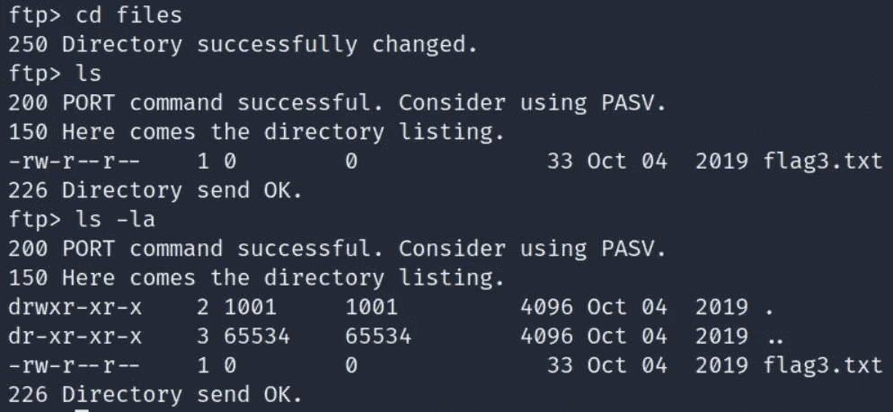

很好很容易！！我们已经找到了“flag3.txt”文件。
传输并退出 FTP。

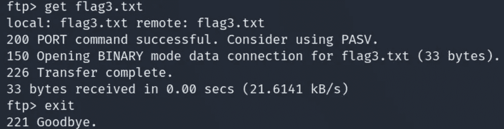

让我们看看“flag3.txt”的内容。

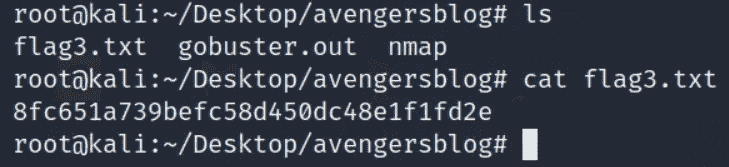

太棒了！！提交吧。

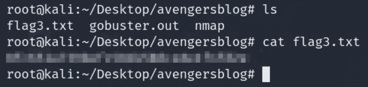

> 环顾 FTP 共享和阅读标志 3！
> Ans:xxxxxxxxxxxxxxxxxxxxxxxxxxxxxxxxxxxxxxxxxx

## 任务 5- Gobuster:

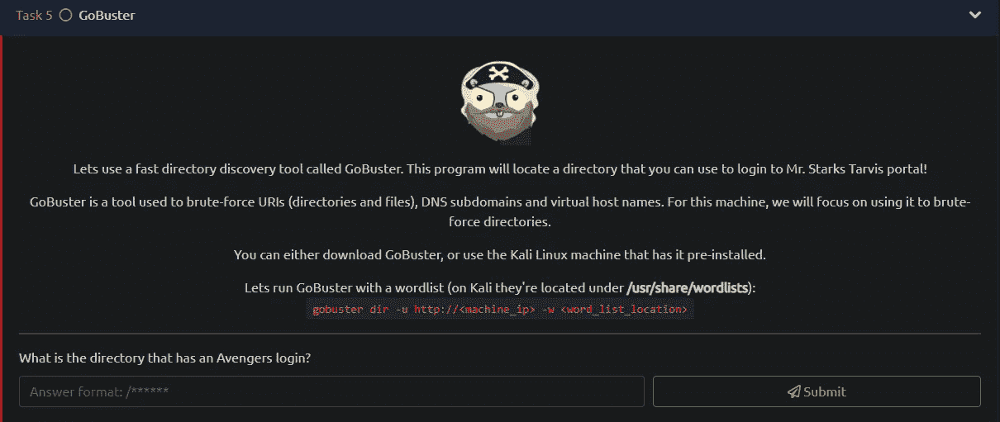

## Gobuster:

> *gobuster dir-u http://<TARGET _ IP>-w<PATH _ TO _ word list>-o<OUTPUT _ FILE _ NAME>-x<EXTENSIONS>*
> 
> -u:URL
> -w:word list
> -q:quiet，静默扫描。将隐藏横幅
> -o:输出将存储在目录
> -x:搜索扩展名，如 html、txt、php、phtml 等

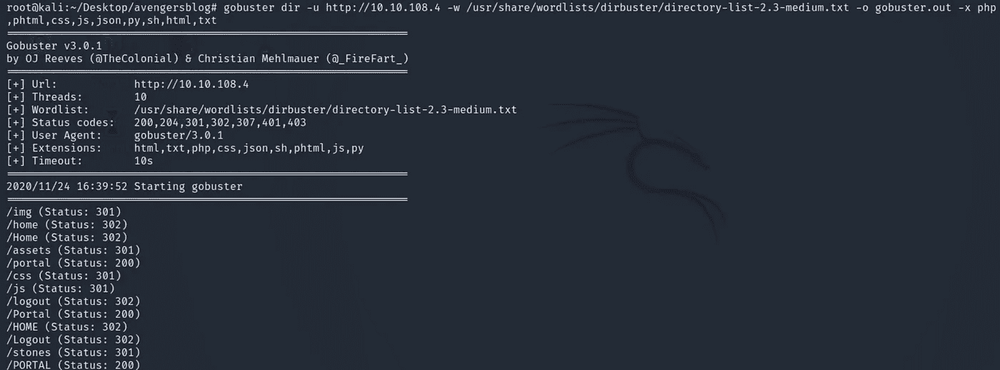

我们已经发现了一堆目录，因此我们将研究它们。目标是找到复仇者联盟博客的登录页面。特别是“/portal”听起来像登录页面。我们将导航到它。

> 导航到 http:// <target_ip>/portal</target_ip>

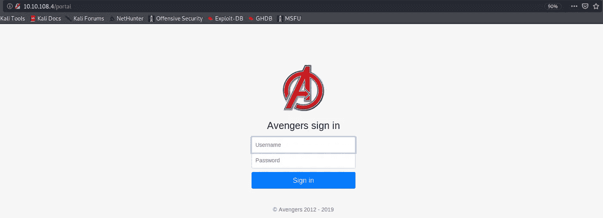

事实上，这是一个登录页面。我们可以提交任务中问题的答案。

> 复仇者登录的目录是什么？
> 回答:/门户

## 任务 6- SQL 注入:

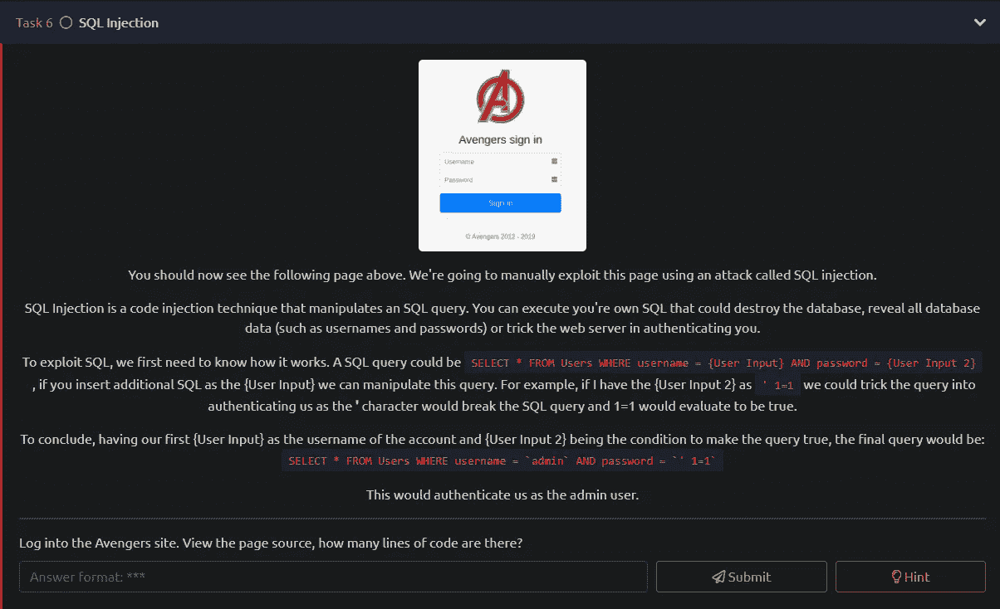

该页面易受 SQLi 攻击。我们可以输入凭证，这些凭证可以操纵和欺骗查询来验证我们的身份。因为我们还不知道用户名和密码，所以我们必须破解 SQL 查询，让 SQL 数据库相信我们是真实的。

为此，我们将使用' or 1 = 1--作为用户名和密码。它将允许我们绕过登录页面。

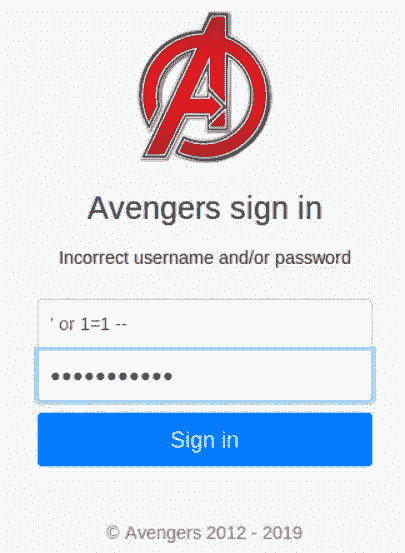

单击“登录”，我们将被重定向到“主页”

> 已重定向至 http:// <target_ip>/home</target_ip>

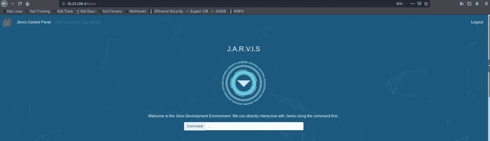

我们需要提交源代码中的总行数。因此我们将检查源代码[Ctrl+U]。向下滚动到底部，找到代码的最后一行。

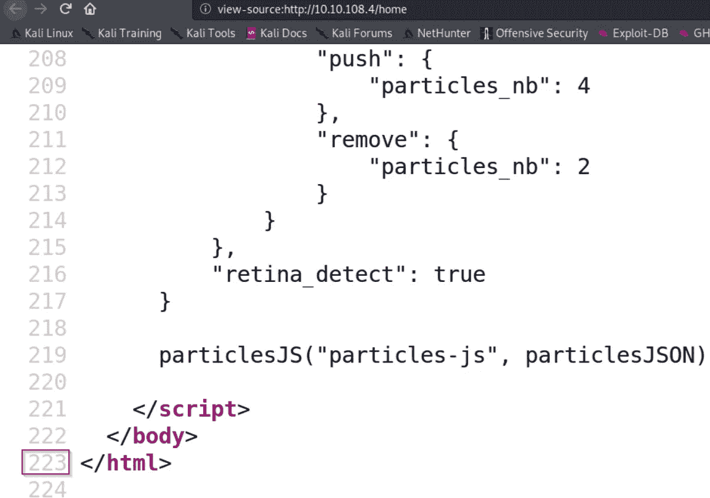

源代码包含 223 行。我们可以提交。

> 登录复仇者联盟网站。查看页面源码，有多少行代码？
> Ans: 223

太棒了。！继续下一个任务…

## 任务 7-远程代码执行和 Linux:

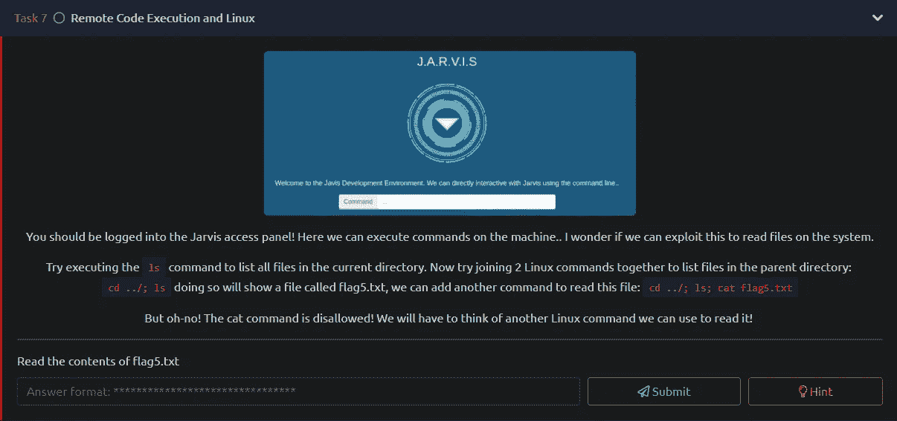

我们将在 web shell 中进行命令注入。我们可以使用不同的命令来抓取' flag5.txt '文件。

在 Linux 文件系统中，检查或查看文件内容有多个命令，例如“cat”、“strings”和“less”。我们将逐一尝试读取“flag5.txt”

按照任务描述中提供的说明，该标志位于父目录中，因此是 cd../'将起作用。我们可以用“；”连接两个或更多的命令。

因此我们可以使用 cd../ ;'列出父目录中的文件。

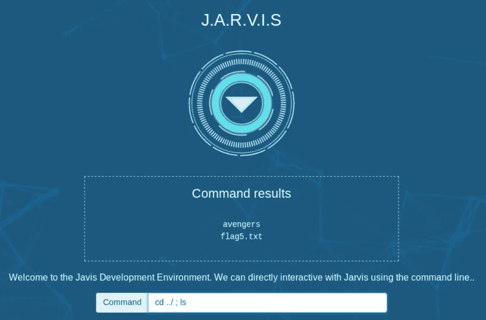

事实上‘flag 5 . txt’在父目录中。现在我们需要阅读它。

从“cat”命令开始。

> 激光唱片../ ;ls；cat flag5.txt

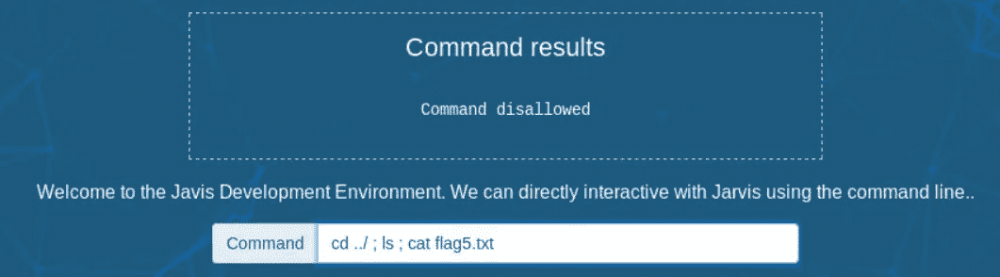

不允许使用命令“cat”。

> 激光唱片../ ;ls；字符串 flag5.txt

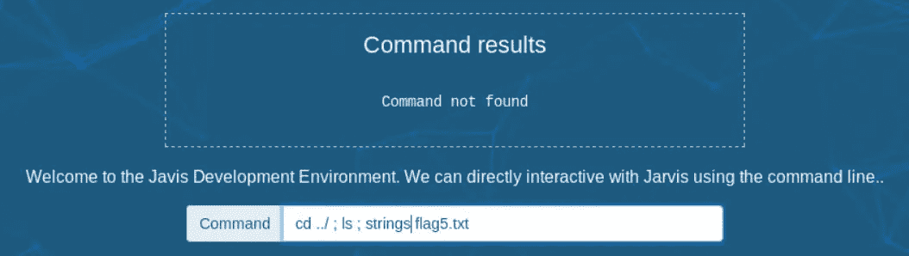

找不到命令“字符串”。

> 激光唱片../ ;ls；less flag5.txt

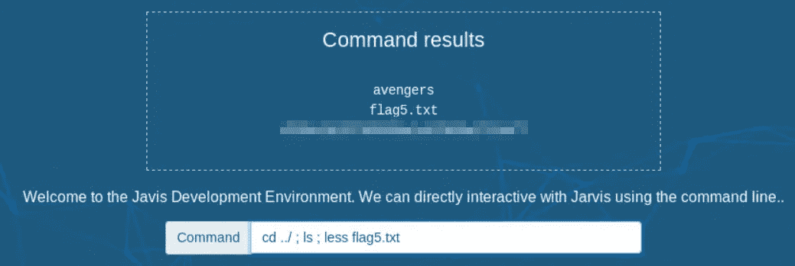

瞧啊。！它起作用了。我们已经成功获得了 flag5。
提交它，给这个盒子一个美好的结局。

> 读取 flag5.txt
> 的内容 Ans:xxxxxxxxxxxxxxxxxxxxxxxxxxxxxxxxxx

我们已经完成了房间。我真的很喜欢这个房间，并从中获得了很多乐趣。我会建议每个人都尝试一下这个房间，我相信你会学到一些新的东西。

如果你喜欢这篇文章，并且这篇文章对你有所帮助，请在评论中告诉我，或者用掌声分享你的爱。

谢谢你抽出时间。

跟着我。

更多的报道正在进行中。

保重，注意安全，继续黑！

**-哈桑·谢赫**