# TryHackMe —坏字节演练

> 原文：<https://infosecwriteups.com/tryhackme-badbyte-walkthrough-6ed68d2d0116?source=collection_archive---------0----------------------->

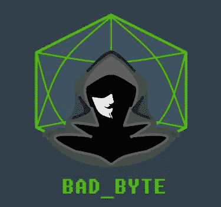

badbyte(【https://tryhackme.com/room/badbyte】T2)涵盖了渗透测试的许多重要方面，如枚举的重要性、哈希破解、端口转发、web 利用和权限提升。首先启动你的笔测试机，通过 OpenVPN 连接到 TryHackMe 网络。然后部署给定的机器。

## 侦察

您必须使用 nmap 执行传统的端口扫描。通过下面的 nmap 扫描，您可以获得所有 4 个问题的答案。

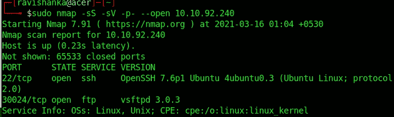

1.  开放了多少个端口？

您可以清楚地看到有两个端口是打开的。

2.最低开放端口上运行的是什么服务？

最低端口是 22。所以，在那里运行的服务是 SSH。

3.有哪些非标准端口是开放的？

我们唯一能找到的非标准端口是 30024。

4.非标准端口上正在运行什么服务？

FTP 正在该端口而不是端口 21 上运行。

## 据点

因此，您知道机器上运行着 FTP 和 SSH 服务。让我们尝试以匿名用户的身份登录 FTP。

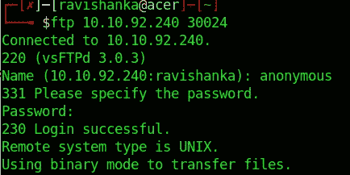

我们可以以匿名用户的身份登录 FTP，无需指定密码。环顾四周，我们可以看到有两个名为 id_rsa 和 note.txt 的文件。

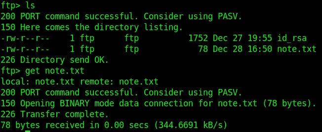

下载 note.txt

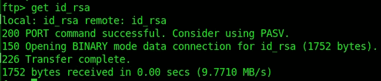

下载 id_rsa

1.  在枚举过程中我们会找到什么用户名？

在查看 note.txt 时，我们可以发现用户名为“errorcauser”。

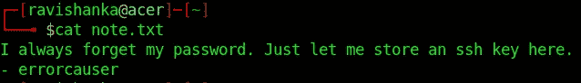

2.RSA 私钥的密码是什么？

我们发现我们下载的 id_rsa 文件是一个 SSH 私有密钥。为了在 SSH 中使用它，我们需要一个密码短语。所以，首先我们需要使用 ssh2john 将这个密钥转换成一个 hash。

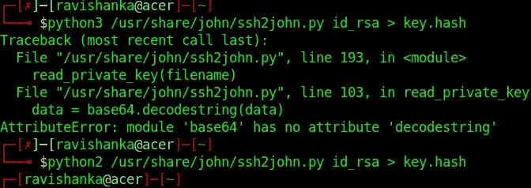

如您所见，python3 对我不起作用。然而 python2 做到了。现在，我们有了 ssh 密钥的散列。所以，我们可以用 JohnTheRipper 破解它。

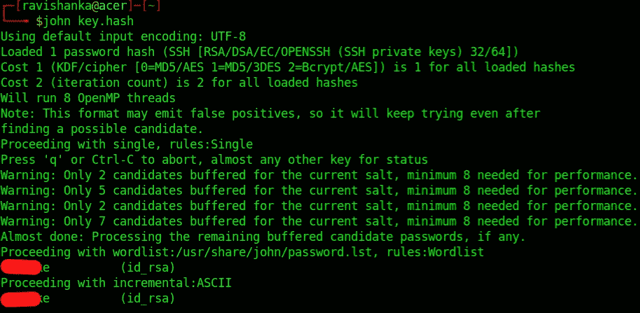

我们可以用约翰的默认单词表破解密码短语。

## 端口转发

因为我们有了密码短语，所以我们可以使用它登录 ssh。我们必须设置动态端口转发。然而，当我们尝试登录时，出现了如下错误。

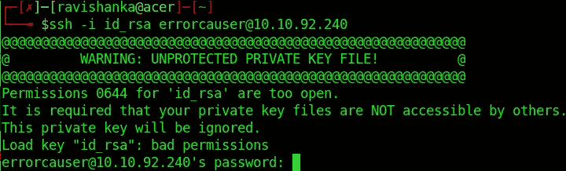

权限错误

错误是由于文件权限造成的。所以，我们必须如下更改 id_rsa 文件的文件权限，

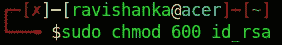

然后，您可以使用动态端口转发登录 ssh。

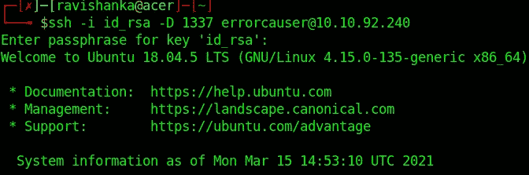

记得提供上面破解的散列作为密码短语。您将能够作为错误原因者轻松登录。

然后，我们必须为动态端口转发设置代理链。因此，转到位于 pentesting 机器“/etc/proxychains.conf”下的 proxychains 配置文件，用 Nano editor 打开它。

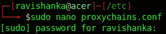

打开 proxychains.conf

然后，进行必要的修改。(注释掉`socks4 127.0.0.1 9050`并将`socks5 127.0.0.1 1337`添加到配置文件的末尾)

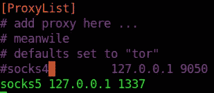

编辑会议文件

然后，使用 nmap 运行端口扫描，以使用 proxychains 枚举服务器上的内部端口。

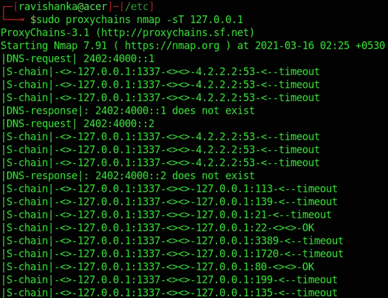

Nmap 代理链扫描

一段时间后，我们得到如下输出。

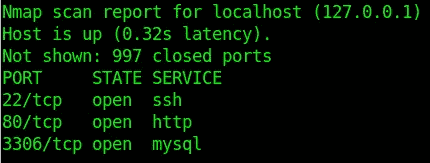

nmap 结果

找到 web 服务器的端口后，使用带有 **-L** 标志的 SSH 执行**本地端口转发**到该端口(端口 80)，如下所示。

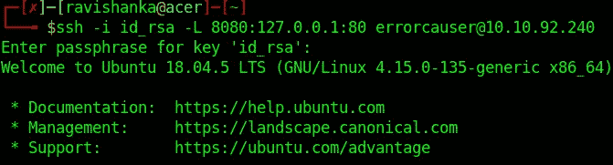

本地端口转发

这里，远程端口是 80(我们通过 nmap 扫描找到的)，本地端口是 8080。给出我们之前破解的密码。

1.  localhost 上监听的主要 TCP 端口是什么？

从上面的结果中，我们可以看到，除了 ssh 端口，端口 80 和 3306 也是开放的。

2.这些端口使用什么协议？

http 和 mysql 服务正在这些端口上运行。

## 网络开发

由于端口 80 是打开的，我们可以看到有一个 web 应用程序参与其中。只需在您的网络浏览器中给出 IP:PORT 组合。

1.  机器上运行的是什么 CMS？

在分析 web 应用程序时，我们会发现它是使用 Wordpress 开发的。

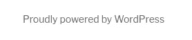

2.你能找到任何易受攻击的插件吗？

你可以使用 wordpress enumeration nmap 脚本来查找插件。

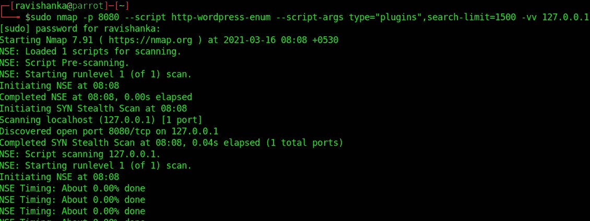

使用 nmap 的 wordpress 枚举

作为上述枚举的结果，我们得到如下输出。

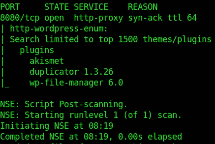

扫描结果

我刚刚谷歌了插件的漏洞，找到了以下问题的答案。

3.目录遍历漏洞的 CVE 数是多少？

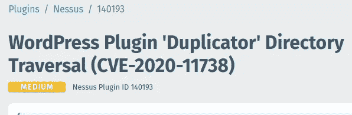

目录遍历漏洞

4.远程代码执行漏洞的 CVE 数是多少？

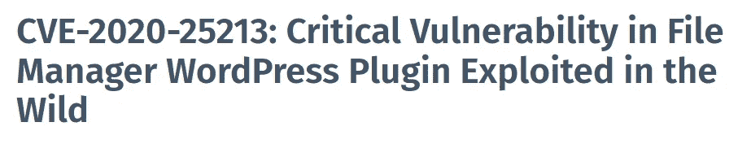

远程代码执行漏洞

5.该漏洞有一个 metasploit 模块。你可以用它来得到反壳。

在 msfconsole 中搜索相关的利用漏洞攻击。我很容易就找到了如下。

msf 模块

您必须将 rhost 设置为 127.0.0.1，rport 设置为 8080，lhost 设置为您的 tun0 IP，然后运行漏洞利用。如果一切正常，将提示您使用 meterpreter 会话。

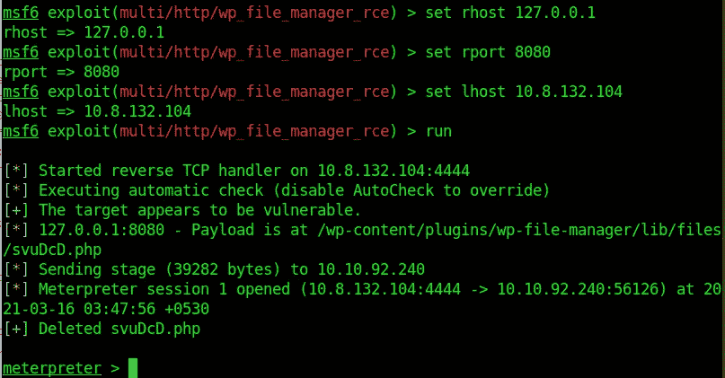

利用

6.运行 CMS 的用户名是什么？

发出命令“whoami ”,您将能够找到用户名。

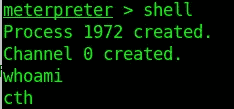

7.什么是用户标志？

在用户的主目录中，您可以找到用户标志。

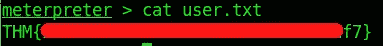

## 权限提升

至于现在，我们有一个低特权的外壳。但是，为了获得根标志，我们需要提升我们的特权。

1.  用户的旧密码是什么？

稍微浏览一下文件系统，你会发现用户可以访问日志文件 **/var/log/bash.log** ，不需要密码。只要“猫”的日志文件，你可以找到那里的密码。

2.根旗是什么？

您必须猜测用户的新密码，才能获得根标志。因为我们必须使用 SSH，所以我们必须需要新密码。这很容易猜测。(提示:旧密码是去年配置的，现在我们不在去年。不是吗？)猜出新密码后，我们可以 ssh 为新用户。

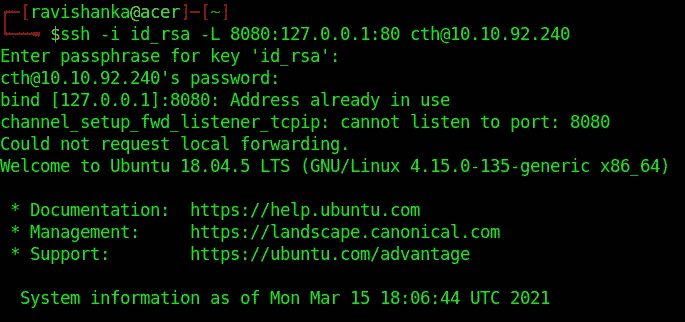

使用户成为超级用户。然后，您可能需要更改一些目录，以便到达 root 的主目录。

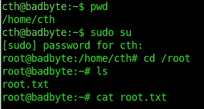

然后，您可以获得根标志，如下所示。

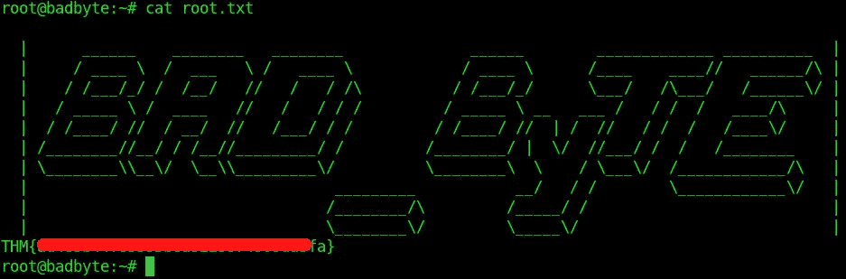

根标志

这就是 CTF 的结局。希望你学到了一些东西。

在 LinkedIn 上联系我[www.linkedin.com/in/ravishanka-silva-a632351a0](http://www.linkedin.com/in/ravishanka-silva-a632351a0)

黑客快乐！！！

感谢你对 OSCP 考试的一点帮助，

