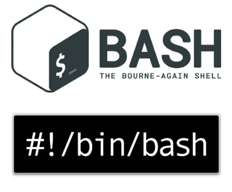

# TryHackMe : Bash 脚本

> 原文：<https://infosecwriteups.com/tryhackme-bash-scripting-92668e63d889?source=collection_archive---------0----------------------->

[一个演示室，教你 bash 脚本的基础知识](https://tryhackme.com/room/bashscripting)

> **T3 任务 1:简介 T5**

什么是 bash？

Bash 是一种脚本语言，可以在大多数 Linux 发行版和 MacOS 的终端上运行。Shell 脚本是文件中的一系列 bash 命令，它们组合在一起可以完成比简单的一行程序更复杂的任务，并且在自动化系统管理员任务(如备份)时特别有用。

这是你们将在这个房间里学到的许多事情中的几件:

*   Bash 语法
*   变量
*   使用参数
*   数组
*   条件式

在这个房间里，请随意和我一起工作！您可以测试所显示的命令，或者将它们集成到您自己的项目中，毕竟您是通过实践和将您所学到的应用到您自己的场景中来学习的。确保生成 tryhackme 攻击框或使用自己的终端。

我发现这个网站在我学习 bash 的旅程中非常有用，请随意使用它来帮助你完成这个房间，并在你完成后进一步学习！[https://devhints.io/bash](https://devhints.io/bash)

> 任务 2:我们第一个简单的 bash 脚本

1.  我们可以在行首插入哪段代码来注释掉我们的代码？

答案:#

2.下面的脚本会输出什么到屏幕上，回显“BishBashBosh”

答:BishBashBosh

> 任务 3:变量

1.  这段代码会返回什么？

答:海哲明今年 21 岁

2 .你如何将城市打印到屏幕上？

答:回声$城市

3.你如何将国家打印到屏幕上？

回答:回声$国家

> **任务 4:参数**

1.  我们如何获得提供给脚本的参数数量？

答案:$#

2.我们如何获得当前脚本的文件名(也就是我们的第一个参数)？

答案:0 美元

3.我们如何将第四个参数提供给脚本？

答案:4 美元

4.如果一个脚本要求我们输入，我们如何使用“read”将输入导入一个名为“test”的变量

答:阅读测试

5.如果脚本运行时使用了，那么“echo $1 $3”的输出会是什么？/script.sh hello hola aloha "

你好，阿罗哈

> **任务 5:数组**

1.  使用索引将 audi 打印到屏幕上的命令是什么。

Ans : echo "${cars[1]} "

2.如果我们想将 tesla 从阵列中移除，我们该如何做？

答:未设置的汽车[3]

3.我们怎样才能插入一种叫做丰田的新价值观来取代特斯拉？

答:汽车[3]=“丰田”

> 任务 6:条件句

1.  用什么标志来检查我们是否有文件的读权限？

答案:-r

2.检查它是否是一个目录的标志是什么？

答案:-d

> 任务 7:进一步阅读

你好，非常感谢你完成这个 bash 脚本的房间！我想祝贺你在困难的时候坚持下来，完成了这个房间。

如果您想进一步扩展 bash 或一般编码的知识，我建议您访问以下网站:

*   [https://www.codewars.com/](https://www.codewars.com/)
*   https://www.hackerrank.com/
*   当然还有谷歌！

再次感谢。如果你想问我任何事情或者对房间有任何疑问，你可以在推特上联系我【https://twitter.com/fieldraccoon 

祝你的狂欢之旅好运！

干得好！

[TryHackMe](https://medium.com/u/dc49a0a3cb16?source=post_page-----92668e63d889--------------------------------)