# TryHackMe —基本恶意软件演练

> 原文：<https://infosecwriteups.com/tryhackme-basic-malware-re-walkthrough-61b24cf79a30?source=collection_archive---------0----------------------->

## 为什么要对恶意软件进行逆向工程？

安全专业人员使用逆向工程进行**静态恶意软件分析**，以便在创建恶意软件时提取有用的信息，如元数据、嵌入资源、加密密钥、标题等。许多工具用于对恶意软件进行反向工程，如反汇编程序、调试器、PE 查看器和网络分析器。

这篇文章是对 TryHackMe 的**基本恶意软件 RE**room([https://tryhackme.com/room/basicmalwarere](https://tryhackme.com/room/basicmalwarere))的一个补充，在这里你必须对一些样本恶意软件进行逆向工程并捕获标记。

## 关于吉德拉

为了完成这个挑战，我使用了由美国国家安全局开发的免费开源逆向工程工具。许多安全研究人员认为 Ghidra 是 IDA Pro 等商业级逆向工程工具的竞争对手。你可以从 https://ghidra-sre.org 下载。它是独立于平台的，所以你可以在 Linux，Windows 和 Mac 上运行它。如果你不熟悉这个工具，先完成 TryHackMe 的 Ghidra room([https://tryhackme.com/room/ccghidra](https://tryhackme.com/room/ccghidra))，或者你可以阅读写得很好的文档。

## 先决条件

*   熟悉**汇编**和 c 等编程语言。
*   逆向工程的基础知识。
*   工具的熟悉程度 **Ghidra。**

让我们进入正题。

## **挑战 1**

该可执行文件在执行时会在屏幕上打印一个 MD5 散列。你能拿到准确的旗子吗？

***解***

首先你需要下载任务文件并用 Ghidra 启动它。在任何情况下，你都不必运行可执行文件，因为它是恶意的。

**提示** —由于任务文件是一个可执行文件，所以不要使用 Windows 来解决这个问题。使用你最喜欢的 Kali/Parrot 操作系统，因为有可能你会不小心打开可执行文件。我们是人类，人类也会犯错。对吗？Windows 恶意软件没有 Linux 强大！！！

启动可执行文件后，Ghidra 界面将如下所示。我们更需要关注的是**符号树**部分，因为它包含了代码的所有功能、导入和导出。

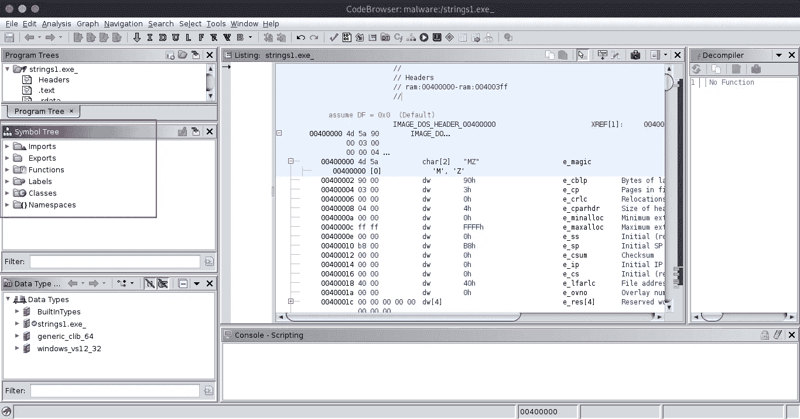

启动任务文件后的 Ghidra 界面

我们更需要关注的是**函数**部分。我展开它，寻找一个主函数。但是，没有主要功能。但是有一个**录入功能。**

在计算机编程中，入口点是程序开始执行指令的地方，也是程序可以访问命令行参数的地方。为了开始一个程序的执行，加载程序或操作系统将控制权传递给它的入口点。这标志着从加载时间到运行时间的转变。

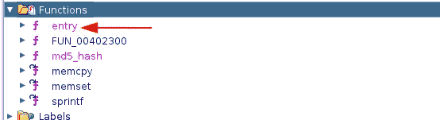

功能部分显示入口功能

为了查看源代码，我双击了入口函数。在观察源代码时，我遇到了一个被 MD5 散列的字符串，我可以很容易地从解编译的源代码中获取第一个标志，如下所示。

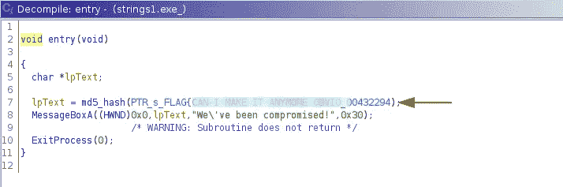

标志 1

提示—Flag 以单词“ **FLAG** 开始，并且**没有**数字出现在 Flag 中！！！

这就像从婴儿手里拿走糖果一样容易。不是吗？让我们开始第二个挑战。但是，并没有上面那么容易。你需要知道 stack 是如何工作的，还要有一些编程知识。

## **挑战 2**

该可执行文件在执行时会在屏幕上打印一个 MD5 散列。你能拿到准确的旗子吗？

***解***

为了解决这一挑战，也遵循了相同的程序。

在分析函数时，我得出了与前面相同的结构。

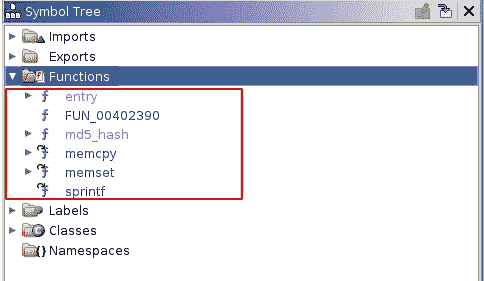

挑战 2 的功能部分

所以，我从入口函数开始，因为它是 flag 在之前挑战中所在的函数。入口函数的反编译源代码如下。

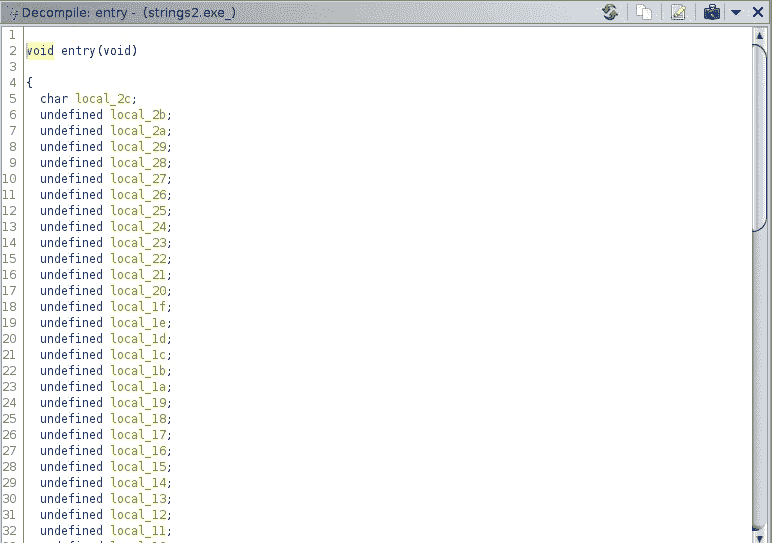

它以一个 **char** 变量开始，然后是一堆**未定义的**变量。最后一个是**字符指针**变量。

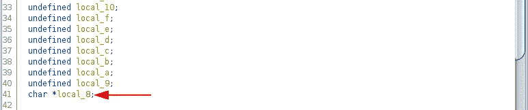

如果我们看一下反汇编部分，我们可以了解这些变量是如何添加到堆栈中的。我们可以清楚地看到一个相反的顺序。

最后一个字符指针 **local_8** 是第一个加入堆栈的指针，如下所示。

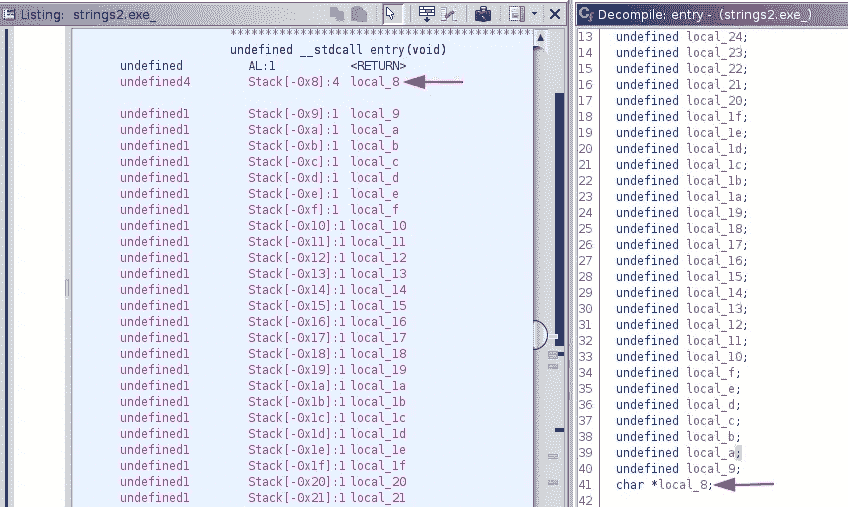

让我们记住这一点，并进一步观察反编译器。

我们可以看到每个变量都被赋值如下。第一个字符变量 **local_2c** 被分配给' **F** '，所有未定义的变量被分配十六进制值。

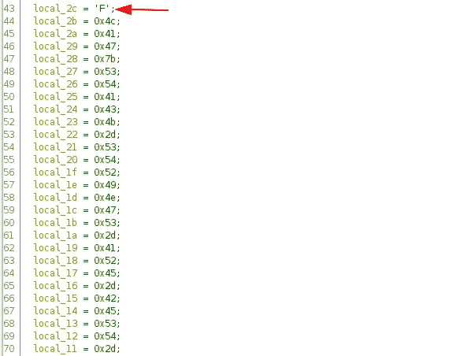

变量被赋值

提示—这些十六进制值应该是 ASCII 字符，因为每个值正好是一个字节。

如果你还记得，我们发现最后定义的变量是 local_8，是一个字符指针。现在，它被赋值为从变量 **char local_2c** 的内存地址开始的字符串的**散列，如下所示。**

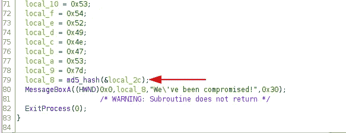

这意味着它将散列从栈底到栈顶**的整个字符串。因此，我们需要**将在 **local_2c** 之后分配给变量的每个十六进制字符转化为 ASCII 字符，以便获得被散列的字符串。****

为此，您可以使用[https://www . rapid tables . com/convert/number/hex-to-ascii . html](https://www.rapidtables.com/convert/number/hex-to-ascii.html)。您将获得如下 ASCII 标志。

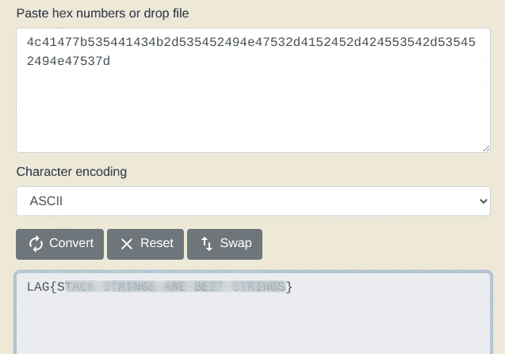

标志 2

提示—提交前需要在标志的开头加上 **local_2c** 的值，即**“F”**。

## 挑战 3

该可执行文件在执行时会在屏幕上打印一个 MD5 散列。你能拿到准确的旗子吗？

***解***

和前面的例子一样，从分析函数部分开始，如下所示。

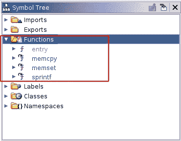

挑战 3 的功能部分

它包含入口函数。然而，在以前的挑战中可以找到的一些功能却不见了。让我们分析一下入口函数。这次你会遇到一个更复杂的入口函数。

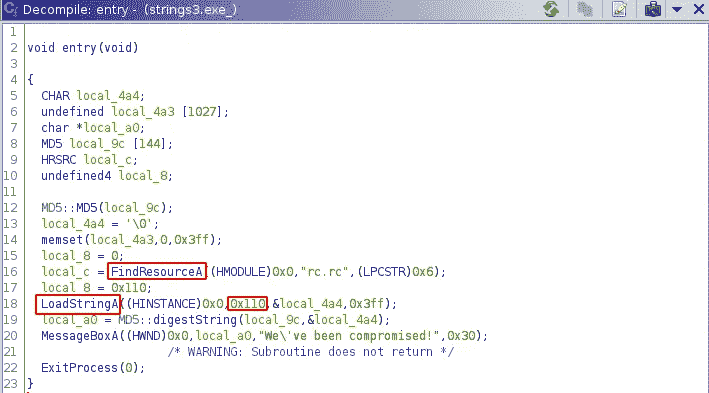

挑战 3 的入口功能

如你所见，有一些外部函数被调用，如 **FindResourceA()** 和 **LoadStringsA()** 。当我们查看汇编代码时，我们会发现 FindResourceA()来自 Kernel32 库，而 LoadStringsA()来自 User32 库。

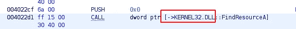

FindResourceA()来自 Kernel32 库

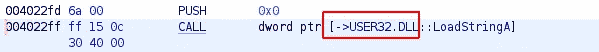

LoadStringsA()来自 User32 库

LoadStringsA()所做的是从其引用中加载字符串，并存储在变量 **local_4a4 中。**那么，让我们找到参照物。

如上面的入口函数所示，我们知道 **0x110** 十六进制值参数是 LoadStringsA()函数调用中字符串的标识符。

十六进制 0x110 =十进制 **272**

从 Ghidra 功能区打开**定义的字符串**(窗口→定义的字符串)。向下滚动，你会看到一个包含许多旗帜的旗帜表。

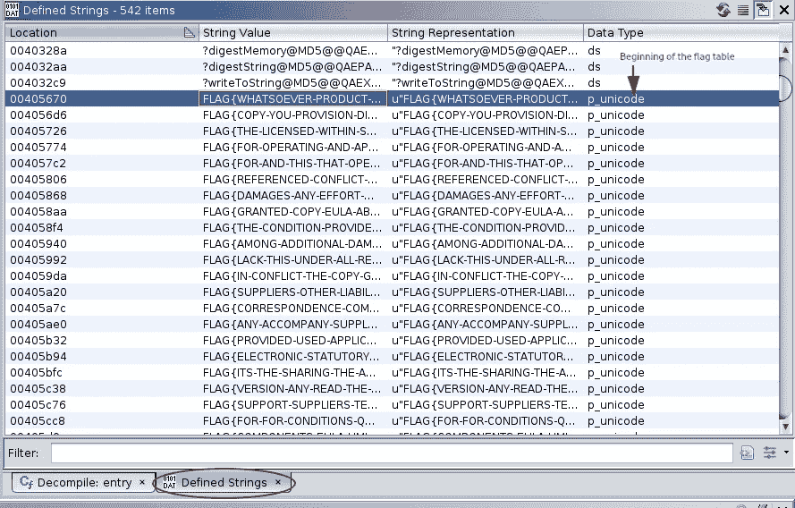

标志表

看一看反汇编程序上的等价代码，你会在右上角找到十进制的**字符串 ID** 。因此，向下滚动直到找到 string-ID 272。

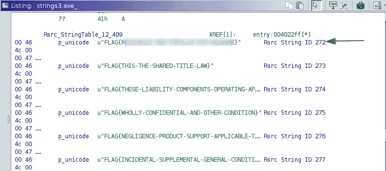

最终旗帜

这将是 CTF 挑战赛的最后一面旗帜。

当涉及到现实世界的静态恶意软件分析时，可能会变得比这更具挑战性，原因有很多，例如，

*   反汇编程序失败。
*   反编译器产生混淆的代码。

这主要是因为恶意软件代码的复杂性。因此，动态恶意软件分析应运而生。动态分析是在一个封闭的系统(称为**沙箱**)上进行的，目的是在一个安全的环境中启动恶意程序，并简单地观察它做了什么。

我希望你学到了一些东西，并享受这个挑战。通过 LinkedIn 联系我，【https://www.linkedin.com/in/ravishanka-silva-a632351a0/ 

祝你在前方捕捉旗帜时好运！！！