# TryHackMe-基本 Pentesting CTF 记录(详细)

> 原文：<https://infosecwriteups.com/tryhackme-basic-pentesting-ctf-writeup-detailed-5baf97d1736a?source=collection_archive---------3----------------------->

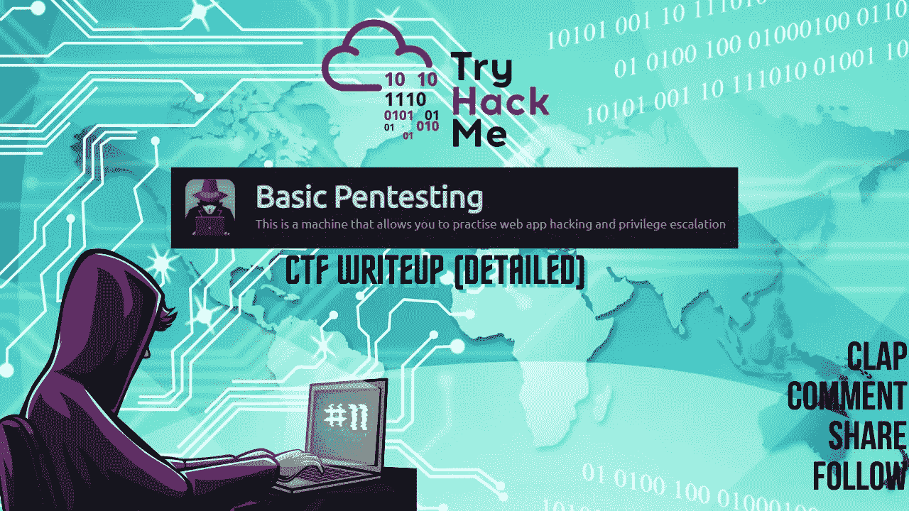

CTF 报道#11

欢迎各位！！我们将在 [TryHackMe](https://medium.com/u/dc49a0a3cb16?source=post_page-----5baf97d1736a--------------------------------) 进行基本的 CTF 测试。

 [## TryHackMe |基本测试

### 这是一台可以让你练习网络应用黑客和权限提升的机器

tryhackme.com](https://tryhackme.com/room/basicpentestingjt) 

在桌面上为您的 CTF 计算机创建一个目录，并在 CTF 目录中为 Nmap 创建一个目录。

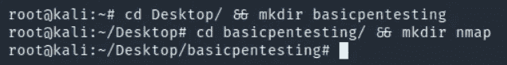

让我们开始吧！！享受流动吧！！

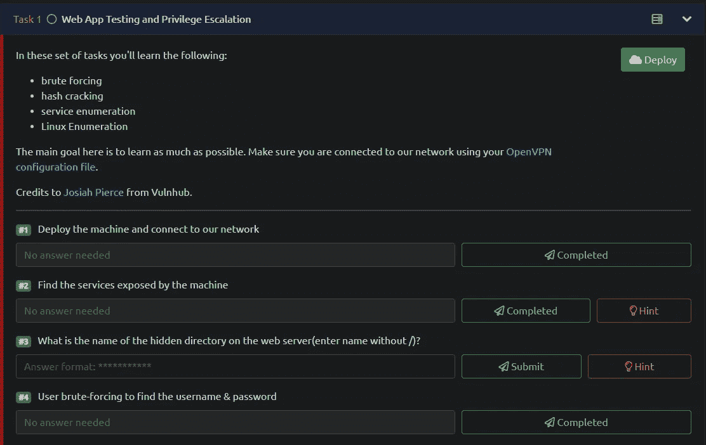

任务 1–4

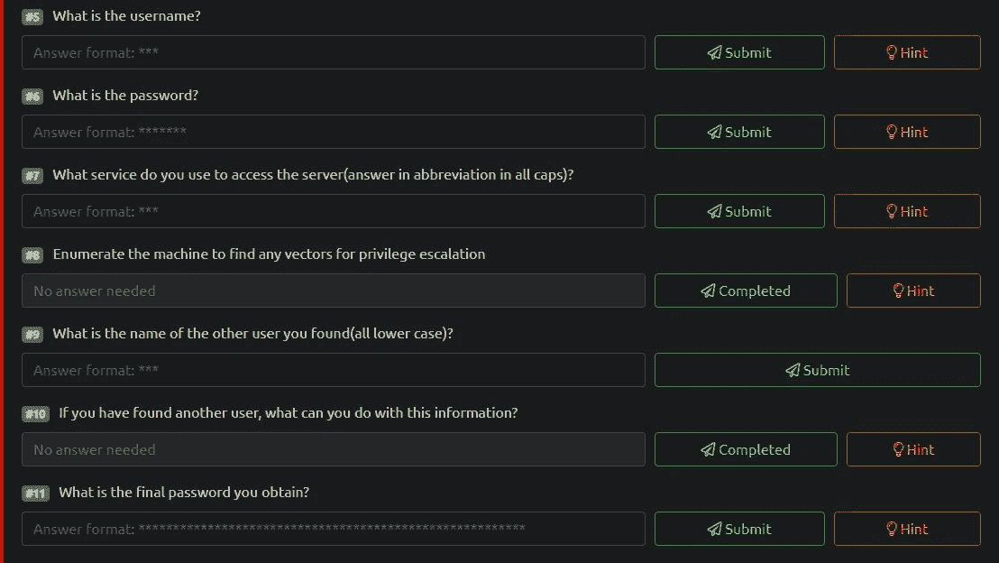

任务 5-11

## Nmap 扫描:

> nmap-sC-sV-p--关于 nmap/基础测试<target_ip></target_ip>
> 
> -sC:默认脚本
> -sV:版本检测
> -p-:扫描所有端口
> -oN:输出将存储在您之前创建的目录“nmap”中

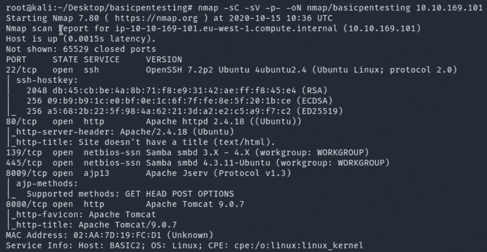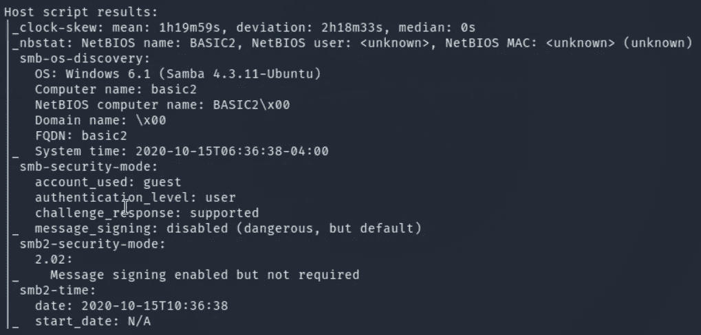

开放的端口有 6 个:
22/ssh—OpenSSH 7.2 p2
80/http-Apache httpd 2 . 4 . 18
139/NetBIOS-SSN-Samba smbd 3。X-4。x
445/NetBIOS-SSN-Samba smbd 4 . 3 . 11-Ubuntu
8009/ajp 13-Apache Jserv 1.3
8080/http-Apache Tomcat 9 . 0 . 7
检测到 OS-Ubuntu Linux

> #1.部署机器并连接到我们的网络
> 答:不需要回答
> 
> #2.找到机器公开的服务
> 答:不需要回答

**Gobuster :**

> gobuster dir-u http://<target_ip>-w<path_to_wordlist>-o<output_file_name>-x</output_file_name></path_to_wordlist></target_ip>
> 
> -u:URL
> -w:word list
> -q:quiet，静默扫描。将隐藏横幅。
> -o:输出将存储在目录
> -x:搜索扩展名，如 html、txt、php、phtml 等。

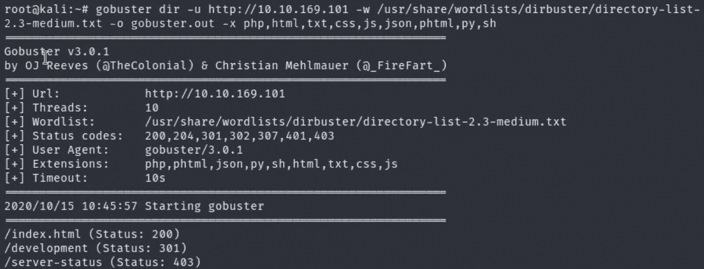

太好了！我们在网络服务器上发现了一个隐藏的目录，它回答了这个问题。

> #3.web 服务器上隐藏目录的名称是什么(输入不带/)的名称？答案:发展

导航到 http://<target_ip></target_ip>

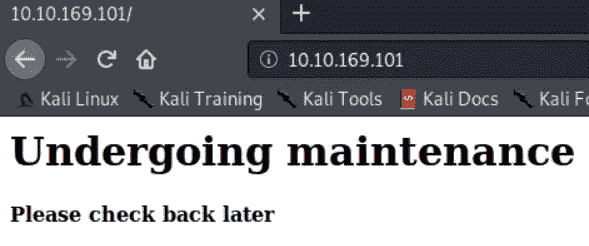

检查页面的源代码，寻找任何对我们的枚举过程有帮助的有趣信息总是好的。
查看 URL 页面的来源。Ctrl+U

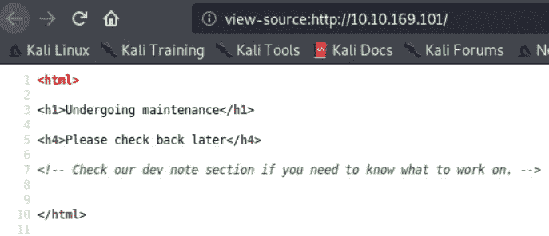

导航到 http:// <target_ip>/development</target_ip>

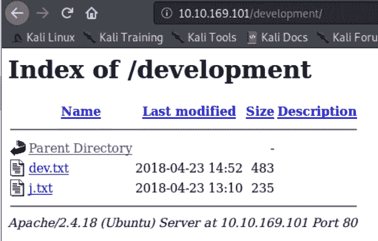

我们可以检查两个文本文件

> 1.开发. txt

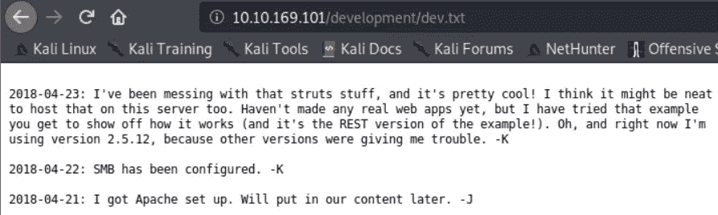

> 2.j.txt

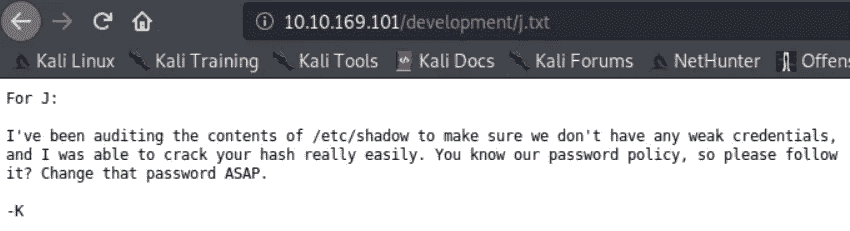

## Enum4linux:

> enum4linux -A<target_ip></target_ip>
> 
> -A:包括对指定 IP 上的用户、smb 共享、组、密码策略、操作系统、nmblookup / nbtstat 和打印机信息进行简单枚举的所有选项。

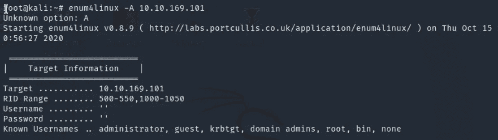

从输出中，我们发现了 smb 共享，因此我们可以枚举匿名共享以深入挖掘。

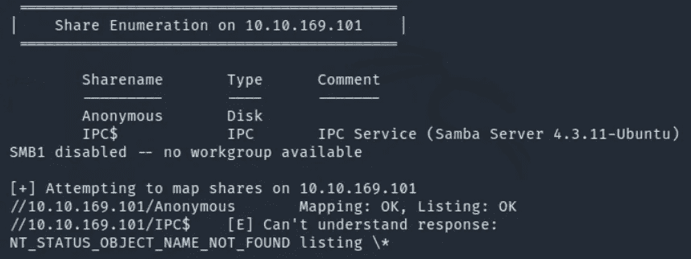

我们将使用 smbclient 工具获得匿名共享内部的访问权限，并通过使用“get”命令将文件下载到我们的主机上。

访问匿名共享的凭据有:
匿名:匿名

> smbclient//<target_ip>/<smb_share>/
> 获取<文件名></smb_share></target_ip>

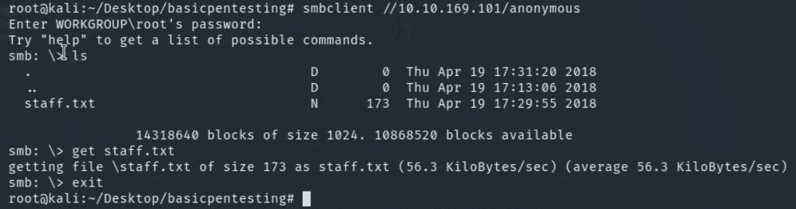

smb 共享中有 1 个文件。获取它并查看 staff.txt 文件。

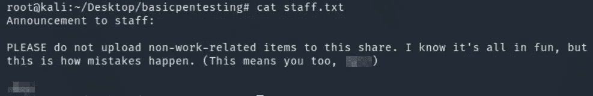

精彩！我们已经获得了用户。
我们可以提交任务的答案，然后开始强行破解用户的密码。

## 九头蛇:

Hydra 是一个破解密码的神奇工具，它支持很多暴力破解服务。让我们旋转九头蛇吧。

> 九头蛇-l <user>-P <path_to_wordlist><target_ip>-t 4 宋承宪</target_ip></path_to_wordlist></user>

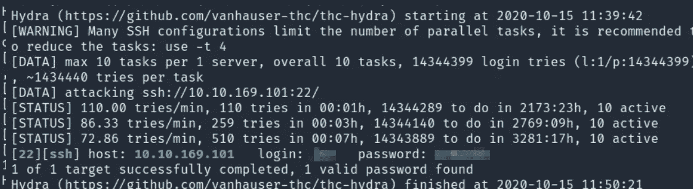

太棒了！！我们已经成功地暴力破解了用户并找到了密码。
这回答了任务中的几个问题。

> #4.用户强行找到用户名和密码
> 答:不需要回答
> 
> #5.用户名是什么？
> 答:XXX
> 
> #6.密码是什么？
> Ans: XXXXXXX

现在我们有了凭证，我们可以使用 SSH 并获得 shell。

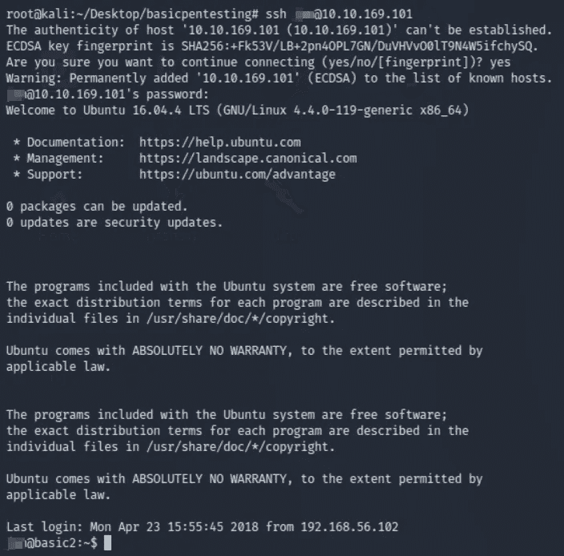

> #7.您使用什么服务来访问服务器(用大写字母缩写回答)？
> 答:宋承宪

让我们通过导航到主目录来找出机器上的其他用户。

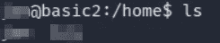

机器上有两个用户。

我们可以尝试做手工枚举。

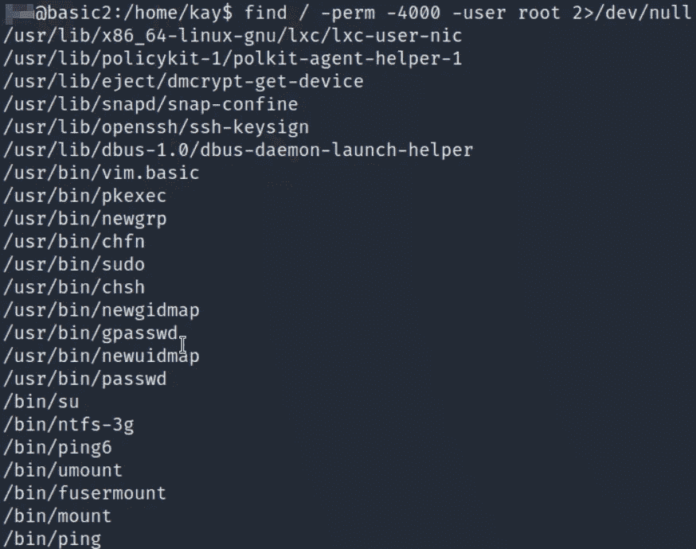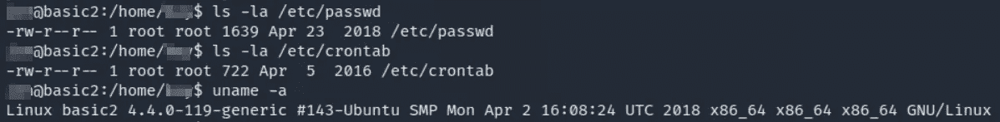

> #8.枚举机器以找到特权提升的任何向量
> 答:不需要回答
> 
> #9.你找到的另一个用户的名字是什么(全小写)？
> 答:XXX

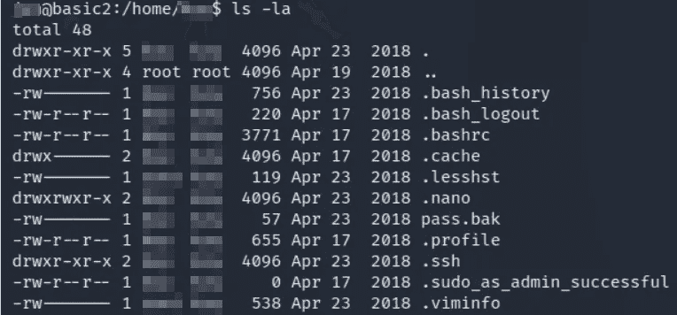

我们有一个. ssh 目录，该目录将包含一个加密的 RSA 密钥。为了在另一个用户中使用 ssh 登录，我们必须解密 RSA 密钥。

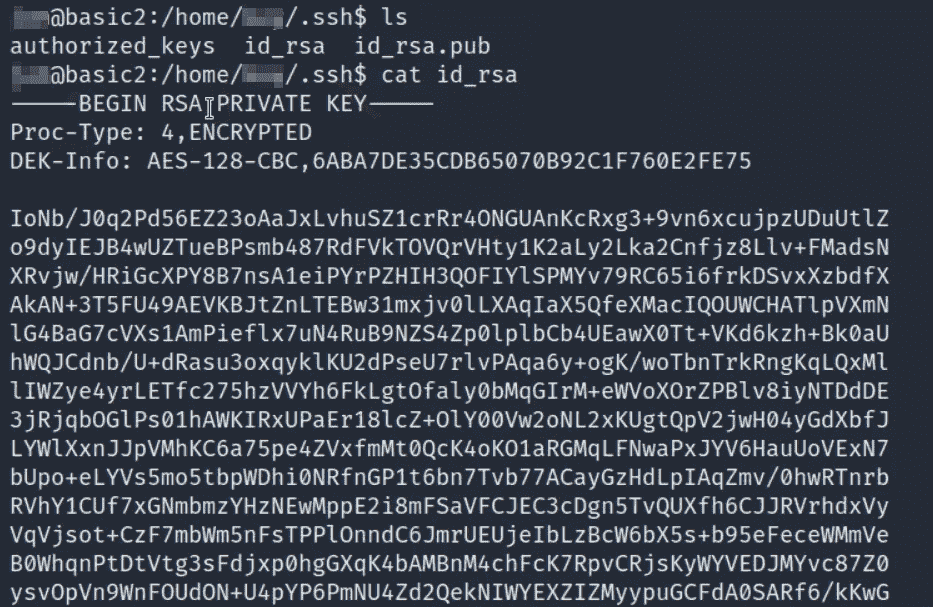

复制密钥并将其保存在主机上。我将使用纳米编辑器来完成这项任务。

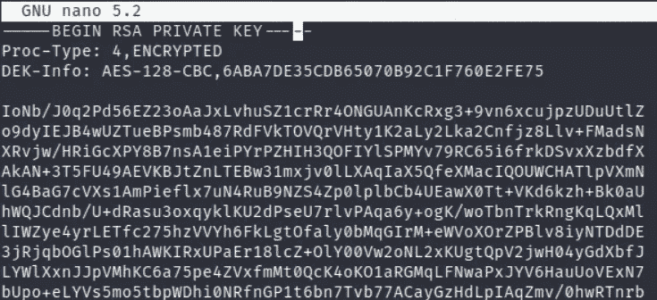

我们必须解密 ssh 密钥，为此，我们可以使用一个非常棒的脚本，将 ssh 密钥转换为开膛手工具 john 可以理解的格式，然后使用单词列表暴力破解该密钥，以找到允许我们登录 SSH 的正确短语或密码。

 [## openwall/约翰

### 此时您不能执行该操作。您已使用另一个标签页或窗口登录。您已在另一个选项卡中注销，或者…

github.com](https://github.com/openwall/john/blob/bleeding-jumbo/run/ssh2john.py) 

在我们将脚本保存到主机上之后，使用“chmod +x ssh2john.py”命令使其可执行是很重要的。

我们可以执行脚本，使用 id_rsa 文件作为输入并保存输出。

> 。/ssh2john.py id_rsa > id_rsa_key

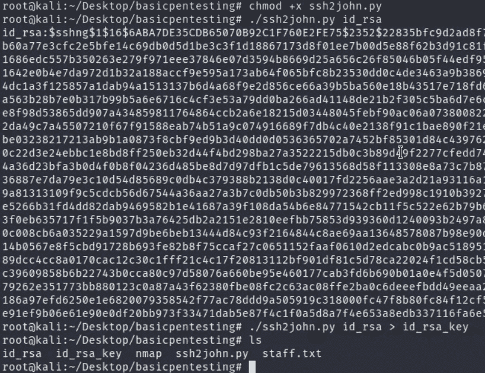

我们将启动开膛手约翰工具，并使用输出文件对 rockyou 单词表进行暴力破解。

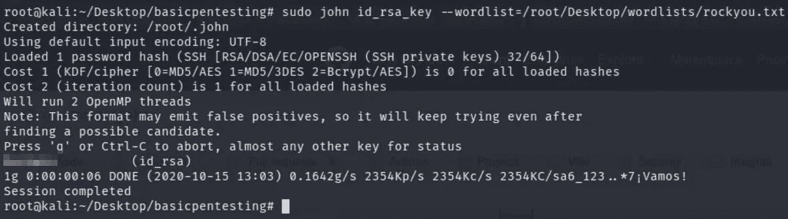

太棒了。！我们已经获得了 ssh 密钥的密码。我们可以使用 id_rsa 文件进入 ssh，以另一个用户的身份登录，当提示输入密码时，我们可以使用通过开膛手约翰破解的密码。

> #10.如果你找到了另一个用户，你可以用这些信息做什么？答:不需要回答

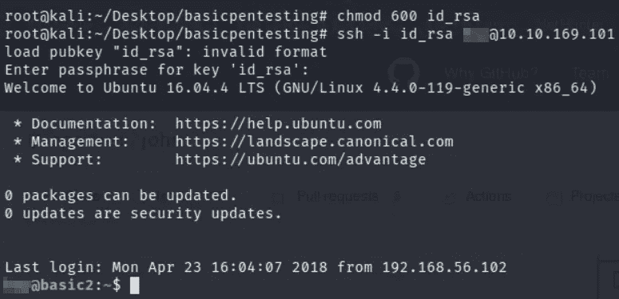

做得好！！我们作为另一个用户获得了外壳。我们需要提交存储在 pass.bak 文件中的最终密码。让我们抓住它。

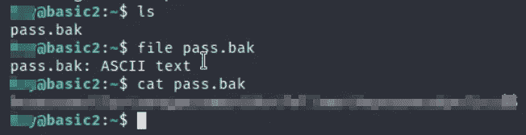

厉害！！我们已经完成了这个房间里的所有任务，但我们仍然要成为 root。我们可以找到用户可以作为 root 使用的二进制文件或命令。

> #11 您获得的最终密码是什么？
> Ans:xxxxxxxxxxxxxxxxxxxxxxxxxxxxxxxxx

sudo su 和我们将根在箱子上。
超赞！让我们看看 flag.txt，给这个盒子一个圆满的结局。

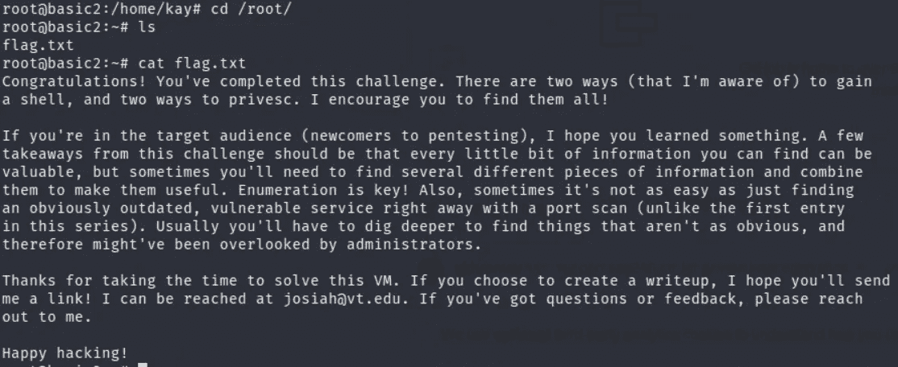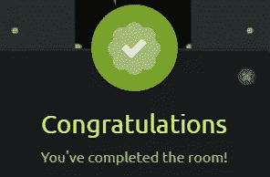

我们已经完成了房间！！我建议初学者试试这个 CTF。您将学习暴力破解、哈希破解、服务枚举和 Linux 枚举等等。

如果你喜欢这篇文章，并且这篇文章对你有所帮助，请在评论中告诉我，或者用掌声分享你的爱。

谢谢你抽出时间。

跟着我。

更多的报道正在进行中。

保重，注意安全，继续黑！

**-哈桑·谢赫**