# TryHackMe 基本测试演练。

> 原文：<https://infosecwriteups.com/tryhackme-basic-pentesting-walkthrough-7817c719fd04?source=collection_archive---------1----------------------->

从 tryhackme.com 取回

1.  ***侦察***

我们首先要做的是扫描。让我们运行两次 Nmap 扫描:

*   **Nmap-sV-sC-O<IP-addr>-oN basic _ scan . Nmap**
*   **Nmap-script = vuln<IP-addr>-oN vuln _ scan . Nmap**

第一次 Nmap 扫描非常类似于-A(主动)扫描，但它不执行 traceroute。第二个是为受害者寻找潜在的攻击媒介。

结果如下图所示:

基本 Nmap 扫描

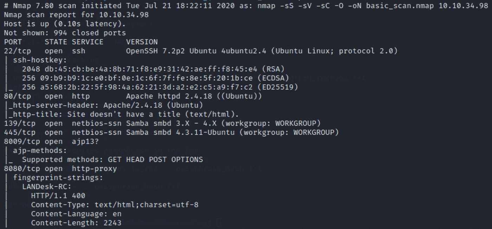

页（page 的缩写）在美国，vuln 扫描没有揭示任何有价值的信息

下一步是检查托管在端口 80 上的网站内容。

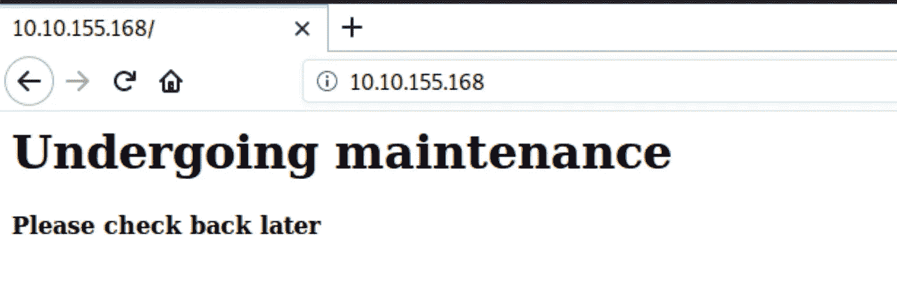

这个网站似乎还处于维护或创建阶段。在这两种情况下，我们都有希望找到一些开发人员笔记。为了继续我们的侦察，让我们运行 GoBuster 来查找服务器上的任何目录。

语法如下:

**gobuster dir-u<URL>-w/usr/share/word lists/dirb/common . txt-o directory . txt**

**目录**指定目录搜索过程

**-u** 指向网站网址

**-w** 是常用目录的单词表

GoBuster 结果:

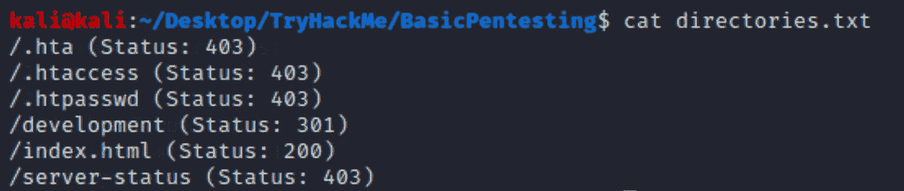

/发展看起来很有前景。

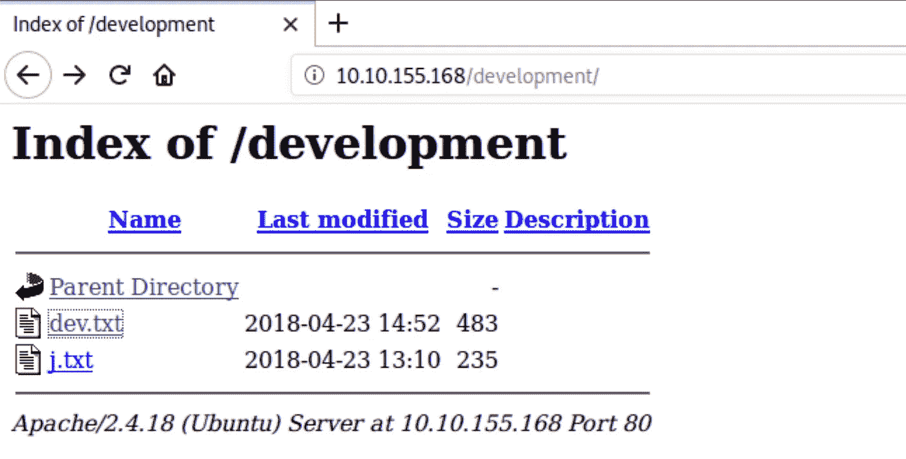

让我们检查两个 txt 文件的内容:

**dev.txt**

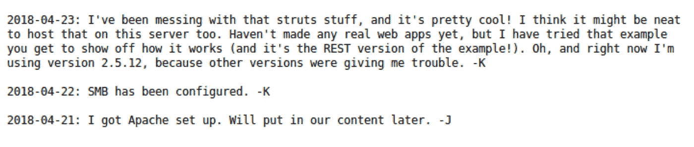

**j.txt**

正如我们之前猜测的那样，这里是开发人员笔记。显然，网络服务器用户的用户名以“j”和“k”开头。我们将来肯定会用到这些信息。此外，K 先生说“SMB 已经配置好了”Nmap 扫描证实了这一点。进一步试验的方向将是那个方向。

***2。SMB 枚举***

对于 SMB 枚举，将使用 Nmap 脚本引擎(NSE)。让我们来看看可用的脚本:

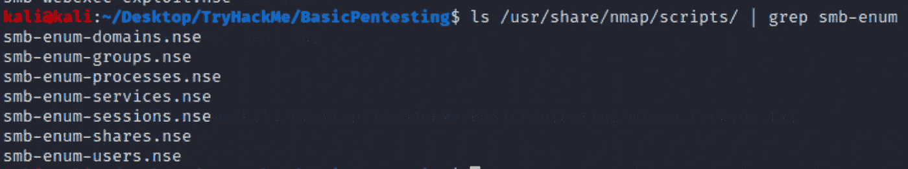

为了获得尽可能多的信息，我们可以使用以下命令运行所有这些脚本:

**nmap-script = SMB-enum *<IP-addr>-oN SMB _ enum . nmap**

该命令的结果显示在下面的屏幕截图中:

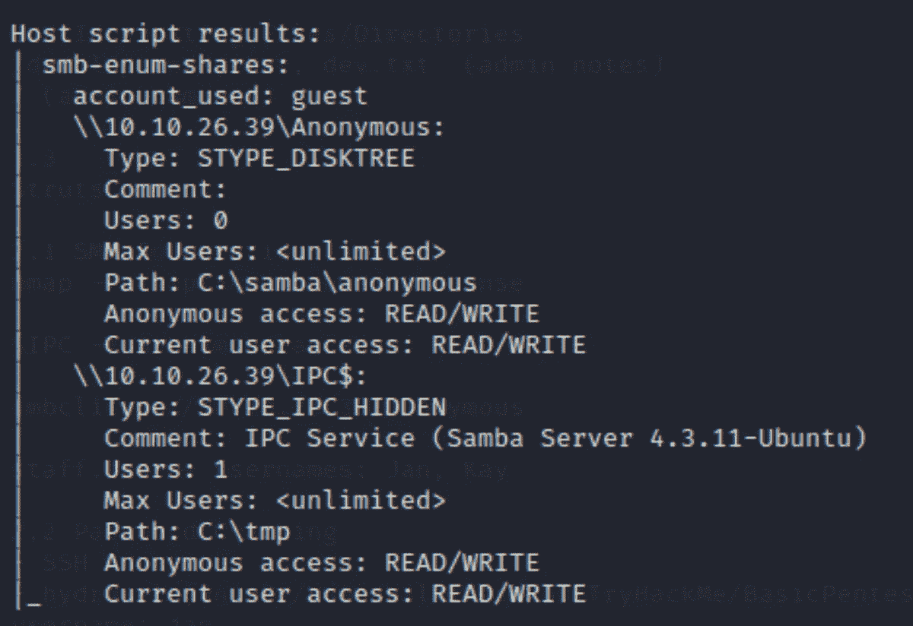

我们可以清楚地看到，有匿名和$IPC 隐藏的股份。$IPC 共享支持进程间通信以及不需要用户名或密码的匿名用户登录。通过使用 **smbclient** 命令并访问匿名共享，我们可以利用这一点。

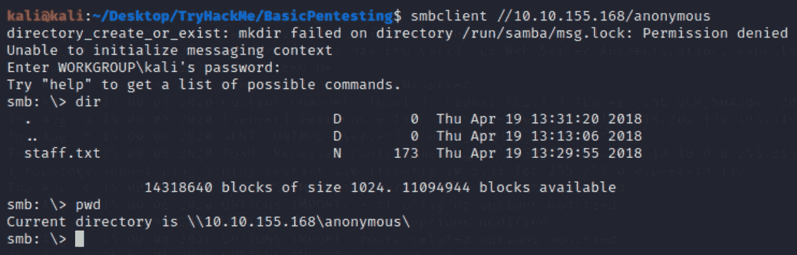

staff.txt 可能包含一些有用的信息，所以让我们用 get staff.txt 命令将它输入到我们的计算机中。

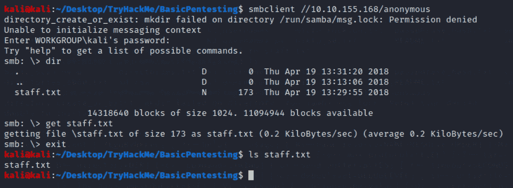

staff.txt 文件已经复制到本地主机上的当前目录中。

让我们来看看 staff.txt 文件的内容。

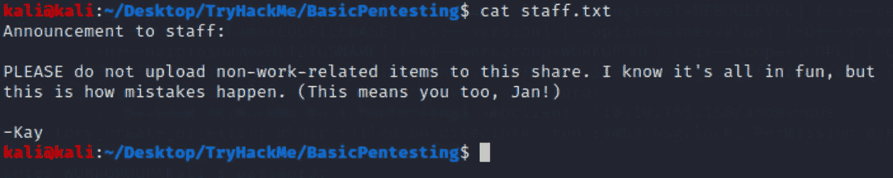

似乎我们已经发现“k”和“j”用户首先出现在开发笔记中。由于 SSH 端口是打开的，我们从 Kay note (j.txt)中知道 Jan 有一个弱密码，让我们运行 hydra 来破解 Jan 的密码并进入服务器。

***3。进入目标***

让我们构建九头蛇指挥部:

**九头蛇 Jan-P/usr/share/wordlits/rock you . txt ssh://<IP-addr>**

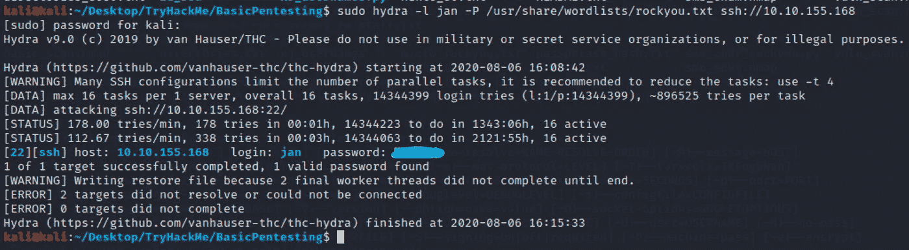

现在，我们可以使用 SSH 使用 jan 凭证登录系统。

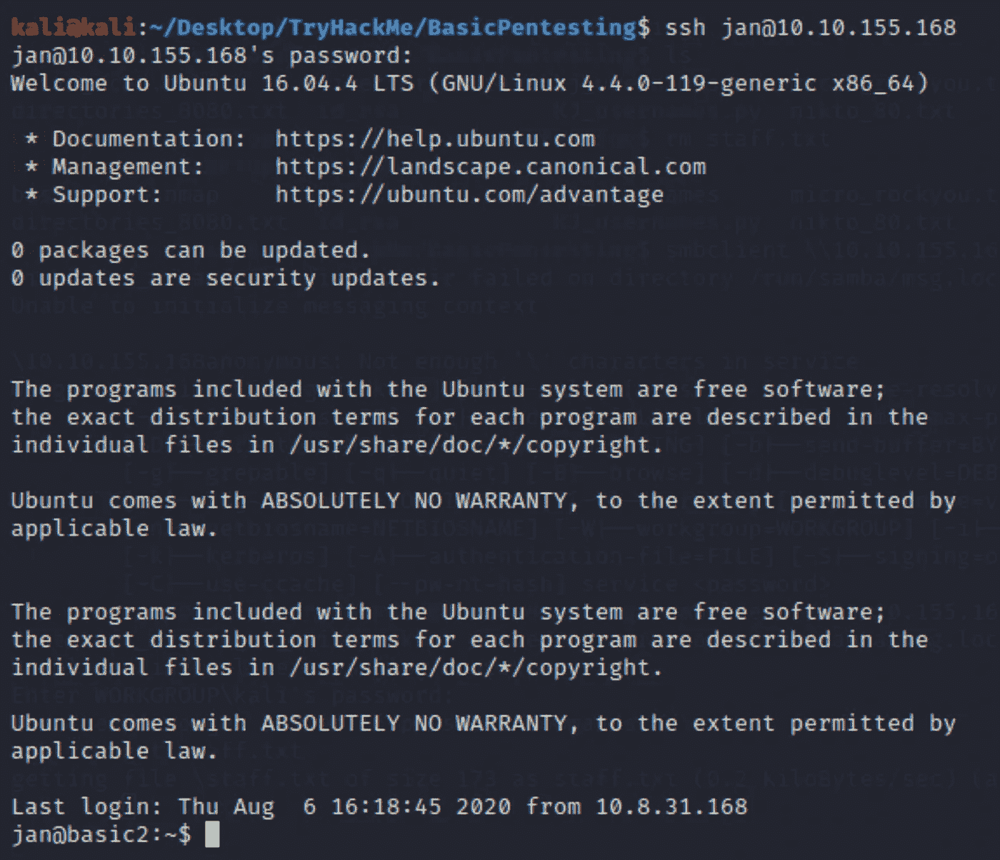

***4。权限提升***

在不同的文件夹中移动并寻找线索，我们可以在 kay 目录中找到自己。

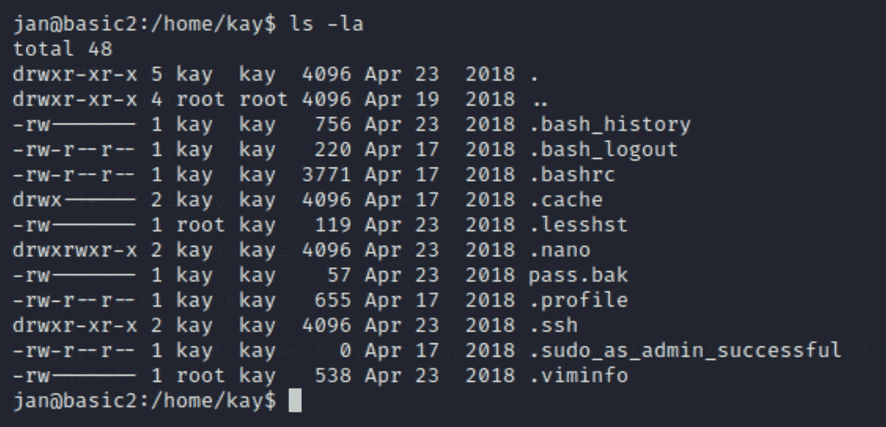

有一个 pass.bak 文件 jan 无法访问。然而，隐藏的。ssh 目录对 Everyone 组具有“读取”权限。

去那里揭示 kay 的 RSA 密钥，我们可以使用 rsync 或 scp 命令传输它。

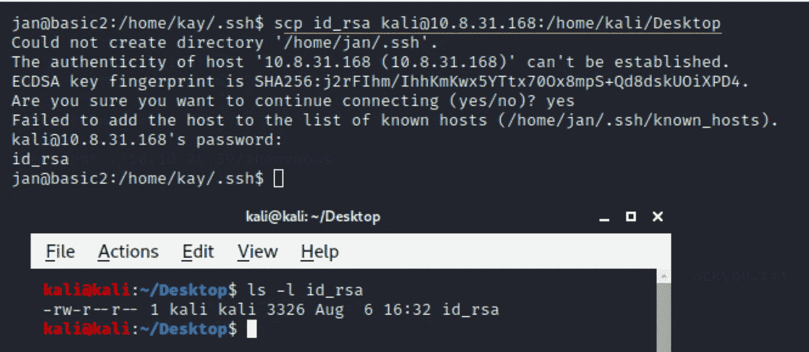

可以清楚地看到，id_rsa 文件已经被传输到本地机器上，现在我们可以使用这个密钥来访问 kay 的用户帐户。

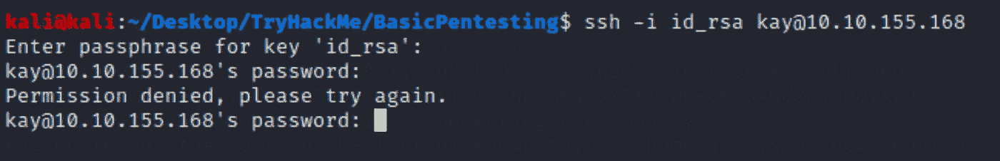

似乎 kay 的 RSA 密钥受密码保护。可以用开膛手约翰密码破解工具解决。

有一个名为 ssh2john.py 的专门的 John The Ripper 工具，它可以从 ssh 私钥中提取可破解的哈希。

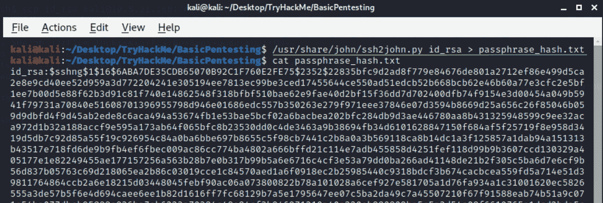

从上面的输出中，我们可以看到 SSH 私有密钥散列以$1$开始，这表明散列是由 MD5 散列算法生成的。

现在，我们可以使用标准的 John The Ripper 来破解这个散列并提取 SSH 私有密钥密码短语。

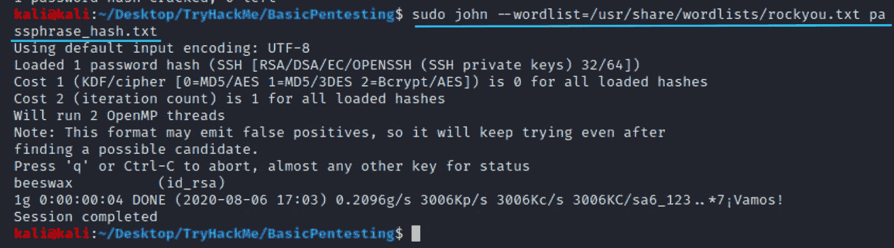

凯的 SSH 私钥密码是**蜜蜡**。

让我们再试一次宋承宪凯的用户帐号。

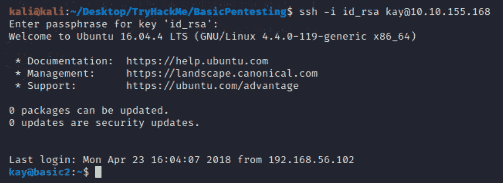

瞧啊。

剩下的最后一件事是创建 pass.bak 文件。

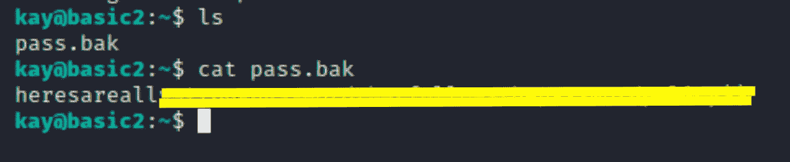