# 爆破手

> 原文：<https://infosecwriteups.com/tryhackme-blaster-2430255a4229?source=collection_archive---------1----------------------->

## 游戏攻略

嗨，大家好，今天我们要做的是 Tryhackme **Blaster** ，这是一款 windows 机器认为简单的游戏。


# 首字母

```
export IP=10.10.184.13
```

## 枚举:

让我们从端口扫描开始，现在我想做的是执行 **rustscan** 来获取开放的端口。

```
rustscan -a $Ip --ulimit 5000
```

现在将这些端口转移到 **nmap**

```
nmap -T4 -sC -sV -p80,3389 -oN nmap $IP -Pn
```

结果是

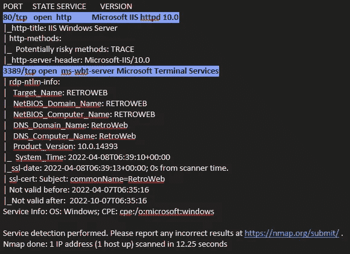

nmap_results.png

所以我们找到了两个开放的端口，即 **80** ( **http** )和 **3389** ( **RDP** )

我检查了端口 80 (http ),因为我们没有任何 RDP 的凭证。

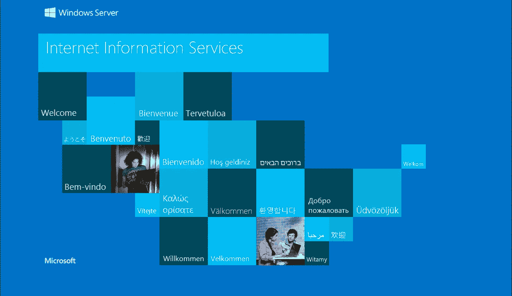

[http://$IP](/$IP)

正常网页，然后我去做了目录暴力破解，发现 **/retro**

```
feroxbuster -u [http://$IP](/$IP) -o feroscan.txt
```

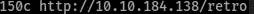

feroxbuster_scan.png

在参观时，

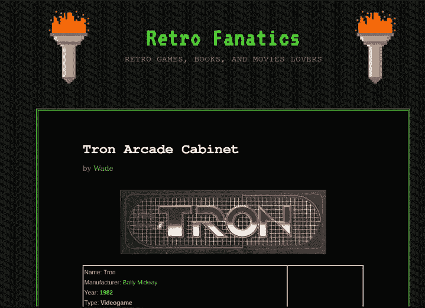

所以这是我们的博客网站。检查博客时，我们发现用户在博客上评论了密码。

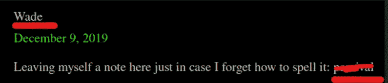

用户名和密码

# User.txt

现在是通过 RDP 服务登录的时候了，在 Windows 中你可以使用`rdp`，在 linux 中有很多工具，但我更喜欢`rdesktop`

```
rdesktop $IP -g 50%
```

在桌面上，我们有用户标志


userflag.png

# 特权:

为了获得 meterpreter 外壳，我尝试了一些 msfvenom 有效载荷，但反病毒正在删除文件。但是在桌面上，有另一个名为 **hhupd** 的 user.txt 文件

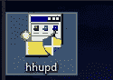

hhupd.png

谷歌了一下，发现了一个漏洞，允许普通用户以管理员身份运行 cmd。

这个[视频](https://www.youtube.com/watch?v=3BQKpPNlTSo)将帮助你更好地理解(:

现在是升级特权的时候了。

以管理员身份运行`hhupd`应用程序，并检查发行者证书。

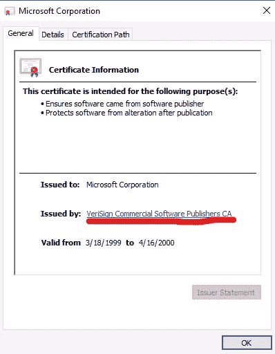

出版商 certificate.png

现在点击链接，一个网页就会打开。保存网页(忽略互联网不工作的错误)

```
CRTL+S
```

导航到 cmd.exe 或简单地运行顶部的 cmd

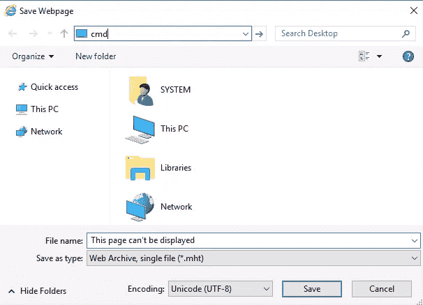

导航到 cmd

点击回车键，cmd 将作为**管理员**打开

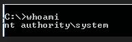

管理命令

现在获取管理标志

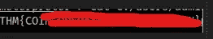

管理标志

# 后期开发:

所以也有一些后剥削，让我们也这样做。

由于 AV 已启用，我们无法通过 msfvenom 获得管理外壳。

现在我们可以使用 **Web Delivery** ，它是一个从 shell (kidna :p)获取 shell 的 metasploit 模块

```
msf> use exploit/multi/script/web_delivery
```

我们将照常使用 paylaod

> **windows/meter preter/reverse _ TCP**

并将目标设置为 powershell，因为我们将 shell 设置为 powershell

设置其他详细信息，如 LHOST、LPORT 等。现在我们可以走了。

运行漏洞并复制结果

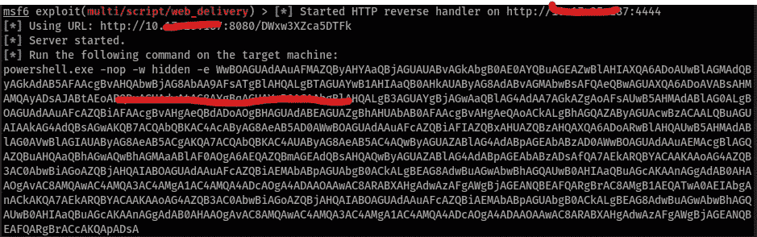

web 交付结果

将此粘贴到 windows admin cmd 上。

> 如果不能从您的系统复制粘贴到 RDP，那么您可以将它保存在本地机器上，并使用 python 服务器托管它。然后从 RDP 复制粘贴

我们得到了管理 meterpreter 外壳

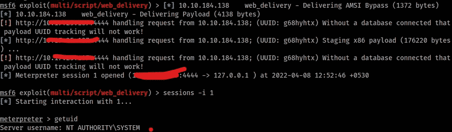

仪表外壳

所以有了这个，我们成功开发了 Blaster。感谢你阅读这篇文章，希望你觉得有用。如果有任何疑问，你可以在推特上发微博

再见，我们在 nxt 博客上见

[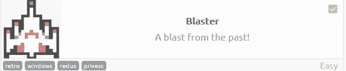](https://tryhackme.com/room/blaster)

> || [房间](https://tryhackme.com/room/blaster) || [推特](https://twitter.com/namx05) ||