# TryHackMe 博客空间记录——一台奇妙的机器

> 原文：<https://infosecwriteups.com/tryhackme-blog-room-writeup-a-wonderful-machine-874151ba8548?source=collection_archive---------0----------------------->

由[法比奥·卢卡斯](https://medium.com/u/18e949d25f5b?source=post_page-----874151ba8548--------------------------------)在 [Unsplash](https://medium.com/u/2053395ac335?source=post_page-----874151ba8548--------------------------------) 上拍摄的照片

[TryHackme 博客房间链接](https://tryhackme.com/room/blog)

TryHackMe 博客空间

#我们要做的第一件事是将部署的机器的 IP 和主机名添加到/etc/hosts:

让我们做一个端口扫描:

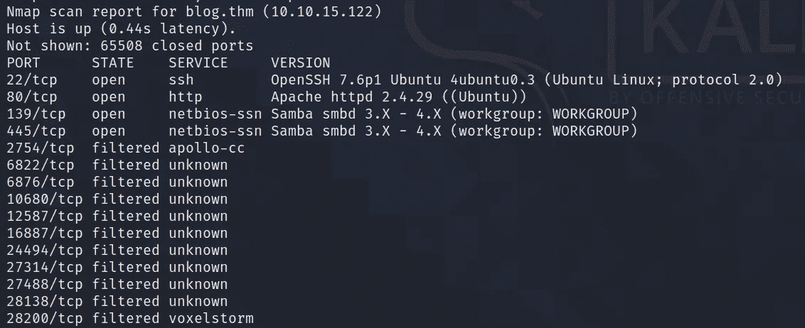

有 4 个端口打开。

好的。SMB 端口已打开。让我们使用 **smbmap** 来看看有哪些共享文件供我们的访客用户使用。

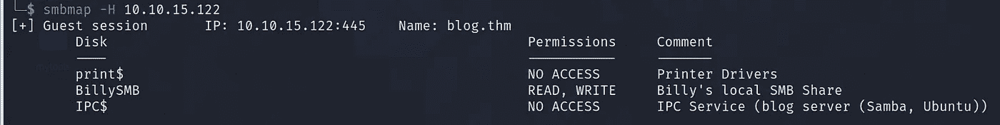

行动。有三个 SMB 共享，但我们只能访问名为“BillySMB”的 SMB 共享。现在让我们用 **smbget** 递归下载 BillySMB 中的所有内容。

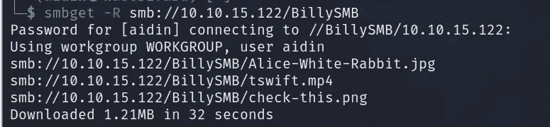

这里有三档:***Alice-White-Rabbit.jpg、*** 和***tswift.mp4***。让我们打开这三个文件。

Alice-White-Rabbit.jpg

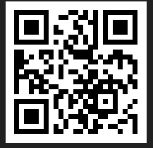

check-this.png

tswift.mp4

我们的第一个方法应该是检查图像中嵌入的隐写术。现在让我们使用**隐藏:**提取爱丽丝白兔图像中的隐藏数据

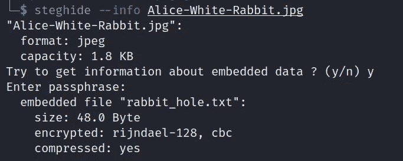

图像中嵌入了一个***rabbit _ hole . txt***文件，不需要任何密码就可以提取。让我们试着获取这个文件，看看它的内容。

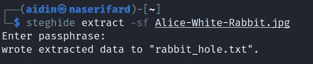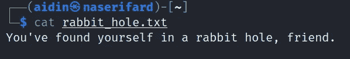

哦床单！我在离经叛道中徘徊。

现在，让我们尝试使用 **ffuf** 暴力破解 web 服务器中的目录和文件:

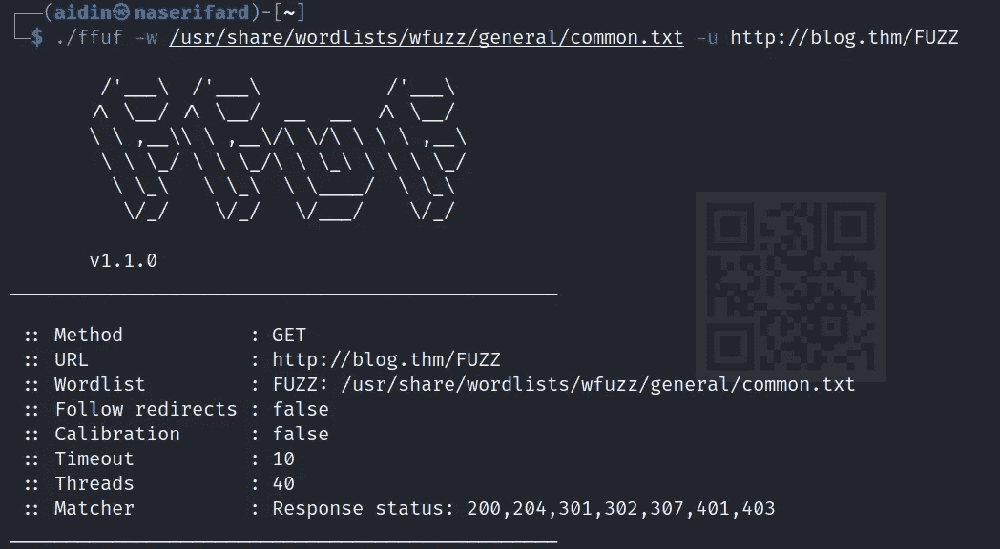

ffuf

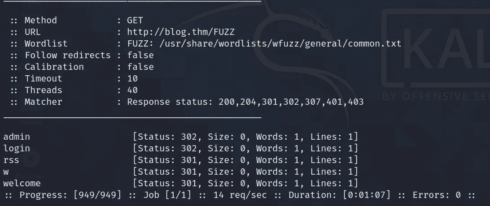

ffuf

我可以访问管理员和登录目录，但我没有登录的凭据

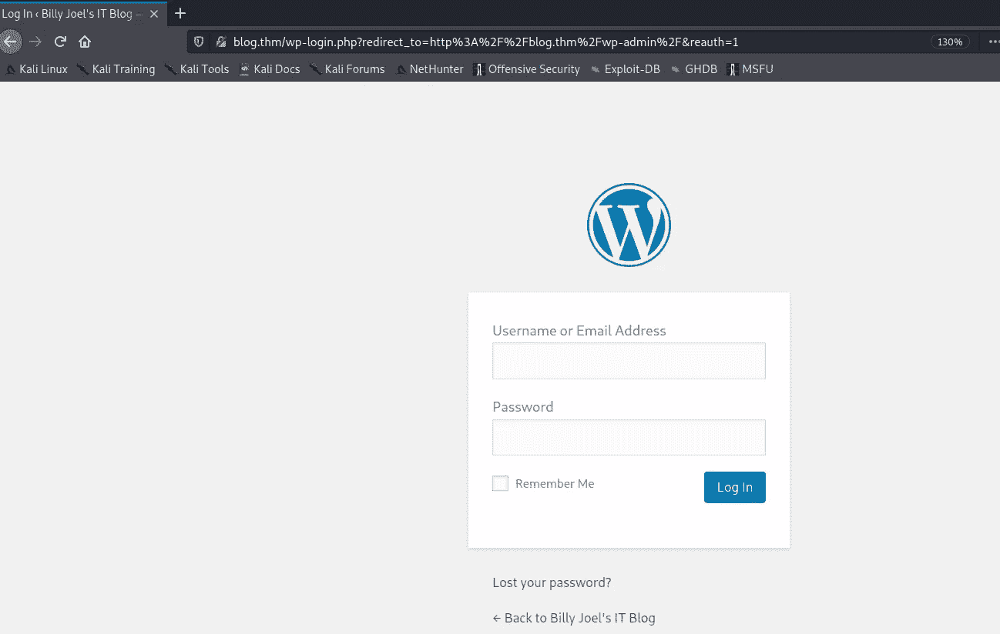

下一步，我使用 **WPSCAN** 扫描易受攻击的插件和主题，但是没有发现插件和主题！

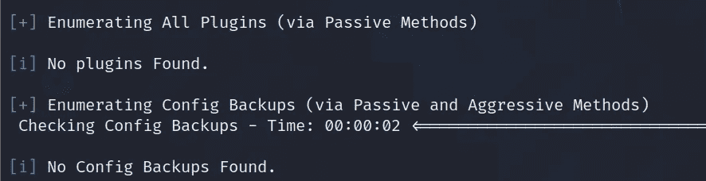

我试图通过进入 **wp-json/wp/v2/users/来枚举用户名。**

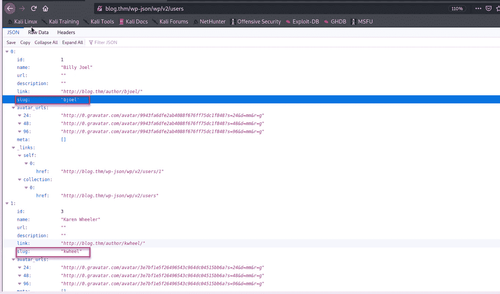

Wordpress 用户披露

现在，是时候蛮力作为用户 **kwheel** 和 **bjoel** 使用相同的 ***wpscan*** 工具了。

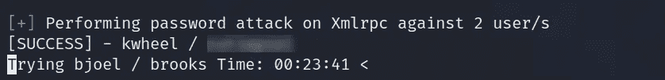

不错！所以我现在有一个有效的用户名和密码，因此在我得到的密码的帮助下以 ***kwheel*** 的身份登录。

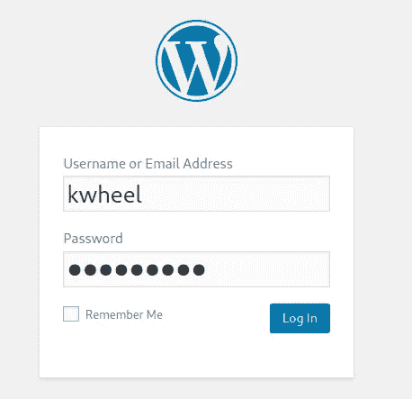

我的第一个方法是想办法上传一个 PHP 反向 shell，但是在模糊了一下之后，我找不到这样做的方法。然而，媒体部分看起来很有趣。

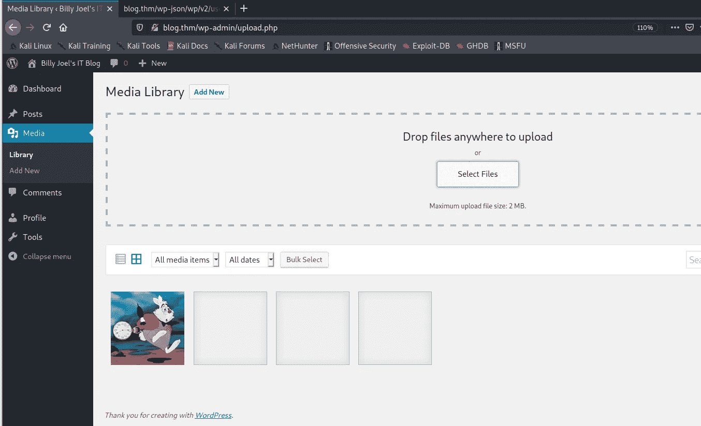

我们四处逛逛吧。博客用的 WordPress 版本是什么？

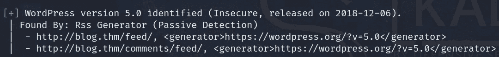

WordPress Core 5.0 上传图片存在漏洞(CVE-2019–8943)。我们对此也有一个 Metasploit 模块。

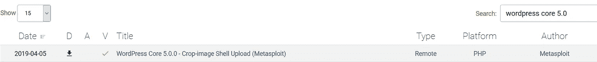

启动 msfconsole 并加载漏洞。

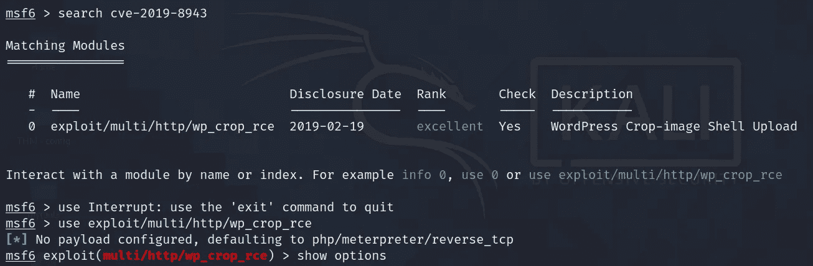

metasploit

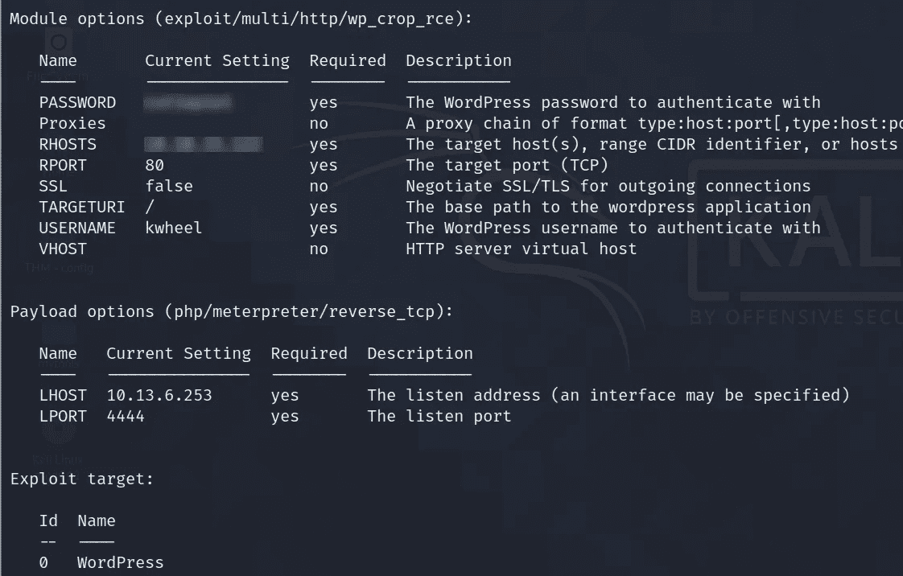

metasploit

我运行这个漏洞。OMG！我得到一个 ***米普雷特*** 会话…

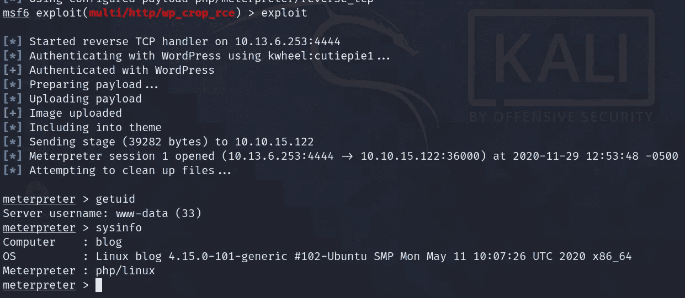

抄表员会话

所以，我已经磨合为 ***www-data*** 。让我们用 **#find / -name user.txt** 命令找到 **user.txt** 文件**。**

现在，我可以在用户 ***bjoel*** 的主目录中获取 ***user.txt*** ，但是我的尝试是没有用的。

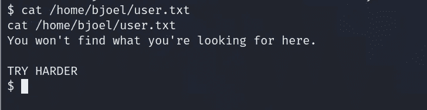

它像巴掌一样向我扑来！

让我们看看**wp-config.php**的文件。

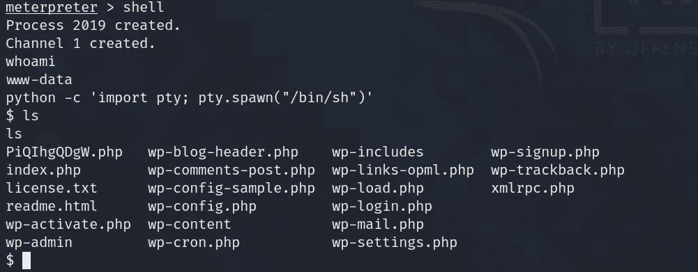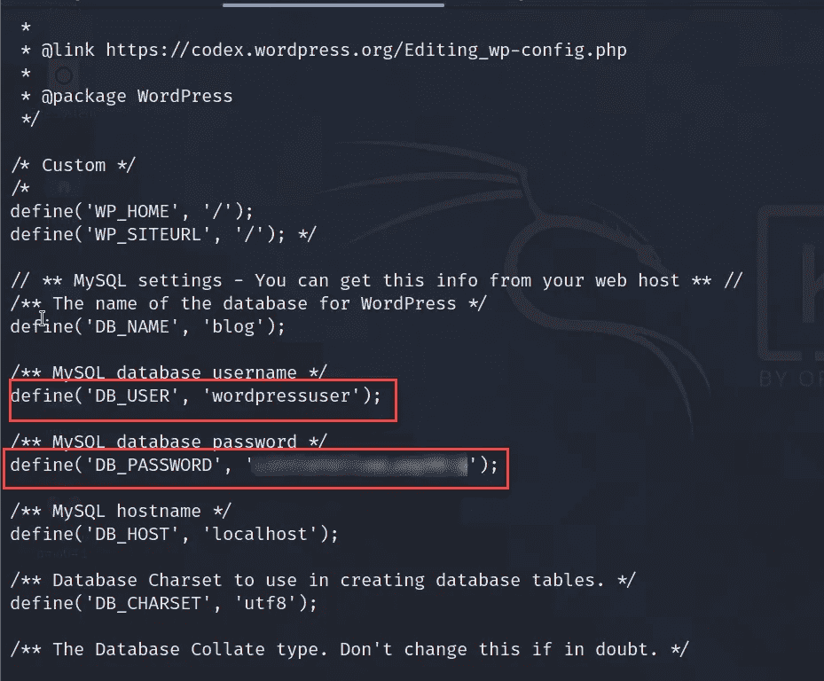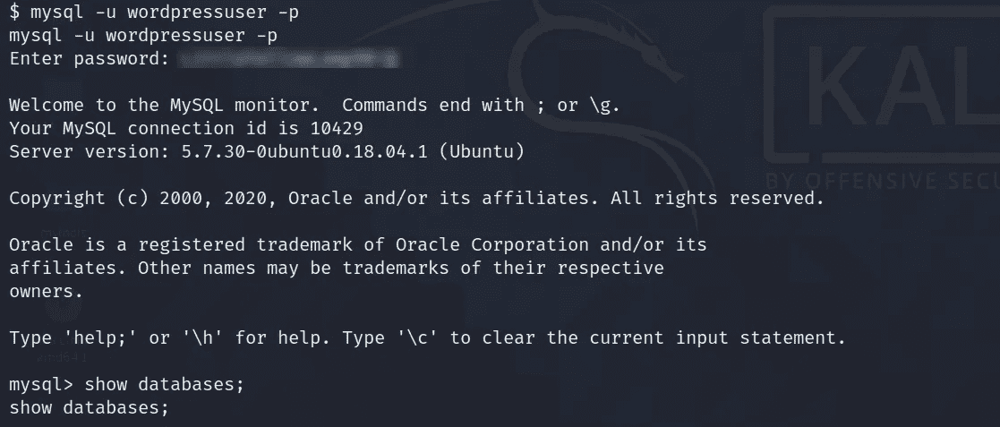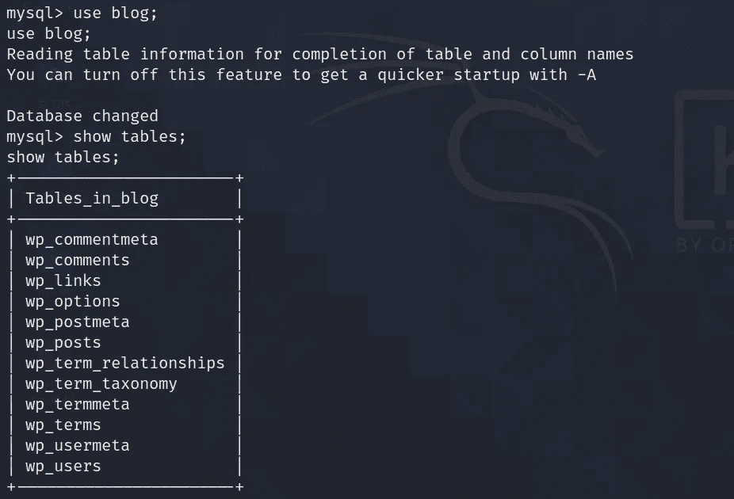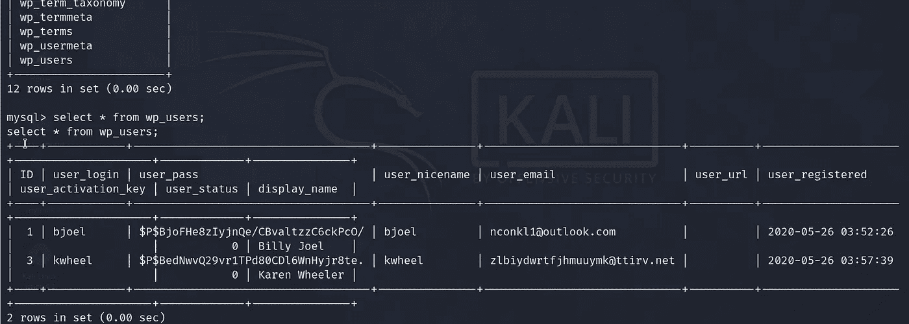

我使用**散列标识符**来获取所使用的散列类型。

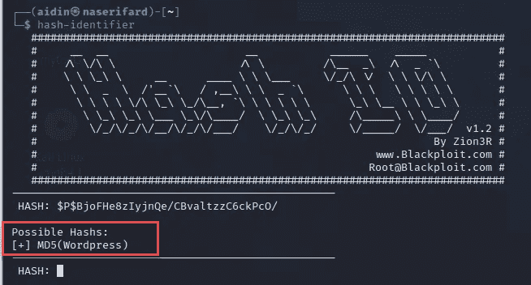

我收到了两个散列。kwheel 用户散列密码在一分钟内被破解，但是 bjoel 用户散列密码没有被破解。也没有意义。

让我再努力一点！我必须去厕所。像这样处理 CTF 时，PrivEsc 的一个常用技术是查找设置了 SUID 位的文件。

**$ find/-perm-4000 2>/dev/null**

我用 **linpeas** 来枚举。过了一会儿，在 SUID 区，我找到了一个定制的 SUID 文件检查器**因为除了这个，所有的项目都是红色和绿色的。**

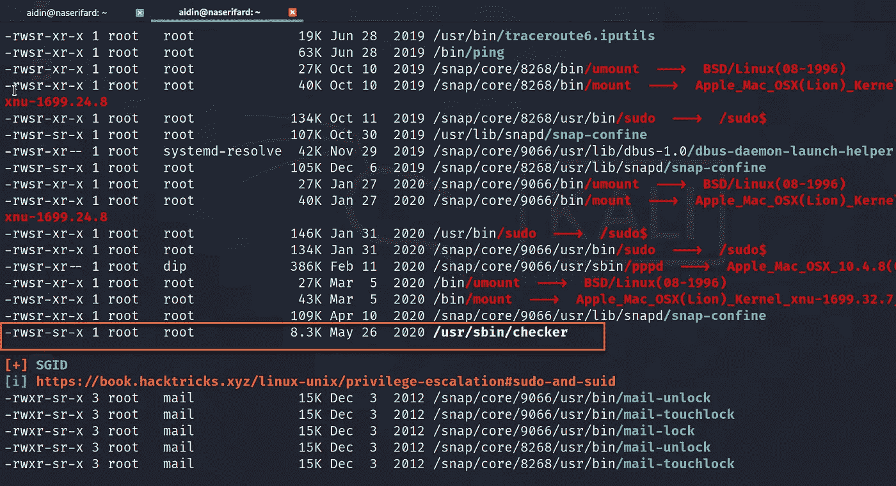

我直接在 shell 中运行 **/usr/sbin/checker** ，但是我遇到了这个消息:(

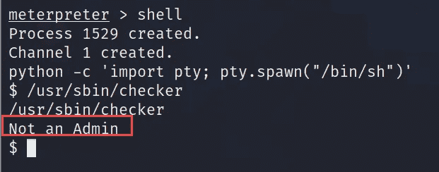

让我们在上面跑 **ltrace** 。

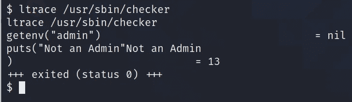

代码在 ***admin*** 环境变量中查找值。它调用 **getenv** 来检查是否声明了一个管理环境变量。如果声明了 admin，那么它会将 **uid** 设置为 **0** 并进行系统调用来生成一个 shell。

让我们尝试导出管理变量并再次运行检查器文件。

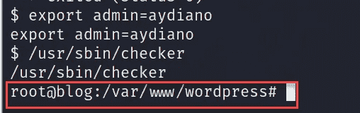

这再好不过了！我们得到根:)

现在我们可以从 **/root/root.txt** 获取根标志，从/ **media/usb/user.txt** 获取用户标志。

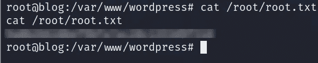

根标志

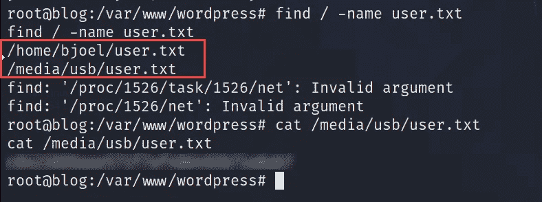

用户标志

最后，我想说这个房间里的 PrivEsc 技术真的很有趣和独特，让这个房间充满挑战和温暖。