# TryHackMe- Bolt CTF 报道(详细)

> 原文：<https://infosecwriteups.com/tryhackme-bolt-ctf-writeup-detailed-15c96fff0d26?source=collection_archive---------4----------------------->

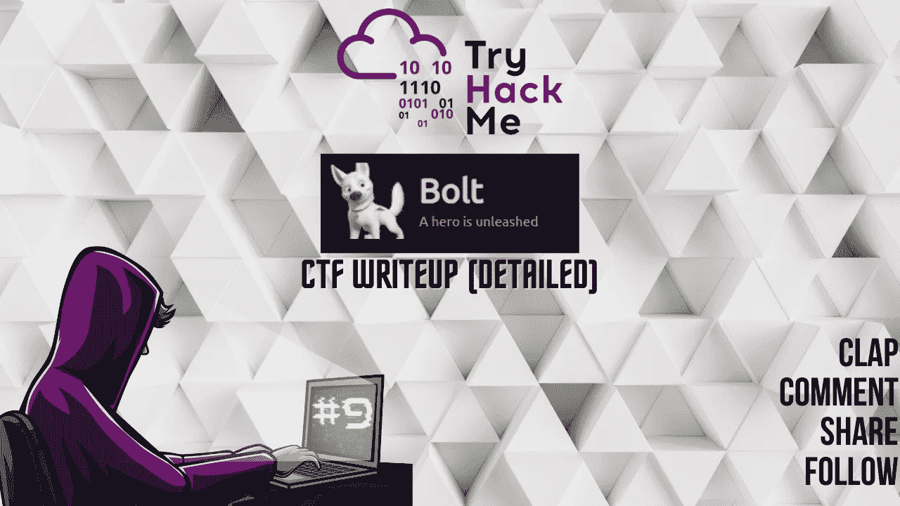

CTF 报道#9

欢迎各位！！我们将在 [TryHackMe](https://medium.com/u/dc49a0a3cb16?source=post_page-----15c96fff0d26--------------------------------) 做博尔特·CTF。

 [## 尝试黑客|螺栓

### TryHackMe 是一个学习和教授网络安全的在线平台，全部通过您的浏览器完成。

tryhackme.com](https://tryhackme.com/room/bolt) 

在桌面上为您的 CTF 计算机创建一个目录，并在 CTF 目录中为 Nmap 创建一个目录。

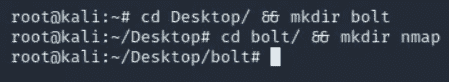

让我们开始吧！！享受流动吧！！

## 任务 1-部署机器:

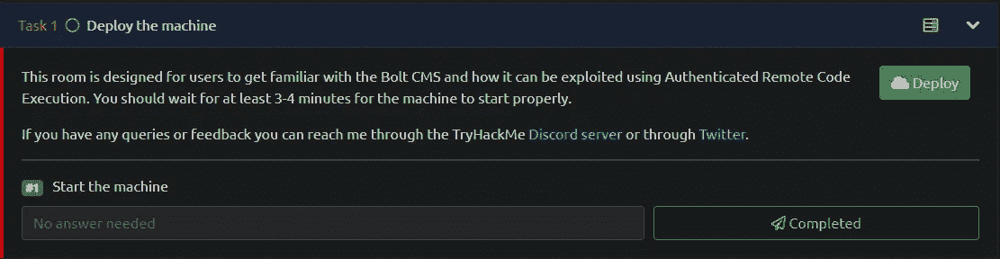

> #1 启动机器
> 答:不需要回答

## 任务 2-侵入机器！：

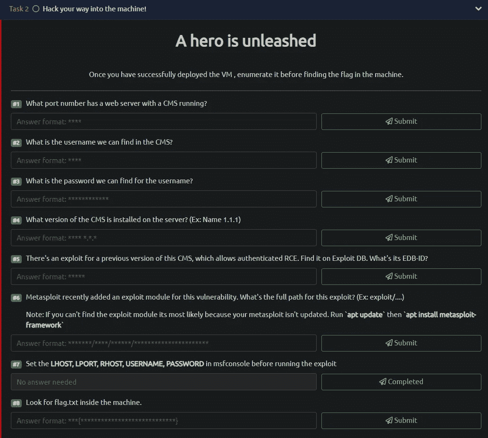

任务列表

## Nmap 扫描:

> nmap-sC-sV-p--关于 nmap/bolt<machine_ip></machine_ip>
> 
> -sC:默认脚本
> -sV:版本检测
> -oN:输出将存储在您之前创建的“nmap”目录中
> -p-:扫描所有端口

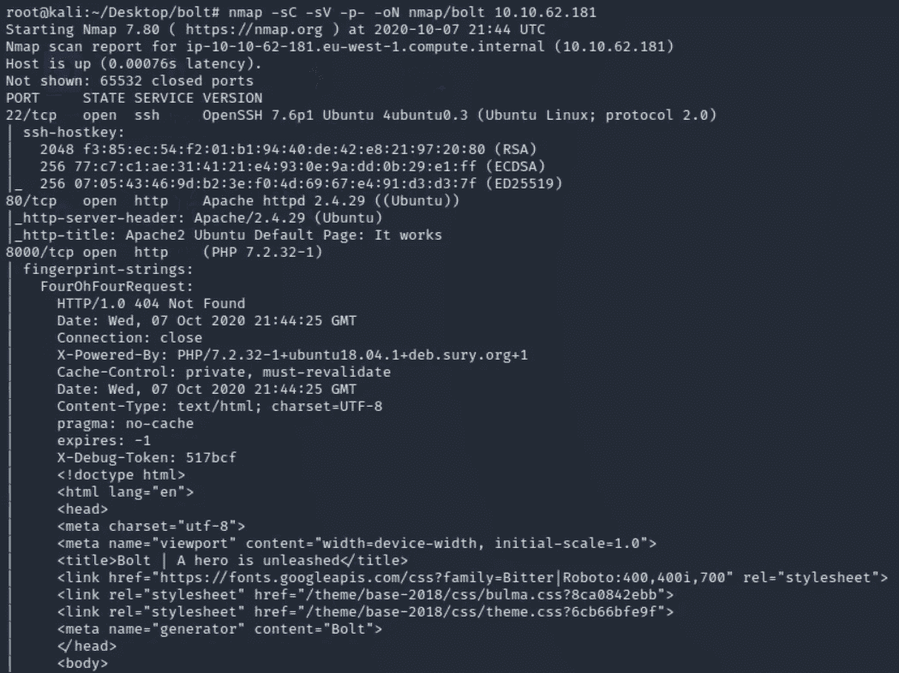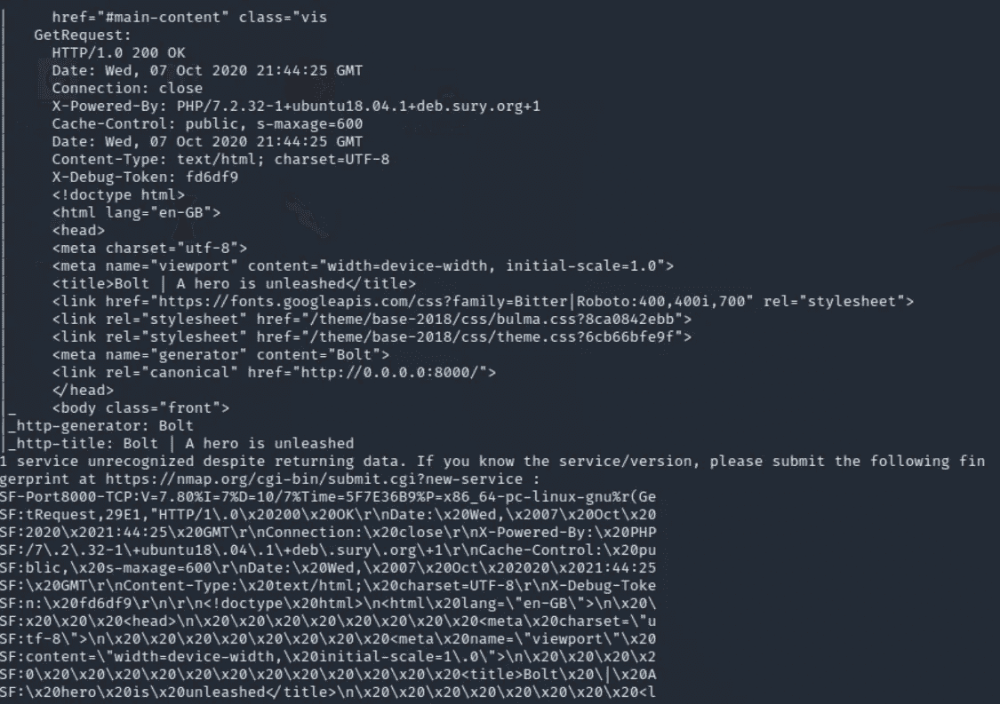

有 3 个端口打开:
22/ssh-OpenSSH 7.6p 1
80/http-Apache httpd 2 . 4 . 29
8000/http-PHP 7 . 2 . 32–1

> #1.运行 CMS 的 web 服务器的端口号是多少？
> 答案:8000

让我们看看在端口 80 上运行的服务器和在端口 8000 上运行的 CMS

> 导航至<target_ip></target_ip>

这是 apache 的默认页面。检查页面的源代码，寻找任何对我们的枚举过程有帮助的有趣信息总是好的。查看 URL 页的源代码。

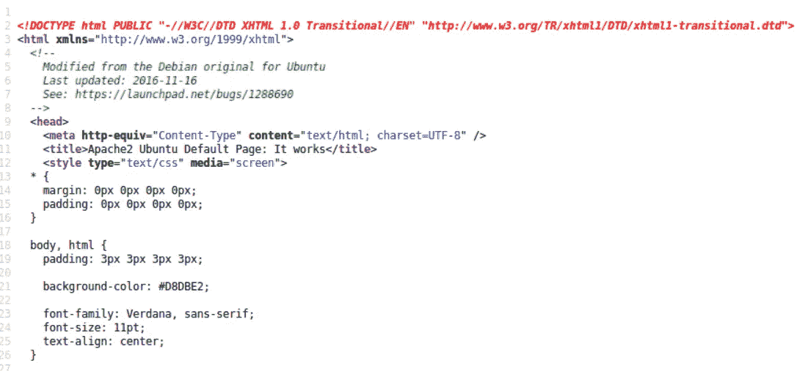

我们在源代码中没有发现任何隐藏/注释/信息。继续前进。

> 导航到 <target_ip>:8000</target_ip>

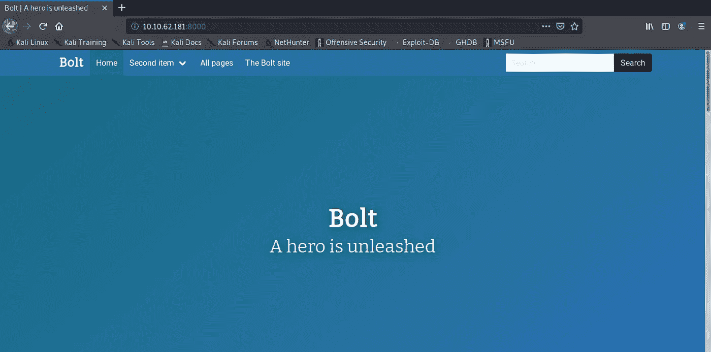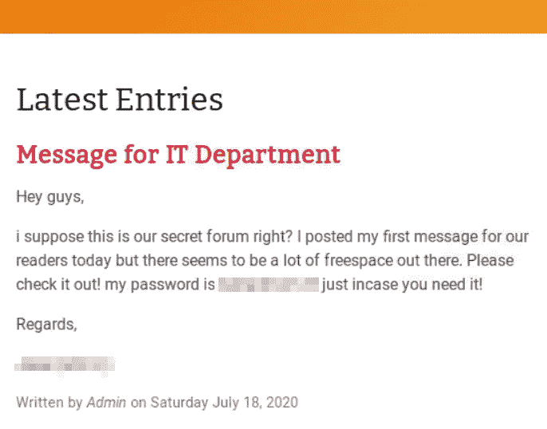

我们发现一个自称为管理员的潜在用户名。其次，他的帖子包含了一个密码，这对我们很有帮助。太好了。

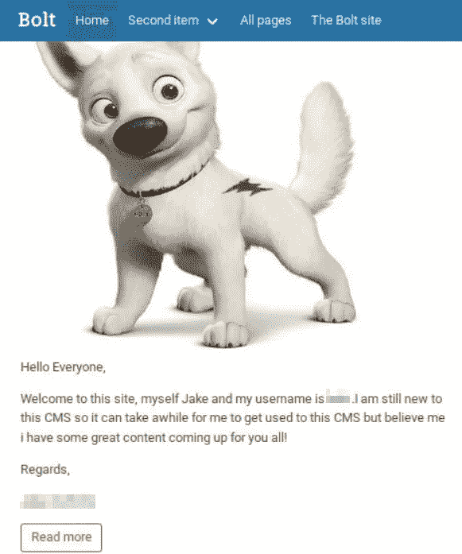

向下滚动，您会发现 CMS 上的管理员使用的用户名。两个帖子都回答了我们任务中的两个问题。

> #2.我们可以在 CMS 中找到的用户名是什么？
> Ans: XXXXXX
> #3。我们能找到的用户名的密码是什么？
> 答案:XXXXXX

我们必须找到我们可以使用在前面的任务中发现的凭据登录到 Bolt CMS 的页面。
如果我们谷歌简单地“bolt cms 登录页面”并点击第一个链接。我们将被重定向到带有登录说明的页面。

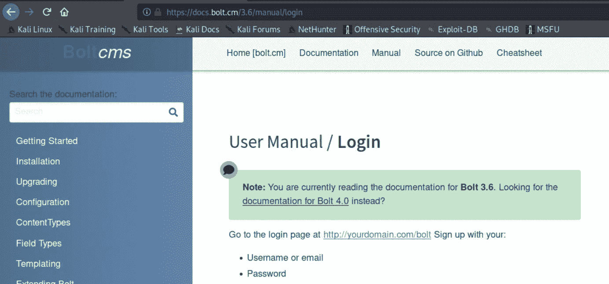

因此，我们可以尝试在 URL 中使用/bolt 导航到登录页面。

> 导航到 http:// <target_ip>:8000/bolt</target_ip>

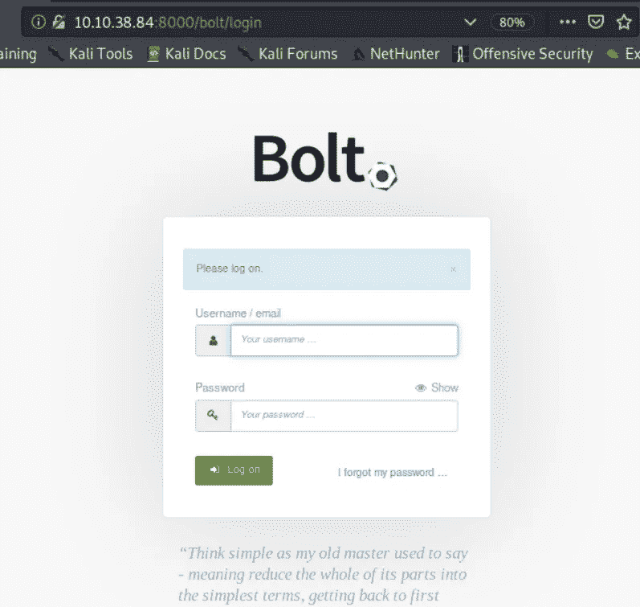

让我们输入凭据，然后单击登录。

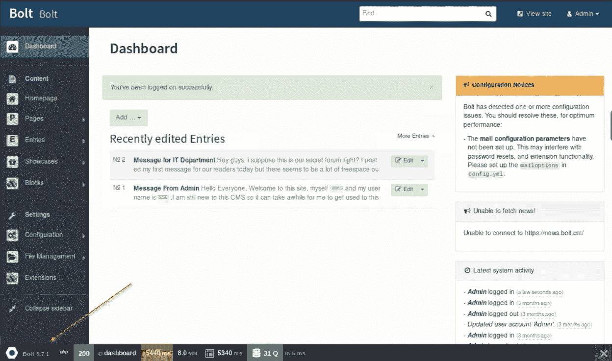

厉害！！我们在 CMS！！
如果你注意到左下角显示的是 CMS 的版本。它实际上回答了下一个任务。让我们提交它。

> #4.服务器上安装了什么版本的 CMS？(例:名称 1.1.1)
> 答案:螺栓 3.7.1

在下一个任务中，我们需要搜索以前版本的 Bolt CMS 可用的漏洞利用的 EDB ID。

 [## 攻击性安全利用数据库档案

### 漏洞数据库-漏洞、外壳代码、0 天、远程漏洞、本地漏洞、Web 应用、漏洞报告…

www.exploit-db.com](https://www.exploit-db.com/) 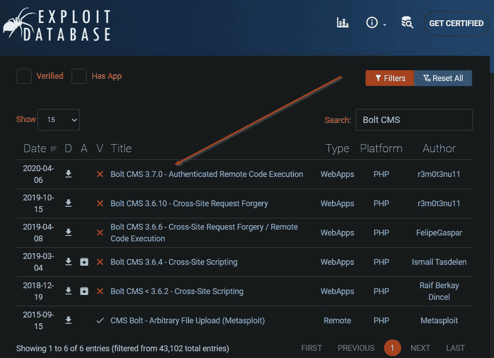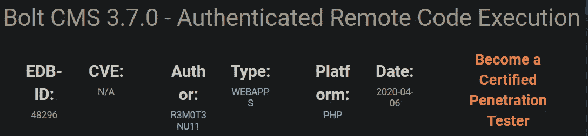

> #5.该 CMS 的早期版本存在漏洞，允许经过身份验证的 RCE。在 Exploit DB 上找到它。它的 EDB ID 是什么？
> Ans: 48296

在下一个任务中，我们必须提交针对上述漏洞的利用模块中可用的利用的完整路径。让我们启动 metasploit。

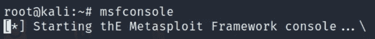

>搜索螺栓

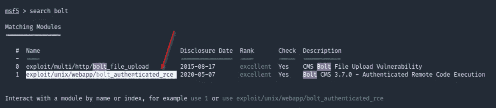

> #6.Metasploit 最近为此漏洞添加了一个利用模块。这个漏洞的完整路径是什么？(例:exploit/…。)
> 注意:如果你找不到漏洞利用模块，很可能是因为你的 metasploit 没有更新。运行` **apt 更新**`然后` **apt 安装 metasploit-framework**`
> Ans:exploit/UNIX/web app/bolt _ authenticated _ rce

>使用 1
>显示选项

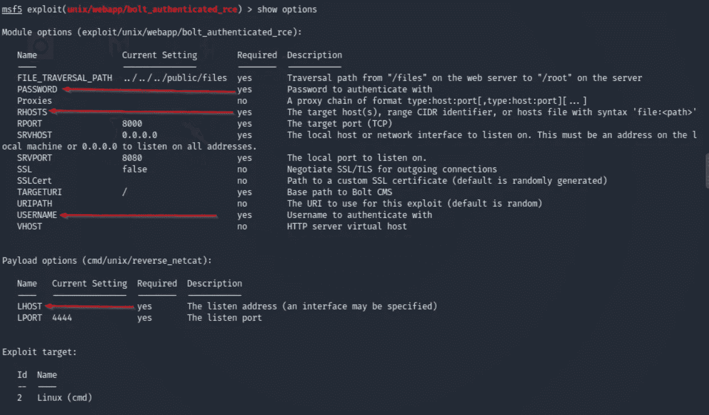

我们需要设置 4 个设置；密码，主机，用户名，主机。

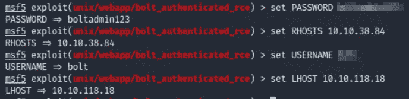

一旦设置它们，我们就可以运行漏洞利用。

> #7.在运行漏洞攻击之前，在 msfconsole 中设置 LHOST，LPORT，RHOST，USERNAME，PASSWORD

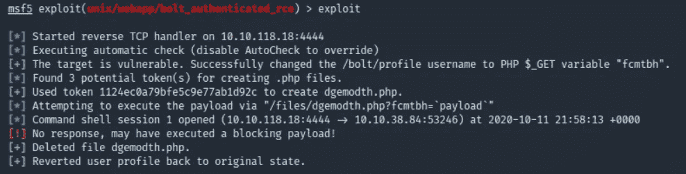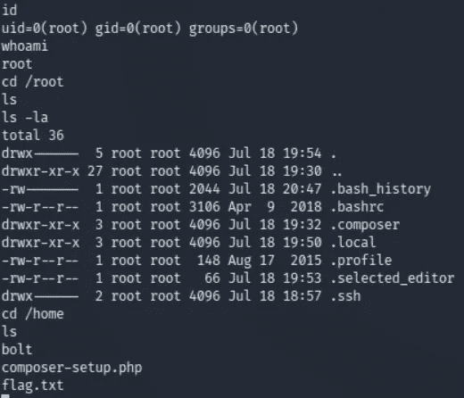

查看 whoami 和 id 的输出，我们可以确认我们是机器上的 root，但是查看/root 目录内部，我们没有找到标志。我们可以导航到/home 目录，它就在那里等待我们去捕获它。

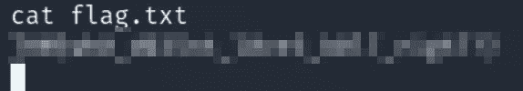

> #8.在机器内部查找 flag.txt。
> 答:XXXXXXXXXXXXXXXXXXXX

瞧。！！太棒了！！我们已经成功地完成了房间里的所有任务。

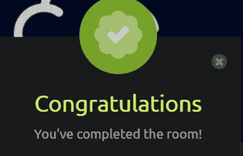

如果你喜欢这个帖子，并且这个帖子在任何可能的方面帮助了你，请在评论中告诉我，或者用掌声分享你的爱。

> 作为 10 月 PentesterLab 赠品的一部分提交

谢谢你抽出时间。

跟着我。

在推特上关注我。

更多的报道正在进行中。

保重，注意安全，继续黑！

**-哈桑·谢赫**