# TryHackMe:Mayur Parmar 的 Bolt 漫游(th3cyb3rc0p)

> 原文：<https://infosecwriteups.com/tryhackme-bolt-walkthrough-by-mayur-parmar-th3cyb3rc0p-f0bbae2bcbcd?source=collection_archive---------2----------------------->

一个英雄被释放了

我们的英雄博尔特的童话故事。

> 房间链接:【https://tryhackme.com/room/bolt 

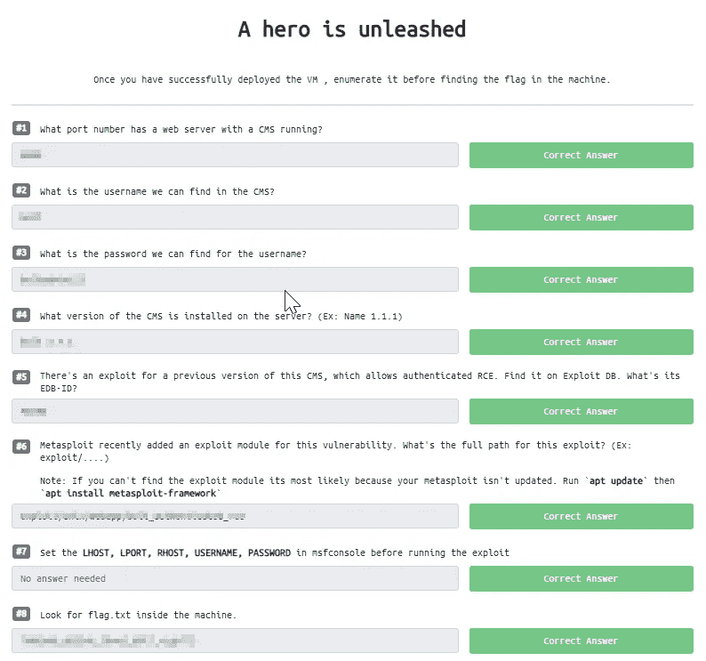

# 信息收集:

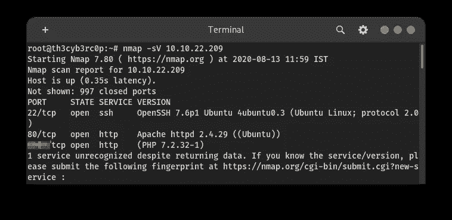

我已经完成了端口扫描，得到了 3 个端口。

在 80 端口上运行 apache。在第三个端口，bolt CMS 正在运行。

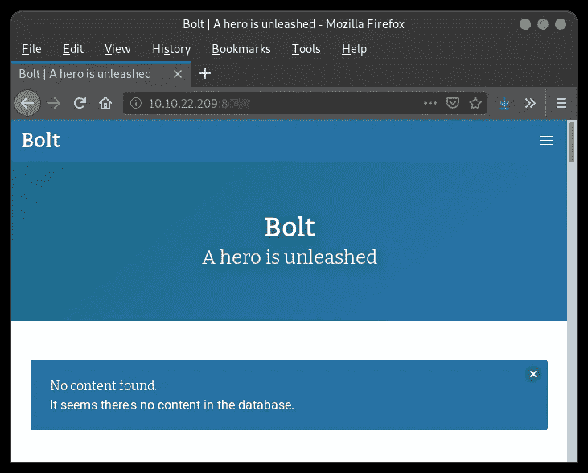

螺栓 CMS

在检查网站时，我在管理员发的帖子中发现了一些有趣的信息。

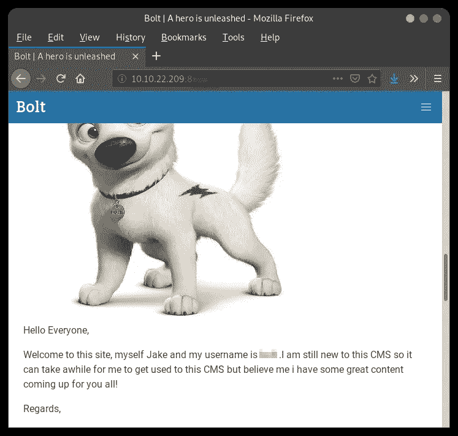

用户名

从这个帖子，我得到了用户名。

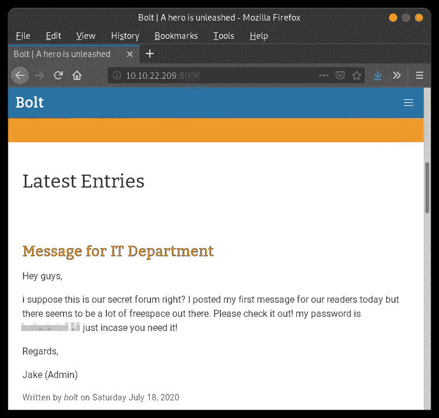

密码

从这个帖子，我得到了密码。

现在，我正在寻找使用这些凭证的登录页面。但是运气不好。

然后我在 google 上搜索了 bolt cms 登录页面的默认路径，在他们的安装文档中找到了。

《出埃及记》abc.com/bolt

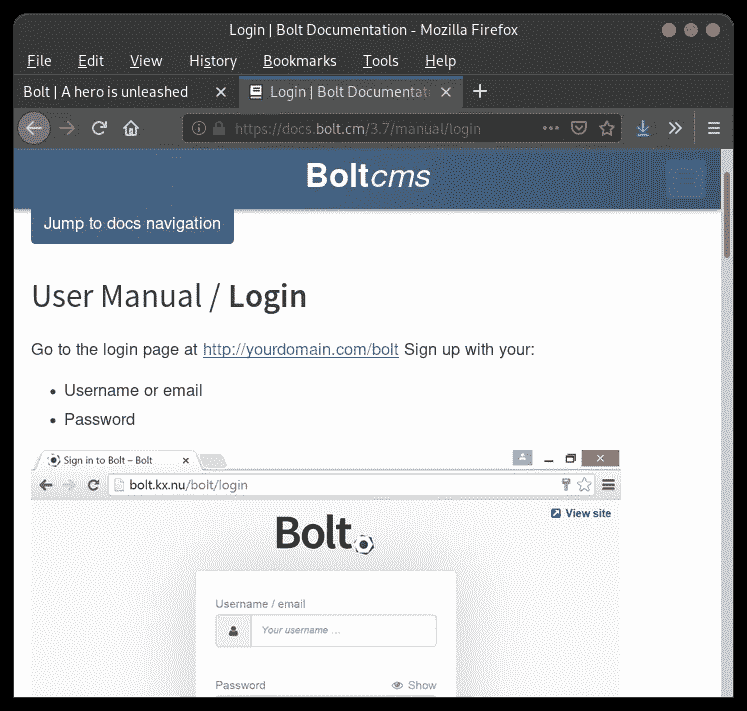

登录面板路径

我使用凭证，并迅速登录到管理面板。在底部，我得到了版本。

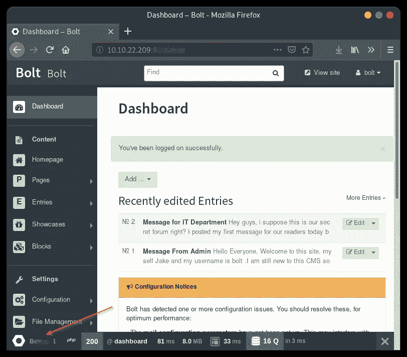

版本

我搜索了“bolt cms 3.7.1 ”,发现了一个旧版本的漏洞。

从那里，我们可以做 RCE。

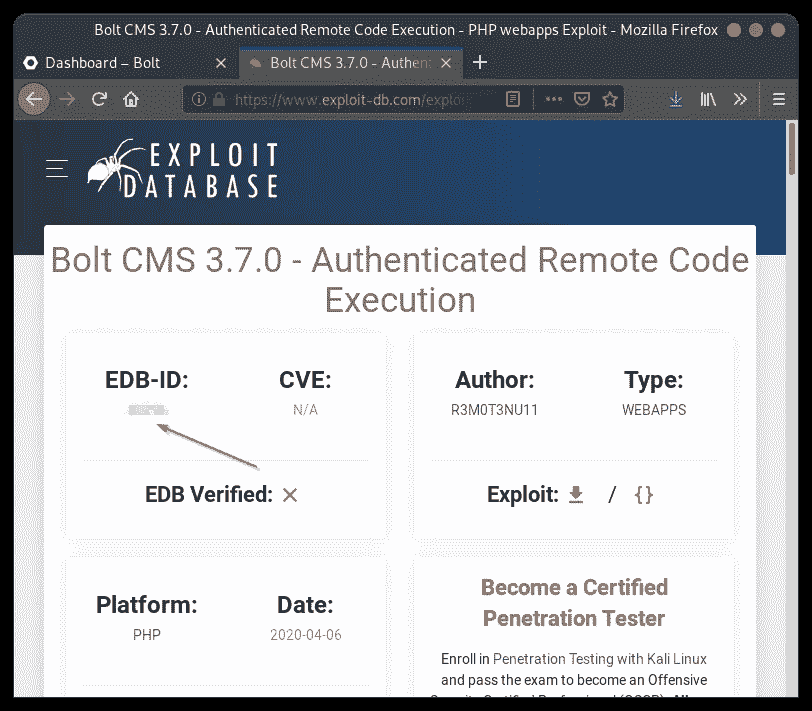

EDB 身份证

现在通过在 Kali Linux 中键入“msfconsole”命令来打开 Metasploit。

现在键入“搜索螺栓”这个命令将列出所有的利用和相关的螺栓关键字辅助。

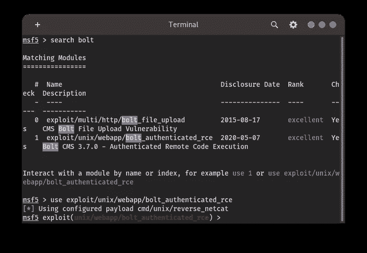

从 exploit-db 我们得到 3.7.0 版本易受 RCE 攻击，因此我们可以选择第二个结果。

命令:使用

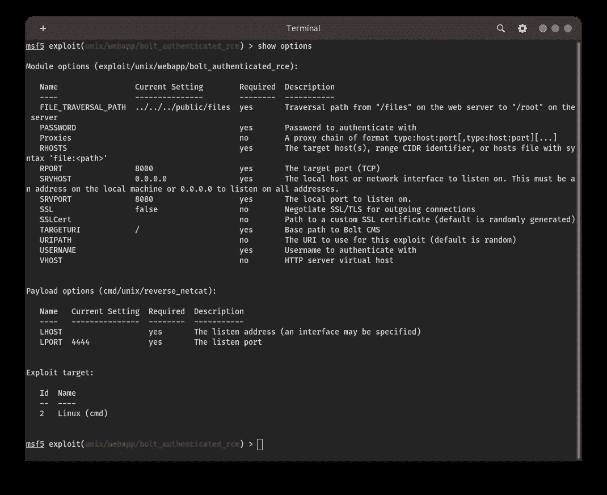

现在输入显示选项。从这个命令中，我们可以知道这利用了我们必须设置的参数类型。

现在设置 lhost=你的 IP 地址

在 Linux 中使用 ifconfig 命令并键入 **tun0 IP 地址**。

rhost=远程主机(web 应用程序 IP 地址)

用户名=管理员用户名(我们已经从帖子中知道了)

密码=管理员密码(我们已经从帖子中知道了)

运行=利用

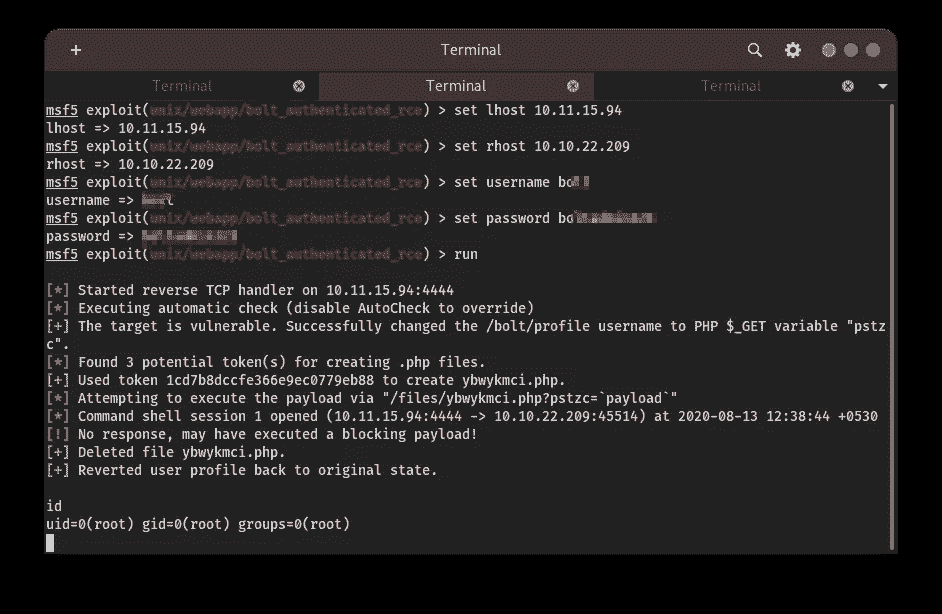

Metasploit

我们可以从下面的截图中看到，我们的利用是成功执行。

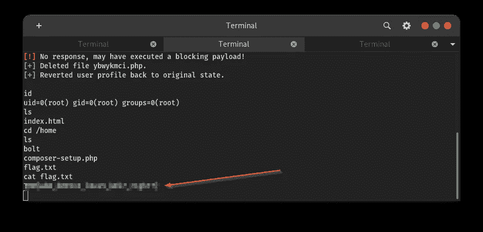

我们可以在后期开发阶段使用各种 Linux 命令。(取决于远程机器)。

在大多数 CTF 盒子中，我们可以在/home 目录中找到这个标志。

> 参考资料:

 [## Bolt CMS:易于编辑，开发者的梦想

### Bolt 是一个开源的内容管理工具，它力求简单明了。这是…

bolt.cm](https://bolt.cm/)  [## 登录|螺栓文档

### Home [bolt.cm]文档手册来源于 Github Cheatsheet

docs.bolt.cm](https://docs.bolt.cm/3.7/manual/login)  [## 攻击性安全利用数据库档案

### 漏洞标题:Bolt CMS 3.7.0 -已验证的远程代码执行#日期:2020-04-05 #漏洞作者:r3m0t3nu11 #…

www.exploit-db.com](https://www.exploit-db.com/exploits/48296)  [## 博尔特 CMS 3.7.0 XSS / CSRF /壳牌上传

### Bolt CMS <= 3.7.0 多个漏洞########################

packetstormsecurity.com](https://packetstormsecurity.com/files/158299/Bolt-CMS-3.7.0-XSS-CSRF-Shell-Upload.html)  [## mubix/后开发

### 当你所能做的只是盲目阅读时，如在 LFI/目录遍历中(不要忘记%00！)ls…

github.com](https://github.com/mubix/post-exploitation/wiki/Linux-Post-Exploitation-Command-List) 

**作者:**[**Mayur Parmar**](https://medium.com/u/4dbaf35dbafc?source=post_page-----f0bbae2bcbcd--------------------------------)**(th 3c Yb 3 RC 0 p)**

在 Twitter 和 LinkedIn 上关注我(通常我会在这些社交媒体平台上分享技巧)

[https://twitter.com/th3cyb3rc0p?lang=en](https://twitter.com/th3cyb3rc0p?lang=en)

[https://in.linkedin.com/in/th3cyb3rc0p](https://in.linkedin.com/in/th3cyb3rc0p)

[https://www.instagram.com/th3cyb3rc0p/?hl=en](https://www.instagram.com/th3cyb3rc0p/?hl=en)

[https://twitter.com/cyberdefecers?lang=en](https://twitter.com/cyberdefecers?lang=en)

[https://ctftime.org/team/112504](https://ctftime.org/team/112504)